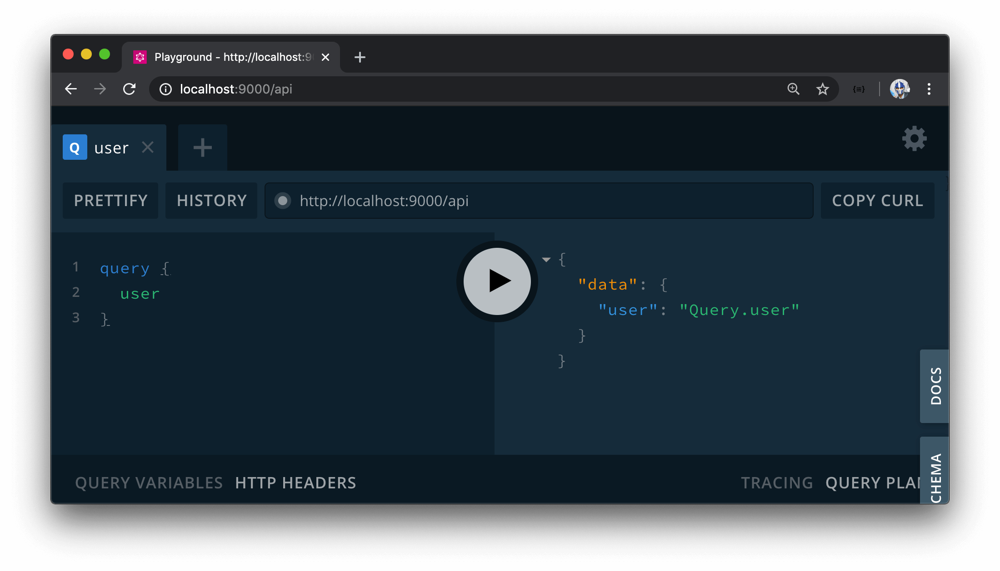

# User GraphQL Fields

To display information about our users in our client application, we'll need to have our client be able to query & resolve user data from our server. With that said, we'll brainstorm exactly what GraphQL fields we'll need to accomplish this.

For our application, we'll need a single root-level `user` query since we'll want the client to query a single user at a time. This should be fairly straightforward to implement on the server since we'll only need to find a single user document from the `users` collection, and return that document! The only complication with this field is that we'll look to return sensitive user data **only** when the user requests their own information. For example, we won't want to query the `income` of another user.

In our GraphQL type definitions in the `src/graphql/typeDefs.ts` file, let's create a new `user` field in the root `Query` object that is to resolve to a non-null string value.

```tsx
import { gql } from "apollo-server-express";

export const typeDefs = gql`
  #...

  type Query {
    #...
    user: String!
  }

  #...
`;
```

Next, we'll set up the resolver function for the `user` field we've created in our schema. Since `user` isn't directly related to the concept of a viewer, we'll create a new resolvers map to contain the resolver function within the user module.

We'll create a new folder called `User/` in our `src/graphql/resolvers/` folder that is to have an `index.ts` file.

```shell
server/
  src/
    // ...
    graphql/
      resolvers/
        User/
          index.ts
        // ...
      // ...
    // ...
  // ...
```

In the `index.ts` file within `src/graphql/resolvers/User/`, we'll export a `userResolvers` map and assign its type with the `IResolvers` interface from `apollo-server-express`.

```ts
import { IResolvers } from "apollo-server-express";

export const userResolver: IResolvers = {};
```

For now, we'll have the `user` resolver simply return a string that references the field being queried - `"Query.user"`.

```ts
import { IResolvers } from "apollo-server-express";

export const userResolvers: IResolvers = {
  Query: {
    user: () => {
      return "Query.user";
    }
  }
};
```

To connect our new resolver map, we'll import the `userResolvers` map in the `src/graphql/resolvers/index.ts` file and place it in the lodash [`merge()`](https://lodash.com/docs/4.17.15#merge) function.

```ts
import merge from "lodash.merge";
import { userResolvers } from "./User";
import { viewerResolvers } from "./Viewer";

export const resolvers = merge(userResolvers, viewerResolvers);
```

With our server project running, if we were to visit GraphQL Playground at <http://localhost:9000/api> and run the `user` query, we'll see the expected `"Query.user"` output.


