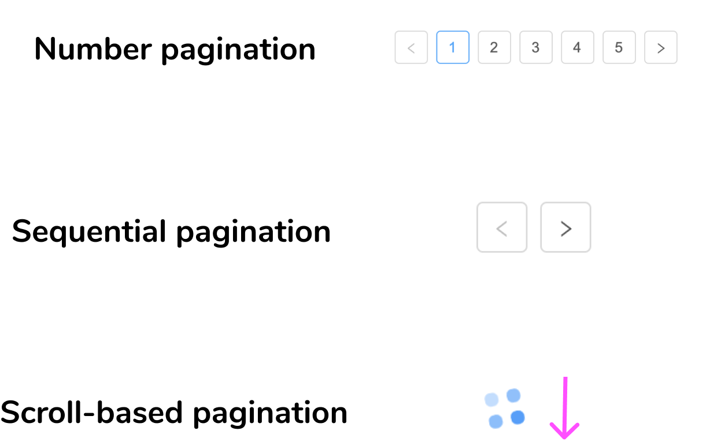
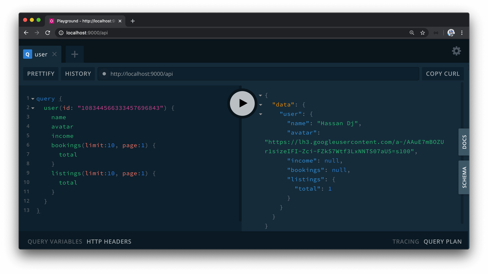

# Building the User Resolvers

> 📖 This lesson's lecture slides can be found - [here](./protected/lecture-slides.pdf).<br />
> 📝 GraphQL documentation on pagination can be found - [here](https://graphql.org/learn/pagination/).<br />
> 📝 Apollo documentation on pagination can be found - [here](https://www.apollographql.com/docs/react/data/pagination/).

With the GraphQL type definitions established for the root-level `user` query, in this lesson we'll modify the resolver function we have to help query for a certain user based on the `id` provided. To implement this, we'll update the `user()` resolver function in the `src/graphql/resolvers/User/index.ts` file.

We'll expect an `id` argument to be passed into the `user()` resolver function. We'll define the shape of the arguments for this resolver as an interface called `UserArgs` which is to contain an `id` of type `string`. We'll define this in a `types.ts` file adjacent to the `index.ts` where we establish the `userResolvers` map.

```ts
export interface UserArgs {
  id: string;
}
```

We'll import this `UserArgs` interface in the `userResolvers` map file. We'll also import the `Database` and `User` interfaces defined in the `src/lib/types.ts` file. In the `user()` resolver function, we'll destruct the `id` argument and `db` object from context and when this resolver function is to be complete, it will resolve to a `Promise` of a `User`.

```ts
import { IResolvers } from "apollo-server-express";
import { Database, User } from "../../../lib/types";
import { UserArgs } from "./types";

export const userResolver: IResolvers = {
  Query: {
    user: async (
      _root: undefined,
      { id }: UserArgs,
      { db }: { db: Database }
    ): Promise<User> => {
      // ...
    }
  }
};
```

The `user()` resolver function itself is going to be a fairly simple resolver. We'll have a `try...catch` block and wherein the try statement, we'll use Mongo's [`findOne()`](https://docs.mongodb.com/manual/reference/method/db.collection.findOne/) function to find a user document from the `users` collection where the `_id` field matches the `id` argument passed in.

We'll throw an error if this user can't be found and if it is found, we'll return the user. In the `catch` block - we'll capture the error fired and state an error along the lines of `"Failed to query user"`.

```ts
import { IResolvers } from "apollo-server-express";
import { Database, User } from "../../../lib/types";
import { UserArgs } from "./types";

export const userResolver: IResolvers = {
  Query: {
    user: async (
      _root: undefined,
      { id }: UserArgs,
      { db }: { db: Database }
    ): Promise<User> => {
      try {
        const user = await db.users.findOne({ _id: id });

        if (!user) {
          throw new Error("user can't be found");
        }

        return user;
      } catch (error) {
        throw new Error(`Failed to query user: ${error}`);
      }
    }
  }
};
```

## Authorization

Since the `user` field is the entry point from our client, the `user()` resolver function will be the first function to run when someone attempts to query the `user` field. The other resolver functions that the `user` object depends on will be run after. We've mentioned that we want certain fields in our `user` object to be protected and only shown when someone is querying their own information. To determine whether a user is authorized to make the query, we'll introduce a new field in the `User` TypeScript interface (in the `src/lib/types.ts` file) called `authorized` that is to be a `boolean` when defined.

```ts
export interface User {
  _id: string;
  token: string;
  name: string;
  avatar: string;
  contact: string;
  walletId?: string;
  income: number;
  bookings: ObjectId[];
  listings: ObjectId[];
  authorized?: boolean;
}
```

This `authorized` field is unique since it's not part of the `user` document stored in our database collection. It'll be used in our resolver functions to determine whether a `user` has the authorization to resolve certain fields.

Since the `user()` resolver function will be the first function run when someone queries the `user` field, we'll determine right in the `user()` resolver whether the `user` is _authorized_. We'll achieve this by comparing the `id` of the viewer making the request and see if it matches the `id` of the user being queried. How would we get information about the `viewer` making the request?

In the last module, we've created an `authorize()` function in the `src/lib/utils/index.ts` file that accepts the `db` and `req` objects as parameters and returns the `viewer` object based on the `cookie` and `token` of the request being made.

```ts
import { Request } from "express";
import { Database, User } from "../types";

export const authorize = async (
  db: Database,
  req: Request
): Promise<User | null> => {
  const token = req.get("X-CSRF-TOKEN");
  const viewer = await db.users.findOne({
    _id: req.signedCookies.viewer,
    token
  });

  return viewer;
};
```

In our `user()` resolver function, we have the `req` object as part of our context so we'll destruct it in the parameters of the function and set its type to the `Request` interface that we'll import from `express`.

```ts
import { Request } from "express";
import { IResolvers } from "apollo-server-express";
import { Database, User } from "../../../lib/types";
import { UserArgs } from "./types";

export const userResolver: IResolvers = {
  Query: {
    user: async (
      _root: undefined,
      { id }: UserArgs,
      { db, req }: { db: Database; req: Request }
    ): Promise<User> => {
      try {
        const user = await db.users.findOne({ _id: id });

        if (!user) {
          throw new Error("user can't be found");
        }

        return user;
      } catch (error) {
        throw new Error(`Failed to query user: ${error}`);
      }
    }
  }
};
```

In the `userResolvers` map file, we'll import the `authorize()` function from the `src/lib/utils/` folder and use it in the `user()` resolver function by passing in the `db` and `req` objects. We'll then check to see if this `viewer` exists and we'll check to see if the `_id` field of this `viewer` object matches that of the `user` being queried. If it does, this means the person making the query is authorized and we'll set the `authorized` field of the `user` object to `true`.

```ts
import { IResolvers } from "apollo-server-express";
import { Request } from "express";
import { Database, User } from "../../../lib/types";
import { authorize } from "../../../lib/utils";
import { UserArgs } from "./types";

export const userResolver: IResolvers = {
  Query: {
    user: async (
      _root: undefined,
      { id }: UserArgs,
      { db, req }: { db: Database; req: Request }
    ): Promise<User> => {
      try {
        const user = await db.users.findOne({ _id: id });

        if (!user) {
          throw new Error("user can't be found");
        }

        const viewer = await authorize(db, req);

        if (viewer && viewer._id === user._id) {
          user.authorized = true;
        }

        return user;
      } catch (error) {
        throw new Error(`Failed to query user: ${error}`);
      }
    }
  }
};
```

For our upcoming resolver functions in the `user` object that are to be protected, we'll check to see if `authorized` is `true` _before_ we resolve to the requested data. With that said, let's now create the resolver functions for certain fields in our `user` object.

We've mentioned before how GraphQL server implementations often handle [trivial resolvers](https://graphql.org/learn/execution/#trivial-resolvers) for us (which are resolver functions that simply return a field from the object passed in with the same name as the field itself). Many of our fields in the `user` object will be handled as trivial resolvers except for a couple with which we'll create explicit resolver functions. The resolver functions we'll define are `id()`, `hasWallet()`, `income()`, `bookings()`, and `listings()`.

```ts
// ...

export const userResolver: IResolvers = {
  Query: {
    // ...
  },
  User: {
    id: () => {},
    hasWallet: () => {},
    income: () => {},
    bookings: () => {},
    listings: () => {}
  }
};
```

#### `id()`

The `id()` resolver function is straightforward and will simply return the `_id` value from the root `user` object.

```ts
// ...

export const userResolver: IResolvers = {
  Query: {
    // ...
  },
  User: {
    id: (user: User): string => {
      return user._id;
    },
    hasWallet: () => {},
    income: () => {},
    bookings: () => {},
    listings: () => {}
  }
};
```

#### `hasWallet()`

The `hasWallet()` function will return a boolean indicating if the user has connected to their [Stripe](https://stripe.com/) account to be able to accept payments. We'll use the JavaScript [`Boolean()`](https://developer.mozilla.org/en-US/docs/Web/JavaScript/Reference/Global_Objects/Boolean) operator to return a `boolean` based on the presence of the `user.walletId` field.

```ts
// ...

export const userResolver: IResolvers = {
  Query: {
    // ...
  },
  User: {
    id: (user: User): string => {
      return user._id;
    },
    hasWallet: (user: User): boolean => {
      return Boolean(user.walletId);
    },
    income: () => {},
    bookings: () => {},
    listings: () => {}
  }
};
```

#### `income()`

`income()` is one of the resolver functions that are to be protected. If the `user.authorized` field is `true`, we'll return the sensitive `user.income` value. Otherwise, we'll return `null`.

```ts
// ...

export const userResolver: IResolvers = {
  Query: {
    // ...
  },
  User: {
    id: (user: User): string => {
      return user._id;
    },
    hasWallet: (user: User): boolean => {
      return Boolean(user.walletId);
    },
    income: (user: User): number | null => {
      return user.authorized ? user.income : null;
    },
    bookings: () => {},
    listings: () => {}
  }
};
```

### Pagination

The `bookings()` and `listings()` resolver functions are to be a little more complicated but are to be similar to one another. This is because the `bookings` and `listings` field in a user are to be paginated fields.

We'll take a brief tangent to discuss how we attempt to help conduct pagination before we begin writing our implementations of the `bookings()` and `listings()` resolvers.

First of all, whenever one attempts to return a large list of information to the client, a good practice is to use pagination. **Pagination is the process of dividing a large collection of data into smaller discrete chunks (within pages)**.

Pagination is pretty much used in almost all applications we use today. There's the simple number pagination, sequential pagination where a user can click next or previous to move from page to page, and in more recent web design - scroll-based pagination (sometimes known as infinite scroll) that has become popular since this helps show more paginated content as a user scrolls a "page".



At the end of the day, pagination is used to reduce latency because clients don't have to wait for a full data dump and can start to present data with small chunks at a time.

Though there are different ways to conduct pagination, there are two popular ways one can go about doing it.

-   **Offset-based pagination** (or numbered pages)
-   **Cursor based pagination**

### Offset-based Pagination

Offset-based pagination (or numbered pages) is often the easiest to implement since the backend simply retrieves `limit` and `page` values and determines the limit of content to be shown for a certain page.

```graphql
query Listings($limit: Int!, $page: Int!) {
  listings(limit: $limit, page: $page) {
    id
    title
  }
}
```

Though easy to implement, there is a certain disadvantage with offset-based pagination. When items are inserted or removed _while_ a user is going through pages, there's a large chance of seeing the same item twice or skipping an additional item. This is due to the concept of boundaries between data within pages and limits. As an example, this can happen if an item is added to the beginning of a list where a user is already paginating through the list and see the same item as the user goes to the next page as it might satisfy both boundaries. As a result, offset-based pagination may not be ideal for applications where users find themselves scrolling through pages fairly quickly and items are added or deleted often. A social media app is a good example of this.

### Cursor-based Pagination

Cursor-based pagination uses a **"cursor"** to keep track of the data within a set of items. This cursor can just be a reference to the `id` of the last object fetched or in more complicated scenarios have a reference to the sorting criteria that has been encoded.

From the client perspective, a `cursor` is simply passed in and the server determines the set of data that is to be returned from this cursor.

```graphql
query Listings($cursor: String!) {
  listings(cursor: $cursor) {
    id
    title
    cursor
  }
}
```

Since this cursor is more accurate, it helps avoid the disadvantages we can see with offset-based pagination as a user goes from page to page and items are being added or removed.

### Relay cursor-based pagination

In even more complicated scenarios, there's also relay-style pagination that takes the cursor model but also returns data in a more particular format. Data is returned within `edges` and `nodes`. Additional data such as `pageInfo` may also be returned that has a reference to when the cursor has an end and whether previous or next page information exists.

```graphql
query Listings($cursor: String!) {
  listings(cursor: $cursor) {
    edges {
      nodes {
        id
      }
    }
    pageInfo {
      endCursor
      hasNextPage
    }
  }
}
```

We'll suggest using cursor-based pagination or relay-style cursor-based pagination if you intend on building a large application that'll have a large number of pages where many users are going to be using the app. Offset-based pagination is by far the easiest to get started with and is fairly straightforward to implement with MongoDB. We'll be implementing our pagination as offset-based pagination (i.e. pagination based on limits and pages).

> The Apollo Client documentation does a great job in documenting the different types of pagination that can often be conducted with GraphQL. Check it out [here](https://www.apollographql.com/docs/react/data/pagination/) if you're interested in reading more about this!

#### `bookings()`

We'll go back to the code and begin with the `bookings()` resolver function. The `bookings()` resolver function will receive a `limit` and `page` arguments where:

-   **`limit`** describes how many data objects to show per page.
-   **`page`** describes the page number the user wants to view.

We'll define the type of arguments the `bookings()` resolver is to expect in an interface in the `types.ts` file we have within the `src/graphql/resolvers/User/` folder. We'll call the interface `UserBookingsArgs` and state that it expects a `limit` and `page` fields that are to be numbers.

```ts
export interface UserBookingsArgs {
  limit: number;
  page: number;
}
```

We'll also describe the shape of data we want the `bookings()` resolver to return. We'll create and call this interface `UserBookingsData` and say it is to have a `total` field of type `number` and a `result` field which is to be an array of the `Booking` interface, with which we'll import from the `lib/types` file.

```ts
import { Booking } from "../../../lib/types";

// ...

export interface UserBookingsData {
  total: number;
  result: Booking[];
}
```

We'll import the `UserBookingsArgs` and `UserBookingsData` interfaces in our `userResolvers` map file. In the `bookings()` resolver, we'll declare the `limit` and `page` parameters the function is to expect and we'll access the `db` object from context. We'll state that the resolver is to be asynchronous since it is to make a database call, and when successfully resolved - it'll resolve to the `UserBookingsData` interface or `null`.

```ts
// ...
import { UserArgs, UserBookingsArgs, UserBookingsData } from "./types";

export const userResolver: IResolvers = {
  Query: {
    // ...
  },
  User: {
    // ...,
    bookings: async (
      user: User,
      { limit, page }: UserBookingsArgs,
      { db }: { db: Database }
    ): Promise<UserBookingsData | null> => {},
    listings: () => {}
  }
};
```

Recall that we've said the `bookings` field within a `user` object is to be protected and we won't want an unauthorized user from seeing the bookings made by another user. We'll use a `try...catch` statement like before and in the `try` block, we'll place an `if` statement to say if the user is not authorized, the `bookings` resolver will return `null`.

```ts
// ...
import { UserArgs, UserBookingsArgs, UserBookingsData } from "./types";

export const userResolver: IResolvers = {
  Query: {
    // ...
  },
  User: {
    // ...,
    bookings: async (
      user: User,
      { limit, page }: UserBookingsArgs,
      { db }: { db: Database }
    ): Promise<UserBookingsData | null> => {
      try {
        if (!user.authorized) {
          return null;
        }
      } catch {}
    },
    listings: () => {}
  }
};
```

If the user is authorized, we'll first construct a data object that initializes the data we will update and return. Within this `data` object, we'll say it is to have a `total` field with an initial value of 0 and a `result` field with an initial value of an empty array.

```ts
// ...
import { UserArgs, UserBookingsArgs, UserBookingsData } from "./types";

export const userResolver: IResolvers = {
  Query: {
    // ...
  },
  User: {
    // ...,
    bookings: async (
      user: User,
      { limit, page }: UserBookingsArgs,
      { db }: { db: Database }
    ): Promise<UserBookingsData | null> => {
      try {
        if (!user.authorized) {
          return null;
        }

        const data: UserBookingsData = {
          total: 0,
          result: []
        };
      } catch {}
    },
    listings: () => {}
  }
};
```

We'll then use Mongo's [`find()`](https://docs.mongodb.com/manual/reference/method/db.collection.find/) method to find all documents in the `bookings` collection where the `_id` field is in the user bookings array. If we recall, in a `user` document there exists a `bookings` field that contains the `id`'s of bookings that the user has booked. With Mongo's `find()` method, the `$in` operator will allow finding all the actual booking documents where the id's of these documents are in the `user.bookings` array. We'll assign this to a constant called the `cursor`.

```ts
// ...
import { UserArgs, UserBookingsArgs, UserBookingsData } from "./types";

export const userResolver: IResolvers = {
  Query: {
    // ...
  },
  User: {
    // ...,
    bookings: async (
      user: User,
      { limit, page }: UserBookingsArgs,
      { db }: { db: Database }
    ): Promise<UserBookingsData | null> => {
      try {
        if (!user.authorized) {
          return null;
        }

        const data: UserBookingsData = {
          total: 0,
          result: []
        };

        let cursor = await db.bookings.find({
          _id: { $in: user.bookings }
        });
      } catch {}
    },
    listings: () => {}
  }
};
```

The cursor we're creating here isn't related to the cursor we've talked about with regards to cursor-based pagination but more along the lines of how MongoDB labels this a [cursor](https://docs.mongodb.com/manual/reference/method/js-cursor/). A [MongoDB cursor](https://docs.mongodb.com/manual/reference/method/js-cursor/) has [`skip()`](https://docs.mongodb.com/manual/reference/method/cursor.skip/#cursor.skip) and [`limit()`](https://docs.mongodb.com/manual/reference/method/cursor.limit/) functions (among others) that allow us to easily offset the number of data within a certain page.

The MongoDB [`cursor.skip()`](https://docs.mongodb.com/manual/reference/method/cursor.skip/#cursor.skip) function allows us to skip a certain number of documents. We'll use the `skip()` function to update the cursor if `page` is greater than `0`.

```ts
// ...
import { UserArgs, UserBookingsArgs, UserBookingsData } from "./types";

export const userResolver: IResolvers = {
  Query: {
    // ...
  },
  User: {
    // ...,
    bookings: async (
      user: User,
      { limit, page }: UserBookingsArgs,
      { db }: { db: Database }
    ): Promise<UserBookingsData | null> => {
      try {
        if (!user.authorized) {
          return null;
        }

        const data: UserBookingsData = {
          total: 0,
          result: []
        };

        let cursor = await db.bookings.find({
          _id: { $in: user.bookings }
        });

        cursor = cursor.skip(page > 0 ? (page - 1) * limit : 0);
      } catch {}
    },
    listings: () => {}
  }
};
```

If `page` is 1 and `limit` is 10, we don't skip anything since we're on the first page. If `page` is 2 and `limit` is 10, we skip the first 10 documents. And so on...

To control the number of elements to show, we'll use the [`cursor.limit()`](https://docs.mongodb.com/manual/reference/method/cursor.limit/) function. When we run `cursor.limit()`, we'll pass in the value of the `limit` argument passed into our resolver function.

```ts
// ...
import { UserArgs, UserBookingsArgs, UserBookingsData } from "./types";

export const userResolver: IResolvers = {
  Query: {
    // ...
  },
  User: {
    // ...,
    bookings: async (
      user: User,
      { limit, page }: UserBookingsArgs,
      { db }: { db: Database }
    ): Promise<UserBookingsData | null> => {
      try {
        if (!user.authorized) {
          return null;
        }

        const data: UserBookingsData = {
          total: 0,
          result: []
        };

        let cursor = await db.bookings.find({
          _id: { $in: user.bookings }
        });

        cursor = cursor.skip(page > 0 ? (page - 1) * limit : 0);
        cursor = cursor.limit(limit);
      } catch {}
    },
    listings: () => {}
  }
};
```

In this instance, if the `limit` is 10; we'll only get 10 documents in total in our cursor.

Finally, we'll say the `data.total` field is equal to the value of the [`cursor.count()`](https://docs.mongodb.com/manual/reference/method/cursor.count/) function which is how MongoDB allows us to get the total count of the initial query while ignoring the `limit()` modifier. For the `data.result` field, we'll ensure it is to be an array of results from the cursor by stating [`cursor.toArray()`](https://docs.mongodb.com/manual/reference/method/cursor.toArray/). We'll finally have the resolver then return the `data` object constructed.

In the `catch` statement of our function, we'll conform to our usual error handling by catching and throwing an error along the lines of `"Failed to query user bookings"`.

```ts
// ...
import { UserArgs, UserBookingsArgs, UserBookingsData } from "./types";

export const userResolver: IResolvers = {
  Query: {
    // ...
  },
  User: {
    // ...,
    bookings: async (
      user: User,
      { limit, page }: UserBookingsArgs,
      { db }: { db: Database }
    ): Promise<UserBookingsData | null> => {
      try {
        if (!user.authorized) {
          return null;
        }

        const data: UserBookingsData = {
          total: 0,
          result: []
        };

        let cursor = await db.bookings.find({
          _id: { $in: user.bookings }
        });

        cursor = cursor.skip(page > 0 ? (page - 1) * limit : 0);
        cursor = cursor.limit(limit);

        data.total = await cursor.count();
        data.result = await cursor.toArray();

        return data;
      } catch (error) {
        throw new Error(`Failed to query user bookings: ${error}`);
      }
    },
    listings: () => {}
  }
};
```

#### `listings()`

The `listings()` resolver function will be practically identical to the `bookings()` resolver function except for the fact that it's going to return listings from the `listings` collection in our database and it won't be a protected field.

Let's first create the types we'll need for the `listings()` resolver in the `src/graphql/resolvers/User/types.ts` file. We'll create an interface called `UserListingArgs` that will describe the shape of arguments that is to be passed to the `listings()` resolver and will have a `limit` and `page` fields of type `number`. The `UserListingsData` interface we'll create will describe the shape of data to be returned from the `listings()` resolver and will have a `total` and `result` field where `total` is a number and `result` is an array of items that match the `Listing` document interface (which we'll import from the `src/lib/types.ts` file).

In its entirety, the `src/graphql/resolvers/User/types.ts` file will look like the following:

```ts
import { Booking, Listing } from "../../../lib/types";

export interface UserArgs {
  id: string;
}

export interface UserBookingsArgs {
  limit: number;
  page: number;
}

export interface UserBookingsData {
  total: number;
  result: Booking[];
}

export interface UserListingsArgs {
  limit: number;
  page: number;
}

export interface UserListingsData {
  total: number;
  result: Listing[];
}
```

> One could also have a single interface for the `args` for both the `bookings()` and `listings()` resolver function. Additionally, one can create a base interface for the `data` to be returned from the `bookings()` and `listings()` resolvers and have this base extended for the interfaces for `UserBookingsData` and `UserListingsData`.

In the `userResolvers` map file, we'll import the `UserListingsArgs` and `UserListingsData` interfaces. We'll copy the `bookings()` resolver over for the `listings()` resolver and make some minor changes. We'll reference the correct types, find documents from the `listings` collection, reference the `id` in `user.listings` (not `user.bookings`), remove the authorized field check, and update the error statement.

This will have the `listings()` resolver function as follows:

```ts
// ...
import {
  UserArgs,
  UserBookingsArgs,
  UserBookingsData,
  UserListingsArgs,
  UserListingsData
} from "./types";

export const userResolver: IResolvers = {
  Query: {
    // ...
  },
  User: {
    // ...,
    listings: async (
      user: User,
      { limit, page }: UserListingsArgs,
      { db }: { db: Database }
    ): Promise<UserListingsData | null> => {
      try {
        const data: UserListingsData = {
          total: 0,
          result: []
        };

        let cursor = await db.listings.find({
          _id: { $in: user.listings }
        });

        cursor = cursor.skip(page > 0 ? (page - 1) * limit : 0);
        cursor = cursor.limit(limit);

        data.total = await cursor.count();
        data.result = await cursor.toArray();

        return data;
      } catch (error) {
        throw new Error(`Failed to query user listings: ${error}`);
      }
    }
  }
};
```

With all the changes we've made to the `userResolvers` map, the `src/graphql/resolvers/User/index.ts` file in our server project will look like the following.

```ts
import { Request } from "express";
import { IResolvers } from "apollo-server-express";
import { Database, User } from "../../../lib/types";
import { authorize } from "../../../lib/utils";
import {
  UserArgs,
  UserBookingsArgs,
  UserBookingsData,
  UserListingsArgs,
  UserListingsData
} from "./types";

export const userResolvers: IResolvers = {
  Query: {
    user: async (
      _root: undefined,
      { id }: UserArgs,
      { db, req }: { db: Database; req: Request }
    ): Promise<User> => {
      try {
        const user = await db.users.findOne({ _id: id });

        if (!user) {
          throw new Error("user can't be found");
        }

        const viewer = await authorize(db, req);

        if (viewer && viewer._id === user._id) {
          user.authorized = true;
        }

        return user;
      } catch (error) {
        throw new Error(`Failed to query user: ${error}`);
      }
    }
  },
  User: {
    id: (user: User): string => {
      return user._id;
    },
    hasWallet: (user: User): boolean => {
      return Boolean(user.walletId);
    },
    income: (user: User): number | null => {
      return user.authorized ? user.income : null;
    },
    bookings: async (
      user: User,
      { limit, page }: UserBookingsArgs,
      { db }: { db: Database }
    ): Promise<UserBookingsData | null> => {
      try {
        if (!user.authorized) {
          return null;
        }

        const data: UserBookingsData = {
          total: 0,
          result: []
        };

        let cursor = await db.bookings.find({
          _id: { $in: user.bookings }
        });

        cursor = cursor.skip(page > 0 ? (page - 1) * limit : 0);
        cursor = cursor.limit(limit);

        data.total = await cursor.count();
        data.result = await cursor.toArray();

        return data;
      } catch (error) {
        throw new Error(`Failed to query user bookings: ${error}`);
      }
    },
    listings: async (
      user: User,
      { limit, page }: UserListingsArgs,
      { db }: { db: Database }
    ): Promise<UserListingsData | null> => {
      try {
        const data: UserListingsData = {
          total: 0,
          result: []
        };

        let cursor = await db.listings.find({
          _id: { $in: user.listings }
        });

        cursor = cursor.skip(page > 0 ? (page - 1) * limit : 0);
        cursor = cursor.limit(limit);

        data.total = await cursor.count();
        data.result = await cursor.toArray();

        return data;
      } catch (error) {
        throw new Error(`Failed to query user listings: ${error}`);
      }
    }
  }
};
```

That's it! We'll now be able to query for a certain `user` by providing the `id` of said user. We can test this out in GraphQL Playground. We can grab the `id` of a valid user stored in the `users` collection of our database and if we were to place it as the argument value of the `user` query field and make the query, we'll get information on the user!



In the next lesson, we'll begin building the `/user/:id` page in our client to surface information about a user.
