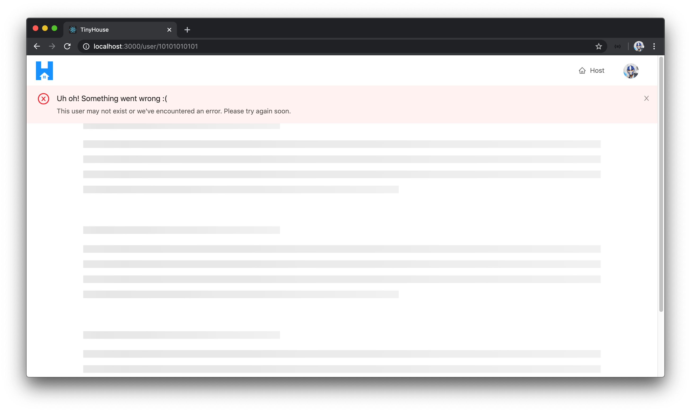

# The UserProfile React Component

With our GraphQL API now able to allow us to query information for a single user, let's focus our efforts on building the user page component in our app which will live in the `/user/:id` route. The UI for our user page is going to be a little robust with a few different child components we'll create.

Here's how we'll want the UI for the page shown in the `/user/:id` route to look. For a user viewing their own user profile page, they'll be able to see their user profile information, a list of listings they've created, and a list of all the bookings they've made as well.

- The profile section would be a **`<UserProfile />`** child component.
- The listings section will be a **`<UserListings />`** child component.
- The bookings section will be a **`<UserBookings />`** child component.


When a user is to view the page for another user, the viewer is only able to see the other user's profile and available listings. In the profile of the other user being viewed, the UI that conforms with how one can connect with Stripe won't be shown as well.


There's a decent amount of UI we're going to build here so we'll break it up in pieces. In this first client lesson for the user page, we'll look to make the query for the `user` field in our API and query for all the information of a user except for bookings and listings. We'll then create the `<UserProfile />` card component and attempt to display the details of the user. When a viewer is to look at their own user page, they'll see an additional section in the `<UserProfile />` card highlighting how they can connect with Stripe. We'll display this but we won't set up the functionality to connect with Stripe in this lesson.

Additionally, we'll create a custom `<PageSkeleton />` component that will be shared for a few different pages and will be the "loading" page when a root-level query is in flight.


### User Query

Let's begin. We'll first look to construct the `user` query document in our `src/lib/graphql/queries/` folder. We'll create a `User/` folder within that has an `index.ts` file.

```shell
client/
  // ...
  src/
    lib/
      graphql/
        queries/
          // ...
          User/
            index.ts
    // ...
  // ...
```

In the `src/lib/graphql/queries/User/index.ts` file, we'll set up the `user` query document. We know the `user` query needs to accept an `id` to query for a certain user. We'll state `id` is an argument to the query, and we'll query for the `id`, `name`, `avatar`, `contact`, `hasWallet`, and `income` fields.

```ts
import { gql } from "apollo-boost";

export const USER = gql`
  query User($id: ID!) {
    user(id: $id) {
      id
      name
      avatar
      contact
      hasWallet
      income
    }
  }
`;
```

We'll then re-export the `USER` document constant from the `src/lib/graphql/queries/index.ts` file.

```ts
export * from "./User";
```

To autogenerate the TypeScript definitions related to the `user` query, we'll first run the `codegen:schema` script in the client project to update the schema file we have in our client.

```shell
npm run codegen:schema
```

We'll then run the `codegen:generate` script to generate the TypeScript definitions for our new query.

```shell
npm run codegen:generate
```

In the `<User />` component file (`src/sections/User/index.tsx`), the first thing we'll look to do is run the `user` query when the `<User />` component first renders. To help us achieve this, we'll import the `useQuery` Hook from React Apollo. In the same file, we'll also import the `USER` query document and the autogenerated TypeScript definitions for the `user` query.

In the `<User />` component function, we'll use the `useQuery` Hook at the top of our component and say we're interested in having the `data`, `loading` and `error` information from our `user` query result and we'll want to pass in an `id` for the query as a variable.

```tsx
import React from "react";
import { useQuery } from "@apollo/react-hooks";
import { USER } from "../../lib/graphql/queries";
import {
  User as UserData,
  UserVariables
} from "../../lib/graphql/queries/User/__generated__/User";

export const User = () => {
  const { data, loading, error } = useQuery<UserData, UserVariables>(USER, {
    variables: {
      id
    }
  });

  return (
    <div>
      <h2>User</h2>
    </div>
  );
};
```

Our query won't run successfully until we provide an appropriate value for the `id` variable it expects. When we render the `<User />` component in our client, the `id` of the user is available as the query parameter of our URL.

```shell
http://localhost:3000/user/108344566333457696843 # id of user is 108344566333457696843
```

React Router provides a pretty intuitive way of being able to access the value of query parameters as part of `props` in a component. The `<Route />` component in React Router automatically provides a prop known as the `match` prop, to the component being rendered, which gives details about the route path for a certain URL.

```tsx
export const User = ({ match }) => {...};
```

> React Router has now introduced Hooks! Be sure to check out the **React Router Hooks** video in **Module 15** of the course to highlight how the above can be done with Hooks.

Of interest to us is the `params` property within this `match` object prop which will provide the value of the `id` parameter in the `/user/:id` route. React Router gives us a `RouteComponentProps` interface that acts as a generic and allows us to help the shape of the props for a certain route.

We'll import `RouteComponentProps` from `react-router-dom`, create an interface that represents our match params (with which we'll call `MatchParams`) and state that the `id` param in this interface is to be a string. We'll then assign the type of the props the `<User />` component is to receive as `RouteComponentProps<MatchParams>`.

With these changes, we'll then be able to access `match.params.id` and provide it as the value of the `id` variable in our `useQuery` Hook. `match.params.id` will represent the `id` of the user we want to query.

```tsx
import React from "react";
import { RouteComponentProps } from "react-router-dom";
import { useQuery } from "@apollo/react-hooks";
import { USER } from "../../lib/graphql/queries";
import {
  User as UserData,
  UserVariables
} from "../../lib/graphql/queries/User/__generated__/User";

interface MatchParams {
  id: string;
}

export const User = ({ match }: RouteComponentProps<MatchParams>) => {
  const { data, loading, error } = useQuery<UserData, UserVariables>(USER, {
    variables: {
      id: match.params.id
    }
  });

  return (
    <div>
      <h2>User</h2>
    </div>
  );
};
```

At this moment in time, if we take a look at the network tab of our client app and visit a valid `/user/:id` route, we'll see the query call being made and user information being returned.


### `<UserProfile />`

With the `user` query now being made, let's look to construct the profile card we want to show in the user page. We'll have the profile card of the user be created as the `<UserProfile />` component that will be a child to the `<User />` component.

Let's attempt to render the `<UserProfile />` component within `<User />` before we create it. First, we'll look to get the `user` object from query `data` if `data` is available. If this `user` object exists, we'll have a constant element labeled `userProfileElement` that will contain the `<UserProfile />` component and we'll pass the `user` object as props along.

```tsx
import React from "react";
import { RouteComponentProps } from "react-router-dom";
import { useQuery } from "@apollo/react-hooks";
import { USER } from "../../lib/graphql/queries";
import {
  User as UserData,
  UserVariables
} from "../../lib/graphql/queries/User/__generated__/User";

export const User = ({ match }: RouteComponentProps<MatchParams>) => {
  const { data, loading, error } = useQuery<UserData, UserVariables>(USER, {
    variables: {
      id: match.params.id
    }
  });

  const user = data ? data.user : null;
  const userProfileElement = user ? <UserProfile user={user} /> : null;

  return (
    <div>
      <h2>User</h2>
    </div>
  );
};
```

In our `<User />` component's return statement, we'll use a few components from Ant Design to help style how our layout is to be shown. We'll import the [`<Layout />`](https://ant.design/components/layout/), [`<Row />`](https://ant.design/components/grid/#Row), and [`<Col />`](https://ant.design/components/grid/#Col) components from Ant Design. `<Row />` and `<Col />` is part of how Ant Design helps provide a [Grid UI](https://ant.design/components/grid/) system.

We'll use the `<Content />` component from `<Layout />` and the `<Row />` and `<Col />` components to return the `userProfileElement`.

```tsx
import React from "react";
import { RouteComponentProps } from "react-router-dom";
import { useQuery } from "@apollo/react-hooks";
import { Col, Layout, Row } from "antd";
import { USER } from "../../lib/graphql/queries";
import {
  User as UserData,
  UserVariables
} from "../../lib/graphql/queries/User/__generated__/User";

interface MatchParams {
  id: string;
}

const { Content } = Layout;

export const User = ({ match }: RouteComponentProps<MatchParams>) => {
  const { data, loading, error } = useQuery<UserData, UserVariables>(USER, {
    variables: {
      id: match.params.id
    }
  });

  const user = data ? data.user : null;
  const userProfileElement = user ? <UserProfile user={user} /> : null;

  return (
    <Content className="user">
      <Row gutter={12} type="flex" justify="space-between">
        <Col xs={24}>{userProfileElement}</Col>
      </Row>
    </Content>
  );
};
```

> The Ant Design `<Col />` component provides prop options to determine the amount of spacing the children elements should take. `xs` refers to extra-small viewports and the size of `24` states the entire width of the screen. There also exist values for small viewports, medium viewports, and so on.
>
> The `<Row />` component allows us to specify gutter spacing between columns and whether we want to justify additional information for how we want the columns in a row to be shown (e.g. with `space-between`). Be sure to check out Ant Design's [grid documentation](https://ant.design/components/grid/) if you're interested in seeing more about how these components work.

The `<User />` component won't render until we create `<UserProfile />`. We'll create the `<UserProfile />` component in an `index.tsx` file placed within a `src/sections/User/components/` folder.

```shell
client/
  // ...
  src/
    sections/
      // ...
      User/
        components/
          UserProfile/
            index.tsx
        index.ts
      index.tsx
  // ...
```

In the `src/sections/User/components/index.ts` file, we'll re-export the `<UserProfile />` component we hope to soon create.

```ts
export * from "./UserProfile";
```

In the `<UserProfile />` index file, we'll create the function component and state it is to expect a prop labeled `user`.

```tsx
import React from "react";

interface Props {
  user: // ...
}

export const UserProfile = ({ user }: Props) => {
  return <h2>UserProfile</h2>;
};
```

We want this `user` prop to represent the `user` object we query from our API. What would the shape of this `user` prop object be? We could look to create our own interface to represent the types of the fields the object might contain but this will be prone to errors if we ever change what fields we're querying from our API. As we've seen before, **we should take advantage of the autogenerated type definitions**.

The autogenerated data interface to describe the shape of the data and the `user` object queried from the root-level `user` query looks like the following:

```ts
// Automatically generated types for the user query
// In src/lib/graphql/queries/User/__generated__/User.ts

export interface User_user {
  __typename: "User";
  id: string;
  name: string;
  avatar: string;
  contact: string;
  hasWallet: boolean;
  income: number | null;
}

export interface User {
  user: User_user; // we want to access the type of user here - User_user
}

// ...
```

We're interested in accessing the type of the `user` field within the `User` interface in our autogenerated typings. To access the interface type of the child `user` field, we can achieve this in TypeScript with **lookup types**.

Let's see this in action. In the `<UserProfile />` component file, we'll import the `User` interface from the autogenerated file that describes the shape of data returned from our `user` query. When looking to describe the shape of the `user` prop passed down to `<UserProfile />`, we'll use the `[]` square bracket syntax to set its type as the type of the `user` property within the `User` data interface.

```tsx
import React from "react";
import { User as UserData } from "../../../../lib/graphql/queries/User/__generated__/User";

interface Props {
  user: UserData["user"];
}

export const UserProfile = ({ user }: Props) => {
  return <h2>UserProfile</h2>;
};
```

> [Look-up types](https://www.typescriptlang.org/docs/handbook/release-notes/typescript-2-1.html#example-1) (or otherwise labeled as indexed access types) appear very similar to how elements can be accessed in an object.

With the `user` prop available, we can begin to build the `<UserProfile />` component. The `<UserProfile />` component will be fairly straightforward and will mostly contain markup to represent the information we want to show.

We'll import the `<Avatar />`, `<Card />`, `<Divider />`, and `<Typography />` components from Ant Design. We'll destruct the `<Paragraph />`, `<Text />`, and `<Title />` child components from `<Typography />`. In the `<UserProfile />` component's return statement, we'll return some simple markup that displays the user's avatar, name, and information.

```tsx
import React from "react";
import { Avatar, Card, Divider, Typography } from "antd";
import { User as UserData } from "../../../../lib/graphql/queries/User/__generated__/User";

interface Props {
  user: UserData["user"];
}

const { Paragraph, Text, Title } = Typography;

export const UserProfile = ({ user }: Props) => {
  return (
    <div className="user-profile">
      <Card className="user-profile__card">
        <div className="user-profile__avatar">
          <Avatar size={100} src={user.avatar} />
        </div>
        <Divider />
        <div className="user-profile__details">
          <Title level={4}>Details</Title>
          <Paragraph>
            Name: <Text strong>{user.name}</Text>
          </Paragraph>
          <Paragraph>
            Contact: <Text strong>{user.contact}</Text>
          </Paragraph>
        </div>
      </Card>
    </div>
  );
};
```

We'll now import the `<UserProfile />` component in the parent `<User />` component file and save our changes.

```tsx
import { UserProfile } from "./components";
```

When we take a look at a valid `/user/:id` route in our app, we'll now see the user profile card being shown! Amazing!


This is the `<UserProfile />` card we'll see when we go to any user profile page. Let's look to add another section within the card for viewers _viewing_ their own user page that addresses the capability to connect with Stripe.

#### `<UserProfile />` - Connect with Stripe

To recognize whether the viewer is looking at their own user page, we can compare the `id` of the viewer with the `id` of the user. We have a `viewer` state object created in the uppermost parent `<App />` component that is updated when a user signs in successfully. To have this `viewer` object available in the `<User />` component, we'll need to pass it down as props from the parent `<App />` component.

In the `src/index.tsx` file, we'll follow the render props pattern like we've seen before and pass the `viewer` state object along down to the `<User />` component rendered in the `/user/:id` route.

```tsx
<Route exact path="/user/:id" render={props => <User {...props} viewer={viewer} />} />
```

In the `<User />` component file, we'll import the `Viewer` interface from the `src/lib/types.ts` file and declare a `Props` interface that has the `viewer` prop with type `Viewer`. We'll have the `viewer` prop be destructured from the `<User />` component function and we'll use an [intersection type](https://www.typescriptlang.org/docs/handbook/advanced-types.html#intersection-types) to state the type of the props of the component is both the `Props` interface and the `RouteComponentProps` interface.

```tsx
// ...
import { Viewer } from "../../lib/types";
import { UserProfile } from "./components";

interface Props {
  viewer: Viewer;
}

interface MatchParams {
  id: string;
}

const { Content } = Layout;

export const User = ({ viewer, match }: Props & RouteComponentProps<MatchParams>) => {
  // ...
};
```

With the `viewer` prop available in the `<User />` component, we can create a constant called `viewerIsUser` that simply checks if the `viewer.id` is equal to `user.id`. We'll pass the `viewerIsUser` value as a prop down to the `<UserProfile />` component.

```tsx
export const User = ({ viewer, match }: Props & RouteComponentProps<MatchParams>) => {
  const { data, loading, error } = useQuery<UserData, UserVariables>(USER, {
    variables: {
      id: match.params.id
    }
  });

  const user = data ? data.user : null;
  const viewerIsUser = viewer.id === match.params.id;

  const userProfileElement = user ? (
    <UserProfile user={user} viewerIsUser={viewerIsUser} />
  ) : null;

  return (
    <Content className="user">
      <Row gutter={12} type="flex" justify="space-between">
        <Col xs={24}>{userProfileElement}</Col>
      </Row>
    </Content>
  );
};
```

In the `<UserProfile />` component, we'll declare the `viewerIsUser` prop it is to expect and state it is to be a `boolean`. We'll also destruct the `viewerIsUser` prop from the props argument in the component function.

```tsx
// ...

interface Props {
  user: UserData["user"];
  viewerIsUser: boolean;
}

// ...

export const UserProfile = ({ user, viewerIsUser }: Props) => {
  // ...
};
```

In the `<UserProfile />` component, we'll create additional markup that is to be shown only if the viewer _is_ the user. We'll import the [`<Button />`](https://ant.design/components/button/) component from Ant Design which will be used for the `"Connect with Stripe"` button we'll show.

Within the `<UserProfile />` component, we'll create the additional markup a viewer viewing their own user page will see in a constant we can call `additionalDetailsSection` that will only be shown if the `viewerIsUser` boolean is true. We'll have the element show a `Divider` and some text prompting the viewer to connect with Stripe. We'll also have the button be displayed for the viewer to `"Connect with Stripe"`.

To ensure our `additionalDetailsSection` React element is to represent a single element, we'll import and use React's [`<Fragment />`](https://reactjs.org/docs/fragments.html) component which will help us group the children elements without adding extra nodes to the DOM.

```tsx
import React, { Fragment } from "react";
import { Avatar, Button, Card, Divider, Typography } from "antd";
import { User as UserData } from "../../../../lib/graphql/queries/User/__generated__/User";

interface Props {
  user: UserData["user"];
  viewerIsUser: boolean;
}

const { Paragraph, Text, Title } = Typography;

export const UserProfile = ({ user, viewerIsUser }: Props) => {
  const additionalDetailsSection = viewerIsUser ? (
    <Fragment>
      <Divider />
      <div className="user-profile__details">
        <Title level={4}>Additional Details</Title>
        <Paragraph>
          Interested in becoming a TinyHouse host? Register with your Stripe account!
        </Paragraph>
        <Button type="primary" className="user-profile__details-cta">
          Connect with Stripe!
        </Button>
        <Paragraph type="secondary">
          TinyHouse uses{" "}
          <a
            href="https://stripe.com/en-US/connect"
            target="_blank"
            rel="noopener noreferrer"
          >
            Stripe
          </a>{" "}
          to help transfer your earnings in a secure and trusted manner.
        </Paragraph>
      </div>
    </Fragment>
  ) : null;

  // ...
};
```

We'll have the `additionalDetailsSection` element shown below the user profile details in our `<UserProfile />` component return statement. With all the changes made, the `<UserProfile />` component file will look like the following.

```tsx
import React, { Fragment } from "react";
import { Avatar, Button, Card, Divider, Typography } from "antd";
import { User as UserData } from "../../../../lib/graphql/queries/User/__generated__/User";

interface Props {
  user: UserData["user"];
  viewerIsUser: boolean;
}

const { Paragraph, Text, Title } = Typography;

export const UserProfile = ({ user, viewerIsUser }: Props) => {
  const additionalDetailsSection = viewerIsUser ? (
    <Fragment>
      <Divider />
      <div className="user-profile__details">
        <Title level={4}>Additional Details</Title>
        <Paragraph>
          Interested in becoming a TinyHouse host? Register with your Stripe account!
        </Paragraph>
        <Button type="primary" className="user-profile__details-cta">
          Connect with Stripe
        </Button>
        <Paragraph type="secondary">
          TinyHouse uses{" "}
          <a
            href="https://stripe.com/en-US/connect"
            target="_blank"
            rel="noopener noreferrer"
          >
            Stripe
          </a>{" "}
          to help transfer your earnings in a secure and truster manner.
        </Paragraph>
      </div>
    </Fragment>
  ) : null;

  return (
    <div className="user-profile">
      <Card className="user-profile__card">
        <div className="user-profile__avatar">
          <Avatar size={100} src={user.avatar} />
        </div>
        <Divider />
        <div className="user-profile__details">
          <Title level={4}>Details</Title>
          <Paragraph>
            Name: <Text strong>{user.name}</Text>
          </Paragraph>
          <Paragraph>
            Contact: <Text strong>{user.contact}</Text>
          </Paragraph>
        </div>
        {additionalDetailsSection}
      </Card>
    </div>
  );
};
```

As a signed-in viewer, if we were to visit the `/user/:id` of our user page, we'll see the new additional details section in the profile card that tells us - if you're interested in becoming a TinyHouse host, register with Stripe.


Great! We're now querying for a certain user and we have the `<UserProfile />` card component be shown which displays information of the user being queried. Before we close this lesson, we'll look to show a loading page of sorts when the `user` query is in flight and an error message if the `user` query was to ever fail.

### `<PageSkeleton />`

The page skeleton we'll be interested in setting up will be used for most of the route pages in our app. With that said, we'll create this component as a `<PageSkeleton />` component in an `index.tsx` file within a `src/lib/components/PageSkeleton/` folder.

```shell
client/
  // ...
  src/
    lib/
      components/
        // ...
        PageSkeleton/
          index.tsx
      // ...
    // ...
  // ...
```

In the `src/lib/components/index.ts` file, we'll re-export the `<PageSkeleton />` component we hope to soon create.

```ts
export * from "./PageSkeleton";
```

The `<PageSkeleton />` component we'll create will be straightforward. We'll import React's `<Fragment />` component and the [`<Skeleton />`](https://ant.design/components/skeleton/) component from Ant Design. Our `<PageSkeleton />` component will return three instances of the `<Skeleton />` component with each of the `<Skeleton />` components having 4 `rows` in a `paragraph`.

```tsx
import React, { Fragment } from "react";
import { Skeleton } from "antd";

export const PageSkeleton = () => {
  const skeletonParagraph = (
    <Skeleton active paragraph={{ rows: 4 }} className="page-skeleton__paragraph" />
  );

  return (
    <Fragment>
      {skeletonParagraph}
      {skeletonParagraph}
      {skeletonParagraph}
    </Fragment>
  );
};
```

In the `<User />` component in the `src/sections/User/index.tsx` file, we'll import the `<PageSkeleton />` component from the `src/lib/components/` folder. We'll also import the `<ErrorBanner />` component from the `src/lib/components/` folder to help show an error banner when the `user` query is to ever error.

```tsx
import { ErrorBanner, PageSkeleton } from "../../lib/components";
```

In `<UserProfile />`, when the `loading` of the `user` query is ever `true`, we'll render the `<PageSkeleton />` component within Ant Design's `<Content />` component. If the `user` query was to ever fail, we'll render the `<PageSkeleton />` component within `<Content />` but also have the `<ErrorBanner />` component be shown as well with an error statement of `"This user may not exist or we've encountered an error. Please try again soon"`.

With all the work we've done for the `<User />` component, the `src/sections/User/index.tsx` file will appear as the following.

```tsx
import React from "react";
import { RouteComponentProps } from "react-router-dom";
import { useQuery } from "@apollo/react-hooks";
import { Col, Layout, Row } from "antd";
import { USER } from "../../lib/graphql/queries";
import {
  User as UserData,
  UserVariables
} from "../../lib/graphql/queries/User/__generated__/User";
import { ErrorBanner, PageSkeleton } from "../../lib/components";
import { Viewer } from "../../lib/types";
import { UserProfile } from "./components";

interface Props {
  viewer: Viewer;
}

interface MatchParams {
  id: string;
}

const { Content } = Layout;

export const User = ({ viewer, match }: Props & RouteComponentProps<MatchParams>) => {
  const { data, loading, error } = useQuery<UserData, UserVariables>(USER, {
    variables: {
      id: match.params.id
    }
  });

  if (loading) {
    return (
      <Content className="user">
        <PageSkeleton />
      </Content>
    );
  }

  if (error) {
    return (
      <Content className="user">
        <ErrorBanner description="This user may not exist or we've encountered an error. Please try again soon." />
        <PageSkeleton />
      </Content>
    );
  }

  const user = data ? data.user : null;
  const viewerIsUser = viewer.id === match.params.id;

  const userProfileElement = user ? (
    <UserProfile user={user} viewerIsUser={viewerIsUser} />
  ) : null;

  return (
    <Content className="user">
      <Row gutter={12} type="flex" justify="space-between">
        <Col xs={24}>{userProfileElement}</Col>
      </Row>
    </Content>
  );
};
```

When we visit the `/user/:id` page of a valid user and the `user` query is in flight, we'll see the `<PageSkeleton />` component be shown.


> **Note:** The `<PageSkeleton />` UI is shown after the loading status for when the `logIn` request is made to log a user in with their cookie.

If we attempted to visit a `/user/:id` route with a user `id` that does not exist, our `user` query will be made but an error will occur. The error banner we've prepared will be presented which will tell the viewer that this user may not exist or an error has occurred.



Great! We'll stop here for now. In the next lesson, we'll set up the rest of the user page by having the listings section and bookings section of a user be shown.
