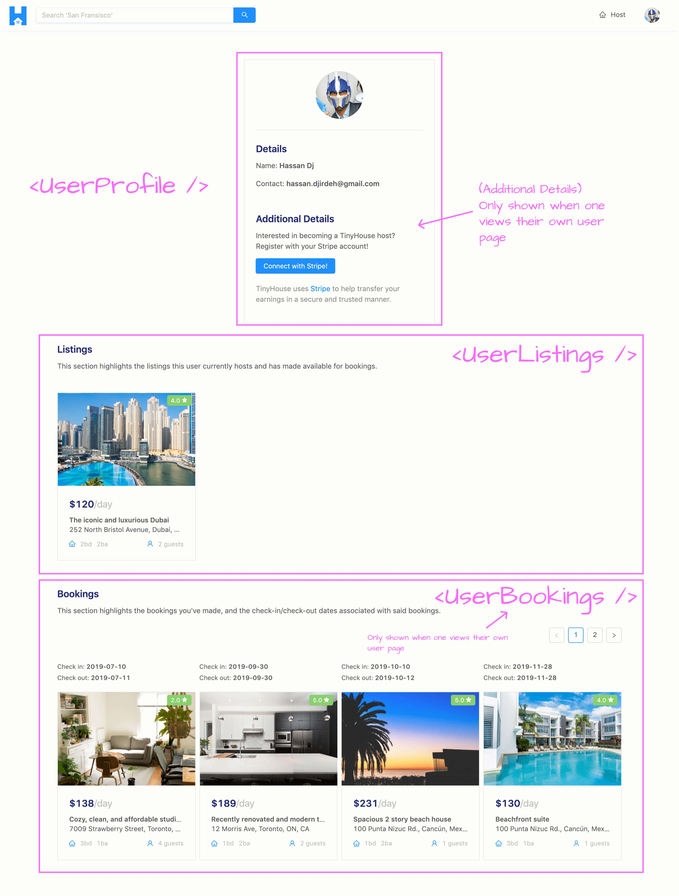
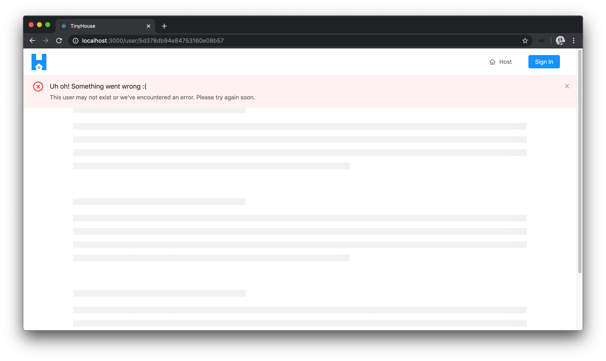
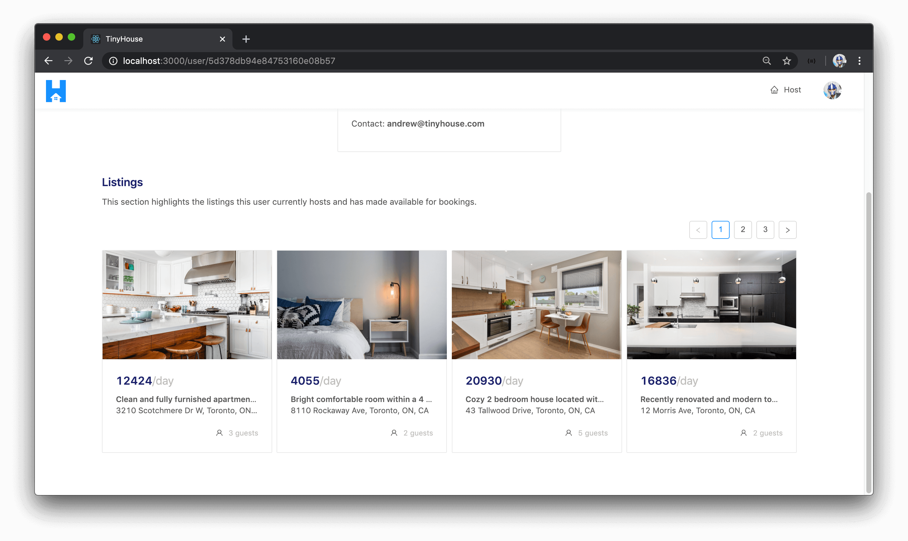
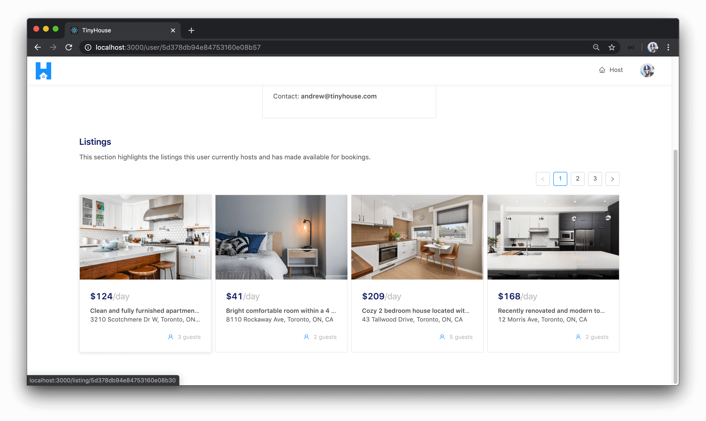
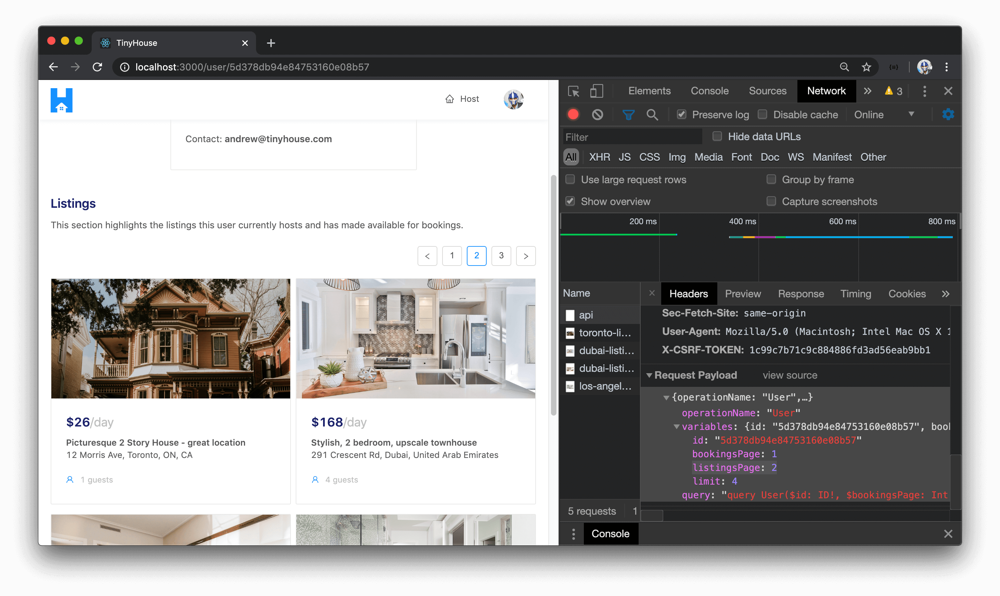

# The UserListings & UserBookings React Components

> 📝 Documentation on the `<List />` component we use from Ant Design can be found - [here](https://ant.design/components/list/).

In the last lesson, we've been able to query for a single user and display some of that queried information in the `/user/:id` page of that user. In this lesson, we'll look to query the paginated list of `listings` and `bookings` for the user and display it on the user's page.

-   The listings section will be a child `<UserListings />` component of the user page.
-   The bookings section will be a child `<UserBookings />` component of the user page.

`<UserListings />` and `<UserBookings />` resemble one another based on the cards being shown. The UI for these cards is going to be used in many different areas of our app including the `/home` page and the `/listings/:location?` page.



Since these listing card elements are going to be used in multiple areas of our application, we'll create a `<ListingCard />` component to represent a single listing element in our application's `src/lib/components/` folder that can be used anywhere. The `<ListingCard />` component will be fairly straightforward - it will accept a series of props such as the `price` of a listing, the `title`, `description`, `numOfGuests`, and it will display that information within a card.

### Update User Query

The first thing we're going to do is update the `user` query document in our app to query for the `bookings` and `listings` fields of a `user`. `bookings` and `listings` are paginated fields that require us to pass in a `limit` and `page` arguments. We're going to be passing these arguments from the `<User />` component that makes the query so let's state the `User` query document we've established in the `src/lib/graphql/queries/User/index.ts` file is going to accept a some new arguments.

We'll state that the `User` query is going to accept a `bookingsPage` argument that will determine which booking page the user is in and will be an integer type. The `User` query will also accept a `listingsPage` argument that will determine which listings page the user is in. Since we'll have the same `limit` for the number of `bookings` or `listings` that can be shown on a single page, we'll only specify a single `limit` argument is to be passed into the `User` query.

```tsx
import { gql } from "apollo-boost";

export const USER = gql`
  query User($id: ID!, $bookingsPage: Int!, $listingsPage: Int!, $limit: Int!) {
    #...
  }
`;
```

#### `bookings`

In our `user` query statement, we'll now query for the `bookings` field and pass the `limit` argument along for the limit of bookings we want in a single page. We'll also say the value for the `page` argument for the `bookings` field will be `bookingsPage`.

```tsx
import { gql } from "apollo-boost";

export const USER = gql`
  query User($id: ID!, $bookingsPage: Int!, $listingsPage: Int!, $limit: Int!) {
    user(id: $id) {
      id
      name
      avatar
      contact
      hasWallet
      income
      bookings(limit: $limit, page: $bookingsPage) {}
    }
  }
`;
```

We'll now query for the fields we'll want from within the `bookings` field.

-   We'll query for the `total` field to get the _total_ number of bookings that are returned.
-   We'll query for the `result` field which is the actual list of booking objects. In each booking object, we'll query for:
    -   The `id` of the booking.
    -   The `listing` of the booking which we'll further query for the `id`, `title`, `image`, `address`, `price`, and `numOfGuests` of the listing.
    -   The `checkIn` and `checkOut` dates of the booking.

```tsx
import { gql } from "apollo-boost";

export const USER = gql`
  query User($id: ID!, $bookingsPage: Int!, $listingsPage: Int!, $limit: Int!) {
    user(id: $id) {
      id
      name
      avatar
      contact
      hasWallet
      income
      bookings(limit: $limit, page: $bookingsPage) {
        total
        result {
          id
          listing {
            id
            title
            image
            address
            price
            numOfGuests
          }
          checkIn
          checkOut
        }
      }
    }
  }
`;
```

#### `listings`

The `listings` field we'll query from the `user` object is going to be very similar to what we query for the `bookings` field except that there's no `checkIn` and `checkOut` information. The `result` field of `listings` is the list of listing objects we'll query where we'll get the `id`, `title`, `image`, `address`, `price`, and `numOfGuests` of the listing. We'll also ensure we provide the `limit` and `listingsPage` values for the `limit` and `page` arguments the `listings` field expects.

With all these changes, the `USER` query document we've established will look like:

```ts
import { gql } from "apollo-boost";

export const USER = gql`
  query User($id: ID!, $bookingsPage: Int!, $listingsPage: Int!, $limit: Int!) {
    user(id: $id) {
      id
      name
      avatar
      contact
      hasWallet
      income
      bookings(limit: $limit, page: $bookingsPage) {
        total
        result {
          id
          listing {
            id
            title
            image
            address
            price
            numOfGuests
          }
          checkIn
          checkOut
        }
      }
      listings(limit: $limit, page: $listingsPage) {
        total
        result {
          id
          title
          image
          address
          price
          numOfGuests
        }
      }
    }
  }
`;
```

There shouldn't be a reason for us to update the schema in our client application since the schema has remained the same from the last lesson _but_ we'll now update the autogenerated type definitions for our GraphQL API in our client.

We'll head to the terminal and run the `codegen:generate` command in our client project.

```shell
npm run codegen:generate
```

### `<ListingCard />`

With our autogenerated type definitions updated, the query we've established in the `<User />` component will currently throw an error since we're not passing in the additional variables the query now accepts (`bookingsPage`, `listingsPage`, and `limit`). We'll come back to this in a second. First, we'll create the custom `<ListingCard />` component that our upcoming `<UserListings />` and `<UserBookings />` components are going to use.

We'll create the `<ListingCard />` component in the `src/lib/components/` folder.

```shell
client/
  // ...
  src/
    lib/
      components/
        // ...
        ListingCard/
          index.tsx
    // ...
  // ...
```

In the `src/lib/components/index.ts` file, we'll re-export the `<ListingCard />` component we'll shortly create.

```ts
export * from "./ListingCard";
```

The `<ListingCard />` component we'll create will mostly be presentational and display some information about a single listing. In the `src/lib/components/ListingCard/index.tsx` file, we'll first import the components we'll need to use from Ant Design - the [`Card`](https://ant.design/components/card/), [`Icon`](https://ant.design/components/icon/), and [`Typography`](https://ant.design/components/typography/) components.

We'll expect the `<ListingCard />` component to accept a single `listing` object prop which will have an `id`, `title,` `image`, and `address` fields all of which are of type `string`. The `listing` object prop will also have a `price` and `numOfGuests` fields which are to be number values.

```tsx
import React from "react";
import { Card, Icon, Typography } from "antd";

interface Props {
  listing: {
    id: string;
    title: string;
    image: string;
    address: string;
    price: number;
    numOfGuests: number;
  };
}
```

We'll destruct the `<Text />` and `<Title />` components from the `<Typography />` component. We'll create and export the `<ListingCard />` component function and in the component, we'll destruct the field values we'll want to access from the `listing` object prop.

```tsx
import React from "react";
import { Card, Icon, Typography } from "antd";

interface Props {
  listing: {
    id: string;
    title: string;
    image: string;
    address: string;
    price: number;
    numOfGuests: number;
  };
}

export const ListingCard = ({ listing }: Props) => {
  const { title, image, address, price, numOfGuests } = listing;
};
```

In the `<ListingCard />` component's return statement, we'll return the `<Card />` component from Ant Design. In the `<Card />` component `cover` prop, we'll state the `backgroundImage` of the cover is to be the listing image. The rest of the contents within the `<Card />` component will display information of the `listing` such as its `price`, `title`, `address`, and `numOfGuests`.

```tsx
import React from "react";
import { Card, Icon, Typography } from "antd";

interface Props {
  listing: {
    id: string;
    title: string;
    image: string;
    address: string;
    price: number;
    numOfGuests: number;
  };
}

const { Text, Title } = Typography;

export const ListingCard = ({ listing }: Props) => {
  const { title, image, address, price, numOfGuests } = listing;

  return (
    <Card
      hoverable
      cover={
        <div
          style={{ backgroundImage: `url(${image})` }}
          className="listing-card__cover-img"
        />
      }
    >
      <div className="listing-card__details">
        <div className="listing-card__description">
          <Title level={4} className="listing-card__price">
            {price}
            <span>/day</span>
          </Title>
          <Text strong ellipsis className="listing-card__title">
            {title}
          </Text>
          <Text ellipsis className="listing-card__address">
            {address}
          </Text>
        </div>
        <div className="listing-card__dimensions listing-card__dimensions--guests">
          <Icon type="user" />
          <Text>{numOfGuests} guests</Text>
        </div>
      </div>
    </Card>
  );
};
```

This will pretty much be the entire `<ListingCard />` component. We'll make some minor changes to it when we survey and see how it looks in our client application.

> [`Icon`](https://ant.design/components/icon/) is a useful component from Ant Design that provides a large list of icons that can be accessed by simply providing a value for the icon's `type` prop. In `<ListingCard />`, we've used the `<Icon />` component and provided a `type` value of `user` to get the user icon.

### `<User />`

We'll head over to the `<User />` component and first look to update the `user` query being made. The query for the `user` field now expects three new variables - `bookingsPage`, `listingsPage`, and `limit`. For the `bookings` and `listings` page values, we want our `<User />` component to keep track of these values and update them based on which of the pages the user wants to visit. As a result, these values will be best kept as component state so we'll import the `useState` Hook in our `<User />` component file.

```tsx
import React, { useState } from "react";
```

At the top of our `<Listings />` component, we'll use the `useState` Hook to create two new state values - `bookingsPage` and `listingsPage`. We'll initialize these page values with the value of `1` since when the user first visits the `/user/:id` page, we'll want them to see the first page for both the bookings and listings lists.

We'll also destruct functions that will be used to update these state values.

```tsx
export const User = ({ viewer, match }: Props & RouteComponentProps<MatchParams>) => {
  const [listingsPage, setListingsPage] = useState(1);
  const [bookingsPage, setBookingsPage] = useState(1);

  // ...
};
```

Since the `limit` value (i.e. the limit of the number of bookings or listings that should show for a single page) will stay the same and we won't want the user to update this, we'll create a constant above our component called `PAGE_LIMIT` that'll reference the limit of paginated items in a page - which will be `4`.

In our `useQuery` Hook declaration, we'll then pass the values for the new variables - `bookingsPage`, `listingsPage`, and `limit`.

```tsx
// ...

const PAGE_LIMIT = 4;

export const User = ({ viewer, match }: Props & RouteComponentProps<MatchParams>) => {
  const [listingsPage, setListingsPage] = useState(1);
  const [bookingsPage, setBookingsPage] = useState(1);

  const { data, loading, error } = useQuery<UserData, UserVariables>(USER, {
    variables: {
      id: match.params.id,
      bookingsPage,
      listingsPage,
      limit: PAGE_LIMIT
    }
  });

  // ...

  return (
    // ...
  );
};
```

We'll now have the `<User />` component render the child `<UserBookings />` and `<UserListings />` components before we create them. In the `<User />` component, we'll check for if the user data exists and if so - we'll assign the `listings` and `bookings` fields of the user data to the constants `userListings` and `userBookings` respectively.

```tsx
// ...

const PAGE_LIMIT = 4;

export const User = ({ viewer, match }: Props & RouteComponentProps<MatchParams>) => {
  const [listingsPage, setListingsPage] = useState(1);
  const [bookingsPage, setBookingsPage] = useState(1);

  const { data, loading, error } = useQuery<UserData, UserVariables>(USER, {
    variables: {
      id: match.params.id,
      bookingsPage,
      listingsPage,
      limit: PAGE_LIMIT
    }
  });

  // ...

  const userListings = user ? user.listings : null;
  const userBookings = user ? user.bookings : null;

  // ...

  return (
    // ...
  );
};
```

We'll create constant elements for the `<UserListings />` and `<UserBookings />` components. If the `userListings` constant has a value (i.e. `listings` within `user` exists), we'll have a `userListingsElement` be the `<UserListings />` component. For the `<UserListings />` component we want to render, we'll pass in a few props that the component will eventually use such as `userListings`, `listingsPage`, `limit`, and the function necessary to update the `listingsPage` value - `setListingsPage()`.

```tsx
// ...

const PAGE_LIMIT = 4;

export const User = ({ viewer, match }: Props & RouteComponentProps<MatchParams>) => {
  const [listingsPage, setListingsPage] = useState(1);
  const [bookingsPage, setBookingsPage] = useState(1);

  const { data, loading, error } = useQuery<UserData, UserVariables>(USER, {
    variables: {
      id: match.params.id,
      bookingsPage,
      listingsPage,
      limit: PAGE_LIMIT
    }
  });

  // ...

  const userListings = user ? user.listings : null;
  const userBookings = user ? user.bookings : null;

  // ...

  const userListingsElement = userListings ? (
    <UserListings
      userListings={userListings}
      listingsPage={listingsPage}
      limit={PAGE_LIMIT}
      setListingsPage={setListingsPage}
    />
  ) : null;

  // ...

  return (
    // ...
  );
};
```

We'll create a similar `userBookingsElement` constant that is to be the `<UserBookings />` component when the `userBookings` property has a value (i.e. `bookings` within `user` exists). The `<UserBookings />` component will receive the following props - `userbookings`, `bookingsPage`, `limit`, and the `setBookingsPage()` function.

```tsx
// ...

const PAGE_LIMIT = 4;

export const User = ({ viewer, match }: Props & RouteComponentProps<MatchParams>) => {
  const [listingsPage, setListingsPage] = useState(1);
  const [bookingsPage, setBookingsPage] = useState(1);

  const { data, loading, error } = useQuery<UserData, UserVariables>(USER, {
    variables: {
      id: match.params.id,
      bookingsPage,
      listingsPage,
      limit: PAGE_LIMIT
    }
  });

  // ...

  const userListings = user ? user.listings : null;
  const userBookings = user ? user.bookings : null;

  // ...

  const userListingsElement = userListings ? (
    <UserListings
      userListings={userListings}
      listingsPage={listingsPage}
      limit={PAGE_LIMIT}
      setListingsPage={setListingsPage}
    />
  ) : null;

  const userBookingsElement = userBookings ? (
    <UserBookings
      userBookings={userBookings}
      bookingsPage={bookingsPage}
      limit={PAGE_LIMIT}
      setBookingsPage={setBookingsPage}
    />
  ) : null;

  // ...

  return (
    // ...
  );
};
```

In the `<User />` component's return statement, we'll render the `userListingsElement` and `userBookingsElement` within their own `<Col />`'s. With all the changes made in the `<User />` component, the `src/sections/User/index.tsx` will look like the following:

```tsx
import React, { useState } from "react";
import { RouteComponentProps } from "react-router-dom";
import { useQuery } from "@apollo/react-hooks";
import { Col, Layout, Row } from "antd";
import { USER } from "../../lib/graphql/queries";
import {
  User as UserData,
  UserVariables
} from "../../lib/graphql/queries/User/__generated__/User";
import { ErrorBanner, PageSkeleton } from "../../lib/components";
import { Viewer } from "../../lib/types";
import { UserBookings, UserListings, UserProfile } from "./components";

interface Props {
  viewer: Viewer;
}

interface MatchParams {
  id: string;
}

const { Content } = Layout;
const PAGE_LIMIT = 4;

export const User = ({ viewer, match }: Props & RouteComponentProps<MatchParams>) => {
  const [listingsPage, setListingsPage] = useState(1);
  const [bookingsPage, setBookingsPage] = useState(1);

  const { data, loading, error } = useQuery<UserData, UserVariables>(USER, {
    variables: {
      id: match.params.id,
      bookingsPage,
      listingsPage,
      limit: PAGE_LIMIT
    }
  });

  if (loading) {
    return (
      <Content className="user">
        <PageSkeleton />
      </Content>
    );
  }

  if (error) {
    return (
      <Content className="user">
        <ErrorBanner description="This user may not exist or we've encountered an error. Please try again soon." />
        <PageSkeleton />
      </Content>
    );
  }

  const user = data ? data.user : null;
  const viewerIsUser = viewer.id === match.params.id;

  const userListings = user ? user.listings : null;
  const userBookings = user ? user.bookings : null;

  const userProfileElement = user ? (
    <UserProfile user={user} viewerIsUser={viewerIsUser} />
  ) : null;

  const userListingsElement = userListings ? (
    <UserListings
      userListings={userListings}
      listingsPage={listingsPage}
      limit={PAGE_LIMIT}
      setListingsPage={setListingsPage}
    />
  ) : null;

  const userBookingsElement = userListings ? (
    <UserBookings
      userBookings={userBookings}
      bookingsPage={bookingsPage}
      limit={PAGE_LIMIT}
      setBookingsPage={setBookingsPage}
    />
  ) : null;

  return (
    <Content className="user">
      <Row gutter={12} type="flex" justify="space-between">
        <Col xs={24}>{userProfileElement}</Col>
        <Col xs={24}>
          {userListingsElement}
          {userBookingsElement}
        </Col>
      </Row>
    </Content>
  );
};
```

We'll now look to create the `<UserListings />` and `<UserBookings />` child components we render within `<User />`. We'll create the folders for them in the `components/` folder within `src/sections/User/`.

```shell
client/
  // ...
  src/
    // ...
    sections/
      // ...
      User/
        components/
          UserListings/
            index.tsx
          UserBookings/
            index.tsx
          // ...
    // ...
```

In the `src/sections/User/components/index.ts` file, we'll re-export the soon to be created `<UserListings />` and `<UserBookings />` components.

```ts
export * from "./UserBookings";
export * from "./UserListings";
```

### `<UserListings />`

We'll begin with the `<UserListings />` component. The main component we're going to use from Ant Design to help us create `<UserListings />` is the powerful [`<List />`](https://ant.design/components/list/) component.

The [properties](https://ant.design/components/list/#List) we're interested in using from Ant Design's `<List />` component is:

-   The `grid` prop that helps control the structure of the grid.
-   The `dataSource` prop which would be the list of data that is going to be iterated and displayed in the list.
-   The `renderItem` prop which is a prop function that determines how every item of the list is going to be rendered. We'll be interested in rendering the custom `<ListingCard />` component for every item in the list.
-   The `pagination` prop to help set-up the list's pagination configuration. The `pagination` prop in the `<List />` component is adapted from Ant Design's [`<Pagination />`](https://ant.design/components/pagination/) component which will allow us to specify the current page, the total number of contents, the default page size, and so on.

In the `<UserListings />` component file (`src/sections/User/components/UserListings/index.tsx`), let's begin by first importing what we'll need. We'll import the `<List />` and `<Typography />` components from Ant Design. We'll import the `<ListingCard />` component from our `src/lib/components/` folder. We'll also import the autogenerated `User` interface for the user data being queried.

```tsx
import React from "react";
import { List, Typography } from "antd";
import { ListingCard } from "../../../../lib/components";
import { User } from "../../../../lib/graphql/queries/User/__generated__/User";
```

We'll then declare the props that the `<UserListings />` component is to accept - `userListings`, `listingsPage`, `limit`, and `setListingsPage`. `listingsPage` and `limit` will be numbers while `setListingsPage` will be a function that accepts a number argument and returns `void`. For the `userListings` prop, we'll declare a lookup type to access the interface type of the `listings` field within the `User` data interface used to describe the shape of data from the `user` query.

We'll also destruct the `<Paragraph />` and `<Title />` child components from `<Typography />`.

```tsx
import React from "react";
import { List, Typography } from "antd";
import { ListingCard } from "../../../../lib/components";
import { User } from "../../../../lib/graphql/queries/User/__generated__/User";

interface Props {
  userListings: User["user"]["listings"];
  listingsPage: number;
  limit: number;
  setListingsPage: (page: number) => void;
}

const { Paragraph, Title } = Typography;
```

We'll create and export the `<UserListings />` component function and destruct the props we'll need in the component. We'll further destruct the `total` and `result` fields from the `userListings` prop object.

```tsx
import React from "react";
import { List, Typography } from "antd";
import { ListingCard } from "../../../../lib/components";
import { User } from "../../../../lib/graphql/queries/User/__generated__/User";

interface Props {
  userListings: User["user"]["listings"];
  listingsPage: number;
  limit: number;
  setListingsPage: (page: number) => void;
}

const { Paragraph, Title } = Typography;

export const UserListings = ({
  userListings,
  listingsPage,
  limit,
  setListingsPage
}: Props) => {
  const { total, result } = userListings;
};
```

We'll first create the list element within a constant we'll call `userListingsList` and we'll use Ant Design's `<List />` component. Here's how we plan on using each of the props we attempt to declare in the `<List />` component.

**`grid`**

`grid` will be used to help set up the grid layout in different viewports.

-   The `gutter` property in `grid` helps introduce some spacing between columns so we'll state a value of `8`.
-   The `xs` field dictates the number of columns to be shown in extra-small viewports with which we'll provide a value of 1.
-   For small viewports (i.e. the `sm` grid field), we'll provide a value `2` to show 2 items for the entire viewport.
-   For large viewports (i.e. the `lg` grid field), we'll provide a value of `4` to show 4 items for the entire viewport.

```tsx
// ...

export const UserListings = ({
  userListings,
  listingsPage,
  limit,
  setListingsPage
}: Props) => {
  const { total, result } = userListings;

  const userListingsList = (
    <List
      grid={{
        gutter: 8,
        xs: 1,
        sm: 2,
        lg: 4
      }}
    />
  );
};
```

**`dataSource`**

`dataSource` is the data we want to use for the list. We'll pass in the `result` array from our `userListings` object which is the list of listings.

```tsx
// ...

export const UserListings = ({
  userListings,
  listingsPage,
  limit,
  setListingsPage
}: Props) => {
  const { total, result } = userListings;

  const userListingsList = (
    <List
      grid={{
        gutter: 8,
        xs: 1,
        sm: 2,
        lg: 4
      }}
      dataSource={result}
    />
  );
};
```

**`locale`**

`locale` can help us introduce text for empty lists. For the value of `locale`, we'll pass an object with an `emptyText` field that will say `"User doesn't have any listings yet!"` which will be shown when the user doesn't have any listings.

```tsx
// ...

export const UserListings = ({
  userListings,
  listingsPage,
  limit,
  setListingsPage
}: Props) => {
  const { total, result } = userListings;

  const userListingsList = (
    <List
      grid={{
        gutter: 8,
        xs: 1,
        sm: 2,
        lg: 4
      }}
      dataSource={result}
      locale={{ emptyText: "User doesn't have any listings yet!" }}
    />
  );
};
```

**`pagination`**

`pagination` is how we'll set up the pagination element of our list. We'll pass an object and the fields we'll want to configure this.

-   `position: "top"` helps position it at the top.
-   `current` references the current page with which we'll give a value of the `listingsPage` prop.
-   `total` references the total number of items to be paginated with which we'll give a value of the `total` field from our query.
-   `defaultPageSize` helps determine the default page size with which we'll pass a value of the `limit` prop (which is 4).
-   `hideOnSinglePage` helps us hide the pagination element when there's only one page and since we'll want it, we'll give this a value of `true`.
-   `showLessItems` helps construct the pagination element in a way that not all page numbers are shown for very large lists. With `showLessItems`, only the pages around the current page and the boundary pages will be shown which is something we'll want as well.
-   Finally, in the `pagination` options there exists an `onChange()` callback function that runs when the user clicks a page number. We'll declare the `onChange()` callback function, take the payload of the callback (which will be the new page number), and run the `setListingsPage()` function we have that will update the `listingsPage` state value in the parent.

```tsx
// ...

export const UserListings = ({
  userListings,
  listingsPage,
  limit,
  setListingsPage
}: Props) => {
  const { total, result } = userListings;

  const userListingsList = (
    <List
      grid={{
        gutter: 8,
        xs: 1,
        sm: 2,
        lg: 4
      }}
      dataSource={result}
      locale={{ emptyText: "User doesn't have any listings yet!" }}
      pagination={{
        position: "top",
        current: listingsPage,
        total,
        defaultPageSize: limit,
        hideOnSinglePage: true,
        showLessItems: true,
        onChange: (page: number) => setListingsPage(page)
      }}
    />
  );
};
```

**`renderItem`**

The last prop we'll declare in the `<List />` component is the `renderItem` prop which takes every item within the data source and determines the UI to be displayed for each list item. We'll keep it simple and say we'll render a `<ListingCard />` component for each item with which we'll pass the iterated listing as props. We'll declare the rendered`<ListingCard />` within the `<List.Item />` component.

```tsx
// ...

export const UserListings = ({
  userListings,
  listingsPage,
  limit,
  setListingsPage
}: Props) => {
  const { total, result } = userListings;

  const userListingsList = (
    <List
      grid={{
        gutter: 8,
        xs: 1,
        sm: 2,
        lg: 4
      }}
      dataSource={result}
      locale={{ emptyText: "User doesn't have any listings yet!" }}
      pagination={{
        position: "top",
        current: listingsPage,
        total,
        defaultPageSize: limit,
        hideOnSinglePage: true,
        showLessItems: true,
        onChange: (page: number) => setListingsPage(page)
      }}
      renderItem={userListing => (
        <List.Item>
          <ListingCard listing={userListing} />
        </List.Item>
      )}
    />
  );
};
```

With our list element created, we can render it in our `<UserListings />` component's return statement. We'll return some markup providing a title and a description for what this listings section is and we'll return the `userListingsList` element. With all these changes, the `<UserListings />` component file will appear as the following:

```tsx
import React from "react";
import { List, Typography } from "antd";
import { ListingCard } from "../../../../lib/components";
import { User } from "../../../../lib/graphql/queries/User/__generated__/User";

interface Props {
  userListings: User["user"]["listings"];
  listingsPage: number;
  limit: number;
  setListingsPage: (page: number) => void;
}

const { Paragraph, Title } = Typography;

export const UserListings = ({
  userListings,
  listingsPage,
  limit,
  setListingsPage
}: Props) => {
  const { total, result } = userListings;

  const userListingsList = (
    <List
      grid={{
        gutter: 8,
        xs: 1,
        sm: 2,
        lg: 4
      }}
      dataSource={result}
      locale={{ emptyText: "User doesn't have any listings yet!" }}
      pagination={{
        position: "top",
        current: listingsPage,
        total,
        defaultPageSize: limit,
        hideOnSinglePage: true,
        showLessItems: true,
        onChange: (page: number) => setListingsPage(page)
      }}
      renderItem={userListing => (
        <List.Item>
          <ListingCard listing={userListing} />
        </List.Item>
      )}
    />
  );

  return (
    <div className="user-listings">
      <Title level={4} className="user-listings__title">
        Listings
      </Title>
      <Paragraph className="user-listings__description">
        This section highlights the listings this user currently hosts and has
        made available for bookings.
      </Paragraph>
      {userListingsList}
    </div>
  );
};
```

This will be the UI we'll need for our `<UserListings />` component.

### `<UserBookings />`

The `<UserBookings />` component will be very similar to the `<UserListings />` component. In the `src/sections/User/components/UserBookings/index.tsx` file, we'll import the `<List />` and `<Typography />` components from Ant Design, we'll import the `<ListingCard />` component from the `src/lib/components/` folder, and we'll import the autogenerated TypeScript interface for the data obtained from the `user` query. We'll destruct the `<Text />`, `<Paragraph />`, and `<Title />` from `<Typography />`.

We'll also reference the appropriate props the `<UserBookings />` component is to receive which is to be `userBookings`, `bookingsPage`, `limit`, and the `setBookingsPage()` function.

```tsx
import React from "react";
import { List, Typography } from "antd";
import { ListingCard } from "../../../../lib/components";
import { User } from "../../../../lib/graphql/queries/User/__generated__/User";

interface Props {
  userBookings: User["user"]["bookings"];
  bookingsPage: number;
  limit: number;
  setBookingsPage: (page: number) => void;
}

const { Paragraph, Text, Title } = Typography;

export const UserBookings = ({
  userBookings,
  bookingsPage,
  limit,
  setBookingsPage
}: Props) => {};
```

In the `<UserBookings />` component, we won't be able to destruct the `total` and `result` value from the `userBookings` prop directly since `userBookings` might be null. `userBookings` will be `null` when a viewer views the user page of _another_ user.

At the beginning of the `<UserBookings />` component function, we'll use ternary statements to determine the values of the `total` and `result` constants which will be null if `userBookings` is ever `null`.

```tsx
// ...

export const UserBookings = ({
  userBookings,
  bookingsPage,
  limit,
  setBookingsPage
}: Props) => {
  const total = userBookings ? userBookings.total : null;
  const result = userBookings ? userBookings.result : null;
};
```

We'll then create an element for the list of bookings which we'll call `userBookingsList`. This element will only be conditionally shown if the `total` and `result` values exist. The list element we'll create for `userBookingsList` will be very similar to that created in the `<UserListings />` component except that we'll reference the appropriate prop values for the pagination object - `bookingsPage` and `setBookingsPage`.

```tsx
// ...

export const UserBookings = ({
  userBookings,
  bookingsPage,
  limit,
  setBookingsPage
}: Props) => {
  const total = userBookings ? userBookings.total : null;
  const result = userBookings ? userBookings.result : null;

  const userBookingsList = userBookings ? (
    <List
      grid={{
        gutter: 8,
        xs: 1,
        sm: 2,
        lg: 4
      }}
      dataSource={result ? result : undefined}
      locale={{ emptyText: "You haven't made any bookings!" }}
      pagination={{
        position: "top",
        current: bookingsPage,
        total: total ? total : undefined,
        defaultPageSize: limit,
        hideOnSinglePage: true,
        showLessItems: true,
        onChange: (page: number) => setBookingsPage(page)
      }}
      renderItem={}
    />
  ) : null;
};
```

In the `renderItem` prop of the `<List />` in `userBookingsList`, the difference we'll make here from the list shown in the `<UserListings />` is that we'll now display booking history above the listing card. In the `renderItem` prop function, we'll create this `bookingHistory` element within a constant that will simply show the `checkIn` and `checkOut` values and we'll render it above the `<ListingCard />` shown for each list item.

```tsx
// ...

export const UserBookings = ({
  userBookings,
  bookingsPage,
  limit,
  setBookingsPage
}: Props) => {
  const total = userBookings ? userBookings.total : null;
  const result = userBookings ? userBookings.result : null;

  const userBookingsList = userBookings ? (
    <List
      grid={{
        gutter: 8,
        xs: 1,
        sm: 2,
        lg: 4
      }}
      dataSource={result ? result : undefined}
      locale={{ emptyText: "You haven't made any bookings!" }}
      pagination={{
        position: "top",
        current: bookingsPage,
        total: total ? total : undefined,
        defaultPageSize: limit,
        hideOnSinglePage: true,
        showLessItems: true,
        onChange: (page: number) => setBookingsPage(page)
      }}
      renderItem={userBooking => {
        const bookingHistory = (
          <div className="user-bookings__booking-history">
            <div>
              Check in: <Text strong>{userBooking.checkIn}</Text>
            </div>
            <div>
              Check out: <Text strong>{userBooking.checkOut}</Text>
            </div>
          </div>
        );

        return (
          <List.Item>
            {bookingHistory}
            <ListingCard listing={userBooking.listing} />
          </List.Item>
        );
      }}
    />
  ) : null;
};
```

Instead of returning the `userBookingsList` element in the return statement of `<UserBookings />` directly, we'll have a conditionally rendered element called `userBookingsElement` that will be shown if the `userBookings` prop is available. By creating and returning this `userBookingsElement` and with the all the changes we've made, our `src/sections/User/components/UserBookings/index.tsx` file will look like the following:

```tsx
import React from "react";
import { List, Typography } from "antd";
import { ListingCard } from "../../../../lib/components";
import { User } from "../../../../lib/graphql/queries/User/__generated__/User";

interface Props {
  userBookings: User["user"]["bookings"];
  bookingsPage: number;
  limit: number;
  setBookingsPage: (page: number) => void;
}

const { Paragraph, Text, Title } = Typography;

export const UserBookings = ({
  userBookings,
  bookingsPage,
  limit,
  setBookingsPage
}: Props) => {
  const total = userBookings ? userBookings.total : null;
  const result = userBookings ? userBookings.result : null;

  const userBookingsList = userBookings ? (
    <List
      grid={{
        gutter: 8,
        xs: 1,
        sm: 2,
        lg: 4
      }}
      dataSource={result ? result : undefined}
      locale={{ emptyText: "You haven't made any bookings!" }}
      pagination={{
        position: "top",
        current: bookingsPage,
        total: total ? total : undefined,
        defaultPageSize: limit,
        hideOnSinglePage: true,
        showLessItems: true,
        onChange: (page: number) => setBookingsPage(page)
      }}
      renderItem={userBooking => {
        const bookingHistory = (
          <div className="user-bookings__booking-history">
            <div>
              Check in: <Text strong>{userBooking.checkIn}</Text>
            </div>
            <div>
              Check out: <Text strong>{userBooking.checkOut}</Text>
            </div>
          </div>
        );

        return (
          <List.Item>
            {bookingHistory}
            <ListingCard listing={userBooking.listing} />
          </List.Item>
        );
      }}
    />
  ) : null;

  const userBookingsElement = userBookingsList ? (
    <div className="user-bookings">
      <Title level={4} className="user-bookings__title">
        Bookings
      </Title>
      <Paragraph className="user-bookings__description">
        This section highlights the bookings you've made, and the check-in/check-out dates
        associated with said bookings.
      </Paragraph>
      {userBookingsList}
    </div>
  ) : null;

  return userBookingsElement;
};
```

And that's it! We've created the `<UserListings />` and `<UserBookings />` components. In the `<User />` component file, let's import these newly created components and save our changes.

```tsx
import { UserBookings, UserListings, UserProfile } from "./components";
```

At this moment in time, the user you've signed in with won't have any listings or bookings data. To verify that at least the `<UserListings />` component works as intended, we'll grab an id of a user from our mock `users` collection in the database and visit the user page directly based on the route.

```shell
/user/5d378db94e84753160e08b56 # example path for user in mock data that has listings
```

And... we see an error!



Why is this error being shown? **There are a few things we've missed on implementing on the server with regards to how the `listings` and `bookings` fields in our GraphQL API are to be resolved.**

### `listingResolvers | bookingResolvers` - Server Update

> 🏃 At this moment, we'll switch over to briefly working on our Node server project.

In the server project, we've defined resolver functions for the `user` object. The `listings` and `bookings` field in our user object are to resolve to the `Listing` and `Booking` GraphQL object types. **We haven't defined any resolver functions for the `Listing` and `Booking` GraphQL objects**. Certain trivial resolver functions are handled for us by Apollo Server, however, we'll need to set up explicit resolver functions for a few fields.

#### `listingResolvers`

We'll begin by creating resolver functions for the `Listing` GraphQL object. We'll create a `Listing/` folder that is to have an `index.ts` file within the `src/graphql/resolvers/` folder.

```shell
server/
  src/
    resolvers/
      // ...
      Listing/
        index.ts
      // ...
    // ..
  // ...
```

In the `src/graphql/resolvers/Listing/index.ts` file, we'll create the `listingResolvers` map for the `Listing` GraphQL object type.

```tsx
import { IResolvers } from "apollo-server-express";

export const listingResolvers: IResolvers = {};
```

Within `listingResolvers`, we'll specify the `id()` resolver function that will simply return the value of the `_id` field of the listing object in string format.

```ts
import { IResolvers } from "apollo-server-express";
import { Listing } from "../../../lib/types";

export const listingResolvers: IResolvers = {
  Listing: {
    id: (listing: Listing): string => {
      return listing._id.toString();
    }
  }
};
```

> **Note:** A listing document in our database differs from a user document in our database since `_id` for a listing document is an `ObjectId` and not a string. This is why we've used the `toString()` helper to convert the `_id` value to a string as we resolve the `id` field for a `Listing` GraphQL object.

There will be other resolvers we'll eventually need to create for the `Listing` object but for the fields we're attempting to access for the `/user/:id` page in our client, the `id()` resolver is the only one we'll explicitly need to create. The other fields being queried for the `Listing` object in the `/user/:id` are being handled as trivial resolvers.

In the `src/graphql/resolvers/index.ts` file, we'll import the `listingResolvers` map and place it in the Lodash [`merge()`](https://lodash.com/docs/4.17.15#merge) function

```tsx
import merge from "lodash.merge";
import { listingResolver } from "./Listing";
import { userResolver } from "./User";
import { viewerResolver } from "./Viewer";

export const resolvers = merge(listingResolver, userResolver, viewerResolver);
```

#### `bookingResolvers`

We'll also need to create a `bookingResolvers` map and some resolver functions for a few fields we query for in the `Booking` object in the `/user/:id` route.

In `src/graphql/resolvers/`, we'll create a `Booking/` folder that is to have an `index.ts` file.

```shell
server/
  src/
    resolvers/
      // ...
      Booking/
        index.ts
      // ...
    // ..
  // ...
```

In the `src/graphql/resolvers/Booking/index.ts` file, we'll create a `bookingsResolver` map. We'll define a `Booking` object and specify the `id()` resolver function similar to how we've done in the `listingResolvers` map.

```tsx
import { IResolvers } from "apollo-server-express";
import { Booking } from "../../../lib/types";

export const bookingResolvers: IResolvers = {
  Booking: {
    id: (booking: Booking): string => {
      return booking._id.toString();
    }
  }
};
```

There's one other field we're querying for in our client, for the `Booking` GraphQL object, that we'll need an explicit resolver function for as well. In the `/user/:id` page, we're querying for the `listing` field from the booking object expecting a listing object that summarizes the listing details of a booking. In the `booking` document in our database, we store `listing` as an `id` value but in the client we expect a listing object.

With that said, we'll create a resolver for the `listing` field in the `Booking` object to find a single listing document from the listings collection where the value of the listing `_id` is equivalent to the id value of the `booking.listing` field.

```ts
import { IResolvers } from "apollo-server-express";
import { Database, Listing, Booking } from "../../../lib/types";

export const bookingResolvers: IResolvers = {
  Booking: {
    id: (booking: Booking): string => {
      return booking._id.toString();
    },
    listing: (
      booking: Booking,
      _args: {},
      { db }: { db: Database }
    ): Promise<Listing | null> => {
      return db.listings.findOne({ _id: booking.listing });
    }
  }
};
```

We'll now import the `bookingResolvers` map in the `src/resolvers/index.ts` file, and place it in the Lodash [merge()](https://lodash.com/docs/4.17.15#merge) function.

```ts
import merge from "lodash.merge";
import { bookingResolvers } from "./Booking";
import { listingResolvers } from "./Listing";
import { userResolvers } from "./User";
import { viewerResolvers } from "./Viewer";

export const resolvers = merge(
  bookingResolvers,
  listingResolvers,
  userResolvers,
  viewerResolvers
);
```

When we save our changes in the server and visit the same user page we attempted to visit before in the client application, we'll be presented with some listing cards for each listing that this user has.



### `<ListingCard />`

> 🏃 We'll switch back to working on our React client project.

There are a few more improvements we'll make before we discuss a few interesting points and close this lesson.

-   All pricing information stored in our database is in **cents**. We'll want to display pricing information for listings in the listing cards in dollar format.
-   For the icon shown in the `<ListingCard />`, we'll like to show a nice blue color that matches the primary color being used in our application.

We'll prepare a function to format currency and a constant to represent the icon color we'll want to show in our app in the `src/lib/utils/index.ts` file where we keep shared app functions.

We'll first create a `formatListingPrice()` function that'll take two arguments:

-   `price` which is a number
-   and a `round` boolean which we'll default to `true`.

```tsx
// ...

export const formatListingPrice = (price: number, round = true) => {};

// ...
```

In most areas of our app, we'll want to format the currency to dollars. We'll also usually want price values rounded to a whole number since it'll more presentable that way which is why we'll have `round` as a function argument to control this.

The `formatListingPrice()` function will simply return a string containing the dollar symbol and a `formatListingPrice` value which will get the dollar value and be rounded depending on the value of the `round` argument.

```tsx
export const formatListingPrice = (price: number, round = true) => {
  const formattedListingPrice = round ? Math.round(price / 100) : price / 100;
  return `$${formattedListingPrice}`;
};
```

We'll also export an `iconColor` value which will simply be a string to represent the primary hex color of our app.

```tsx
export const iconColor = "#1890ff";
```

With these changes, our `src/lib/utils/index.ts` file will look like the following:

```tsx
import { message, notification } from "antd";

export const iconColor = "#1890ff";

export const formatListingPrice = (price: number, round = true) => {
  const formattedListingPrice = round ? Math.round(price / 100) : price / 100;
  return `$${formattedListingPrice}`;
};

export const displaySuccessNotification = (
  message: string,
  description?: string
) => {
  return notification["success"]({
    message,
    description,
    placement: "topLeft",
    style: {
      marginTop: 50
    }
  });
};

export const displayErrorMessage = (error: string) => {
  return message.error(error);
};
```

In our `<ListingCard` /> component file, we'll import the `iconColor` and `formatListingPrice()` function from the `src/lib/utils/index.ts` file.

```tsx
import { iconColor, formatListingPrice } from "../../utils";
```

We'll make the following changes to the `<ListingCard />` component.

-   We'll use the `formatListingPrice()` function to show the price in the `<ListingCard />` template. By not passing in a second argument, it'll default to show a rounded value.
-   We'll apply a style to the `<Icon />` element to specify the color to be the `iconColor` value we've set up in the `src/lib/utils/index.ts` file.
-   We want listing cards to be links to the listing page of a particular listing. To make this happen, we'll import the `<Link />` component from `react-router-dom`, we'll destruct the `id` of a listing from the `listing` prop object, and we'll wrap our `<ListingCard />` component return statement with the `<Link />` component with a target route of `/listing/${id}`.

With these changes made to the `<ListingCard />` component, the `src/lib/components/ListingCard/index.tsx` file will look like the following.

```tsx
import React from "react";
import { Link } from "react-router-dom";
import { Card, Icon, Typography } from "antd";
import { iconColor, formatListingPrice } from "../../utils";

interface Props {
  listing: {
    id: string;
    title: string;
    image: string;
    address: string;
    price: number;
    numOfGuests: number;
  };
}

const { Text, Title } = Typography;

export const ListingCard = ({ listing }: Props) => {
  const { id, title, image, address, price, numOfGuests } = listing;

  return (
    <Link to={`/listing/${id}`}>
      <Card
        hoverable
        cover={
          <div
            style={{ backgroundImage: `url(${image})` }}
            className="listing-card__cover-img"
          />
        }
      >
        <div className="listing-card__details">
          <div className="listing-card__description">
            <Title level={4} className="listing-card__price">
              {formatListingPrice(price)}
              <span>/day</span>
            </Title>
            <Text strong ellipsis className="listing-card__title">
              {title}
            </Text>
            <Text ellipsis className="listing-card__address">
              {address}
            </Text>
          </div>
          <div className="listing-card__dimensions listing-card__dimensions--guests">
            <Icon type="user" style={{ color: iconColor }} />
            <Text>{numOfGuests} guests</Text>
          </div>
        </div>
      </Card>
    </Link>
  );
};
```

When we now take a look at the same user page we've viewed before in our client application, we can see that the pricing details now show the dollar symbol. The price of each listing is in dollars per day. In addition, the listing cards are now links that when clicked will take the user to that `/listing/:id` page.



### Pagination

#### Changing variables in `useQuery` Hook

We can see the pagination element shown when a user has more than 4 listings in total. If we were to click another page, our user page is loaded again and we'll see another page of listings! Amazing!

If the page is loading and we see a new set of listings, this probably means we're made another query, and we can confirm this from our browser's network tab. With that said, why is another query for the `user` happening when we switch pages?



When we take a look at the use of the `useQuery` Hook in the `<User />` component, we've come to understand the `useQuery` Hook makes the request when the component mounts for the first time. When we click a new page button, the only thing that's changed is the value of the `listingsPage` or `bookingsPage` state.

**The `useQuery` Hook in React Apollo is smart enough to make _another_ query request when the variables of the query _changes_, and this occurs by default**. This is especially helpful because our component is prepared to consume the `data`, `loading`, and `error` properties of our query result anytime the query is made again.

When our query is in flight again, `loading` in the `<User />` component is set to true and our page shows the loading skeleton. When the new query is complete - we see the new list of listings.

#### Apollo Client Cache

There's another important note we should talk about. If we head back to the client and try to navigate to a listing page we've already visited, our UI updates to show the listings that intend to be shown but a request _isn't being made again_.

How is this working? This is due to something we've briefly mentioned before but now can witness. Apollo Client doesn't only give us useful methods to conduct data fetching but sets up an [**in-memory intelligent cache without any configuration on our part**](https://www.apollographql.com/docs/react/why-apollo/#zero-config-caching).

When we make requests to retrieve data with Apollo Client, Apollo Client under the hood **caches the data**. The next time we return to the page that we've just visited, Apollo Client is smart enough to say - "Hey, we already have this data in the cache. Let's just provide the data from the cache directly without needing to make another request to the server". This saves time and helps avoid the unnecessary re-request of data from the server that we've already requested before.

> Apollo Client also gives us the capability to directly [update information in the cache](https://www.apollographql.com/docs/react/caching/cache-configuration/) when needed.

Are there ways we can tell Apollo Client to force the request from the network and not from the cache? Yes, and we'll see examples of this later in the course.

Okay. We're going to stop here for now. Great job so far! The UI we've built for the `/user/:id` page will be very similar to the other pages we intend to build in our client application.
