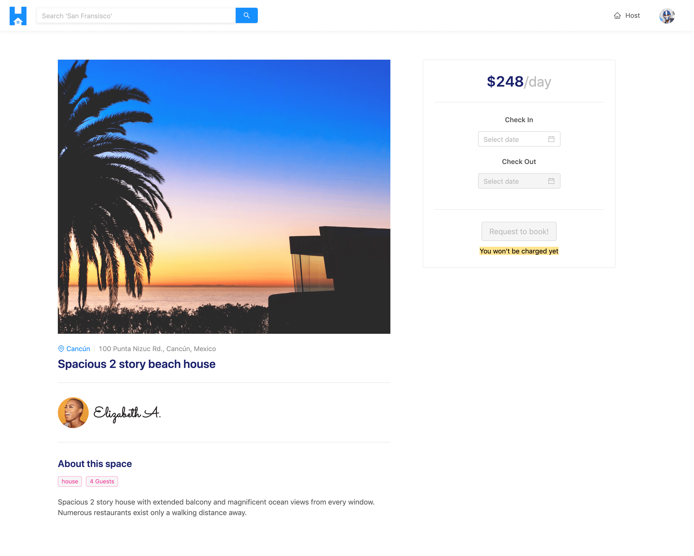

# Module 7 Introduction

In this module, we'll look to have listing information be queried from the database and shown in the Listing page of our application. The Listing page is where a user can see details about a certain listing and where the user will eventually be able to book that listing for a period of time.

The Listing page is to be displayed in the `/listing/:id` route of our app and in its complete state will look similar to the following:

In this module, we'll:

- Update our GraphQL API to query information for a specific listing from our database.
- Build the UI of the Listing page in our client project.
