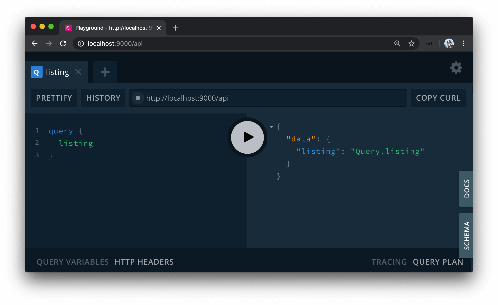

# Listing GraphQL Fields

In the last module, we managed to build the server GraphQL fields and client representation of a user. In this module, we'll look to build the server and client portions of getting information for a single **listing**. To display information about our listings in our client app, we will need some kind of functionality to query and resolve listing data on our server.

Just like how we have a single root-level field to query for a user, we'll have a single root-level field to query for a certain listing. The one thing we'll keep in mind with our `listing` query field is that we should only return the sensitive portions of the listing data if the user is requesting their own listing. The sensitive data we're referring to is the bookings made for a certain listing. Only the user querying for their own listing page should be able to access the bookings made to their listing. We'll implement this authorization in the coming lessons.

Let's first prepare the `listing` GraphQL field and the accompanying resolver function. We'll first define the `listings` field in the root `Query` object of our GraphQL API and we'll say, for now, that its expected return type is a defined string value.

```ts
  type Query {
    authUrl: String!
    user(id: ID!): User!
    listing: String!
  }
```

Next, we'll construct the resolver for the `listing` query field. When we built the user module, we defined the structure of a `Listing` GraphQL object since listings can be queried within a user. As a result, we also had to define the explicit resolver function for the `id` field for the `Listing` object, so we created the `listingResolvers` map to contain the resolvers for the listing module.

In the `listingResolvers` map within the `src/graphql/resolvers/Listing/index.ts` file, we'll now create the resolver for the root level `listing` field from the `Query` root object and we'll say, at this moment, it is to return a string that is to say `Query.listing`.

```ts
import { IResolvers } from "apollo-server-express";
import { Listing } from "../../../lib/types";

export const listingResolvers: IResolvers = {
  Query: {
    listing: () => {
      return "Query.listing";
    }
  },
  Listing: {
    id: (listing: Listing): string => {
      return listing._id.toString();
    }
  }
};
```

With our server project running, if we head over to the GraphQL Playground at <http://localhost:9000/api> and execute the `listing` query, we'll see the `"Query.listing"` output. In the next lesson, we'll build the functionality for the `listing()` resolver to actually query for listing information from the database.


