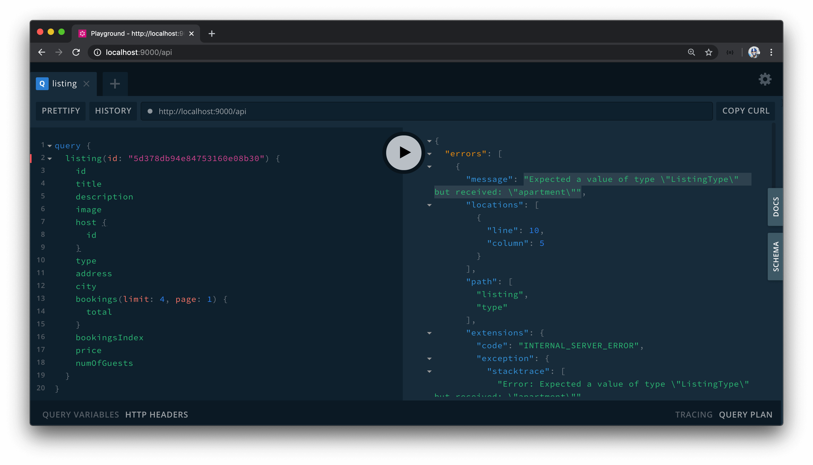
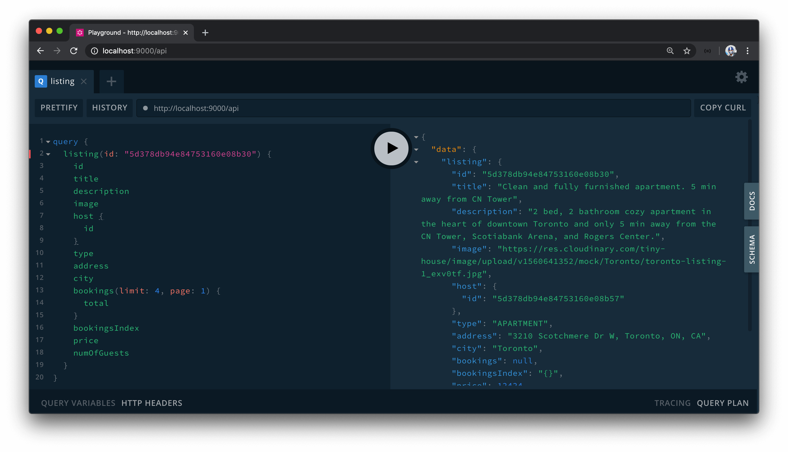

# Building the Listing Resolvers

With the root-level `listing` field prepared in our GraphQL API, we'll construct the resolver function for this field to attempt to query for the appropriate listing from the listings collection in our database. Similar to how the `user` query field queried for a user from our database with a certain ID, the `listing` query field will query for a certain listing based on the ID provided.

As a result, we'll update the `listing` field in our GraphQL type definitions and state it expects a defined argument of `id` of type GraphQL ID. In addition, the `listing` field when resolved should return the appropriate `Listing` GraphQL object.

```ts
  type Query {
    authUrl: String!
    user(id: ID!): User!
    listing(id: ID!): Listing!
  }
```

This `Listing` GraphQL object has been created in the last module and has fields to describe the certain listing - such as it's `title`, `description`, `host`, etc.

### `listing()`

We'll now modify the resolver function for the `listing` field to state that it is to accept an `id` input from our client and return a `Listing` object when resolved. First, we'll construct the interface of the expected arguments for this field in a `types.ts` file kept within the `src/graphql/resolvers/Listing` folder. We'll create a `ListingArgs` interface that is to have an `id` field of type `string`.

```ts
export interface ListingArgs {
  id: string;
}
```

In our `listingResolvers` map within the `src/graphql/resolvers/Listing/index.ts` file, we'll import a few things we'll need for our `listing()` resolver function. We'll first import the `Database` and `Listing` interfaces that have been defined in the `src/lib/types.ts` file. We'll also import the recently created `ListingArgs` interface from the `types.ts` file adjacent to this file.

```ts
// ...
import { Database, Listing } from "../../../lib/types";
import { ListingArgs } from "./types";
```

We'll now update the `listing()` resolver function to query for a certain listing from the database.

- We'll define the `listing()` resolver function as an `async` function.
- In the `listing()` resolver function, we'll access the `id` argument passed in and the `db` object available in the context of our resolver.
- When the `listing()` resolver function is to be complete, it should return a `Promise` that when resolved is an object of type `Listing`.

```ts
// ...

export const listingResolvers: IResolvers = {
  Query: {
    listing: async (
      _root: undefined,
      { id }: ListingArgs,
      { db, req }: { db: Database; req: Request }
    ): Promise<Listing> => {}
  },
  Listing: {
    // ...
  }
};
```

The `listing()` resolver function will be fairly straightforward to implement. We'll use Mongo's [`findOne()`](https://docs.mongodb.com/manual/reference/method/db.collection.findOne/) method to find a listing document from the `listings` collection where the `_id` field is the `ObjectId` representation of the `id` argument passed in. If this listing document doesn't exist, we'll throw a new `Error`. If the listing document does exist, we'll return the `listing` document that's been found. We'll have this implementation be kept in a `try` block while in a `catch` statement - we'll catch an error if ever to arise and have it thrown within a new error message.

```tsx
// ...
import { ObjectId } from "mongodb";
// ...

export const listingResolvers: IResolvers = {
  Query: {
    listing: async (
      _root: undefined,
      { id }: ListingArgs,
      { db, req }: { db: Database; req: Request }
    ): Promise<Listing> => {
      try {
        const listing = await db.listings.findOne({ _id: new ObjectId(id) });
        if (!listing) {
          throw new Error("listing can't be found");
        }

        return listing;
      } catch (error) {
        throw new Error(`Failed to query listing: ${error}`);
      }
    }
  },
  Listing: {
    // ...
  }
};
```

### `listing()` authorize

The `listing` object contains a series of fields where we'll need to define explicit resolver functions for a certain number of them. In the last lesson, we mentioned that the `bookings` field within a listing object should be authorized and shown only to the user who owns the listing. When we define the resolver for the listing `booking` field, we'll need to check if the listing query is authorized.

We'll follow a similar format to what we did for the `User` module and simply get the viewer details with the `authorize()` function available in the `src/lib/utils/` folder. Within the `listing()` resolver function, we'll have an `if` statement to check if the viewer id matches that of the listing `host` field which will determine the viewer is querying for their own listing. If this is `true`, we'll set an `authorized` field in the `listing` object to be `true`.

With that said, the first thing we'll do is add the `authorized` field to the `Listing` TypeScript interface in the `src/lib/types.ts` file and state that it is to be of type `boolean` when defined.

```ts
export interface Listing {
  _id: ObjectId;
  title: string;
  description: string;
  image: string;
  host: string;
  type: ListingType;
  address: string;
  country: string;
  admin: string;
  city: string;
  bookings: ObjectId[];
  bookingsIndex: BookingsIndexYear;
  price: number;
  numOfGuests: number;
  authorized?: boolean;
}
```

In our `listingResolvers` map file, we'll import the `authorize()` function from the `src/lib/utils/` folder. We'll also import the `Request` interface from `express`.

In the `listing()` resolver function, we'll access the `req` object available as part of context in all our resolvers. Within the function, we'll have the `authorize()` function be run and pass in the `db` and `req` objects it expects, and we'll do this after the listing document has already been found. With the `viewer` obtained from the `authorize()` function, we'll then state that if `viewer._id` matches the `listing.host` field, we'll set the `authorized` value of the `listing` object to `true`.

With these changes, the `listing()` resolver function will be finalized as follows:

```ts
export const listingResolvers: IResolvers = {
  Query: {
    listing: async (
      _root: undefined,
      { id }: ListingArgs,
      { db, req }: { db: Database; req: Request }
    ): Promise<Listing> => {
      try {
        const listing = await db.listings.findOne({ _id: new ObjectId(id) });
        if (!listing) {
          throw new Error("listing can't be found");
        }

        const viewer = await authorize(db, req);
        if (viewer && viewer._id === listing.host) {
          listing.authorized = true;
        }

        return listing;
      } catch (error) {
        throw new Error(`Failed to query listing: ${error}`);
      }
    }
  }
  // ...
};
```

> **Note:** The `host` field within the `listing` document object is an `id` of the host of the listing (i.e. the user who owns the listing).

We'll now create explicit resolver functions for the fields in the `Listing` object that we want to be resolved differently than the value being kept in the database. We already have the `id()` resolver set-up to resolve the `_id` of the listing document to an `id` string representation when queried from the client.

### `host()`

The `host` field in a `listing` document in the database is a string ID of the user that owns the listing. When the client queries for this field, we'll want the client to receive object information of the `host`. Since we want to resolve the host field to a `User` object value, we'll import the `User` interface from the `src/lib/types.ts` file.

We'll define a resolver function for the `host()` field in the `Listing` object within our `listingResolvers` map, and we'll use MongoDB's [`findOne()`](https://docs.mongodb.com/manual/reference/method/db.collection.findOne/) method to find the host from the `listing.host` id value.

```ts
// ...
import { Database, Listing, User } from "../../../lib/types";
// ...

export const listingResolvers: IResolvers = {
  Query: {
    // ...
  },
  Listing: {
    // ...,
    host: async (
      listing: Listing,
      _args: {},
      { db }: { db: Database }
    ): Promise<User> => {
      const host = await db.users.findOne({ _id: listing.host });
      if (!host) {
        throw new Error("host can't be found");
      }
      return host;
    }
  }
};
```

Since there's only one request that can fail in the `host()` resolver function, we won't use a `try...catch` block and throw the only error of not finding the host if that error is to occur.

> **Note**: As a reminder, the `_id` field for the `user` document in our Mongo database is of type `string` and not of type `ObjectID`. MongoDB natively creates an `ObjectID` type for the `_id` fields but we've resorted to having the user's `_id` field be a `string` since we simply capture whatever `id` Google OAuth returns to us. The `host` in a listing document is the same `string` representation of this ID.

### `bookingsIndex()`

In one of our earlier modules, we highlighted how the dates of bookings that have been made to listings are captured in a `bookingsIndex` field within a listing document. A listing `bookingsIndex` field is to be a key/value representation of the dates that have already been booked. On the client-side, we'll want this key/value object returned since on the client we'll look to control which dates a user can book on the listing page. For example, if a booking has been made on a certain date, we'll want to prevent a user from booking that same date.

We'll want `listing.bookingsIndex` returned to the client as an object but unfortunately, the `bookingsIndex` object within a listing document is an unstructured data set where we won't know what the values are going to be so we won't be able to define the GraphQL type of `bookingsIndex`. As a result, we've defined the `bookingsIndex` field in our `Listing` GraphQL object **as a string**. We'll create a resolver for the `bookingsIndex` field in the `Listing` object that simply stringifies the `bookingsIndex` object within a listing document to a string.

```ts
// ...

export const listingResolvers: IResolvers = {
  Query: {
    // ...
  },
  Listing: {
    // ...,
    bookingsIndex: (listing: Listing): string => {
      return JSON.stringify(listing.bookingsIndex);
    }
  }
};
```

On the client, we'll receive the `bookingsIndex` of a listing as a string and we'll parse it to get the object we're looking for.

### `bookings()`

Finally, we'll create the resolver function for the `bookings` field that is to be a paginated list of bookings that have been made for a certain listing. The structure of how we create this resolver will be almost identical to the paginated `bookings` field in the `User` object.

- It'll be offset-based pagination where the field accepts `limit` and `page` arguments and will return data that contains the `total` number of bookings returned and a `result` array of the list within a certain page.
- We'll want the `bookings` field within a `listing` object to be authorized only for a viewer viewing their own listing.
- We'll use Mongo DB's [`cursor`](https://docs.mongodb.com/manual/reference/method/js-cursor/) capability to find the paginated list of document objects and the total amount.

We'll first define the TypeScript interfaces for the arguments the `booking()` resolver function is to receive and the data it's expected to return. We'll define these types in the `types.ts` file within the `src/graphql/resolver/Listing/types.ts` file. We'll import the `Booking` interface (that describes the shape of a booking document in the database) from the `src/lib/types.ts` file. We'll define the `ListingBookingArgs` interface which is to have `limit` and `page` properties of type `number`. We'll define a `ListingBookingData` interface that is to have a `total` field of type `number` and a `result` field which is to be an array of type `Booking`.

With all the changes we've made, the `types.ts` file within the `src/graphql/resolvers/Listing/` folder will appear as follows:

```ts
import { Booking } from "../../../lib/types";

export interface ListingArgs {
  id: string;
}

export interface ListingBookingsArgs {
  limit: number;
  page: number;
}

export interface ListingBookingsData {
  total: number;
  result: Booking[];
}
```

We'll import the newly created `ListingBookingArgs` and `ListingBookingData` interfaces in the `listingResolvers` map file. We'll look to copy over the `bookings()` resolver function from the `userResolvers` map and change the context of a few certain things:

- We'll say the root object passed in is `listing` and is of type `Listing`.
- The shape of arguments passed in to the resolver function is `ListingBookingArgs`.
- The function, when resolved successfully, should return a `Promise` that when resolved will be an object of shape `ListingBookingData` or `null`.
- In the resolver function, we'll check for the `authorized` field from the `listing` object.
- The data constructed within the function will be of type `ListingBookingData`.
- The `$in` operator used within the MongoDB [`find()`](https://docs.mongodb.com/manual/reference/method/db.collection.find/) method will reference the `listing.bookings` array.
- Finally, in the `catch` statement, if an error was to ever occur we'll fire an error message of `"Failed to query listing bookings"`.

With this implemented, the `bookings()` resolver function will appear as the following:

```ts
// ...
import { ListingArgs, ListingBookingsArgs, ListingBookingsData } from "./types";

export const listingResolvers: IResolvers = {
  Query: {
    // ...
  },
  Listing: {
    // ...,
    bookings: async (
      listing: Listing,
      { limit, page }: ListingBookingsArgs,
      { db }: { db: Database }
    ): Promise<ListingBookingsData | null> => {
      try {
        if (!listing.authorized) {
          return null;
        }

        const data: ListingBookingsData = {
          total: 0,
          result: []
        };

        let cursor = await db.bookings.find({
          _id: { $in: listing.bookings }
        });

        cursor = cursor.skip(page > 0 ? (page - 1) * limit : 0);
        cursor = cursor.limit(limit);

        data.total = await cursor.count();
        data.result = await cursor.toArray();

        return data;
      } catch (error) {
        throw new Error(`Failed to query listing bookings: ${error}`);
      }
    }
  }
};
```

And with all the changes we've made in this lesson, the `src/graphql/resolvers/Listing/index.ts` file will appear as follows:

```ts
import { IResolvers } from "apollo-server-express";
import { Request } from "express";
import { ObjectId } from "mongodb";
import { Database, Listing, User } from "../../../lib/types";
import { authorize } from "../../../lib/utils";
import { ListingArgs, ListingBookingsArgs, ListingBookingsData } from "./types";

export const listingResolvers: IResolvers = {
  Query: {
    listing: async (
      _root: undefined,
      { id }: ListingArgs,
      { db, req }: { db: Database; req: Request }
    ): Promise<Listing> => {
      try {
        const listing = await db.listings.findOne({ _id: new ObjectId(id) });
        if (!listing) {
          throw new Error("listing can't be found");
        }

        const viewer = await authorize(db, req);
        if (viewer && viewer._id === listing.host) {
          listing.authorized = true;
        }

        return listing;
      } catch (error) {
        throw new Error(`Failed to query listing: ${error}`);
      }
    }
  },
  Listing: {
    id: (listing: Listing): string => {
      return listing._id.toString();
    },
    host: async (
      listing: Listing,
      _args: {},
      { db }: { db: Database }
    ): Promise<User> => {
      const host = await db.users.findOne({ _id: listing.host });
      if (!host) {
        throw new Error("host can't be found");
      }
      return host;
    },
    bookingsIndex: (listing: Listing): string => {
      return JSON.stringify(listing.bookingsIndex);
    },
    bookings: async (
      listing: Listing,
      { limit, page }: ListingBookingsArgs,
      { db }: { db: Database }
    ): Promise<ListingBookingsData | null> => {
      try {
        if (!listing.authorized) {
          return null;
        }

        const data: ListingBookingsData = {
          total: 0,
          result: []
        };

        let cursor = await db.bookings.find({
          _id: { $in: listing.bookings }
        });

        cursor = cursor.skip(page > 0 ? (page - 1) * limit : 0);
        cursor = cursor.limit(limit);

        data.total = await cursor.count();
        data.result = await cursor.toArray();

        return data;
      } catch (error) {
        throw new Error(`Failed to query listing bookings: ${error}`);
      }
    }
  }
};
```

### `ListingType` - Error

That's it for now! All the functions we've defined for the `Listing` object - `bookings()`, `bookingsIndex()`, `host()`, and `id()` are explicit resolver functions for how we want these fields to be returned. The other fields within the `Listing` object are to be trivially resolved such as the `title`, `description`, `image`, etc.

If we were to query the fields for a certain listing in our database, we should get the data resolved from our API. Let's give this a check. With our server project running, we'll first head over to GraphQL Playground. To query for a certain listing, we need to pass in the ID argument of that listing. We'll grab the string id of a certain listing from our MongoDB Atlas dashboard. We'll pass that value for the `id` argument in our query and we'll look to query for all the fields in the `listing` object. This would look something like this:

```graphql
query {
  listing(id: "5d378db94e84753160e08b30") {
    id
    title
    description
    image
    host {
      id
    }
    type
    address
    city
    bookings(limit: 4, page: 1) {
      total
    }
    bookingsIndex
    price
    numOfGuests
  }
}
```

When we run our query, we see an error.



The error message says `"Expected a value of type \"ListingType\" but received: \"apartment\""` and comes from the `listing.type` field.

In our GraphQL API schema, we've defined the GraphQL `ListingType` Enum as `APARTMENT` and `HOUSE` in capital letters.

```ts
  enum ListingType {
    APARTMENT
    HOUSE
  }
```

In our TypeScript definition, we define the values of our `ListingType` Enum as `"apartment"` and `"house"` but in lower-case letters.

```ts
export enum ListingType {
  Apartment = "apartment",
  House = "house"
}
```

Enums, in GraphQL, can behave differently depending on the GraphQL server implementation however in our instance - the GraphQL Enum structure is to be mapped to the TypeScript Enum values. In essence, we have an issue where the capital letter format isn't being matched to the lower-case format being used to **seed our database**. The error comes from the fact that GraphQL states that the returned data from the database _doesn't_ match the GraphQL schema contract.

There are two simple ways we can resolve this issue.

1.  Have the values in our TypeScript Enum definition be in capital letters and re-seed our database.
2.  Change the GraphQL Enum definition and state the `apartment` and `house` properties in lower-case format.

Some folks within the GraphQL community often state that Enums in GraphQL schemas should be defined in capital letters as best practice. We'll stick with this practice and attempt to have the values in our TypeScript Enum definition in capital letters.

This will require us to update the values of the `ListingType` interface in the `src/lib/types.ts` to `"APARTMENT"` and `"HOUSE"`.

```ts
export enum ListingType {
  Apartment = "APARTMENT",
  House = "HOUSE"
}
```

We'll then clear our database with the `clear` script.

```shell
npm run clear
```

And re-seed the database with the `seed` script to ensure all the type fields in our listing documents are of the capital letter format.

```shell
npm run seed
```

If we now head back to GraphQL Playground and re-run our query for the root-level `listing` field, our query now resolves successfully!



In the next lesson, we'll begin building the client UI for the `/listing/:id` page.
