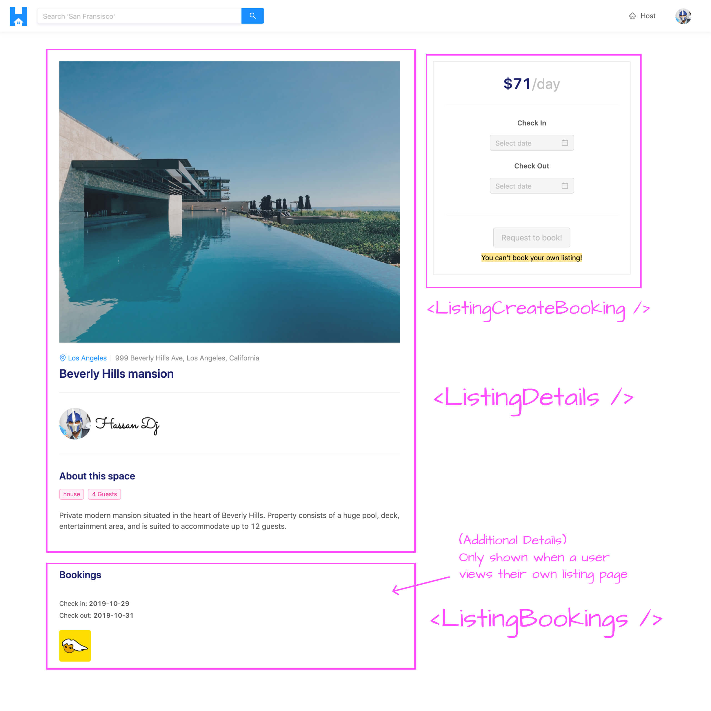

# Querying for listing data

Our GraphQL API is now prepared to have us query the `listing` field to get information for a certain listing. With that said, we'll begin working on our React client application and create the listing page for when a user visits the `/listing/:id` route of our app.

The listing page is to show details for a certain listing as well as provide the capability for a user to book the listing within certain dates. The user is to see details of a listing which consist of the listing image, location, title, host, description. For a viewer that views one of their own listings, they'll be able to also see the bookings that have been made for the listing.

The component breakdown of the `/listing/:id` page is as follows:

- The UI that encompasses the details of the listing is to be a component labeled **`<ListingDetails />`**.
- The **`<ListingBookings />`** component is to show a paginated list of bookings for the listing. The `<ListingBookings />` component will only be shown to a user that is viewing their own listing.
- The capability to create a booking will be part of the **`<ListingCreateBooking />`** component. When the user selects dates in this component and clicks the **Request to Book** button, a modal will be shown where the user can confirm their booking and provide payment information. We'll create this modal at a later point in the course.

Here's how we'll want the UI for the page shown in the `/listing/:id` route to look.



When the query for listing information is in the loading state, the `<PageSkeleton />` component (which we've created before) will be shown.


### Listing Query

To begin, we'll first create the GraphQL query document for the root-level `listing` field in our API. We'll create an `index.ts` file within a `Listing/` folder under the `src/lib/graphql/queries/` folder.

    client/
      src/
        lib/
          graphql/
            queries/
              // ...
              Listing/
                index.ts
            // ...
        // ...

We'll export the soon to be created `LISTING` GraphQL `const` document in the `src/lib/graphql/queries/index.ts` file.

```ts
export * from "./Listing";
```

In the `src/lib/graphql/queries/Listing/index.ts` file, we'll set-up the `LISTING` GraphQL `const` document. The `Listing` query function will accept an `id` argument of the listing that is to be queried, a `bookingsPage` argument to reference the page the user is viewing for their bookings list, and a `limit` argument to constitute the amount of booking objects to be shown for a single page.

We'll query for every possible field within the `Listing` GraphQL object in our API.

```ts
import { gql } from "apollo-boost";

export const LISTING = gql`
  query Listing($id: ID!, $bookingsPage: Int!, $limit: Int!) {
    listing(id: $id) {
      id
      title
      description
      image
      host {
        id
        name
        avatar
        hasWallet
      }
      type
      address
      city
      bookings(limit: $limit, page: $bookingsPage) {
        total
        result {
          id
          tenant {
            id
            name
            avatar
          }
          checkIn
          checkOut
        }
      }
      bookingsIndex
      price
      numOfGuests
    }
  }
`;
```

With the GraphQL listing query defined in our client, we'll auto-generate the corresponding TypeScript definitions of the variables and data related to our new query.

We'll first run the `codegen:schema` script to re-generate the `schema.json` file in our client app.

```shell
npm run codegen:schema
```

We'll then run the `codegen:generate` script to re-generate the TypeScript definitions for our GraphQL queries and mutations.

```shell
npm run codegen:generate
```

### Making the Listing query

We'll now build the `/listing/:id` page in our app. The `<Listing />` section component is the component that's shown in the `/listing/:id` route. Within the `<Listing />` component, we'll make the query for listing information similar to how we made the query for user information in the `/user/:id` page.

In the `src/sections/Listing/index.tsx` file, we'll import the `useQuery` Hook from React Apollo. We'll import the `LISTING` GraphQL document from the `src/lib/graphql/queries/` folder. We'll also import the autogenerated TypeScript definitions for the data and variables for the `LISTING` GraphQL document.

```tsx
import React from "react";
import { useQuery } from "@apollo/react-hooks";
import { LISTING } from "../../lib/graphql/queries";
import {
  Listing as ListingData,
  ListingVariables
} from "../../lib/graphql/queries/Listing/__generated__/Listing";

export const Listing = () => {
  return <h2>Listing</h2>;
};
```

We'll run the `listing` query when the `<Listing />` component first mounts with the `useQuery` Hook and attempt to return the `loading`, `data`, and `error` states of our query result. We'll also pass in the autogenerated type definitions for the data to be returned from the query and the variables that are expected to be passed in.

```tsx
import React from "react";
import { useQuery } from "@apollo/react-hooks";
import { LISTING } from "../../lib/graphql/queries";
import {
  Listing as ListingData,
  ListingVariables
} from "../../lib/graphql/queries/Listing/__generated__/Listing";

export const Listing = () => {
  const { loading, data, error } = useQuery<ListingData, ListingVariables>(LISTING);

  return <h2>Listing</h2>;
};
```

The `listing` query we make here expects us to pass a few variables such as the `id` of the listing that is to be queried, the `bookingsPage` the user is viewing, and the number of bookings to be returned in a page (in other words the limit of our pagination in the bookings list).

The value of the `id` variable will come from the route that the user accesses. We'll get the `id` param from the route from the `match` prop available in this component since this component is rendered from React Router's `<Route />` component.

We'll import the `RouteComponentProps` interface from `react-router-dom`. We'll declare the interface for the params in our route as `MatchParams` which will consist of an `id` of type `string`. We'll access the `match` prop available in the `<Listing />` component and set the `id` variable of our query as `match.params.id`.

```tsx
import React from "react";
import { RouteComponentProps } from "react-router-dom";
import { useQuery } from "@apollo/react-hooks";
import { LISTING } from "../../lib/graphql/queries";
import {
  Listing as ListingData,
  ListingVariables
} from "../../lib/graphql/queries/Listing/__generated__/Listing";

interface MatchParams {
  id: string;
}

export const Listing = ({ match }: RouteComponentProps<MatchParams>) => {
  const { loading, data, error } = useQuery<ListingData, ListingVariables>(LISTING, {
    variables: {
      id: match.params.id
    }
  });

  return <h2>Listing</h2>;
};
```

> React Router has now introduced Hooks! Be sure to check out the **React Router Hooks** video in **Module 15** of the course to highlight how the above can be done with Hooks.

When the `<Listing />` component renders for the first time, the page number for the bookings list should be `1` (i.e. should be on the first page of results). To instantiate this value and have it tracked as component state, we'll import the `useState` Hook from React. We'll use the `useState` Hook at the top of the `<Listing />` component function and destruct a `bookingsPage` state value and a `setBookingsPage()` function we'll use to update the `bookingsPage` state value. We'll initialize the state `bookingsPage` value as `1` and declare it as the value of the `bookingsPage` variable in our query.

```tsx
import React, { useState } from "react";
import { RouteComponentProps } from "react-router-dom";
import { useQuery } from "@apollo/react-hooks";
import { LISTING } from "../../lib/graphql/queries";
import {
  Listing as ListingData,
  ListingVariables
} from "../../lib/graphql/queries/Listing/__generated__/Listing";

interface MatchParams {
  id: string;
}

export const Listing = ({ match }: RouteComponentProps<MatchParams>) => {
  const [bookingsPage, setBookingsPage] = useState(1);

  const { loading, data, error } = useQuery<ListingData, ListingVariables>(LISTING, {
    variables: {
      id: match.params.id,
      bookingsPage
    }
  });

  return <h2>Listing</h2>;
};
```

The `limit` variable in our query is how many bookings we'll want to be limited for a certain page. We'll want to have a maximum of three bookings to show for a single page so we'll define a constant above our `<Listing />` component labeled `PAGE_LIMIT` and provide it a value of `3`. We'll then declare the value of the `limit` variable in our query to be `PAGE_LIMIT`.

```tsx
import React, { useState } from "react";
import { RouteComponentProps } from "react-router-dom";
import { useQuery } from "@apollo/react-hooks";
import { LISTING } from "../../lib/graphql/queries";
import {
  Listing as ListingData,
  ListingVariables
} from "../../lib/graphql/queries/Listing/__generated__/Listing";

interface MatchParams {
  id: string;
}

const PAGE_LIMIT = 3;

export const Listing = ({ match }: RouteComponentProps<MatchParams>) => {
  const [bookingsPage, setBookingsPage] = useState(1);

  const { loading, data, error } = useQuery<ListingData, ListingVariables>(LISTING, {
    variables: {
      id: match.params.id,
      bookingsPage,
      limit: PAGE_LIMIT
    }
  });

  return <h2>Listing</h2>;
};
```

While our `listing` query is in flight (i.e. the query is in the loading state), we'll want to show the shared `<PageSkeleton />` component we've set up before. We'll import the `<PageSkeleton />` component from the `src/lib/components/` folder and we'll say that when the `listing` query is loading, we'll want the `<PageSkeleton />` component to show. We'll wrap the rendered `<PageSkeleton />` component with Ant Design's `<Content />` component from `<Layout />` so we'll be sure to import the `<Layout />` component from Ant Design and destruct `<Content />` from it.

```tsx
import React, { useState } from "react";
import { RouteComponentProps } from "react-router-dom";
import { useQuery } from "@apollo/react-hooks";
import { Layout } from "antd";
import { PageSkeleton } from "../../lib/components";
import { LISTING } from "../../lib/graphql/queries";
import {
  Listing as ListingData,
  ListingVariables
} from "../../lib/graphql/queries/Listing/__generated__/Listing";

interface MatchParams {
  id: string;
}

const { Content } = Layout;
const PAGE_LIMIT = 3;

export const Listing = ({ match }: RouteComponentProps<MatchParams>) => {
  const [bookingsPage, setBookingsPage] = useState(1);

  const { loading, data, error } = useQuery<ListingData, ListingVariables>(LISTING, {
    variables: {
      id: match.params.id,
      bookingsPage,
      limit: PAGE_LIMIT
    }
  });

  if (loading) {
    return (
      <Content className="listings">
        <PageSkeleton />
      </Content>
    );
  }

  return <h2>Listing</h2>;
};
```

If our `listing` query was to error, we'll want to show the `<PageSkeleton />` component with an error banner placed above. With that said, we'll import the shared `<ErrorBanner />` component we have in the `src/lib/components/` folder and render it in addition to `<PageSkeleton />` if our query was to ever error.

We'll place a description of the error along the lines of `"This listing may not exist or we've encountered an error. Please try again soon."`

```tsx
import React, { useState } from "react";
import { RouteComponentProps } from "react-router-dom";
import { useQuery } from "@apollo/react-hooks";
import { Layout } from "antd";
import { ErrorBanner, PageSkeleton } from "../../lib/components";
import { LISTING } from "../../lib/graphql/queries";
import {
  Listing as ListingData,
  ListingVariables
} from "../../lib/graphql/queries/Listing/__generated__/Listing";

interface MatchParams {
  id: string;
}

const { Content } = Layout;
const PAGE_LIMIT = 3;

export const Listing = ({ match }: RouteComponentProps<MatchParams>) => {
  const [bookingsPage, setBookingsPage] = useState(1);

  const { loading, data, error } = useQuery<ListingData, ListingVariables>(LISTING, {
    variables: {
      id: match.params.id,
      bookingsPage,
      limit: PAGE_LIMIT
    }
  });

  if (loading) {
    return (
      <Content className="listings">
        <PageSkeleton />
      </Content>
    );
  }

  if (error) {
    return (
      <Content className="listing">
        <ErrorBanner description="This listing may not exist or we've encountered an error. Please try again soon." />
        <PageSkeleton />
      </Content>
    );
  }

  return <h2>Listing</h2>;
};
```

If our `listing` query was to finish loading and no error arises, this would mean our query has resolved and data should now be available. At this point, we'll get the `listing` object from `data` and the bookings object from `listing`.

```tsx
import React, { useState } from "react";
import { RouteComponentProps } from "react-router-dom";
import { useQuery } from "@apollo/react-hooks";
import { Layout } from "antd";
import { ErrorBanner, PageSkeleton } from "../../lib/components";
import { LISTING } from "../../lib/graphql/queries";
import {
  Listing as ListingData,
  ListingVariables
} from "../../lib/graphql/queries/Listing/__generated__/Listing";

interface MatchParams {
  id: string;
}

const { Content } = Layout;
const PAGE_LIMIT = 3;

export const Listing = ({ match }: RouteComponentProps<MatchParams>) => {
  const [bookingsPage, setBookingsPage] = useState(1);

  const { loading, data, error } = useQuery<ListingData, ListingVariables>(LISTING, {
    variables: {
      id: match.params.id,
      bookingsPage,
      limit: PAGE_LIMIT
    }
  });

  if (loading) {
    return (
      <Content className="listings">
        <PageSkeleton />
      </Content>
    );
  }

  if (error) {
    return (
      <Content className="listings">
        <ErrorBanner description="This listing may not exist or we've encountered an error. Please try again soon!" />
        <PageSkeleton />
      </Content>
    );
  }

  const listing = data ? data.listing : null;
  const listingBookings = listing ? listing.bookings : null;

  return <h2>Listing</h2>;
};
```

With the expected data available when our query resolves successfully, we can begin to build the child components in our UI and surface the information we want. In the next lesson, we'll build out the child `<ListingDetails />` and `<ListingBookings />` components and render it in this parent `<Listing />` component.
