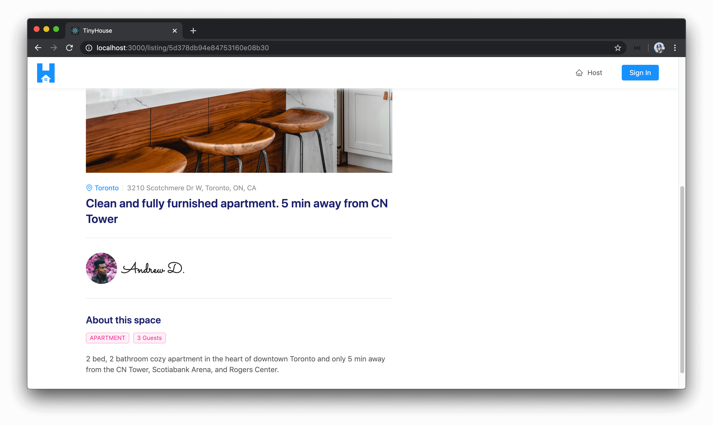
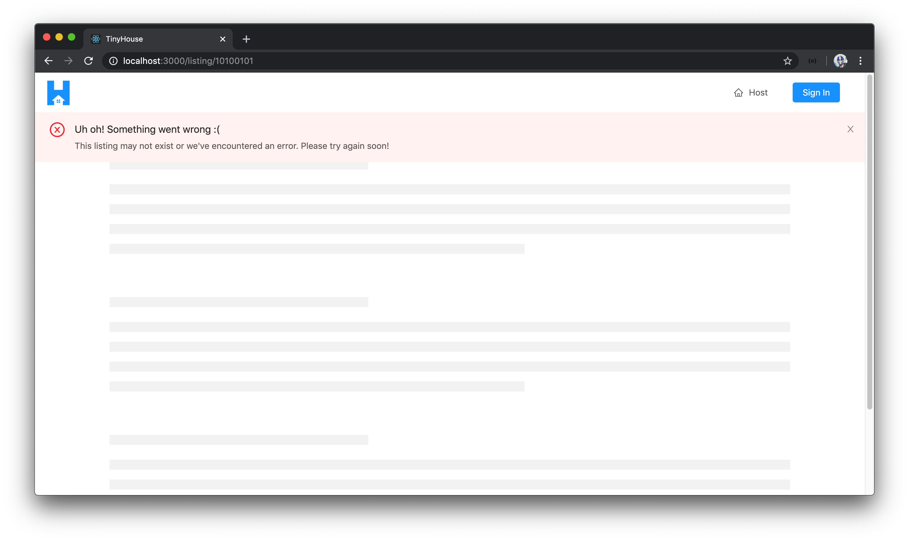
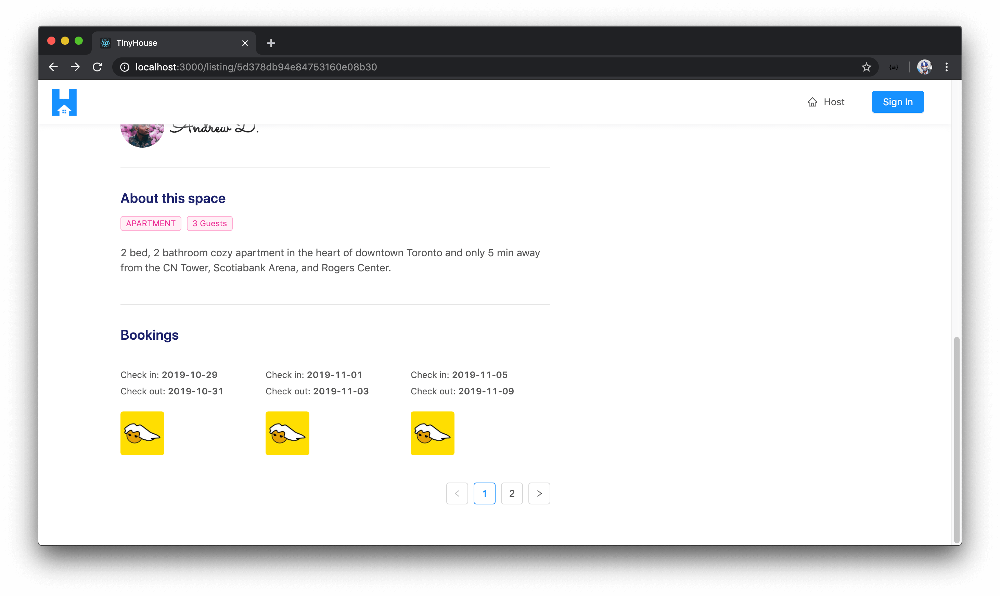

# ListingDetails & ListingBookings

> 📝 A sample of the mock `listingBookings` object used in this lesson can be found - [here](https://gist.github.com/djirdehh/8c5774967a48f6ec21d1cd42c124498d).

With the `<Listing />` section component now prepared in making our GraphQL query for `listing` information, we can begin building the UI we want to show in the `<Listing />` component.

### `<ListingDetails />`

We'll first look to build the `<ListingDetails />` component responsible in surfacing listing information to the user viewing the page. We'll create this `<ListingDetails />` component within a folder kept in the `components/` folder of the `src/sections/Listing/` directory.

```shell
client/
  // ...
  src/
    sections/
      // ...
      Listing/
        components/
          ListingDetails/
            index.tsx
        index.ts
      // ...
    // ...
  // ...
```

Within the `src/sections/Listing/components/index.ts` file, we'll export the `<ListingDetails />` component we'll shortly create.

```ts
export * from "./ListingDetails";
```

In the `<ListingDetails />` component file, we'll import a few things we'll need.

- We'll import the `React` library.
- We'll import the `<Link />` component from React Router.
- We'll import all the components we'll need from Ant Design - [`<Avatar />`](https://ant.design/components/avatar/), [`<Divider />`](https://ant.design/components/divider/), [`<Icon />`](https://ant.design/components/icon/), [`<Tag />`](https://ant.design/components/tag/), and [`<Typography />`](https://ant.design/components/typography/).
- We'll import the autogenerated typescript definitions of the data that is to be returned from the `listing` query.
- We'll import the `iconColor` constant we have in the `src/lib/utils/` folder of our client project.

```tsx
import React from "react";
import { Link } from "react-router-dom";
import { Avatar, Divider, Icon, Tag, Typography } from "antd";
import { Listing as ListingData } from "../../../../lib/graphql/queries/Listing/__generated__/Listing";
import { iconColor } from "../../../../lib/utils";
```

We've seen most of these Ant Design components before.

- [`<Avatar />`](https://ant.design/components/avatar/) helps display an avatar image.
- [`<Divider />`](https://ant.design/components/divider/) is an element that can help divide sections.
- [`<Icon />`](https://ant.design/components/icon/) gives us the ability to use one of the many Ant Design Icons.
- [`<Typography />`](https://ant.design/components/typography/) helps allow us to use the `Text`, `Title`, and `Paragraph` elements from Ant Design.
- We haven't used the [`<Tag />`](https://ant.design/components/tag/) component before. The `<Tag />` component is an element that can help display tags to categorize information or for presentational purposes.

We're importing the autogenerated `Listing` data typescript definition of our `listing` query since we'll use it to type check the prop we expect this `<ListingDetails />` component is to receive. We expect this component to receive the `listing` object from the data returned from the query since we'll use it to display the listing information in our UI. As a result, we'll define the `Props` interface for the `<ListingDetails />` component and state that this component is to receive a `listing` prop. The type of the `listing` prop will be the type of the `listing` object from the GraphQL data returned and we'll use Typescript's capability of indexed access types (i.e. lookup types) to achieve this.

```tsx
import React from "react";
import { Link } from "react-router-dom";
import { Avatar, Divider, Icon, Tag, Typography } from "antd";
import { Listing as ListingData } from "../../../../lib/graphql/queries/Listing/__generated__/Listing";
import { iconColor } from "../../../../lib/utils";

interface Props {
  listing: ListingData["listing"];
}
```

We can then begin building the UI for the `<ListingDetails />` component. First, we'll destruct the `<Paragraph />` and `<Title />` components from `<Typography />`. We'll construct the function for the `<ListingDetails />` component and state that it expects a `listing` prop. At the beginning of our component function, we'll destruct all the properties we'll need from the `listing` prop - `title`, `description`, `image`, `type`, `address`, `city`, `numOfGuests`, and `host`.

```tsx
import React from "react";
import { Link } from "react-router-dom";
import { Avatar, Divider, Icon, Tag, Typography } from "antd";
import { Listing as ListingData } from "../../../../lib/graphql/queries/Listing/__generated__/Listing";
import { iconColor } from "../../../../lib/utils";

interface Props {
  listing: ListingData["listing"];
}

const { Paragraph, Title } = Typography;

export const ListingDetails = ({ listing }: Props) => {
  const { title, description, image, type, address, city, numOfGuests, host } = listing;
};
```

We'll now build the template of the `<ListingDetails />` component. The template will have:

- A `<div />` element with a `background-image` style applied to it that is to display the listing image.
- A `<Paragraph />` section to display the listing `city`, `address`, and `title`.
- A section to display the host `avatar` and `name`.
- Finally, we'll have a section to highlight the listing `type`, the `numOfGuests` the listing can have, and the `description` of the listing.

We'll be sure to use the `iconColor` constant we have imported to color the one `<Icon />` element we have in `<ListingDetails />`.

For the section that displays host information, we'll wrap the section with React Router's `<Link />` component and make it have a target path of `/user/${host.id}` - which will be the user page of the host.

With all this implemented, the `<ListingDetails />` component file will look like the following:

```tsx
import React from "react";
import { Link } from "react-router-dom";
import { Avatar, Divider, Icon, Tag, Typography } from "antd";
import { Listing as ListingData } from "../../../../lib/graphql/queries/Listing/__generated__/Listing";
import { iconColor } from "../../../../lib/utils";

interface Props {
  listing: ListingData["listing"];
}

const { Paragraph, Title } = Typography;

export const ListingDetails = ({ listing }: Props) => {
  const { title, description, image, type, address, city, numOfGuests, host } = listing;

  return (
    <div className="listing-details">
      <div
        style={{ backgroundImage: `url(${image})` }}
        className="listing-details__image"
      />

      <div className="listing-details__information">
        <Paragraph type="secondary" ellipsis className="listing-details__city-address">
          <Link to={`/listings/${city}`}>
            <Icon type="environment" style={{ color: iconColor }} /> {city}
          </Link>
          <Divider type="vertical" />
          {address}
        </Paragraph>
        <Title level={3} className="listing-details__title">
          {title}
        </Title>
      </div>

      <Divider />

      <div className="listing-details__section">
        <Link to={`/user/${host.id}`}>
          <Avatar src={host.avatar} size={64} />
          <Title level={2} className="listing-details__host-name">
            {host.name}
          </Title>
        </Link>
      </div>

      <Divider />

      <div className="listing-details__section">
        <Title level={4}>About this space</Title>
        <div className="listing-details__about-items">
          <Tag color="magenta">{type}</Tag>
          <Tag color="magenta">{numOfGuests} Guests</Tag>
        </div>
        <Paragraph ellipsis={{ rows: 3, expandable: true }}>{description}</Paragraph>
      </div>
    </div>
  );
};
```

> The markup and actual styling of how we build our UI isn't the important takeaway here. You're welcome to build the presentation UI as you please and this is the setting/styling we've come up with. The key takeaway is how we **receive the necessary data from the parent component and display it in `<ListingDetails />`**.

Let's now render the `<ListingDetails />` component in the `<Listing />` component. In the `<Listing />` section component file, we'll import the child `<ListingDetails />` component from the adjacent `components/` folder.

```tsx
import { ListingDetails } from "./components";
```

We'll also import the `<Col />` and `<Row />` components from Ant Design with which we'll use to help structure how our child components will appear in `<Listing />`.

```tsx
import { Col, Layout, Row } from "antd";
```

We'll construct an element labeled `listingDetailsElement` that is to be the `<ListingDetails />` component if `listing` information from GraphQL data is available. Otherwise, `listingDetailsElement` will be `null`.

```tsx
// ...

export const Listing = ({ match }: RouteComponentProps<MatchParams>) => {
  const [bookingsPage, setBookingsPage] = useState(1);

  const { loading, data, error } = useQuery<ListingData, ListingVariables>(LISTING, {
    variables: {
      id: match.params.id,
      bookingsPage,
      limit: PAGE_LIMIT
    }
  });

  // ...

  const listing = data ? data.listing : null;
  const listingBookings = listing ? listing.bookings : null;

  const listingDetailsElement = listing ? <ListingDetails listing={listing} /> : null;

  return <h2>Listing</h2>;
};
```

We'll have the `return()` statement of the `<Listing />` component return the `<Content />` component as a wrapper. Within, we'll use the `<Row />` element from Ant Design to constitute that we're to display a row of columns and apply some `gutter` spacing. We'll construct a column that'll take the entire width in extra-small viewports and a little more than half the width from large viewports (and upwards), and display the `listingDetailsElement`.

```tsx
// ...

export const Listing = ({ match }: RouteComponentProps<MatchParams>) => {
  const [bookingsPage, setBookingsPage] = useState(1);

  const { loading, data, error } = useQuery<ListingData, ListingVariables>(LISTING, {
    variables: {
      id: match.params.id,
      bookingsPage,
      limit: PAGE_LIMIT
    }
  });

  // ...

  const listing = data ? data.listing : null;
  const listingBookings = listing ? listing.bookings : null;

  const listingDetailsElement = listing ? <ListingDetails listing={listing} /> : null;

  return (
    <Content className="listings">
      <Row gutter={24} type="flex" justify="space-between">
        <Col xs={24} lg={14}>
          {listingDetailsElement}
        </Col>
      </Row>
    </Content>
  );
};
```

> [Ant Design's grid](https://ant.design/components/grid/) column structure work with 24 columns. By specifying an `xs` value of `24` for a column, we'll want the element within to take the entire width of the viewport (i.e. all the columns). By specifying a `lg` value of `14` for a column, we say we want the `listingDetailsElement` to take a little more than half the viewport spacing.

With our server and client Webpack server running, let's launch our app in the browser and navigate to a valid `/listing/:id` route.

```shell
http://localhost:3000/listing/5d378db94e84753160e08b48
# id of mock listing is 5d378db94e84753160e08b48
```

We'll see the `<ListingDetails />` component which presents information about the listing image, the city the listing is located in, its address, the title, the host information, and so on.



If we try to navigate to a certain `/listing/:id` route in which the listing `id` is invalid (i.e. doesn't really exist), the query would fail and we're notified of this in our UI.



Great!

### `<ListingBookings />`

> 👀 Since this section involves copying code over from the `<UserBookings />` component and making changes after, it might be easier to follow along by watching the lesson video for this section first.

With the listing details prepared and shown in the `/listing/:id` page, we'll now set up the small component that's responsible for displaying a paginated list of bookings that exist within a listing. The bookings section to be shown in the `/listing/:id` page will be very similar to the bookings or listings section shown in the `/user/:id` page. As a result, we won't spend as much time building the paginated list of bookings but look to replicate what was done in the `/user/:id` page.

First, we'll create a `ListingBookings/` folder that is to have an `index.tsx` file in the `src/sections/Listing/components/` folder.

```shell
client/
  // ...
  src/
    sections/
      // ...
      Listing/
        components/
          ListingBookings/
            index.tsx
          // ...
        index.ts
      // ...
    // ...
  // ...
```

In the `src/sections/Listing/components/index.ts` file, we'll have the soon to be created `<ListingBookings />` component exported from the adjacent `ListingBookings/` folder.

```tsx
export * from "./ListingBookings";
```

In the `src/sections/Listing/components/ListingBookings/index.tsx` file, we'll copy over the contents of the `<UserBookings />` component (from the `src/sections/User/components/UserBookings/index.tsx` file) and make the necessary changes.

We'll import some other components we'll need from Ant Design such as the `<Avatar />` and `<Divider />` components.

```tsx
import { Avatar, Divider, List, Typography } from "antd";
```

We'll remove the import of the `<ListingCard />` component since we don't intend for it to be shown within the `<ListingBookings />` component.

We'll import the `Listing` data TypeScript definition for the `listing` field query.

```tsx
import { Listing } from "../../../../lib/graphql/queries/Listing/__generated__/Listing";
```

We'll expect `<ListingBookings />` to receive mostly all the same props as `<UserBookings />`. However, the main prop change is that the `<ListingBookings />` component should expect the bookings from the `listing` object queried from GraphQL (not the `user` object). So we'll update the first prop to be passed down to the `<ListingBookings />` component to be `listingBookings` and we'll say its type is the `bookings` object within the `listing` object from our GraphQL data.

```tsx
interface Props {
  listingBookings: Listing["listing"]["bookings"];
  bookingsPage: number;
  limit: number;
  setBookingsPage: (page: number) => void;
}
```

We'll remove the import of the `<Paragraph />` component from `<Typography />` since we won't need it.

```tsx
const { Text, Title } = Typography;
```

We'll update the name of the component function here to be `ListingBookings` and the first prop should be `listingBookings`. We'll get the `total` and `result` from the `listingBookings` prop object and we'll rename any reference to `userBookings` to now be `listingBookings`.

```tsx
export const ListingBookings = ({
  listingBookings,
  bookingsPage,
  limit,
  setBookingsPage
}: Props) => {
  const total = listingBookings ? listingBookings.total : null;
  const result = listingBookings ? listingBookings.result : null;
};
```

We'll remove the `<Paragraph />` section in the final element we want to be displayed. We'll add a `<Divider />` between the top of the parent `<div />` element and wrap the rest within a `<div />` section, and we'll update the classes accordingly.

```tsx
// ...

export const ListingBookings = ({
  listingBookings,
  bookingsPage,
  limit,
  setBookingsPage
}: Props) => {
  // ...

  const listingBookingsElement = listingBookingsList ? (
    <div className="listing-bookings">
      <Divider />
      <div className="listing-bookings__section">
        <Title level={4}>Bookings</Title>
      </div>
      {listingBookingsList}
    </div>
  ) : null;

  return listingBookingsElement;
};
```

```tsx
const listingBookingsElement = listingBookingsList ? (
  <div className="listing-bookings">
    <Divider />
    <div className="listing-bookings__section">
      <Title level={4}>Bookings</Title>
    </div>
    {listingBookingsList}
  </div>
) : null;
```

We'll remove the listing card that's to be shown for each rendered list item, and instead for every rendered item within the `list`, we'll intend to show an avatar of the tenant who's made the booking below the `bookingHistory` dates. We'll import the `<Link />` component from `react-router-dom` and make the avatar of the tenant within each list item a link to that tenant's user page.

```tsx
// ...
import { Link } from "react-router-dom";
// ...

export const ListingBookings = ({
  listingBookings,
  bookingsPage,
  limit,
  setBookingsPage
}: Props) => {
  const total = listingBookings ? listingBookings.total : null;
  const result = listingBookings ? listingBookings.result : null;

  const listingBookingsList = listingBookings ? (
    <List
      // ...
      renderItem={listingBooking => {
        const bookingHistory = (
          <div className="listing-bookings__history">
            <div>
              Check in: <Text strong>{listingBooking.checkIn}</Text>
            </div>
            <div>
              Check out: <Text strong>{listingBooking.checkOut}</Text>
            </div>
          </div>
        );

        return (
          <List.Item className="listing-bookings__item">
            {bookingHistory}
            <Link to={`/user/${listingBooking.tenant.id}`}>
              <Avatar src={listingBooking.tenant.avatar} size={64} shape="square" />
            </Link>
          </List.Item>
        );
      }}
    />
  ) : null;

  // ...
};
```

The rest of the `<List />` element will be practically the same. The only changes we'll make is that we'll remove the positioning at the top that we've done for the list in the `<UserBookings />` section and we'll update the empty text if shown to be `"No bookings have been made yet!"`. Finally, we'll update the grid layout for large viewports to be 3 elements to show at a time.

Ensuring all our variables are to now reference bookings within a listing as opposed to a user (e.g. `listingBookings` instead of `userBookings`) and our element `className`'s have all been updated, our`<ListingBookings />` component file will look like the following:

```tsx
import React from "react";
import { Link } from "react-router-dom";
import { Avatar, Divider, List, Typography } from "antd";
import { Listing } from "../../../../lib/graphql/queries/Listing/__generated__/Listing";

interface Props {
  listingBookings: Listing["listing"]["bookings"];
  bookingsPage: number;
  limit: number;
  setBookingsPage: (page: number) => void;
}

const { Text, Title } = Typography;

export const ListingBookings = ({
  listingBookings,
  bookingsPage,
  limit,
  setBookingsPage
}: Props) => {
  const total = listingBookings ? listingBookings.total : null;
  const result = listingBookings ? listingBookings.result : null;

  const listingBookingsList = listingBookings ? (
    <List
      grid={{
        gutter: 8,
        xs: 1,
        sm: 2,
        lg: 3
      }}
      dataSource={result ? result : undefined}
      locale={{ emptyText: "No bookings have been made yet!" }}
      pagination={{
        current: bookingsPage,
        total: total ? total : undefined,
        defaultPageSize: limit,
        hideOnSinglePage: true,
        showLessItems: true,
        onChange: (page: number) => setBookingsPage(page)
      }}
      renderItem={listingBooking => {
        const bookingHistory = (
          <div className="listing-bookings__history">
            <div>
              Check in: <Text strong>{listingBooking.checkIn}</Text>
            </div>
            <div>
              Check out: <Text strong>{listingBooking.checkOut}</Text>
            </div>
          </div>
        );

        return (
          <List.Item className="listing-bookings__item">
            {bookingHistory}
            <Link to={`/user/${listingBooking.tenant.id}`}>
              <Avatar src={listingBooking.tenant.avatar} size={64} shape="square" />
            </Link>
          </List.Item>
        );
      }}
    />
  ) : null;

  const listingBookingsElement = listingBookingsList ? (
    <div className="listing-bookings">
      <Divider />
      <div className="listing-bookings__section">
        <Title level={4}>Bookings</Title>
      </div>
      {listingBookingsList}
    </div>
  ) : null;

  return listingBookingsElement;
};
```

We've now updated the `<ListingBookings />` component to behave as we expect it to for the listing bookings list we want to show in the `/listing/:id` page. Let's now have the parent `<Listing />` component render `<ListingBookings />` as a child component when bookings are available. In the `<Listing />` component file, we'll first import the `<ListingBookings />` component from the adjacent `components/` folder.

```tsx
import { ListingBookings, ListingDetails } from "./components";
```

In the `<Listing />` component, we'll create a `listingBookingsElement` constant that will be the `<ListingBookings />` component when listing `bookings` exist. In the rendered `<ListingBookings />` component, we'll pass in the `listingBookings` prop, the `page` prop, the `limit` prop, and the `setBookingsPage()` function prop.

```tsx
// ...

export const Listing = ({ match }: RouteComponentProps<MatchParams>) => {
  const [bookingsPage, setBookingsPage] = useState(1);

  const { loading, data, error } = useQuery<ListingData, ListingVariables>(LISTING, {
    variables: {
      id: match.params.id,
      bookingsPage,
      limit: PAGE_LIMIT
    }
  });

  // ...

  const listing = data ? data.listing : null;
  const listingBookings = listing ? listing.bookings : null;

  const listingDetailsElement = listing ? <ListingDetails listing={listing} /> : null;

  const listingBookingsElement = listingBookings ? (
    <ListingBookings
      listingBookings={listingBookings}
      bookingsPage={bookingsPage}
      limit={PAGE_LIMIT}
      setBookingsPage={setBookingsPage}
    />
  ) : null;

  return (
    <Content className="listings">
      <Row gutter={24} type="flex" justify="space-between">
        <Col xs={24} lg={14}>
          {listingDetailsElement}
        </Col>
      </Row>
    </Content>
  );
};
```

We'll then look to render `listingBookingsElement` right below the `listingDetailsElement` in the `return()` statement of the `<Listing />` component. With all these changes made, the `src/sections/Listing/index.tsx` file in the complete state will look like the following:

```tsx
import React, { useState } from "react";
import { RouteComponentProps } from "react-router-dom";
import { useQuery } from "@apollo/react-hooks";
import { Col, Layout, Row } from "antd";
import { ErrorBanner, PageSkeleton } from "../../lib/components";
import { LISTING } from "../../lib/graphql/queries";
import {
  Listing as ListingData,
  ListingVariables
} from "../../lib/graphql/queries/Listing/__generated__/Listing";
import { ListingBookings, ListingDetails } from "./components";

interface MatchParams {
  id: string;
}

const { Content } = Layout;
const PAGE_LIMIT = 3;

export const Listing = ({ match }: RouteComponentProps<MatchParams>) => {
  const [bookingsPage, setBookingsPage] = useState(1);

  const { loading, data, error } = useQuery<ListingData, ListingVariables>(LISTING, {
    variables: {
      id: match.params.id,
      bookingsPage,
      limit: PAGE_LIMIT
    }
  });

  if (loading) {
    return (
      <Content className="listings">
        <PageSkeleton />
      </Content>
    );
  }

  if (error) {
    return (
      <Content className="listings">
        <ErrorBanner description="This listing may not exist or we've encountered an error. Please try again soon!" />
        <PageSkeleton />
      </Content>
    );
  }

  const listing = data ? data.listing : null;
  const listingBookings = listing ? listing.bookings : null;

  const listingDetailsElement = listing ? <ListingDetails listing={listing} /> : null;

  const listingBookingsElement = listingBookings ? (
    <ListingBookings
      listingBookings={listingBookings}
      bookingsPage={bookingsPage}
      limit={PAGE_LIMIT}
      setBookingsPage={setBookingsPage}
    />
  ) : null;

  return (
    <Content className="listings">
      <Row gutter={24} type="flex" justify="space-between">
        <Col xs={24} lg={14}>
          {listingDetailsElement}
          {listingBookingsElement}
        </Col>
      </Row>
    </Content>
  );
};
```

Our `<Listing />` component should now be rendering the `<ListingBookings />` component when bookings exist within the `listing` object queried from our API.

### Surveying `<ListingBookings />`

When we look at the listing of any other user than ourselves, we won't see any bookings information. In the server, we've only authorized the `bookings` field within the `listing` object to return information if **bookings exist for the listing** and **the viewer is viewing their own listing page**.

We don't have any bookings created within our application and we're unable to create them just yet. To observe how the bookings section in the `<Listing />` page is to behave, we can try to mock the existence of `bookings` in our client just for this use case.

What we'll do is take a mock data object we've prepared (shown below) and we can say the `listingBookings` constant in the `<Listing />` component is to have this value.

```ts
const listingBookings = {
  total: 4,
  result: [
    {
      id: "5daa530eefc64b001767247c",
      tenant: {
        id: "117422637055829818290",
        name: "User X",
        avatar:
          "https://lh3.googleusercontent.com/a-/AAuE7mBL9NpzsFA6mGSC8xIIJfeK4oTeOJpYvL-gAyaB=s100",
        __typename: "User"
      },
      checkIn: "2019-10-29",
      checkOut: "2019-10-31",
      __typename: "Booking"
    },
    {
      id: "5daa530eefc64b001767247d",
      tenant: {
        id: "117422637055829818290",
        name: "User X",
        avatar:
          "https://lh3.googleusercontent.com/a-/AAuE7mBL9NpzsFA6mGSC8xIIJfeK4oTeOJpYvL-gAyaB=s100",
        __typename: "User"
      },
      checkIn: "2019-11-01",
      checkOut: "2019-11-03",
      __typename: "Booking"
    },
    {
      id: "5daa530eefc64b001767247g",
      tenant: {
        id: "117422637055829818290",
        name: "User X",
        avatar:
          "https://lh3.googleusercontent.com/a-/AAuE7mBL9NpzsFA6mGSC8xIIJfeK4oTeOJpYvL-gAyaB=s100",
        __typename: "User"
      },
      checkIn: "2019-11-05",
      checkOut: "2019-11-09",
      __typename: "Booking"
    },
    {
      id: "5daa530eefc64b001767247f",
      tenant: {
        id: "117422637055829818290",
        name: "User X",
        avatar:
          "https://lh3.googleusercontent.com/a-/AAuE7mBL9NpzsFA6mGSC8xIIJfeK4oTeOJpYvL-gAyaB=s100",
        __typename: "User"
      },
      checkIn: "2019-11-10",
      checkOut: "2019-11-11",
      __typename: "Booking"
    }
  ]
} as any;
```

When we temporarily save the changes made in the `<Listing />` component, head back to the `/listing/:id` page in our client application and scroll to the bottom - we'll now see the bookings section.



Each of the iterated items shown within the bookings list shows the check-in and check-out dates of the booking as well as an avatar of the actual tenant. The list is also a paginated list where if we were to click to navigate to another page, a new set of bookings will be shown.

Great! That will be it for this particular lesson. Before we close, we'll go back to the `<Listing />` component and ensure we're trying to access the `bookings` field within the queried `listing` object and not use the mock data array we've just placed to test the appearance of `<ListingBookings />`.
