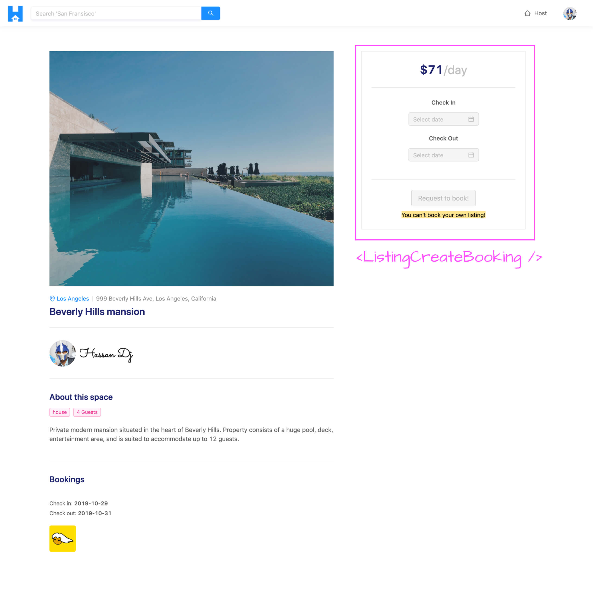
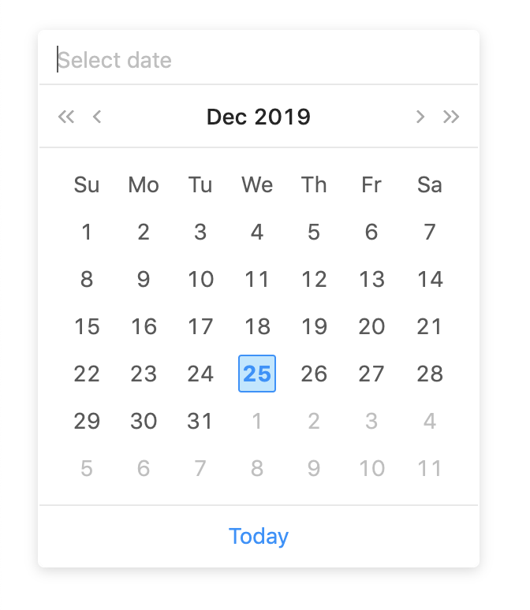
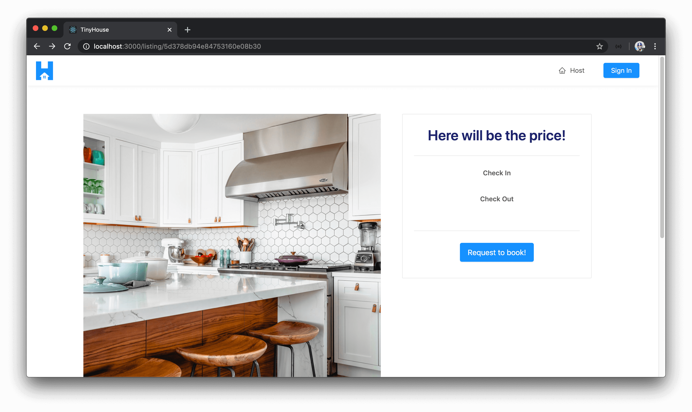
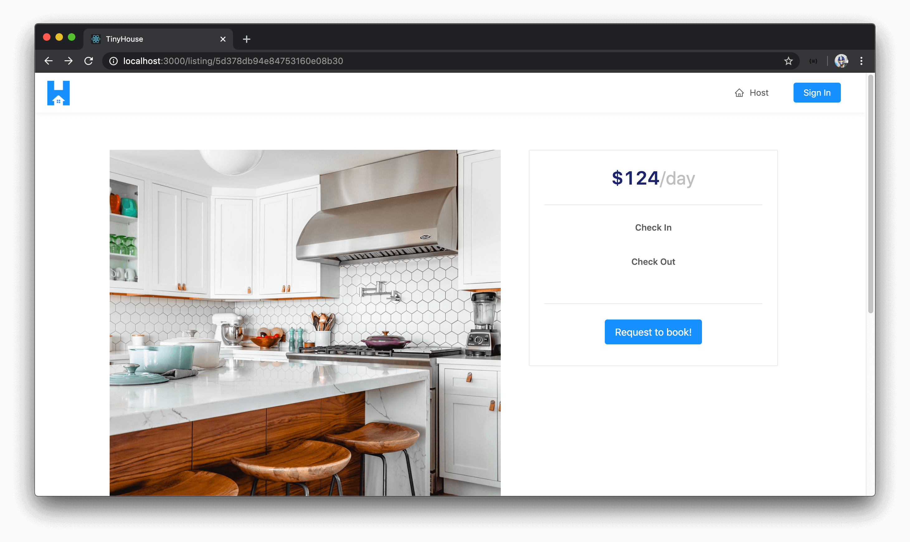
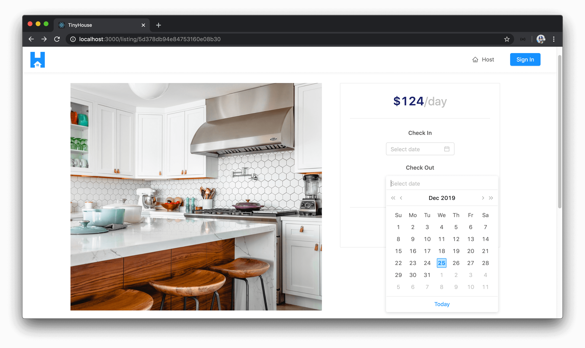
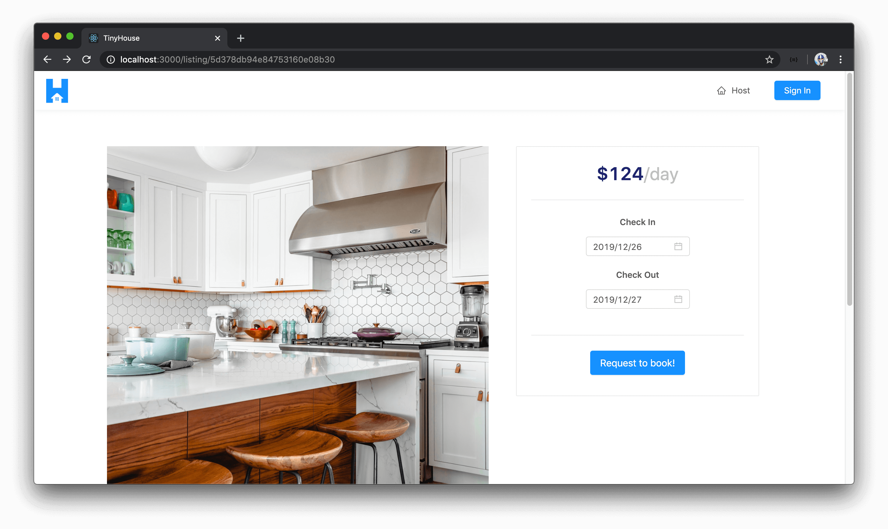
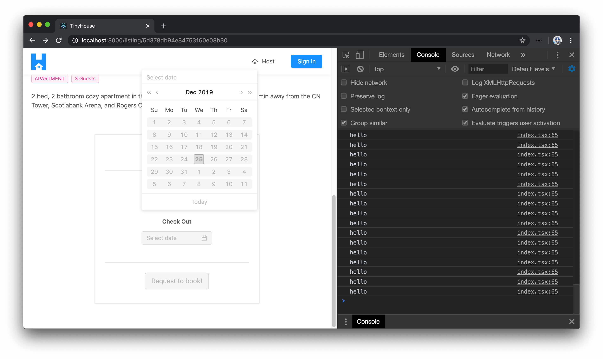
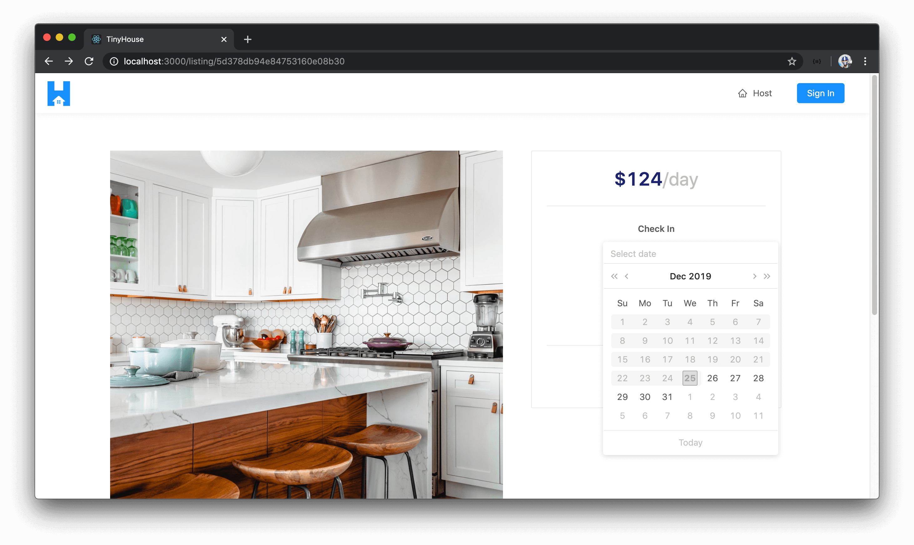

# The ListingCreateBooking React Component

In the last few lessons, we managed to create the GraphQL query to retrieve information for a single listing in the `/listing/:id` page of our client. With listing information available, we built the accompanying UI in the `/listing/:id` page to display listing information (`<ListingDetails />`) and the bookings that have been made for the listing (`<ListingBookings />`).

In this lesson, we're going to build the initial UI of the calendar and date-picker portion of the listing page. We'll create this section as the `<ListingCreateBooking />` component which will be the component responsible in allowing a user to begin the booking creation process.



### Ant Design's `<DatePicker />`

The `<ListingCreateBooking />` component will be fairly straightforward except for how we attempt to build and set-up the datepickers in the component. In the `<ListingCreateBooking />` component, we would want to have two datepickers shown.

- In the first datepicker, the user would be able to pick the date of **check-in** for the booking.
- In the second datepicker, the user would be able to pick the date of **check-out** for the booking.

Building the datepickers from scratch would be a little bit of a difficult task (from a UI perspective) since there are a lot of things we'll have to keep in mind. Fortunately, the UI framework we're using ([Ant Design](https://ant.design/)) gives us a robust datepicker component that can help us quite a bit.



The one thing we'll have to do to comply with Ant Design's [`<DatePicker />`](https://ant.design/components/date-picker/) component is provide date values from the [moment.js](https://momentjs.com/) library. [moment.js](https://momentjs.com/) is a fantastic JavaScript library that provides an incredible amount of utility functions that allow us to parse, validate, manipulate, and display dates and times. We'll primarily use the moment.js library in our client application to comply with how date values can be captured in Ant Design's `<DatePicker />` components.

When we eventually run the mutation to book a listing, we'll convert the date object values captured from the datepickers to string values before we send it to the server.

Before we begin to build the datepickers, let's first install the moment.js library as an application dependency on our client.

```shell
npm i moment
```

The `moment` `npm` library already has static typing associated with it so we won't have to install an additional type definitions file.

### `<ListingCreateBooking />`

The next thing we'll do is create a file for the new component that we intend to create. We'll create a folder called `ListingCreateBooking/` that is to have an `index.tsx` file within the `src/sections/Listing/components/` folder.

    client/
      src/
        // ...
        sections/
          // ...
          Listing/
            components/
              ListingCreateBooking/
                index.tsx
          // ...
      // ...

In the index file of the `src/sections/Listing/components/` folder, we'll re-export the `<ListingCreateBooking />` component we'll soon create.

```ts
export * from "./ListingCreateBooking";
```

#### `<ListingCreateBooking />` - Initial UI

Before we focus on building the datepicker elements, we'll first look to build the basic UI of the `<ListingCreateBooking />` component which consists of the card, the card titles, and the primary button action. In the `<ListingCreateBooking />` component file, we'll import the `React` library and we'll import some of the components we'll need from Ant Design - [`<Button />`](https://ant.design/components/button/), [`<Card />`](https://ant.design/components/card/), [`<Divider />`](https://ant.design/components/divider/), and [`<Typography />`](https://ant.design/components/typography/). We'll also import the utility `formatListingPrice()` function from the `src/lib/utils/` folder that we'll use to format the listing price shown in this component.

```tsx
import React from "react";
import { Button, Card, Divider, Typography } from "antd";
import { formatListingPrice } from "../../../../lib/utils";
```

We'll destruct the `<Paragraph />` and `<Title />` components from `<Typography />`.

```tsx
import React from "react";
import { Button, Card, Divider, Typography } from "antd";
import { formatListingPrice } from "../../../../lib/utils";

const { Paragraph, Title } = Typography;
```

We'll create and export the `<ListingCreateBooking />` component function. In the `return()` statement of the component function, we'll render the `<Card/>` component which will have a `<Paragraph />` at the top responsible for showing the price of the listing (before we show the price, we'll show a message that says `Here will be the price!`). Within the `<Card />` component, we'll also have two other `<Paragraph />` elements that will be responsible in showing the check-in and check-out datepickers. We'll finally show a `<Button/>` element with the title of `Request to book!` that the user will eventually use to confirm the booking.

```tsx
import React from "react";
import { Button, Card, Divider, Typography } from "antd";
import { formatListingPrice } from "../../../../lib/utils";

const { Paragraph, Title } = Typography;

export const ListingCreateBooking = () => {
  return (
    <div className="listing-booking">
      <Card className="listing-booking__card">
        <div>
          <Paragraph>
            <Title level={2} className="listing-booking__card-title">
              Here will be the price!
            </Title>
          </Paragraph>
          <Divider />
          <div className="listing-booking__card-date-picker">
            <Paragraph strong>Check In</Paragraph>
          </div>
          <div className="listing-booking__card-date-picker">
            <Paragraph strong>Check Out</Paragraph>
          </div>
        </div>
        <Divider />
        <Button size="large" type="primary" className="listing-booking__card-cta">
          Request to book!
        </Button>
      </Card>
    </div>
  );
};
```

We'll now want to render the `<ListingCreateBooking />` component in the parent `<Listing />` component. In the `<Listing />` component file, we'll first import the `<ListingCreateBooking />` component from the adjacent `components/` folder.

```tsx
import { ListingCreateBooking, ListingBookings, ListingDetails } from "./components";
```

In the `<Listing />` component, we'll have a constant named `listingCreateBookingElement` that will be the `<ListingCreateBooking />` component. In the `<Listing />` component's `return()` statement, we'll create a new column in the presented row that'll take the entire window in `xs` viewports and will take slightly less width in `lg` viewports and will contain the `<ListingCreateBooking />` component.

```tsx
export const Listing = ({ match }: RouteComponentProps<MatchParams>) => {
  // ...
  // ...

  // ...

  const listingCreateBookingElement = <ListingCreateBooking />;

  return (
    <Content className="listings">
      <Row gutter={24} type="flex" justify="space-between">
        <Col xs={24} lg={14}>
          {listingDetailsElement}
          {listingBookingsElement}
        </Col>
        <Col xs={24} lg={10}>
          {listingCreateBookingElement}
        </Col>
      </Row>
    </Content>
  );
};
```

With our changes saved, if we were to take a look at a valid `/listing/:id` page in our browser, we'll see the `<ListingCreateBooking />` component we've prepared.



We'll now try and get the price of the listing shown within the `<ListingCreateBooking />` component. In the parent `<Listing />` component, we have the `listing` data object available to us from the GraphQL query which contains a `price` field that determines the price of the listing. We'll check to see if the `listing` object is present, and if so, pass in a `price` prop to the `<ListingCreateBooking />` component with a value of `listing.price`. If the `listing` object doesn't exist, we'll have the element be `null`.

```tsx
export const Listing = ({ match }: RouteComponentProps<MatchParams>) => {
  // ...
  // ...

  // ...

  const listingCreateBookingElement = listing ? (
    <ListingCreateBooking price={listing.price} />
  ) : null;

  return (
    <Content className="listings">
      <Row gutter={24} type="flex" justify="space-between">
        <Col xs={24} lg={14}>
          {listingDetailsElement}
          {listingBookingsElement}
        </Col>
        <Col xs={24} lg={10}>
          {listingCreateBookingElement}
        </Col>
      </Row>
    </Content>
  );
};
```

In the `<ListingCreateBooking />` component, we'll say it expects a `price` prop of type `number` and we'll display the `price` prop value in the `<Title />` section with the help of the `formatListingPrice()` utility function. We'll make sure to say the price is `/day`.

```tsx
import React from "react";
import { Button, Card, Divider, Typography } from "antd";
import { formatListingPrice } from "../../../../lib/utils";

const { Paragraph, Title } = Typography;

interface Props {
  price: number;
}

export const ListingCreateBooking = ({ price }: Props) => {
  return (
    <div className="listing-booking">
      <Card className="listing-booking__card">
        <div>
          <Paragraph>
            <Title level={2} className="listing-booking__card-title">
              {formatListingPrice(price)}
              <span>/day</span>
            </Title>
          </Paragraph>
          <Divider />
          <div className="listing-booking__card-date-picker">
            <Paragraph strong>Check In</Paragraph>
          </div>
          <div className="listing-booking__card-date-picker">
            <Paragraph strong>Check Out</Paragraph>
          </div>
        </div>
        <Divider />
        <Button size="large" type="primary" className="listing-booking__card-cta">
          Request to book!
        </Button>
      </Card>
    </div>
  );
};
```

If we take a look at the `<ListingCreateBooking />` card in our `/listing/:id` page, we'll now see the formatted price of the listing shown.



#### `<ListingCreateBooking />` - Datepickers

We'll now look to use the `<DatePicker />` components from Ant Design and create the check-in and check-out date picker inputs.

In the `<ListingCreateBooking />` component file, we'll first import the `<DatePicker />` component from the Ant Design library.

```tsx
import { Button, Card, DatePicker, Divider, Typography } from "antd";
```

We'll then place a `<DatePicker />` element below each of the `"Check In"` and `"Check Out"` `<Paragraph />` elements.

```tsx
import React from "react";
import { Button, Card, Divider, Typography } from "antd";
import { formatListingPrice } from "../../../../lib/utils";

const { Paragraph, Title } = Typography;

interface Props {
  price: number;
}

export const ListingCreateBooking = ({ price }: Props) => {
  return (
    <div className="listing-booking">
      <Card className="listing-booking__card">
        <div>
          <Paragraph>
            <Title level={2} className="listing-booking__card-title">
              {formatListingPrice(price)}
              <span>/day</span>
            </Title>
          </Paragraph>
          <Divider />
          <div className="listing-booking__card-date-picker">
            <Paragraph strong>Check In</Paragraph>
            <DatePicker />
          </div>
          <div className="listing-booking__card-date-picker">
            <Paragraph strong>Check Out</Paragraph>
            <DatePicker />
          </div>
        </div>
        <Divider />
        <Button size="large" type="primary" className="listing-booking__card-cta">
          Request to book!
        </Button>
      </Card>
    </div>
  );
};
```

Just by doing that alone, when we take a look at our page - we'll see two `<DatePicker />` component elements be presented to us!



Though the initial UI work for the datepickers is prepared for us, the datepickers don't behave exactly the way we want it too. There are certain things we'll want to handle with our date pickers - some we'll handle now, and some we'll handle later when we start to allow users to book listings.

#### `<DatePicker />` Values

The first thing we'll do is look to track the values of the check-in and check-out dates that the user is to select with the separate datepickers. We could track the states for the check-in and check-out dates within the `<ListingCreateBooking />` component however we'll create these state values in the parent `<Listing />` component instead. The reason being is once the user is to click the `"Request to book!"` button in the `<ListingCreateBooking />` component, we'll surface a modal that we'll build later that tells the user the dates they've picked as well as the price of the booking. When we build this modal, we'll create it as a child of the `<Listing />` component. As a result, we'll have the check-in and check-out date related state values be created in the parent `<Listing />` component and pass them down to both the `<ListingCreateBooking />` component and the modal component we'll create later.

With that said, in the `<Listing />` component we'll use the `useState` Hook to create two new state properties. We'll create the state properties `checkInDate` and `checkOutDate` and the setter functions responsible in updating these state values - `setCheckInDate()` and `setCheckOutDate()`. We'll define the initial values of the `checkInDate` and `checkOutDate` state properties as `null`. We'll need to convey that these state properties will be either of a `Moment` date object or a `null` value. In the `<Listing />` component file, we'll import the `Moment` interface from the `moment` library and use it to help define the type of the `checkIn` and `checkOut` state properties as either a `Moment` date object or `null`.

```tsx
// ...
import { Moment } from "moment";
// ...

export const Listing = ({ match }: RouteComponentProps<MatchParams>) => {
  // ...
  const [checkInDate, setCheckInDate] = useState<Moment | null>(null);
  const [checkOutDate, setCheckOutDate] = useState<Moment | null>(null);

  // ...
  // ...

  return (
    // ...
  )
}
```

As to where the `<ListingCreateBooking />` component is being set-up in the `<Listing />` component, we'll pass in the newly created state properties and the functions responsible in updating these states as props - `checkInDate`, `checkOutDate`, `setCheckInDate()`, and `setCheckOutDate()`.

```tsx
// ...
import { Moment } from "moment";
// ...

export const Listing = ({ match }: RouteComponentProps<MatchParams>) => {
  // ...
  const [checkInDate, setCheckInDate] = useState<Moment | null>(null);
  const [checkOutDate, setCheckOutDate] = useState<Moment | null>(null);

  const listingCreateBookingElement = listing ? (
    <ListingCreateBooking
      price={listing.price}
      checkInDate={checkInDate}
      checkOutDate={checkOutDate}
      setCheckInDate={setCheckInDate}
      setCheckOutDate={setCheckOutDate}
    />
  ) : null;

  return (
    // ...
  );
}
```

In the `<ListingCreateBooking />` component, we'll specify that the component is to now expect the new props passed in. We'll first import the `Moment` interface from the `moment` library that we'll use to define the shape of the props that might be passed in.

```tsx
import React from "react";
import { Button, Card, DatePicker, Divider, Typography } from "antd";
import { Moment } from "moment";
import { displayErrorMessage, formatListingPrice } from "../../../../lib/utils";

// ...
```

We'll state that the `checkIn` and `checkOut` props can either be of type `Moment` or null. The `setCheckIn()` and `setCheckOut()` function props will either accept the `checkIn` and `checkOut` date values of type `Moment | null` and will return `void`.

```tsx
interface Props {
  price: number;
  checkInDate: Moment | null;
  checkOutDate: Moment | null;
  setCheckInDate: (checkInDate: Moment | null) => void;
  setCheckOutDate: (checkOutDate: Moment | null) => void;
}
```

We'll destruct these new props from our `<ListingCreateBooking />` component function.

```tsx
// ...

export const ListingCreateBooking = ({
  price,
  checkInDate,
  checkOutDate,
  setCheckInDate,
  setCheckOutDate
}: Props) => {
  // ...
};
```

In the `<DatePicker />` components being rendered within `<ListingCreateBooking />`, we'll now use the new props that are passed in to help capture the values the user may select. The `<DatePicker />` components have a `value` prop that conveys the date value being captured. With that said, we'll state the `value` of the first `<DatePicker />` as the `checkInDate` prop and the `value` of the second `<DatePicker />` as the `checkOutDate` prop.

```tsx
export const ListingCreateBooking = ({
  price,
  checkInDate,
  checkOutDate,
  setCheckInDate,
  setCheckOutDate
}: Props) => {
  return (
    <div className="listing-booking">
      {/* ... */}
      {/* ... */}
      <div className="listing-booking__card-date-picker">
        <Paragraph strong>Check In</Paragraph>
        <DatePicker value={checkInDate} />
      </div>
      <div className="listing-booking__card-date-picker">
        <Paragraph strong>Check Out</Paragraph>
        <DatePicker value={checkOutDate} />
      </div>
      {/* ... */}
      {/* ... */}
    </div>
  );
};
```

Ant Design's `<DatePicker />` components seem to only accept values of a `Moment` date object or `undefined`. So we'll use a ternary statement to convey that if the date state properties don't exist - we'll pass in a value of `undefined`.

```tsx
export const ListingCreateBooking = ({
  price,
  checkInDate,
  checkOutDate,
  setCheckInDate,
  setCheckOutDate
}: Props) => {
  return (
    <div className="listing-booking">
      {/* ... */}
      {/* ... */}
      <div className="listing-booking__card-date-picker">
        <Paragraph strong>Check In</Paragraph>
        <DatePicker value={checkInDate ? checkInDate : undefined} />
      </div>
      <div className="listing-booking__card-date-picker">
        <Paragraph strong>Check Out</Paragraph>
        <DatePicker value={checkOutDate ? checkOutDate : undefined} />
      </div>
      {/* ... */}
      {/* ... */}
    </div>
  );
};
```

The `<DatePicker />` components also have an `onChange()` function prop that gets triggered whenever a change is made in the datepicker. This `onChange()` function prop receives the value of the date the user selected with which we can pass along to the appropriate state setter functions to update the date state values.

For the first datepicker, we'll say that when a change is made we'll trigger the `setCheckInDate()` function to update the `checkInDate` state property in the parent. For the second date picker, we'll say that when a change is made - it'll update the `checkOutDate` state property in the parent.

```tsx
export const ListingCreateBooking = ({
  price,
  checkInDate,
  checkOutDate,
  setCheckInDate,
  setCheckOutDate
}: Props) => {
  return (
    <div className="listing-booking">
      {/* ... */}
      {/* ... */}
      <div className="listing-booking__card-date-picker">
        <Paragraph strong>Check In</Paragraph>
        <DatePicker
          value={checkInDate ? checkInDate : undefined}
          onChange={dateValue => setCheckInDate(dateValue)}
        />
      </div>
      <div className="listing-booking__card-date-picker">
        <Paragraph strong>Check Out</Paragraph>
        <DatePicker
          value={checkOutDate ? checkOutDate : undefined}
          onChange={dateValue => setCheckOutDate(dateValue)}
        />
      </div>
      {/* ... */}
      {/* ... */}
    </div>
  );
};
```

At this moment, the values conveyed in our datepickers are the state values being tracked in the parent `<Listing />` component. When a change is made, it'll update those state values.

#### `<DatePicker />` Format

The `<DatePicker />` components also accept a `format` prop that allows us to format our date strings so we'll have them as `YYYY/MM/DD`.

```tsx
export const ListingCreateBooking = ({
  price,
  checkInDate,
  checkOutDate,
  setCheckInDate,
  setCheckOutDate
}: Props) => {
  return (
    <div className="listing-booking">
      {/* ... */}
      {/* ... */}
      <div className="listing-booking__card-date-picker">
        <Paragraph strong>Check In</Paragraph>
        <DatePicker
          value={checkInDate ? checkInDate : undefined}
          format={"YYYY/MM/DD"}
          onChange={dateValue => setCheckInDate(dateValue)}
        />
      </div>
      <div className="listing-booking__card-date-picker">
        <Paragraph strong>Check Out</Paragraph>
        <DatePicker
          value={checkOutDate ? checkOutDate : undefined}
          format={"YYYY/MM/DD"}
          onChange={dateValue => setCheckOutDate(dateValue)}
        />
      </div>
      {/* ... */}
      {/* ... */}
    </div>
  );
};
```

If we take a look at the datepickers at this moment, we'll see selected dates now in the format we've stated `"YYYY/MM/DD"`.



#### `<DatePicker />` Disabled Date

There are a few other things we'll want to handle from a client perspective that'll make the UI more intuitive to the user. The first thing we need to think about is the fact that a user **should not** be able to select a date before today for either checking in or for checking out. No one can travel back in time!

With that said, we'll look to disable dates before the current day's date (i.e. today's date). Ant Design's `<DatePicker />` components provide a `disabledDate()` prop which is a function prop that receives the current date and allows us to return a `boolean`. The `disabledDate()` prop function runs for _every_ date element within a visible date grid and when it returns a value of `true` - the iterated date item in the grid is disabled.

We can give this a try. We can add the `disabledDate` prop to the first `<DatePicker />` element and in the function, place a `console.log()` to verify when this function runs and have it return `true`.

```tsx
export const ListingCreateBooking = ({
  price,
  checkInDate,
  checkOutDate,
  setCheckInDate,
  setCheckOutDate
}: Props) => {
  return (
    <div className="listing-booking">
      {/* ... */}
      {/* ... */}
      <div className="listing-booking__card-date-picker">
        <Paragraph strong>Check In</Paragraph>
        <DatePicker
          value={checkInDate ? checkInDate : undefined}
          format={"YYYY/MM/DD"}
          disabledDate={() => {
            console.log("hello");
            return true;
          }}
          onChange={dateValue => setCheckInDate(dateValue)}
        />
      </div>
      <div className="listing-booking__card-date-picker">
        <Paragraph strong>Check Out</Paragraph>
        <DatePicker
          value={checkOutDate ? checkOutDate : undefined}
          format={"YYYY/MM/DD"}
          onChange={dateValue => setCheckOutDate(dateValue)}
        />
      </div>
      {/* ... */}
      {/* ... */}
    </div>
  );
};
```

If we take a look at the UI when we open the check-in date picker, we'll see a `console` message for every date element shown at a certain grid.



All the date elements we see are disabled because we have the `disabledDate()` function return `true` in all cases.

With the `disabledDate()` function available to us, let's prepare the case where the dates before today are to be disabled. We'll have the `disabledDate()` function prop call a function in the component of the same name. We'll specify `currentDate` as the expected parameter to our component function that will be passed along that could be `undefined` or of the `Moment` date object. We'll have the `disabledDate()` prop call the `disabledDate()` component function in both of our `<DatePicker />` elements.

```tsx
export const ListingCreateBooking = ({
  price,
  checkInDate,
  checkOutDate,
  setCheckInDate,
  setCheckOutDate
}: Props) => {
  const disabledDate = (currentDate?: Moment) => {};

  return (
    <div className="listing-booking">
      {/* ... */}
      {/* ... */}
      <div className="listing-booking__card-date-picker">
        <Paragraph strong>Check In</Paragraph>
        <DatePicker
          value={checkInDate ? checkInDate : undefined}
          format={"YYYY/MM/DD"}
          disabledDate={disabledDate}
          onChange={dateValue => setCheckInDate(dateValue)}
        />
      </div>
      <div className="listing-booking__card-date-picker">
        <Paragraph strong>Check Out</Paragraph>
        <DatePicker
          value={checkOutDate ? checkOutDate : undefined}
          format={"YYYY/MM/DD"}
          disabledDate={disabledDate}
          onChange={dateValue => setCheckOutDate(dateValue)}
        />
      </div>
      {/* ... */}
      {/* ... */}
    </div>
  );
};
```

If the `currentDate` value for some reason or another doesn't exist (i.e. is `undefined`), we'll have our component `disabledDate()` function return `false`.

```tsx
export const ListingCreateBooking = ({
  price,
  checkInDate,
  checkOutDate,
  setCheckInDate,
  setCheckOutDate
}: Props) => {
  const disabledDate = (currentDate?: Moment) => {
    if (currentDate) {
    } else {
      return false;
    }
  };

  return (
    <div className="listing-booking">
      {/* ... */}
      {/* ... */}
      <div className="listing-booking__card-date-picker">
        <Paragraph strong>Check In</Paragraph>
        <DatePicker
          value={checkInDate ? checkInDate : undefined}
          format={"YYYY/MM/DD"}
          disabledDate={disabledDate}
          onChange={dateValue => setCheckInDate(dateValue)}
        />
      </div>
      <div className="listing-booking__card-date-picker">
        <Paragraph strong>Check Out</Paragraph>
        <DatePicker
          value={checkOutDate ? checkOutDate : undefined}
          format={"YYYY/MM/DD"}
          disabledDate={disabledDate}
          onChange={dateValue => setCheckOutDate(dateValue)}
        />
      </div>
      {/* ... */}
      {/* ... */}
    </div>
  );
};
```

If the `currentDate` value exists, we'll look to determine at what conditions will the function return `true`. If the `currentDate` value is ever a day before today, we'll want this function to return `true` (i.e. be disabled). This is where the moment.js library shines because it makes date comparisons _really easy_. First, we'll import the actual `moment` function from the `moment` library.

```tsx
import moment, { Moment } from "moment";
```

In our component `disabledDate()` function, we'll create a `const` value called `dateIsBeforeEndOfDay` that'll be a boolean to dictate if the `currentDate` being assessed is before the end of today. We can check for this by using the [`isBefore()`](https://momentjs.com/docs/#/query/is-before/) function from moment.js to check if the `currentDate` value is before today's date (which we can get by simply running the `moment()` function). We'll then return the value for the `dateIsBeforeEndOfDay` constant.

```tsx
export const ListingCreateBooking = ({
  price,
  checkInDate,
  checkOutDate,
  setCheckInDate,
  setCheckOutDate
}: Props) => {
  const disabledDate = (currentDate?: Moment) => {
    if (currentDate) {
      const dateIsBeforeEndOfDay = currentDate.isBefore(moment());

      return dateIsBeforeEndOfDay;
    } else {
      return false;
    }
  };

  return (
    <div className="listing-booking">
      {/* ... */}
      {/* ... */}
      <div className="listing-booking__card-date-picker">
        <Paragraph strong>Check In</Paragraph>
        <DatePicker
          value={checkInDate ? checkInDate : undefined}
          format={"YYYY/MM/DD"}
          disabledDate={disabledDate}
          onChange={dateValue => setCheckInDate(dateValue)}
        />
      </div>
      <div className="listing-booking__card-date-picker">
        <Paragraph strong>Check Out</Paragraph>
        <DatePicker
          value={checkOutDate ? checkOutDate : undefined}
          format={"YYYY/MM/DD"}
          disabledDate={disabledDate}
          onChange={dateValue => setCheckOutDate(dateValue)}
        />
      </div>
      {/* ... */}
      {/* ... */}
    </div>
  );
};
```

If we take a look at the datepickers in our UI, we'll see every date before the current date and the current date (i.e. today) included is disabled!



Great! The current date (i.e. today) might also be disabled because of how the time values between the `currentDate` value passed in and today's date differs. We'll want to confirm that today can never be booked and only the day starting tomorrow will be the first day able to be booked. To do this, we'll compare the `currentDate` with today's date and we'll append [`.endOf('day')`](https://momentjs.com/docs/#/manipulating/end-of/) which says we want this date object to represent the **end of today**.

```tsx
export const ListingCreateBooking = ({
  price,
  checkInDate,
  checkOutDate,
  setCheckInDate,
  setCheckOutDate
}: Props) => {
  const disabledDate = (currentDate?: Moment) => {
    if (currentDate) {
      const dateIsBeforeEndOfDay = currentDate.isBefore(moment().endOf("day"));

      return dateIsBeforeEndOfDay;
    } else {
      return false;
    }
  };

  return (
    <div className="listing-booking">
      {/* ... */}
      {/* ... */}
      <div className="listing-booking__card-date-picker">
        <Paragraph strong>Check In</Paragraph>
        <DatePicker
          value={checkInDate ? checkInDate : undefined}
          format={"YYYY/MM/DD"}
          disabledDate={disabledDate}
          onChange={dateValue => setCheckInDate(dateValue)}
        />
      </div>
      <div className="listing-booking__card-date-picker">
        <Paragraph strong>Check Out</Paragraph>
        <DatePicker
          value={checkOutDate ? checkOutDate : undefined}
          format={"YYYY/MM/DD"}
          disabledDate={disabledDate}
          onChange={dateValue => setCheckOutDate(dateValue)}
        />
      </div>
      {/* ... */}
      {/* ... */}
    </div>
  );
};
```

Now, regardless of what time the `currentDate` object is, if it falls on today's date - it'll still probably be _before_ the end of day which we'll prevent the user from booking.

> Another limitation one could add is how _far_ the user can book into the future. For example, we can say users can only book within a certain year, or within a certain month, or only within a certain week.
>
> We won't handle this but if you were interested in adding the client-side guard, it'll be added here where we can check to see if the iterated date objects are after today's date by a certain margin (e.g. disable all dates a year after today's date).

#### `<DatePicker />` Verify Check-Out Date

We'll add a few more UI tweaks before we close this lesson. One important thing we'll need to do is prevent the user from picking a check-out date that is _before_ the check-in date since this wouldn't make any sense at all (i.e. user can't book a check-out time before the day they check-in).

The way we can handle this is by giving the user the capability to do so in the UI but showing an error message and preventing them from setting the state in the check-out value _if_ they were ever to select a check-out date before check-in. And we'll make this check primarily in the check-out datepicker element.

For the `<DatePicker />` displayed to capture the check-out date, we'll update the `onChange()` prop function to call another function from our component that we'll label as `verifyAndSetCheckOutDate()`. The `verifyAndSetCheckOutDate()` function will receive the selected `checkOutDate` value or `null` from the check-out datepicker element.

```tsx
export const ListingCreateBooking = ({
  price,
  checkInDate,
  checkOutDate,
  setCheckInDate,
  setCheckOutDate
}: Props) => {
  const disabledDate = (currentDate?: Moment) => {
    if (currentDate) {
      const dateIsBeforeEndOfDay = currentDate.isBefore(moment().endOf("day"));

      return dateIsBeforeEndOfDay;
    } else {
      return false;
    }
  };

  const verifyAndSetCheckOutDate = (selectedCheckOutDate: Moment | null) => {};

  return (
    <div className="listing-booking">
      {/* ... */}
      {/* ... */}
      <div className="listing-booking__card-date-picker">
        <Paragraph strong>Check In</Paragraph>
        <DatePicker
          value={checkInDate ? checkInDate : undefined}
          format={"YYYY/MM/DD"}
          disabledDate={disabledDate}
          onChange={dateValue => setCheckInDate(dateValue)}
        />
      </div>
      <div className="listing-booking__card-date-picker">
        <Paragraph strong>Check Out</Paragraph>
        <DatePicker
          value={checkOutDate ? checkOutDate : undefined}
          disabledDate={disabledDate}
          format={"YYYY/MM/DD"}
          onChange={dateValue => verifyAndSetCheckOutDate(dateValue)}
        />
      </div>
      {/* ... */}
      {/* ... */}
    </div>
  );
};
```

We have a `displayErrorMessage()` utility function we've created before that helps display an error message in our UI. With that said, we'll import this function from the `src/lib/utils` file.

```tsx
import { displayErrorMessage, formatListingPrice } from "../../../../lib/utils";
```

In the `verifyAndSetCheckOutDate()` function of our component, we'll check if the `checkOutDate` value selected is before the `checkInDate` state property. If so, we'll return early and prevent the update of the `checkOutDate` state property as well as display an error message that says `"You can't book date of check out to be prior to check in!"`. If the `checkOutDate` date selected is after the `checkInDate` state property, we'll simply call the `setCheckOutDate()` function and pass the selected date along.

This will look something like the following:

```tsx
export const ListingCreateBooking = ({
  price,
  checkInDate,
  checkOutDate,
  setCheckInDate,
  setCheckOutDate
}: Props) => {
  const disabledDate = (currentDate?: Moment) => {
    if (currentDate) {
      const dateIsBeforeEndOfDay = currentDate.isBefore(moment().endOf("day"));

      return dateIsBeforeEndOfDay;
    } else {
      return false;
    }
  };

  const verifyAndSetCheckOutDate = (selectedCheckOutDate: Moment | null) => {
    if (checkInDate && selectedCheckOutDate) {
      if (moment(selectedCheckOutDate).isBefore(checkInDate, "days")) {
        return displayErrorMessage(
          `You can't book date of check out to be prior to check in!`
        );
      }
    }

    setCheckOutDate(selectedCheckOutDate);
  };

  return (
    <div className="listing-booking">
      {/* ... */}
      {/* ... */}
      <div className="listing-booking__card-date-picker">
        <Paragraph strong>Check In</Paragraph>
        <DatePicker
          value={checkInDate ? checkInDate : undefined}
          format={"YYYY/MM/DD"}
          disabledDate={disabledDate}
          onChange={dateValue => setCheckInDate(dateValue)}
        />
      </div>
      <div className="listing-booking__card-date-picker">
        <Paragraph strong>Check Out</Paragraph>
        <DatePicker
          value={checkOutDate ? checkOutDate : undefined}
          disabledDate={disabledDate}
          format={"YYYY/MM/DD"}
          onChange={dateValue => verifyAndSetCheckOutDate(dateValue)}
        />
      </div>
      {/* ... */}
      {/* ... */}
    </div>
  );
};
```

In the `verifyAndSetCheckOutDate()` function, we check to see if the `selectedCheckOutDate` value is before the `checkInDate` state property by a period of days and we do this with the moment.js [`isBefore()`](https://momentjs.com/docs/#/query/is-before/) function. If the selected check-out date is before the captured check-in date, we display an error message and we return early. If not - we simply set the check out date as the state value in the parent component.

If we now tried to book a check-out date that is before the check-in date, we'll get the error message and the state value for our check-out date input will not be updated!


#### `<DatePicker />` - `showToday`

This is mostly where we'll end for this lesson. We'll add a few more UI tweaks before we close.

First, we won't want to see the `Today` tag that's shown at the footer of each opened datepicker by default. We can prevent them from showing by stating the `showToday` prop is given a value of `false` for both of our `<DatePickers />`.

```tsx
export const ListingCreateBooking = ({
  price,
  checkInDate,
  checkOutDate,
  setCheckInDate,
  setCheckOutDate
}: Props) => {
  // ...

  // ...

  return (
    <div className="listing-booking">
      {/* ... */}
      {/* ... */}
      <div className="listing-booking__card-date-picker">
        <Paragraph strong>Check In</Paragraph>
        <DatePicker
          value={checkInDate ? checkInDate : undefined}
          disabledDate={disabledDate}
          format={"YYYY/MM/DD"}
          showToday={false}
          onChange={dateValue => setCheckInDate(dateValue)}
        />
      </div>
      <div className="listing-booking__card-date-picker">
        <Paragraph strong>Check Out</Paragraph>
        <DatePicker
          value={checkOutDate ? checkOutDate : undefined}
          disabledDate={disabledDate}
          format={"YYYY/MM/DD"}
          showToday={false}
          onChange={dateValue => verifyAndSetCheckOutDate(dateValue)}
        />
      </div>
      {/* ... */}
      {/* ... */}
    </div>
  );
};
```

#### `<DatePicker />` - Disable/enable confirmation

Another thing we'll want is to have the check-out datepicker input be disabled only until a check-in date is selected. We'll also want the primary button action (`"Request to book!"`) to be disabled only until the check-in and check-out dates have both been selected.

The date pickers have a `disabled` prop with which we can use for the check-out datepicker and say it's disabled if the check-in state property is `undefined` or `null`.

We'll dictate a `checkOutInputDisabled` property that'll dictate when the check-out datepicker should be disabled. As of now, it'll only be disabled when the `checkInDate` state property doesn't have a value. We'll place the `checkOutInputDisabled` property as the value of the `disabled` prop in our check-out datepicker.

```tsx
export const ListingCreateBooking = ({
  price,
  checkInDate,
  checkOutDate,
  setCheckInDate,
  setCheckOutDate
}: Props) => {
  // ...

  // ...

  const checkOutInputDisabled = !checkInDate;

  return (
    <div className="listing-booking">
      {/* ... */}
      {/* ... */}
      <div className="listing-booking__card-date-picker">
        <Paragraph strong>Check In</Paragraph>
        <DatePicker
          value={checkInDate ? checkInDate : undefined}
          disabledDate={disabledDate}
          format={"YYYY/MM/DD"}
          showToday={false}
          onChange={dateValue => setCheckInDate(dateValue)}
        />
      </div>
      <div className="listing-booking__card-date-picker">
        <Paragraph strong>Check Out</Paragraph>
        <DatePicker
          value={checkOutDate ? checkOutDate : undefined}
          disabledDate={disabledDate}
          format={"YYYY/MM/DD"}
          showToday={false}
          disabled={checkOutInputDisabled}
          onChange={dateValue => verifyAndSetCheckOutDate(dateValue)}
        />
      </div>
      {/* ... */}
      {/* ... */}
    </div>
  );
};
```

Similarly, we'll have a `buttonDisabled` constant that'll be true when either the `checkIn` or `checkOut` dates aren't defined. We'll place this `buttonDisabled` constant as the value of the `"Request to book!" button's`disabled\` status.

```tsx
export const ListingCreateBooking = ({
  price,
  checkInDate,
  checkOutDate,
  setCheckInDate,
  setCheckOutDate
}: Props) => {
  // ...

  // ...

  const checkOutInputDisabled = !checkInDate;
  const buttonDisabled = !checkInDate || !checkOutDate;

  return (
    <div className="listing-booking">
      {/* ... */}
      {/* ... */}
      <div className="listing-booking__card-date-picker">
        <Paragraph strong>Check In</Paragraph>
        <DatePicker
          value={checkInDate ? checkInDate : undefined}
          disabledDate={disabledDate}
          format={"YYYY/MM/DD"}
          showToday={false}
          onChange={dateValue => setCheckInDate(dateValue)}
        />
      </div>
      <div className="listing-booking__card-date-picker">
        <Paragraph strong>Check Out</Paragraph>
        <DatePicker
          value={checkOutDate ? checkOutDate : undefined}
          disabledDate={disabledDate}
          format={"YYYY/MM/DD"}
          showToday={false}
          disabled={checkOutInputDisabled}
          onChange={dateValue => verifyAndSetCheckOutDate(dateValue)}
        />
      </div>
      <Divider />
      <Button
        disabled={buttonDisabled}
        size="large"
        type="primary"
        className="listing-booking__card-cta"
      >
        Request to book!
      </Button>
    </div>
  );
};
```

If we now check our UI - we'll notice the check-out date picker is disabled until a check-in date is provided AND the button is disabled until both the check-in and check-out dates are provided. Great!

#### `<DatePicker />` - `onOpenChange()`

One small UI bug exists at this moment and can be seen if we move the date of check-in to be after the check-out date _when a check-out date has been already set_. To prevent this bug, the minute the user ever opens the check-in datepicker, we can automatically reset the check-out date picker state value back to `null`.

We can achieve this by using the `onOpenChange()` callback function available as a `prop` to the `<DatePicker />` component. The `onOpenChange()` callback function gets called the moment the datepicker gets opened. For our check-in datepicker, we can use the `onOpenChange()` callback function and when the check-in datepicker ever gets open, we'll call the `setCheckOutDate()` function and set the check-out date state value to `null` automatically.

With this change and all the changes made to implement the `<ListingCreateBooking />` component, the `src/sections/Listing/components/ListingCreateBooking/index.tsx` will look like the following.

```tsx
import React from "react";
import { Button, Card, DatePicker, Divider, Typography } from "antd";
import moment, { Moment } from "moment";
import { displayErrorMessage, formatListingPrice } from "../../../../lib/utils";

const { Paragraph, Title } = Typography;

interface Props {
  price: number;
  checkInDate: Moment | null;
  checkOutDate: Moment | null;
  setCheckInDate: (checkInDate: Moment | null) => void;
  setCheckOutDate: (checkOutDate: Moment | null) => void;
}

export const ListingCreateBooking = ({
  price,
  checkInDate,
  checkOutDate,
  setCheckInDate,
  setCheckOutDate
}: Props) => {
  const disabledDate = (currentDate?: Moment) => {
    if (currentDate) {
      const dateIsBeforeEndOfDay = currentDate.isBefore(moment().endOf("day"));

      return dateIsBeforeEndOfDay;
    } else {
      return false;
    }
  };

  const verifyAndSetCheckOutDate = (selectedCheckOutDate: Moment | null) => {
    if (checkInDate && selectedCheckOutDate) {
      if (moment(selectedCheckOutDate).isBefore(checkInDate, "days")) {
        return displayErrorMessage(
          `You can't book date of check out to be prior to check in!`
        );
      }
    }

    setCheckOutDate(selectedCheckOutDate);
  };

  const checkOutInputDisabled = !checkInDate;
  const buttonDisabled = !checkInDate || !checkOutDate;

  return (
    <div className="listing-booking">
      <Card className="listing-booking__card">
        <div>
          <Paragraph>
            <Title level={2} className="listing-booking__card-title">
              {formatListingPrice(price)}
              <span>/day</span>
            </Title>
          </Paragraph>
          <Divider />
          <div className="listing-booking__card-date-picker">
            <Paragraph strong>Check In</Paragraph>
            <DatePicker
              value={checkInDate ? checkInDate : undefined}
              format={"YYYY/MM/DD"}
              showToday={false}
              disabledDate={disabledDate}
              onChange={dateValue => setCheckInDate(dateValue)}
              onOpenChange={() => setCheckOutDate(null)}
            />
          </div>
          <div className="listing-booking__card-date-picker">
            <Paragraph strong>Check Out</Paragraph>
            <DatePicker
              value={checkOutDate ? checkOutDate : undefined}
              format={"YYYY/MM/DD"}
              showToday={false}
              disabled={checkOutInputDisabled}
              disabledDate={disabledDate}
              onChange={dateValue => verifyAndSetCheckOutDate(dateValue)}
            />
          </div>
        </div>
        <Divider />
        <Button
          disabled={buttonDisabled}
          size="large"
          type="primary"
          className="listing-booking__card-cta"
        >
          Request to book!
        </Button>
      </Card>
    </div>
  );
};
```

Great! We'll stop here for now! What we've done could have appeared complicated but is fairly straightforward. In summary,

- We declare the `checkInDate` and `checkOutDate` state properties in the parent `<Listing />` component and pass it down to the `<ListingCreateBooking />` component.
- We render two datepickers for where the user will pick a check-in date and a check-out date to book a listing.
- We prevent users from picking dates before today and we've added an extra guard to prevent folks from picking a check-out date before check-in.
- We enable the check-out datepicker and the `"Request to book!"` button only after the previous information is provided.

Great job so far! In the next coming module, we'll focus on setting up the home index page (`/`) of our TinyHouse application.
