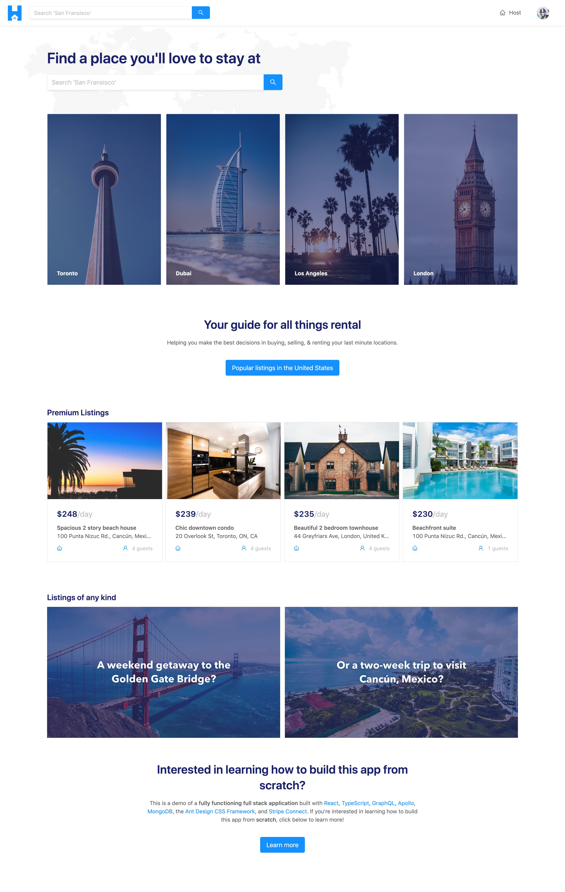

# Module 8 Introduction

In this module, we'll continue from what we've done in the previous module but now allow our client project to query for a _list_ of listing objects from the server. For this module, we'll do this to show the four highest priced listings (i.e. the premium listings) in the Home page of our app.

The Home page of our app is to be displayed in the `/` (i.e. index) route and in the complete state will look similar to the following:

In this module, we'll:

-   Update our API to allow the request of data for multiple listings at the same time.
-   Build the UI for our Home page.
-   Finally, see how we can apply a filter to our API request to fetch only the highest-priced listings.
