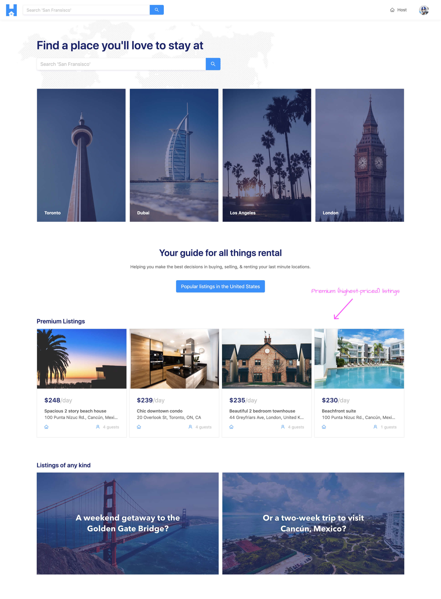
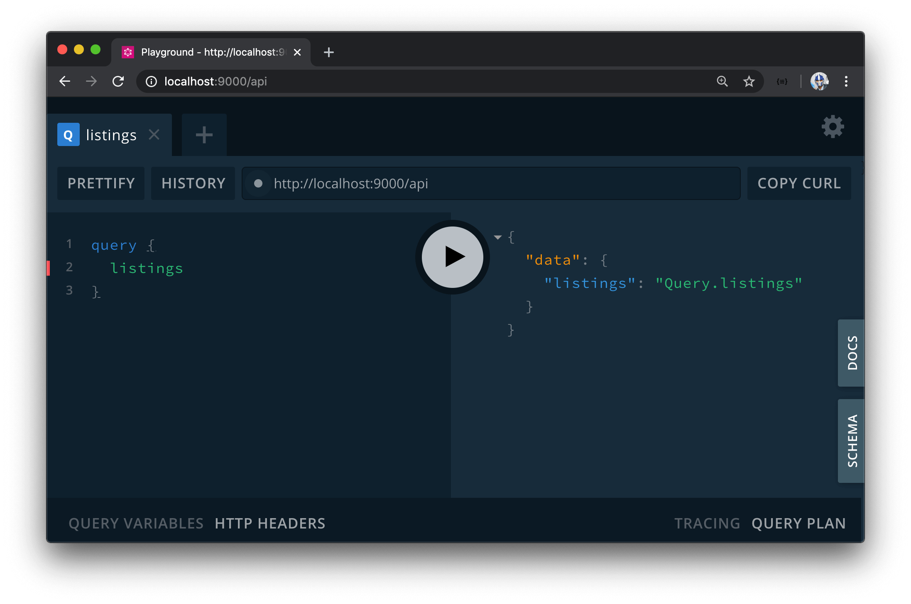

# Listings GraphQL Fields

We're going to want to build a homepage for our app that provides information about what our app does. One section we'll hope to display on the homepage is a small list of the most premium listings available.

Premium is a term we're using here to refer to the most expensive listings in our app. When we build the page that is to display listings for a certain location (i.e. the `/listings/:location?` page), we're going to provide an option to user to sort the listings shown from highest price to lowest price and vice versa. On the homepage, however, we simply want to show the four most expensive listings in our app from any location at any given moment in time.



For both the `/listings/:location?` page we'll create later and the homepage, we'll need to have the client be able to query for multiple listings. We have a field in our API currently available that allows us to query for a single listing but now we'll need to have a field for querying a _list of listings_.

We'll need one root-level `listings` field from our API to help achieve this. This `listings` field will accept a series of arguments:

-   Since its to be a paginated field, we'll make it accept both a **`page`** and **`limit`** arguments to help facilitate offset-based pagination.
-   It will also accept a **`filter`** argument that we'll use to tell the query to return listings in a certain format (e.g. we want listings from the highest price to the lowest price).
-   At a certain point in this course, we'll add an optional **`location`** argument that will allow us to query for listings from a certain location.

We're going to handle some of this server implementation in the next lesson but for this lesson, we'll simply create the resolver for this `listings` field and we'll have it return some dummy data.

In the GraphQL schema of our server project, in the root `Query` object definition, we'll state that a `listings` field is to exist and is to return a string when resolved.

```ts
  type Query {
    authUrl: String!
    user(id: ID!): User!
    listing(id: ID!): Listing!
    listings: String!
  }
```

Next, we'll create the resolver for this `listings` field. Since this `listings` field is within the domain of a listing - we'll create this resolver in the `listingResolvers` map and we'll have it return a string that says `"Query.listings"`.

```ts
// ...

export const listingResolvers: IResolvers = {
  Query: {
    // ...,
    listings: () => {
      return "Query.listings";
    }
  },
  Listing: {
    // ...
  }
};
```

With our server project running, if we were head to GraphQL Playground and query for the `listings` field; we'll see the expected string `"Query.listings"` be returned.


