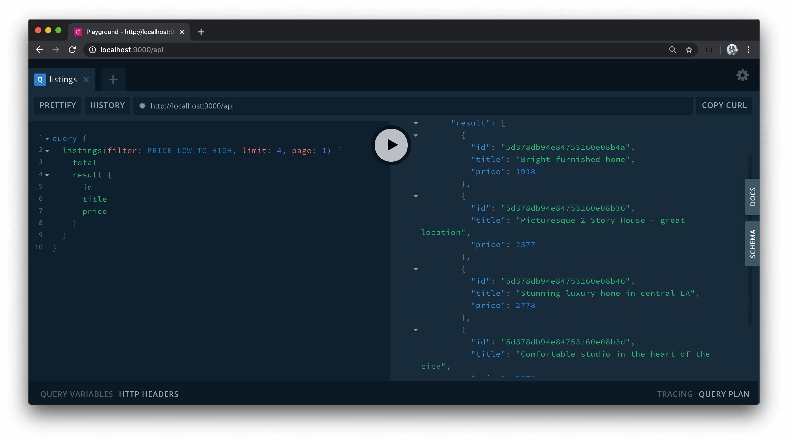
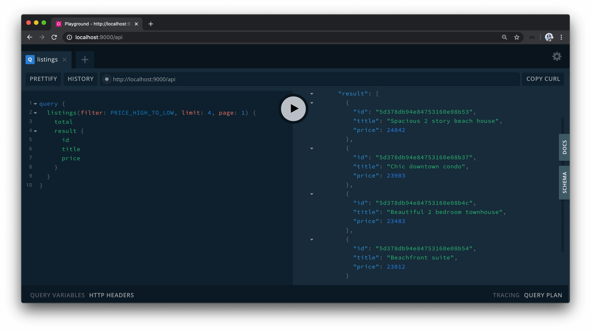

# Building the Listings Resolvers

Now that we have the `listings` GraphQL query field established, let's update the resolver function for this field such that it will retrieve a list of listings from the `"listings"` collection from our database when queried.

### `listings` typeDefs

We'll first update the GraphQL type definitions of the `listings` field before implementing the resolver function.

The `listings` field will have three input arguments:

- It will have a **`filter`** argument that will be of an Enum type we'll create shortly called `ListingsFilter`. When this `filter` argument is passed in, it'll allow the field to return a list of listings that are sorted based on the filter applied.
- It will have a **`limit`** argument which is to be an integer to determine the number of listings to return for a certain query.
- It'll have a **`page`** argument of type integer which is to determine the page (or in other words the sub-list) of listings to be returned.

When the `listings` field is to be resolved, it'll return a `Listings` object type we've set up before which contains the `total` number of items returned and the list of items returned.

```tsx
  type Query {
    authUrl: String!
    user(id: ID!): User!
    listing(id: ID!): Listing!
    listings(filter: ListingsFilter!, limit: Int!, page: Int!): Listings!
  }
```

Next, we'll set up the GraphQL type definition for the `ListingsFilter` Enum. There are to kinds of filters we'll allow the client to specify for how it wants the collection of listings to be returned in this field. We'll have a filter that will allow the client to query listings from the lowest price to the highest price and we can call the Enum value for this `"PRICE_LOW_TO_HIGH"`. Similarly, the client will also be able to pass in a filter value that will filter listings from the highest price to the lowest. We'll call this filter Enum value `"PRICE_HIGH_TO_LOW"`.

```tsx
  enum ListingsFilter {
    PRICE_LOW_TO_HIGH
    PRICE_HIGH_TO_LOW
  }
```

### `listings()` resolver

With the GraphQL type definition for the root-level `listings` field prepared, we'll now look to update the accompanying resolver function. The first thing we'll do is define the TypeScript type definitions of the expected arguments and return value of the `listings()` function resolver. We'll define these TypeScript types in the `src/graphql/resolvers/Listing/types.ts` file.

We'll first define the shape of arguments that can be passed into the `listings` field and we'll establish this in an interface we'll call `ListingsArgs`. There are three current expected arguments - `filter`, `limit`, and `page`. `limit` and `page` are to be `number`'s while `filter` is to be a defined set of values or in other words an Enum. So we'll declare a string-based TypeScript Enum, labeled `ListingsFilter`, to reflect the different listing filters that can be applied - `"PRICE_LOW_TO_HIGH"` and `"PRICE_HIGH_TO_LOW"`.

```tsx
export enum ListingsFilter {
  PRICE_LOW_TO_HIGH = "PRICE_LOW_TO_HIGH",
  PRICE_HIGH_TO_LOW = "PRICE_HIGH_TO_LOW"
}

export interface ListingsArgs {
  filter: ListingsFilter;
  limit: number;
  page: number;
}
```

We'll then create the shape of the data that is expected to be returned from the `listings()` resolver function. We'll call this interface `ListingsData` and it is to have a `total` field of type `number` and a `result` field which is to be a list of listings. We have the definition of a single `Listing` document defined in our `src/lib/types.ts` types file so we'll import it and use it within the `ListingsData` interface.

With these changes, the `src/graphql/resolvers/Listing/types.ts` file will now look like the following:

```tsx
import { Booking, Listing } from "../../../lib/types";

export enum ListingsFilter {
  PRICE_LOW_TO_HIGH = "PRICE_LOW_TO_HIGH",
  PRICE_HIGH_TO_LOW = "PRICE_HIGH_TO_LOW"
}

export interface ListingArgs {
  id: string;
}

export interface ListingBookingsArgs {
  limit: number;
  page: number;
}

export interface ListingBookingsData {
  total: number;
  result: Booking[];
}

export interface ListingsArgs {
  filter: ListingsFilter;
  limit: number;
  page: number;
}

export interface ListingsData {
  total: number;
  result: Listing[];
}
```

We'll now head over to the `listingResolvers` map file (`src/graphql/resolvers/Listing/index.ts`) and look to create the resolver functionality for the `listings` field. We'll import the `ListingsArgs` and `ListingsData` interfaces from the adjacent types file and we'll state the arguments and expected return statement for the `listings()` resolver. In the `listing()` resolver function, the `root` object argument will be undefined. The resolver will expect a `filter`, `limit`, and `page` arguments. We'll need access to the `db` object available in context and when the resolver function is completed successfully, it'll return a `Promise` that when resolved will resolve to an object that conforms to the `ListingsData` shape.

```ts
// ...
import {
  // ..
  ListingsArgs,
  ListingsData
} from "./types";

export const listingResolvers: IResolvers = {
  Query: {
    // ...,
    listings: async (
      _root: undefined,
      { filter, limit, page }: ListingsArgs,
      { db }: { db: Database }
    ): Promise<ListingsData> => {
      return "Query.listings";
    }
  },
  Listing: {
    // ...
  }
};
```

The `listings` field in the root `Query` object is going to be very similar to the `listings` field from the `User` GraphQL object since the resolver function will simply return a paginated list of listings from the `"listings"` collection in our database. With that said, we'll head over to the `userResolvers` map and copy the functionality of the `listings()` resolver in the `User` object and paste it for the `listings()` resolver in the `Query` object within the `listingResolvers` map.

```ts
// ...
import {
  // ..
  ListingsArgs,
  ListingsData
} from "./types";

export const listingResolvers: IResolvers = {
  Query: {
    // ...,
    listings: async (
      _root: undefined,
      { filter, limit, page }: ListingsArgs,
      { db }: { db: Database }
    ): Promise<ListingsData> => {
      try {
        const data: UserListingsData = {
          total: 0,
          result: []
        };

        let cursor = await db.listings.find({
          _id: { $in: user.listings }
        });

        cursor = cursor.skip(page > 0 ? (page - 1) * limit : 0);
        cursor = cursor.limit(limit);

        data.total = await cursor.count();
        data.result = await cursor.toArray();

        return data;
      } catch (error) {
        throw new Error(`Failed to query user listings: ${error}`);
      }
    }
  },
  Listing: {
    // ...
  }
};
```

Some quick changes we'll make.

- We'll declare the type of data that is to be returned as `ListingsData`.
- For the `User` object, we used the `$in` operator in the MongoDB [`find()`](https://docs.mongodb.com/manual/reference/method/db.collection.find/) method to find all listings where the `_id` field of the listing was in the `user.listings` array. We won't want this restriction for the root-level `listings` field (i.e. we'll want listings from any user). With that said, we'll simply find all the listings from the `"listings"` collection for our MongoDB cursor.
- Lastly, we'll update the final error message if ever to occur as `"Failed to query listings"`.

```ts
export const listingResolvers: IResolvers = {
  Query: {
    // ...,
    listings: async (
      _root: undefined,
      { filter, limit, page }: ListingsArgs,
      { db }: { db: Database }
    ): Promise<ListingsData> => {
      try {
        const data: ListingsData = {
          total: 0,
          result: []
        };

        let cursor = await db.listings.find({});

        cursor = cursor.skip(page > 0 ? (page - 1) * limit : 0);
        cursor = cursor.limit(limit);

        data.total = await cursor.count();
        data.result = await cursor.toArray();

        return data;
      } catch (error) {
        throw new Error(`Failed to query listings: ${error}`);
      }
    }
  },
  Listing: {
    // ...
  }
};
```

At this moment, we're using the cursor `limit` and `skip` options to query for a certain limit of listings for a certain page, which is what we want. However, we haven't used the `filter` argument that is to be passed into the resolver function to filter/sort the listings found from the collection.

The `filter` argument value in the resolver is an Enum of one of two values - `"PRICE_LOW_TO_HIGH"` and `"PRICE_HIGH_TO_LOW"`. When the client passes a filter of `"PRICE_LOW_TO_HIGH"`, we want to query for listings that are sorted from the _lowest price to the highest price_ and vice versa for the other filter (`"PRICE_HIGH_TO_LOW"`).

To facilitate these two options, we'll create `if` statements to determine what we'll do to the MongoDB cursor in each condition. One `if` statement for when the filter value is `"PRICE_LOW_TO_HIGH"` and the other for when the filter value is `"PRICE_HIGH_TO_LOW"`.

```ts
export const listingResolvers: IResolvers = {
  Query: {
    // ...,
    listings: async (
      _root: undefined,
      { filter, limit, page }: ListingsArgs,
      { db }: { db: Database }
    ): Promise<ListingsData> => {
      try {
        const data: ListingsData = {
          total: 0,
          result: []
        };

        let cursor = await db.listings.find({});

        if (filter && filter === ListingsFilter.PRICE_LOW_TO_HIGH) {
          // filter listings from price low to high
        }

        if (filter && filter === ListingsFilter.PRICE_HIGH_TO_LOW) {
          // filter listings from price high to low
        }

        cursor = cursor.skip(page > 0 ? (page - 1) * limit : 0);
        cursor = cursor.limit(limit);

        data.total = await cursor.count();
        data.result = await cursor.toArray();

        return data;
      } catch (error) {
        throw new Error(`Failed to query listings: ${error}`);
      }
    }
  },
  Listing: {
    // ...
  }
};
```

The cursor is a pointer to the collection of documents that we've pulled (or found) from the `find()` method. When we apply a "filter", we essentially want to _sort_ our cursor around the price of listings. MongoDB gives us the option to run a [`sort()`](https://docs.mongodb.com/manual/reference/method/cursor.sort/) method in our cursor to help redefine the cursor as a new set of listing documents based on the sort criteria we'll specify.

The `sort()` method allows us to define the order of the documents in our cursor collection and accepts an options object where we can specify the properties we'll want the sort to occur in. In our instance, we want to sort based on the `price` field of a listing document. When it comes to sorting on a field from the highest to lowest value or the lowest to highest value (i.e. in ascending or descending order), [all we'll need to do is either pass a value of `-1` or `1`](https://docs.mongodb.com/manual/reference/method/cursor.sort/#ascending-descending-sort) to the field we want to sort. `-1` denotes we're interested in sorting our collection in descending order (from the highest to the lowest value). `1` denotes we're interested in sorting our collection in ascending order (from the lowest to the highest value).

Since `"PRICE_LOW_TO_HIGH"` refers to the ascending condition, we'll place a sort and state a value of `1` for the `price` field in a listing. In the other `if` statement referring to when the Enum value is `"PRICE_HIGH_TO_LOW"`, we'll do the same but provide a sort value of `-1`.

```ts
export const listingResolvers: IResolvers = {
  Query: {
    // ...,
    listings: async (
      _root: undefined,
      { filter, limit, page }: ListingsArgs,
      { db }: { db: Database }
    ): Promise<ListingsData> => {
      try {
        const data: ListingsData = {
          total: 0,
          result: []
        };

        let cursor = await db.listings.find({});

        if (filter && filter === ListingsFilter.PRICE_LOW_TO_HIGH) {
          cursor = cursor.sort({ price: 1 });
        }

        if (filter && filter === ListingsFilter.PRICE_HIGH_TO_LOW) {
          cursor = cursor.sort({ price: -1 });
        }

        cursor = cursor.skip(page > 0 ? (page - 1) * limit : 0);
        cursor = cursor.limit(limit);

        data.total = await cursor.count();
        data.result = await cursor.toArray();

        return data;
      } catch (error) {
        throw new Error(`Failed to query listings: ${error}`);
      }
    }
  },
  Listing: {
    // ...
  }
};
```

That should be it! We'll now attempt to test what we've done in GraphQL Playground before we move to work on the client. We'll query for the root-level `listings` field and we'll inquire for the `total` and `result` sub-field that's part of the `Listings` object. For the `result`, all we'll ask for is the `id`, `title` and `price` of each listing. We'll then provide some values for the required arguments - we'll say the `filter` will be `PRICE_LOW_TO_HIGH`, we'll want a limit of `4` listings, and we'll want results only for page `1`.



When the query is made successfully, we can see the list of listings returned to us is sorted from the **lowest price to the highest**! If we instead provide a `filter` value of `PRICE_HIGH_TO_LOW`, we'll get listings sorted from the **highest price to the lowest**.


