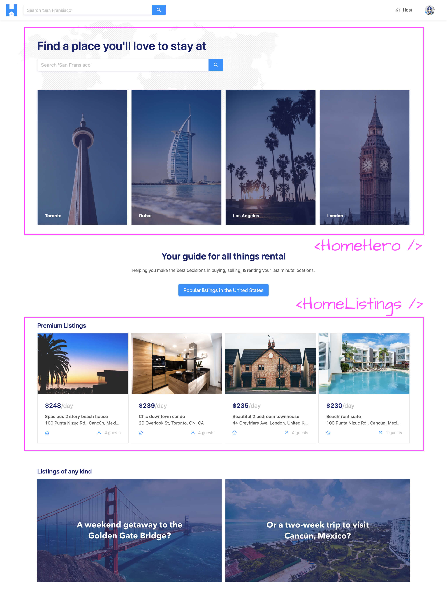
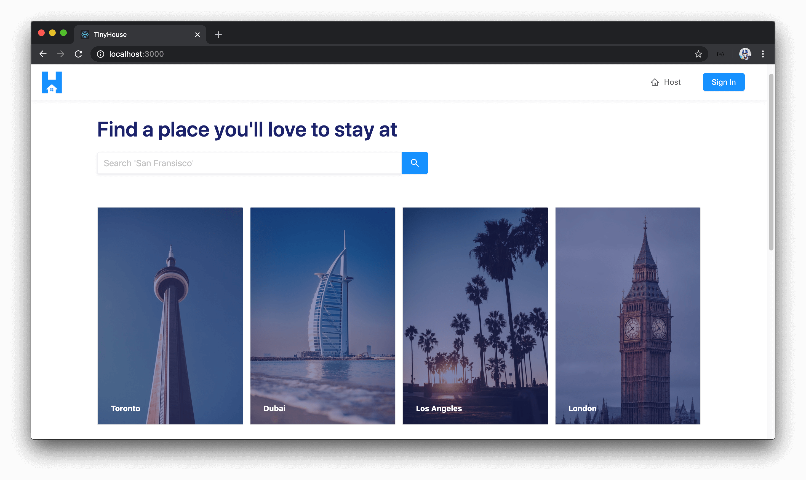
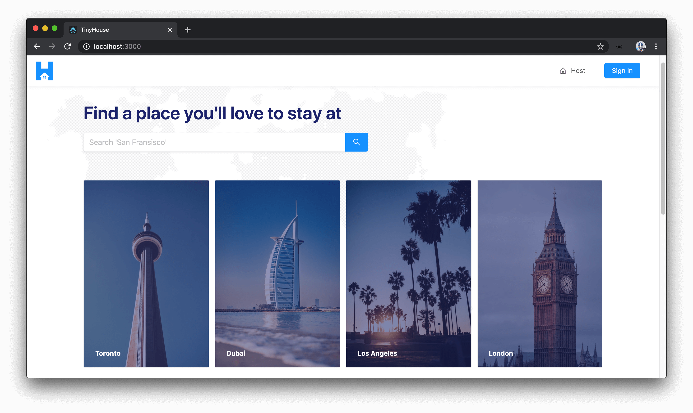
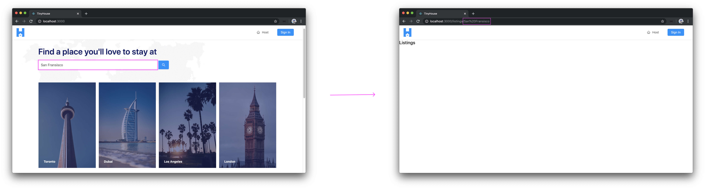
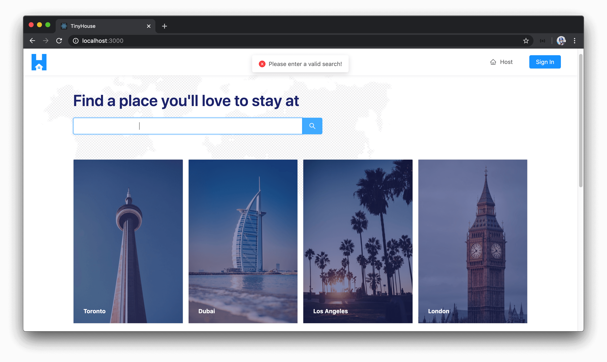
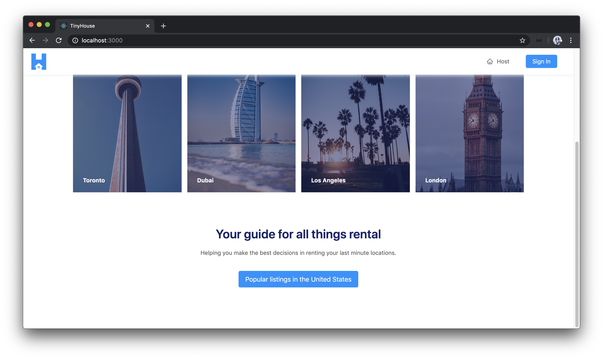
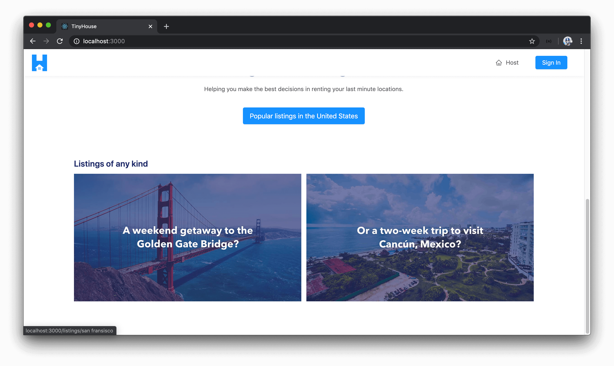

# Building the UI of the Homepage

> 📝 The `cancun.jpg` image asset used in this lesson can be found - [here](./public/assets/cancun.jpg).<br />
> 📝 The `dubai.jpg` image asset used in this lesson can be found - [here](./public/assets/dubai.jpg).<br />
> 📝 The `los-angeles.jpg` image asset used in this lesson can be found - [here](./public/assets/los-angeles.jpg).<br />
> 📝 The `map-background.jpg` image asset used in this lesson can be found - [here](./public/assets/map-background.jpg).<br />
> 📝 The `san-fransisco.jpg` image asset used in this lesson can be found - [here](./public/assets/san-fransisco.jpg).<br />
> 📝 The `toronto.jpg` image asset used in this lesson can be found - [here](./public/assets/toronto.jpg).

The homepage we're going to build is to be to mostly presentational and aims to serve the purpose of telling the user what our app does as well as provide useful links to direct them elsewhere. There will be two child components we're going to create as part of the homepage:

- The **`<HomeHero />`** component which is would be the upper portion of the homepage that is to have the search functionality and the different visual cards to help direct users to certain specific cities.
- The **`<HomeListings/>`** component which is the list of the highest priced listings we'll display to the user.

Everything else in the homepage will just be part of the `<Home />` parent component.



The first thing we'll do as part as part of this lesson is to focus on the more presentational parts of the page while in the next lesson or so, we'll look to make the query for the recently added root level `listings` field to give us the four highest priced listings.

> **Note:** There are a couple of static image assets we'll need for the homepage that is to be kept in an `assets/` folder in the `src/sections/Home/` directory. At the top of this lesson manuscript, you'll be able to find links to each of the image assets sources.

### `<HomeHero />`

#### `<HomeHero />` - Cards

We'll work in the `src/sections/Home/index.tsx` file to create the `<Home />` component that's rendered in the index route of our app. The first thing we'll do is create the `<HomeHero />` component file and an `index.ts` file in a `components/` folder within the `src/sections/Home/` directory.

    client/
      src/
        // ...
        sections/
          // ...
          Home/
            components/
              HomeHero/
                index.tsx
              index.ts
          // ...
      // ...

In the `src/sections/Home/components/index.ts` file, we'll re-export the `<HomeHero />` component function we'll soon create.

```tsx
export * from "./HomeHero";
```

In the `src/sections/Home/components/HomeHero/index.tsx` file, we'll import the `React` library and everything else we might need. We'll import all the components we'll need from Ant Design such as the `<Card />`, `<Col />`, `<Input />`, `<Row />`, and `<Typography />` components. We'll import the image assets we'll use in this `<HomeHero />` component from the `assets/` directory in the parent `Home /` directory - which is the image assets of the cities of toronto, dubai, los angeles, and london.

We'll destruct the `<Title />` sub-component from [`<Typography />`](https://ant.design/components/typography/) and we'll destruct the `<Search />` sub-component from [`<Input />`](https://ant.design/components/input/). And we'll export a component function named `HomeHero`.

```tsx
import React from "react";
import { Card, Col, Input, Row, Typography } from "antd";

import torontoImage from "../../assets/toronto.jpg";
import dubaiImage from "../../assets/dubai.jpg";
import losAngelesImage from "../../assets/los-angeles.jpg";
import londonImage from "../../assets/london.jpg";

const { Title } = Typography;
const { Search } = Input;

export const HomeHero = () => {};
```

In the `<HomeHero />` component return statement, we'll return a parent `<div />` element with two children - another `<div />` element and the Ant Design `<Row />` component. We'll apply a gutter spacing between each columns that is to be shown within the `<Row />`.

```tsx
import React from "react";
import { Card, Col, Input, Row, Typography } from "antd";

import torontoImage from "../../assets/toronto.jpg";
import dubaiImage from "../../assets/dubai.jpg";
import losAngelesImage from "../../assets/los-angeles.jpg";
import londonImage from "../../assets/london.jpg";

const { Title } = Typography;
const { Search } = Input;

export const HomeHero = () => {
  return (
    <div className="home-hero">
      <div className="home-hero__search"></div>
      <Row gutter={12} className="home-hero__cards"></Row>
    </div>
  );
};
```

The `.home-hero__search` `<div />` element will be responsible in displaying the `<Title />` as well as the Search [`<Input />`](https://ant.design/components/input/) where users will be able to search for listings in a certain city. The `<Input />` component from Ant Design is fairly straightforward and essentially provides a text input where we can specify some additional variations. The `<Search />` sub-component gives us the ability to have a search button alongside the input and gives us the capability to use a `onSearch()` callback prop which gets triggered either when the user presses the `"Enter"` key or clicks the search button.

With that said, in the `<HomeHero />` component, let's add a `<Title />` that says `"Find a place you'll love to stay at"` and a `<Search />` input that is to have a placeholder that says `"Search San Fransisco"` (we're using San Fransisco as an example of a location that can be searched). In the `<Search />` input, we'll provide a `size` placeholder with a value of `"large"` which helps specify we want a visibly large input. We'll also pass an `"enterButton"` prop which helps display the search button alongside the input.

```tsx
import React from "react";
import { Card, Col, Input, Row, Typography } from "antd";

import torontoImage from "../../assets/toronto.jpg";
import dubaiImage from "../../assets/dubai.jpg";
import losAngelesImage from "../../assets/los-angeles.jpg";
import londonImage from "../../assets/london.jpg";

const { Title } = Typography;
const { Search } = Input;

export const HomeHero = () => {
  return (
    <div className="home-hero">
      <div className="home-hero__search">
        <Title className="home-hero__title">Find a place you'll love to stay at</Title>
        <Search placeholder="Search 'San Fransisco'" size="large" enterButton className="home-hero__search-input" />
      </div>
      <Row gutter={12} className="home-hero__cards"></Row>
    </div>
  );
};
```

Next, we'll build out a row of cards for the different cities we'll want the user to see in the home hero section. We'll essentially set up four separate columns and in `md` and greater viewports, we'll want each of the columns to take 1/4th of the entire width of the viewport.

```tsx
import React from "react";
import { Card, Col, Input, Row, Typography } from "antd";

import torontoImage from "../../assets/toronto.jpg";
import dubaiImage from "../../assets/dubai.jpg";
import losAngelesImage from "../../assets/los-angeles.jpg";
import londonImage from "../../assets/london.jpg";

const { Title } = Typography;
const { Search } = Input;

export const HomeHero = () => {
  return (
    <div className="home-hero">
      <div className="home-hero__search">
        <Title className="home-hero__title">Find a place you'll love to stay at</Title>
        <Search placeholder="Search 'San Fransisco'" size="large" enterButton className="home-hero__search-input" />
      </div>
      <Row gutter={12} className="home-hero__cards">
        <Col md={6}></Col>
        <Col md={6}></Col>
        <Col md={6}></Col>
        <Col md={6}></Col>
      </Row>
    </div>
  );
};
```

In small viewports (that is to say mobile viewports), we'll actually want to show just the first two columns side by side without showing the other two. With that said, we'll give the first two columns a width of `12` spaces to take half the available grid and the last two columns with values of `0` to declare we don't want it to be shown in small viewports.

```tsx
import React from "react";
import { Card, Col, Input, Row, Typography } from "antd";

import torontoImage from "../../assets/toronto.jpg";
import dubaiImage from "../../assets/dubai.jpg";
import losAngelesImage from "../../assets/los-angeles.jpg";
import londonImage from "../../assets/london.jpg";

const { Title } = Typography;
const { Search } = Input;

export const HomeHero = () => {
  return (
    <div className="home-hero">
      <div className="home-hero__search">
        <Title className="home-hero__title">Find a place you'll love to stay at</Title>
        <Search placeholder="Search 'San Fransisco'" size="large" enterButton className="home-hero__search-input" />
      </div>
      <Row gutter={12} className="home-hero__cards">
        <Col xs={12} md={6}></Col>
        <Col xs={12} md={6}></Col>
        <Col xs={0} md={6}></Col>
        <Col xs={0} md={6}></Col>
      </Row>
    </div>
  );
};
```

For each of the columns, we'll display a `<Card />` component where in the card `cover` prop - we'll provide a `src` for an accompanying image. We'll also look to display the appropriate label within the card to convey which city is is. The first one will refer to Toronto, followed by Dubai, Los Angeles, and then London.

We'll add an `alt` prop (i.e. alternate text prop) to each card cover `img` to comply with our React ESLint set-up and to explain what each of the images convey.

```tsx
import React from "react";
import { Card, Col, Input, Row, Typography } from "antd";

import torontoImage from "../../assets/toronto.jpg";
import dubaiImage from "../../assets/dubai.jpg";
import losAngelesImage from "../../assets/los-angeles.jpg";
import londonImage from "../../assets/london.jpg";

const { Title } = Typography;
const { Search } = Input;

export const HomeHero = () => {
  return (
    <div className="home-hero">
      <div className="home-hero__search">
        <Title className="home-hero__title">Find a place you'll love to stay at</Title>
        <Search placeholder="Search 'San Fransisco'" size="large" enterButton className="home-hero__search-input" />
      </div>
      <Row gutter={12} className="home-hero__cards">
        <Col xs={12} md={6}>
          <Card cover={}>Toronto</Card>
        </Col>
        <Col xs={12} md={6}>
          <Card cover={}>Dubai</Card>
        </Col>
        <Col xs={0} md={6}>
          <Card cover={}>Los Angeles</Card>
        </Col>
        <Col xs={0} md={6}>
          <Card cover={}>London</Card>
        </Col>
      </Row>
    </div>
  );
};
```

We want each of the cards shown in the homehero to be _links_ to the listings page we'll eventually create where the listings for the appropriate city is then to be shown. If we recall, we've created a `/listings/:location?` route that is to have a `location` parameter that'll be used in the page to determine which listings to be shown for a certain location. At this moment, we're not concerned with how that `location` parameter is going to be used to query for the correct listings - we'll just need to direct the user to the listings page and provide the appropriate URL parameter.

Since we want to link the user somewhere in our app, we'll import and use the `<Link/>` component from react-router-dom.

```tsx
import { Link } from "react-router-dom";
```

We'll then wrap each `<Card />` in the columns with the `<Link />` component and we'll provide a target path to take the user to the `listings/:location?` page with the appropriate location in the route param.

- For Toronto, we'll take them to `/listings/toronto`.
- For Dubai, we'll take them to `/listings/dubai/`.
- For Los Angeles, we'll take them to `/listings/los%20angeles`. The `%20` value is a URL-safe character that is used to indicate a space between the words `los` and `angeles`.
- For London, we'll take them to `/listings/london/`.

```tsx
import React from "react";
import { Link } from "react-router-dom";
import { Card, Col, Input, Row, Typography } from "antd";

import torontoImage from "../../assets/toronto.jpg";
import dubaiImage from "../../assets/dubai.jpg";
import losAngelesImage from "../../assets/los-angeles.jpg";
import londonImage from "../../assets/london.jpg";

const { Title } = Typography;
const { Search } = Input;

export const HomeHero = () => {
  return (
    <div className="home-hero">
      <div className="home-hero__search">
        <Title className="home-hero__title">Find a place you'll love to stay at</Title>
        <Search placeholder="Search 'San Fransisco'" size="large" enterButton className="home-hero__search-input" />
      </div>
      <Row gutter={12} className="home-hero__cards">
        <Col xs={12} md={6}>
          <Link to="/listings/toronto">
            <Card cover={}>Toronto</Card>
          </Link>
        </Col>
        <Col xs={12} md={6}>
          <Link to="/listings/dubai">
            <Card cover={}>Dubai</Card>
          </Link>
        </Col>
        <Col xs={0} md={6}>
          <Link to="/listings/los%20angeles">
            <Card cover={}>Los Angeles</Card>
          </Link>
        </Col>
        <Link to="/listings/london">
          <Col xs={0} md={6}>
            <Card cover={}>London</Card>
          </Col>
        </Link>
      </Row>
    </div>
  );
};
```

That's the majority of what we'll want to do for the `<HomeHero />` component. We'll now import it and look to render it in the parent `<Home />` page component. In the `<Home />` component file, we'll import the `<Layout />` component from Ant Design and the `<HomeHero />` component from the adjacent `components/` folder, and we'll destructure the `<Content />` sub component from `<Layout />`.

We'll have our `<Home />` component return statement return the `<Content />` component with the `<HomeHero />` as a child.

```tsx
import React from "react";
import { Layout } from "antd";
import { HomeHero } from "./components";

const { Content } = Layout;

export const Home = () => {
  return (
    <Content className="home">
      <HomeHero />
    </Content>
  );
};
```

If we take a look at our home page right now, we'll see the title + search input + the 4 different cards be shown. If we were to click one of these cards, we'll be redirected to the listings page with the appropriate URL parameter.



> **Note:** There has been some CSS work to have the cover images within each listing card encompass the entire card. The `<Card />` component from Ant Design doesn't really appear this way so we've customized a few styles to get to this point. If you're interested, do take a look at the root `src/index.css` file of our client project to see how this might have been done!

Let's make a few small changes before to the hero before we move towards the other sections in the homepage. We have a nice dotted map of the world available as an asset and we'll look to make it the background-image of the parent content component of `<Home/>`.

We'll import the map background asset and place it as the `background-image` of the `<Content />` element in the `<Home />` component.

```tsx
import React from "react";
import { Layout } from "antd";
import { HomeHero } from "./components";

import mapBackground from "./assets/map-background.jpg";

const { Content } = Layout;

export const Home = () => {
  return (
    <Content className="home" style={{ backgroundImage: `url(${mapBackground})` }}>
      <HomeHero />
    </Content>
  );
};
```

We'll now get a nice background image at the hero level. Great!



#### `<HomeHero />` - Search Input

At this moment, our search input here in the `<HomeHero />` component doesn't do anything when we press the enter key or even click the button available to us. When a user searches for listings with the search input, we'll want to direct them to the `/listings/:location?` page with the search that they've made as part of the `location` URL parameter of the listings route. For example, if the user searches `"San Fransisco"` - we'll want them to be directed to the `/listings/` route where `San%20Fransisco` is the URL parameter.

We'll create a function in the `<Home />` component called `onSearch()` that'll handle the functionality to make a redirect to the new route, and we'll pass this function down as a prop to the `<HomeHero/>` component.

```tsx
// ...

export const Home = () => {
  const onSearch = () => {};

  return (
    <Content className="home" style={{ backgroundImage: `url(${mapBackground})` }}>
      <HomeHero onSearch={onSearch} />
    </Content>
  );
};
```

The `<Home />` component is a component that's rendered as part of a `<Route />` within the context of our React Router routes and components. Any component that's rendered directly as the component of a `<Route />` has access automatically to an object as a prop known as the [`history`](https://github.com/ReactTraining/react-router/blob/master/packages/react-router/docs/api/history.md) object which is a reference to the browser's session history. We can use this `history` object to push a new entry to the history stack or in other words **direct the user to a new location**.

If the `history` object is available as a prop to the `<Home />` component, we should be able to access it directly but we don't know what its type is. Which is why we can use the `RouteComponentProps` interface from `react-router-dom` to help declare the shape of props a component receives when rendered as a route.

```tsx
// ...
import { RouteComponentProps } from "react-router-dom";

// ...

export const Home = ({ history }: RouteComponentProps) => {
  const onSearch = () => {};

  return (
    <Content className="home" style={{ backgroundImage: `url(${mapBackground})` }}>
      <HomeHero onSearch={onSearch} />
    </Content>
  );
};
```

In the `onSearch()` component function, we can use the `history.push()` method to take the user to a certain route. The user is to provide what location they'll want to go and see listings for so we'll get this information as a parameter of the `onSearch()` function that we'll label as a value and will be a string.

```tsx
// ...
import { RouteComponentProps } from "react-router-dom";

// ...

export const Home = ({ history }: RouteComponentProps) => {
  const onSearch = (value: string) => {
    history.push(`/listings/${value}`);
  };

  return (
    <Content className="home" style={{ backgroundImage: `url(${mapBackground})` }}>
      <HomeHero onSearch={onSearch} />
    </Content>
  );
};
```

With our `onSearch()` function prepared and passed down, we'll have to declared in `<HomeHero />` component for the `<Search />` input to use. In the `<HomeHero />` component, we'll state it is to accept a function prop called `onSearch` that is to accept a string argument and return void (i.e. nothing).

In the `<HomeHero />` component file, we'll declare the `onSearch` function prop and pass it to the `<Search />` input to use. With all these changes made for the `<HomeHero />` component, the `src/sections/Home/components/HomeHero/index.tsx` file will look like the following:

```tsx
import React from "react";
import { Link } from "react-router-dom";
import { Card, Col, Input, Row, Typography } from "antd";

import torontoImage from "../../assets/toronto.jpg";
import dubaiImage from "../../assets/dubai.jpg";
import losAngelesImage from "../../assets/los-angeles.jpg";
import londonImage from "../../assets/london.jpg";

const { Title } = Typography;
const { Search } = Input;

interface Props {
  onSearch: (value: string) => void;
}

export const HomeHero = ({ onSearch }: Props) => {
  return (
    <div className="home-hero">
      <div className="home-hero__search">
        <Title className="home-hero__title">Find a place you'll love to stay at</Title>
        <Search placeholder="Search 'San Fransisco'" size="large" enterButton className="home-hero__search-input" onSearch={onSearch} />
      </div>
      <Row gutter={12} className="home-hero__cards">
        <Col xs={12} md={6}>
          <Link to="/listings/toronto">
            <Card cover={}>Toronto</Card>
          </Link>
        </Col>
        <Col xs={12} md={6}>
          <Link to="/listings/dubai">
            <Card cover={}>Dubai</Card>
          </Link>
        </Col>
        <Col xs={0} md={6}>
          <Link to="/listings/los%20angeles">
            <Card cover={}>Los Angeles</Card>
          </Link>
        </Col>
        <Col xs={0} md={6}>
          <Link to="/listings/london">
            <Card cover={}>London</Card>
          </Link>
        </Col>
      </Row>
    </div>
  );
};
```

We can now see how the search input is to behave. If we typed something in the input available in the hero section of our homepage and pressed enter (or clicked the search button), we'll be redirected to the `/listings` route with the appropriate URL parameter applied! Great!



The search input will behave mostly as we would want. We're not going to spend too much time trying to come up with any strict field level validations. If the user types something completely incorrect - like a random sets of strings or numbers; what we'll do is direct the user to the listings page and the query (we'll eventually set up) to query for listings will fail.

However the one thing we'll handle is an attempt to remove whitespace characters from the beginning and end of a string. For example, if a user is type something like `" london "`, we won't want the whitespace characters in the beginning or end to be part of our route. If there's whitespace characters in the middle, we'll leave it as is; otherwise we'll remove them from the beginning and end. There's a JavaScript function that helps us achieve just this and is adoptable on almost all browsers and is called [`.trim()`](https://developer.mozilla.org/en-US/docs/Web/JavaScript/Reference/Global_Objects/String/trim).

In the `onSearch()` function within the `<Home />` component, we can create a constant value called `trimmedValue` that is the trimmed string and pass that as the URL parameter for the listings route.

```tsx
// ...

export const Home = ({ history }: RouteComponentProps) => {
  const onSearch = (value: string) => {
    const trimmedValue = value.trim();
    history.push(`/listings/${trimmedValue}`);
  };

  return (
    <Content className="home" style={{ backgroundImage: `url(${mapBackground})` }}>
      <HomeHero onSearch={onSearch} />
    </Content>
  );
};
```

If we were now to type a string with whitespace characters in the beginning and end, we'll have them removed in our URL parameter!

The one other condition we'll guard for is if the user doesn't type anything but just empty spaces and attempts to make a search. If the user was to type just empty spaces, the `trim` function will trim all those spaces away for it be an empty string. We can place an `if` statement in the `onSearch()` function and check if the searched string is empty, if so we'll display an error message that says `"'Please enter a valid search!'"` and we'll use the `displayErrorMessage()` utility function we've set up to help us here.

With the above implemented and the all the changes made for the `<HomeHero />` component, the `src/sections/Home/components/HomeHero/index.tsx` file will look like the following:

```tsx
import React from "react";
import { Link } from "react-router-dom";
import { Card, Col, Input, Row, Typography } from "antd";

import torontoImage from "../../assets/toronto.jpg";
import dubaiImage from "../../assets/dubai.jpg";
import losAngelesImage from "../../assets/los-angeles.jpg";
import londonImage from "../../assets/london.jpg";

const { Title } = Typography;
const { Search } = Input;

interface Props {
  onSearch: (value: string) => void;
}

export const HomeHero = ({ onSearch }: Props) => {
  return (
    <div className="home-hero">
      <div className="home-hero__search">
        <Title className="home-hero__title">Find a place you'll love to stay at</Title>
        <Search placeholder="Search 'San Fransisco'" size="large" enterButton className="home-hero__search-input" onSearch={onSearch} />
      </div>
      <Row gutter={12} className="home-hero__cards">
        <Col xs={12} md={6}>
          <Link to="/listings/toronto">
            <Card cover={}>Toronto</Card>
          </Link>
        </Col>
        <Col xs={12} md={6}>
          <Link to="/listings/dubai">
            <Card cover={}>Dubai</Card>
          </Link>
        </Col>
        <Col xs={0} md={6}>
          <Link to="/listings/los%20angeles">
            <Card cover={}>Los Angeles</Card>
          </Link>
        </Col>
        <Col xs={0} md={6}>
          <Link to="/listings/london">
            <Card cover={}>London</Card>
          </Link>
        </Col>
      </Row>
    </div>
  );
};
```

Now, if we type just empty characters and attempt to make search, a visible error message will be shown to the user!



This is to be pretty much be our `<HomeHero />` component. The rest of the homepage (without considering the home listings section) is pretty straightforward, so we'll look to build it our fairly quickly.

#### `<Home />` - CTAs

The next section after our hero section is going to have a title and description with some copy and there'll be a call-to-action that when the user is to click it will take them to listings in the United States.

Let's create this section. First, we'll import the `<Typography />` component from Ant Design in the `<Home />` component file and we'll destructue the `<Title />` and `<Paragraph />` sub components from `<Typography />`. We'll have a new `<div />` element that has a title that says `"Your guide for all things rental"` and there'll be a paragraph that says `"Helping you make your best decisions in renting your last minute locations"`.

```tsx
// ...
import { Col, Row, Layout, Typography } from "antd";
// ...

// ...
const { Paragraph, Title } = Typography;

export const Home = ({ history }: RouteComponentProps) => {
  const onSearch = (value: string) => {
    const trimmedValue = value.trim();
    history.push(`/listings/${trimmedValue}`);
  };

  return (
    <Content className="home" style={{ backgroundImage: `url(${mapBackground})` }}>
      <HomeHero onSearch={onSearch} />

      <div className="home__cta-section">
        <Title level={2} className="home__cta-section-title">
          Your guide for all things rental
        </Title>
        <Paragraph>Helping you make the best decisions in renting your last minute locations.</Paragraph>
      </div>
    </Content>
  );
};
```

We're interested in providing a call-to-action that appears as a button from Ant Design but behaves as a `Link` within the context of React Router. There's a few ways we can try and achieve something like this - by either wrapping the Ant Design `<Button />` element over React Router's `<Link />` component or vice versa. We can even create our own `Button/Link` component that will use React Router's `history` object to push a new entry into the browser session.

The simplest way we'll achieve this is to simply use React Router's `<Link />` component and provide the CSS classes that constitute how this link will look like. We can achieve this by using the following classes - `.ant-btn` to have it appear as an Ant Design button, `.ant-btn-primary` for it to appear as the primary blue color, and `.ant-btn-lg` for it to have a larger size. We'll specify an additional class we've created before that adds a little margin to the element as well.

```tsx
// ...
import { Col, Row, Layout, Typography } from "antd";
// ...

// ...
const { Paragraph, Title } = Typography;

export const Home = ({ history }: RouteComponentProps) => {
  const onSearch = (value: string) => {
    const trimmedValue = value.trim();
    history.push(`/listings/${trimmedValue}`);
  };

  return (
    <Content className="home" style={{ backgroundImage: `url(${mapBackground})` }}>
      <HomeHero onSearch={onSearch} />

      <div className="home__cta-section">
        <Title level={2} className="home__cta-section-title">
          Your guide for all things rental
        </Title>
        <Paragraph>Helping you make the best decisions in renting your last minute locations.</Paragraph>
        <Link to="/listings/united%20states" className="ant-btn ant-btn-primary ant-btn-lg home__cta-section-button">
          Popular listings in the United States
        </Link>
      </div>
    </Content>
  );
};
```

We've specified a target path for the link to be `listings/united%20states`. If we looked at our page now, we'll see the new section and if we were to click the call-to-action - we'll be taken to the `/listings/` route with `united%20states` as the URL parameter.



The other section will add in the homepage will be a simple two column split that shows a nice image with some nice content for one of two cities - San Fransico, US and Cancun, Mexico. Each of these images will be links as well to take us to the listings page for each respective city, and these images are available to us as some of the assets we have.

First and foremost; we'll import some additional Ant Design components in the `<Home />` component file such as `<Col />` and `<Row />`, and we'll import the the `san-fransisco` and `cancun` image files from the local `assets/` folder kept in the parent.

```tsx
import { Col, Row, Layout, Typography } from "antd";

// ...

import sanFransiscoImage from "./assets/san-fransisco.jpg";
import cancunImage from "./assets/cancun.jpg";

// ...
```

We'll build the next section that'll have a title of `"Listings of any kind"` and there'll be a row where each column has full width in extra-small viewports and half width of the grid in small viewports and greater. Each of these columns will be a `<Link />` with a `<div />` and `` elements. The first link will take us to `/listings/san%20fransisco` and the second link will take us to `/listings/cancún`.

With this implemented, the `src/sections/Home/index.tsx` file will look as follows:

```tsx
import React from "react";
import { Link, RouteComponentProps } from "react-router-dom";
import { Col, Row, Layout, Typography } from "antd";
import { displayErrorMessage } from "../../lib/utils";
import { HomeHero } from "./components";

import mapBackground from "./assets/map-background.jpg";
import sanFransiscoImage from "./assets/san-fransisco.jpg";
import cancunImage from "./assets/cancun.jpg";

const { Content } = Layout;
const { Paragraph, Title } = Typography;

export const Home = ({ history }: RouteComponentProps) => {
  const onSearch = (value: string) => {
    const trimmedValue = value.trim();

    if (trimmedValue) {
      history.push(`/listings/${trimmedValue}`);
    } else {
      displayErrorMessage("Please enter a valid search!");
    }
  };

  return (
    <Content className="home" style={{ backgroundImage: `url(${mapBackground})` }}>
      <HomeHero onSearch={onSearch} />

      <div className="home__cta-section">
        <Title level={2} className="home__cta-section-title">
          Your guide for all things rental
        </Title>
        <Paragraph>Helping you make the best decisions in renting your last minute locations.</Paragraph>
        <Link to="/listings/united%20states" className="ant-btn ant-btn-primary ant-btn-lg home__cta-section-button">
          Popular listings in the United States
        </Link>
      </div>

      <div className="home__listings">
        <Title level={4} className="home__listings-title">
          Listings of any kind
        </Title>
        <Row gutter={12}>
          <Col xs={24} sm={12}>
            <Link to="/listings/san%20fransisco">
              <div className="home__listings-img-cover">
                
              </div>
            </Link>
          </Col>
          <Col xs={24} sm={12}>
            <Link to="/listings/cancún">
              <div className="home__listings-img-cover">
                
              </div>
            </Link>
          </Col>
        </Row>
      </div>
    </Content>
  );
};
```

If we took a look at our homepage at this moment and scroll to the bottom, we'll see the two separate images shown to us. If we click the one on the left, we will be directed to listings in San Francisco and if we were to click the image on the right will be navigated to listings in Cancún!



Our homepage now looks pretty good. In the next coming lessons, we'll look to display the most premium (i.e. highest priced) listings in the homepage.
