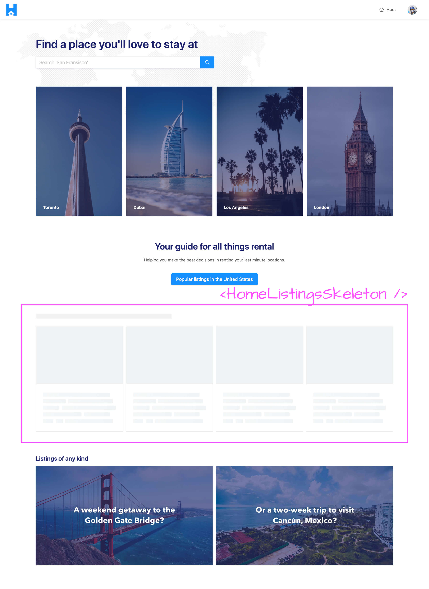
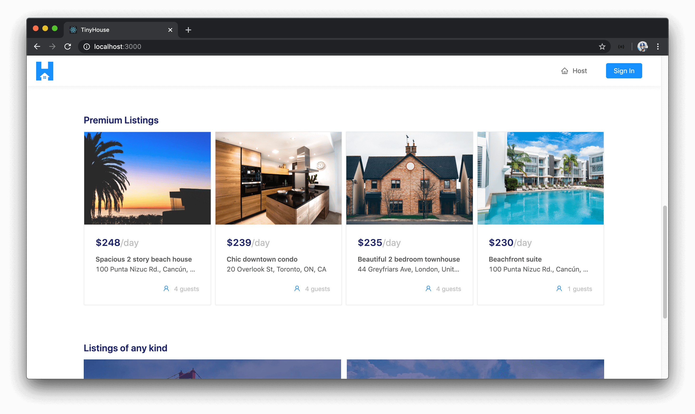
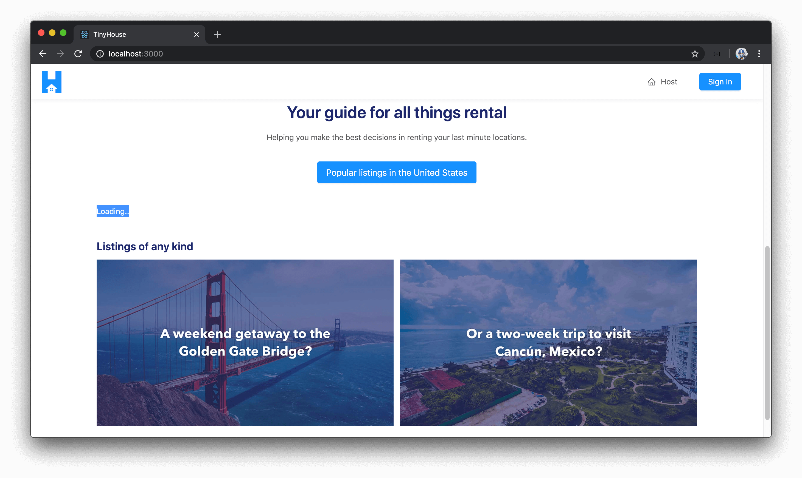
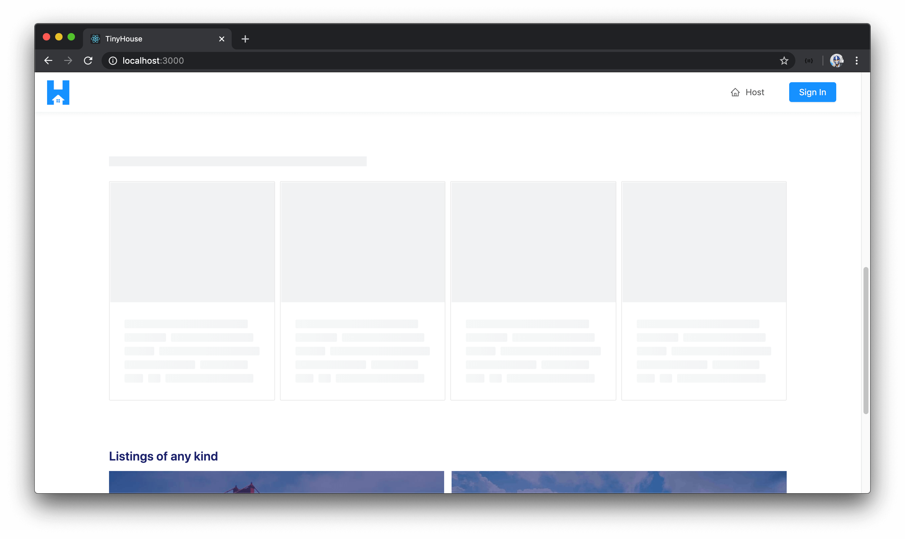

# Displaying the highest-priced listings in the Homepage

> 📝 The `listing-loading-card-cover.jpg` image asset used in this lesson can be found - [here](./public/assets/listing-loading-card-cover.jpg).

Our homepage is mostly prepared except for displaying the most premium (i.e. highest price) listings. In this lesson, we'll look to make the query we'll need to retrieve the highest priced listings from our server and display that information on our homepage.

> **Note:** We use an image asset labeled `listing-loading-card-cover.jpg` in the `src/sections/Home/assets/` folder for help displaying the loading state for the request of the highest priced listings shown on the homepage. Find a source for this image asset - [here](./public/assets/listing-loading-card-cover.jpg).

### `listings` query

We've created a root-level `listings` field that allows us to query for listings from the `"listings"` collection in our database _and_ we're able to apply a `filter` argument to determine how we would want the results returned to be sorted based on price. With that said, let's create the `listings` query document so our client will be able to request listings data from our API. We'll create a `Listings/` folder that has an `index.ts` file within the `src/lib/graphql/queries/` folder.

    client/
      src/
        lib/
          graphql/
            queries/
              // ...
              Listings/
                index.ts
              // ...
        // ...
      // ...

In the `src/graphql/queries/index.ts` file, we'll re-export the soon to be created GraphQL document for the `listings` field.

```ts
export * from "./Listings";
```

In the `src/graphql/queries/Listings/index.ts` file, we'll import the `gql` tag from `apollo-boost`, export a constant labeled `LISTINGS`, and construct our `Listings` query. We'll state that the query is to accept a `filter` argument of type `ListingsFilter` and `limit`/`page` arguments of type `Int`. All of these arguments are to be required and not optional. We'll query for the `listings` field and pass those arguments down.

```ts
import { gql } from "apollo-boost";

export const LISTINGS = gql`
  query Listings($filter: ListingsFilter!, $limit: Int!, $page: Int!) {
    listings(filter: $filter, limit: $limit, page: $page) {
      
    }
  }
`;
```

All the information we'll need from the `listings` query is just the information needed to populate the `<ListingCard />` component we've created before which is a card preview of a certain listing. We'll be using the `<ListingCard />` component to show the premium listings on the homepage. With that said, we'll query for the `result` returned from the `listings` field (which is the list of listings) and for each listing item we'll look to get the `id`, `title`, `image`, `address`, `price`, and `numOfGuests` fields.

```tsx
import { gql } from "apollo-boost";

export const LISTINGS = gql`
  query Listings($filter: ListingsFilter!, $limit: Int!, $page: Int!) {
    listings(filter: $filter, limit: $limit, page: $page) {
      result {
        id
        title
        image
        address
        price
        numOfGuests
      }
    }
  }
`;
```

With our GraphQL query document established, we'll autogenerate the TypeScript definitions with regards to this newly added `listings` GraphQL document. We'll head to the terminal and first run the `codegen:schema` command to regenerate the schema in our client application.

    npm run codegen:schema

We'll then run the `codegen:generate` command to regenerate the TypeScript definitions of our GraphQL schema.

    npm run codegen:generate

With our GraphQL query for the `listings` field prepared, we can now look to query for the `listings` field in our `<HomePage />` component.

In the `src/sections/Home/index.tsx` file, we'll first import the `useQuery` Hook from React Apollo.

```tsx
import { useQuery } from "@apollo/react-hooks";
```

We'll also import the `LISTINGS` query document and the autogenerated TypeScript definitions for the data and variables related to the `LISTINGS` query document.

```tsx
import { LISTINGS } from "../../lib/graphql/queries";
import {
  Listings as ListingsData,
  ListingsVariables
} from "../../lib/graphql/queries/Listings/__generated__/Listings";
```

Remember how we've mentioned that the Apollo CLI creates a `globalTypes.ts` file when we generate our TypeScript definitions and contains the Enum and Input object types of our GraphQL schema in TypeScript format? When we run the listings query on the homepage, we're going to pass in a filter value of `"PRICE_HIGH_TO_LOW"` to ensure we're getting the highest priced listings. Instead of passing the value directly, we can use the autogenerated `ListingsFilter` Enum from the `globalTypes.ts` file to reference a value from the correct list of values. With that said, in the `<Home />` component file - we'll import the `ListingsFilter` Enum from the `globalTypes.ts` file generated by the Apollo CLI.

```tsx
import { ListingsFilter } from "../../lib/graphql/globalTypes";
```

We'll now prepare our query. We'll run the `useQuery` Hook at the top of the `<Home />` component function, pass the `ListingsData` and `ListingsVariables` interfaces, specify the `LISTINGS` GraphQL document, and we'll say we're interested in retrieving the `loading` and `data` information from our Query Result.

```tsx
export const Home = ({ history }: RouteComponentProps) => {
  const { loading, data } = useQuery<ListingsData, ListingsVariables>(LISTINGS, {
    variables: {}
  });

  // ...
};
```

Let's now pass the variables the `listings` query expects.

- We'll state a `filter` variable and use the `ListingsFilter` Enum to pass a filter value of `"PRICE_HIGH_TO_LOW"`.
- The `limit` variable helps dictate the number of listings we want to be returned. Since we only want to show a total of four listings on the homepage, we'll pass a value of `4`. We'll define the value for this `limit` as a `PAGE_LIMIT` constant outside of the component function.
- Since we want the first four listings in our collection (i.e. the first page of results), we'll pass a value of `1` for the `page` variable. We'll define the value for this `page` variable as a `PAGE_NUMBER` constant outside of the component function.

```tsx
// ...

const PAGE_LIMIT = 4;
const PAGE_NUMBER = 1;

export const Home = ({ history }: RouteComponentProps) => {
  const { loading, data } = useQuery<ListingsData, ListingsVariables>(LISTINGS, {
    variables: {
      filter: ListingsFilter.PRICE_HIGH_TO_LOW,
      limit: PAGE_LIMIT,
      page: PAGE_NUMBER
    }
  });

  // ...
};
```

When the `listings` query is in flight (i.e. query result is `loading`), we'll want to show a more focused skeleton experience just around the listings section shown on the homepage. We'll have three states that govern how the listings section on the homepage is going to be shown.

When the `listings` query is in flight, we'll show a `<HomeListingsSkeleton />` component.



When the `listings` query is complete, we'll show a `<HomeListings />` component.


If the `listings` query ever fails, we just don't show anything. We _could_ try and show an error message but from a UI perspective, we can see that the homepage shows other information than just the most premium listings. If the `listings` query errors, we won't show any listings and the user can still move around and see everything else on the homepage.


With this gameplan in mind, we can have a function in the `<Home />` component called `renderListingsSection()` that will be responsible for rendering the correct listings related sub-component depending on the result of the query. If the query is `loading` - the function will return a `"Loading.."` message (for now). If data is available from the query, the function will return a child component we can call `<HomeListings />` that will accept a `title` prop with a value of `"Premium Listings"` and a `listings` prop that is the `listings` array itself with which we can get from the query data. If data doesn't exist and loading isn't true, this probably means the query has failed so we'll have the function return `null`.

```tsx
// ...

export const Home = ({ history }: RouteComponentProps) => {
  const { loading, data } = useQuery<ListingsData, ListingsVariables>(LISTINGS, {
    variables: {
      filter: ListingsFilter.PRICE_HIGH_TO_LOW,
      limit: PAGE_LIMIT,
      page: PAGE_NUMBER
    }
  });

  const renderListingsSection = () => {
    if (loading) {
      return "Loading..";
    }

    if (data) {
      return <HomeListings title="Premium Listings" listings={data.listings.result} />;
    }

    return null;
  };

  // ...
};
```

We can then run the `renderListingsSection()` function in the `<Home />` return statement to convey what would be shown depending on the state of the `listings` query. We'll have the function be run right after the call-to-action section.

```tsx
// ...

export const Home = ({ history }: RouteComponentProps) => {
  const { loading, data } = useQuery<ListingsData, ListingsVariables>(LISTINGS, {
    variables: {
      filter: ListingsFilter.PRICE_HIGH_TO_LOW,
      limit: PAGE_LIMIT,
      page: PAGE_NUMBER
    }
  });

  const renderListingsSection = () => {
    if (loading) {
      return <HomeListingsSkeleton />;
    }

    if (data) {
      return <HomeListings title="Premium Listings" listings={data.listings.result} />;
    }

    return null;
  };

  return (
    <Content className="home" style={{ backgroundImage: `url(${mapBackground})` }}>
      <HomeHero onSearch={onSearch} />

      <div className="home__cta-section">{/* ... */}</div>

      {renderListingsSection()}

      <div className="home__listings">{/* ... */}</div>
    </Content>
  );
};
```

We're now missing the actual `<HomeListings />` component which we haven't created yet. In the `src/sections/Home/components/` folder, we'll create a `HomeListings/` folder that is to have an `index.tsx` file.

    client/
      src/
        // ...
        sections/
          // ...
          Home
            components/
              // ...
              HomeListings/
                index.tsx
            index.ts
          // ...
      // ...

In the `src/sections/Home/components/index.ts` file, we'll re-export the soon to be created `<HomeListings />` child component.

```ts
export * from "./HomeListings";
```

The `<HomeListings />` component is going to be very similar to how we've shown a list of listings in a `/user/:id` page albeit being simpler since there won't be any form of pagination.

In the `<HomeListings />` component file, we'll import the `React` library. We'll import the `<List />` and `<Typography />` components from Ant Design. We'll import the `<ListingCard />` component from the `src/lib/components/` folder. Finally, we'll import the interface for the data returned from the `listings` query from our generated TypeScript definitions. We'll be using this to help describe the shape of the `listings` prop that's going to be passed into this component.

```tsx
import React from "react";
import { List, Typography } from "antd";
import { ListingCard } from "../../../../lib/components";
import { Listings } from "../../../../lib/graphql/queries/Listings/__generated__/Listings";
```

We'll describe the shape of props the `<HomeListings />` component is to receive. We'll say it is to receive a `title` prop of type `string` and a `listings` prop which is to have the shape of the `result` field from the `listings` field from our auto-generated data interface.

We'll also destruct the `<Title />` sub component from `<Typography />` and create the `<HomeListings />` component function.

```tsx
import React from "react";
import { List, Typography } from "antd";
import { ListingCard } from "../../../../lib/components";
import { Listings } from "../../../../lib/graphql/queries/Listings/__generated__/Listings";

interface Props {
  title: string;
  listings: Listings["listings"]["result"];
}

const { Title } = Typography;

export const HomeListings = ({ title, listings }: Props) => {};
```

The `<HomeListings />` component return statement is going to be fairly straightforward. It's simply going to render a `<Title />` with the text content derived from the `title` prop, and it'll render the `<List />` component that we've seen before in earlier lessons. In the `<List />` component, we'll apply a grid layout with the intention of four items being shown in the list side by side in large viewports, two items taking the entire viewport width in small viewports, and one item taking the entire viewport width in extra-small viewports.

The source of data for the presented list is to be the `listings` prop available and for every item we want to render in the list - we'll render the `<ListingCard />` component and pass the iterated `listing` object down.

```tsx
import React from "react";
import { List, Typography } from "antd";
import { ListingCard } from "../../../../lib/components";
import { Listings } from "../../../../lib/graphql/queries/Listings/__generated__/Listings";

interface Props {
  title: string;
  listings: Listings["listings"]["result"];
}

const { Title } = Typography;

export const HomeListings = ({ title, listings }: Props) => {
  return (
    <div className="home-listings">
      <Title level={4} className="home-listings__title">
        {title}
      </Title>
      <List
        grid={{
          gutter: 8,
          xs: 1,
          sm: 2,
          lg: 4
        }}
        dataSource={listings}
        renderItem={listing => (
          <List.Item>
            <ListingCard listing={listing} />
          </List.Item>
        )}
      />
    </div>
  );
};
```

In the parent `<Home />` component file, we'll now just need to import the `<HomeListings />` component from the adjacent `components/` folder.

```tsx
import { HomeHero, HomeListings } from "./components";
```

If we take a look at our homepage now, when our query is successful we'll see the four highest priced listings shown to us.



### `<HomeListingsSkeleton />`

Though we have the `<HomeListings />` component rendered, our loading state for this section isn't too presentable at this moment. We just have a text that says `Loading..`.



With that said, let's prepare a `<HomeListingsSkeleton />` component responsible for rendering the skeleton UI of our listings section. We'll create this component index in the same `components/` folder within the `Home/` sections directory.

    client/
      src/
        // ...
        sections/
          // ...
          Home
            components/
              // ...
              HomeListingsSkeleton/
                index.tsx
            index.ts
          // ...
      // ...

In the `src/sections/Home/components/index.ts` file, we'll re-export the soon to be created `<HomeListingsSkeleton />` component.

```ts
export * from "./HomeListingsSkeleton";
```

The `<HomeListingsSkeleton />` component will be very similar to the `<HomeListings />` component except we're not going to render `<ListingCard/>`'s but instead render custom card elements we'll create that appears as a card in the "loading" state.

In summary, the `<HomeListingsSkeleton />` component will essentially render four custom card elements with Ant Design's `<List />` component where each custom card displays a background image to represent the card is in the "loading" state. This background image is to be imported from the `assets/` folder within the `src/sections/Home/` directory. With that said, the `src/sections/Home/components/HomeListingsSkeleton/index.tsx` will appear as follows.

```tsx
import React from "react";
import { Card, List, Skeleton } from "antd";

import listingLoadingCardCover from "../../assets/listing-loading-card-cover.jpg";

export const HomeListingsSkeleton = () => {
  const emptyData = [{}, {}, {}, {}];

  return (
    <div className="home-listings-skeleton">
      <Skeleton paragraph={{ rows: 0 }} />
      <List
        grid={{
          gutter: 8,
          xs: 1,
          sm: 2,
          lg: 4
        }}
        dataSource={emptyData}
        renderItem={() => (
          <List.Item>
            <Card
              cover={
                <div
                  style={{ backgroundImage: `url(${listingLoadingCardCover})` }}
                  className="home-listings-skeleton__card-cover-img"
                ></div>
              }
              loading
            />
          </List.Item>
        )}
      />
    </div>
  );
};
```

In the `<Home />` parent component file, we'll import the newly created `<HomeListingsSkeleton />` component from the adjacent components folder.

```tsx
import { HomeHero, HomeListings, HomeListingsSkeleton } from "./components";
```

In the `renderListingsSection()` function of the `<Home />` component, when our query is in the loading state, we'll return the `<HomeListingsSkeleton />` component we've just created instead of a `"Loading.."` message. With all the changes made to the `<Home />` component, the `src/sections/Home/index.tsx` file will now appear as follows:

```tsx
import React from "react";
import { Link, RouteComponentProps } from "react-router-dom";
import { useQuery } from "@apollo/react-hooks";
import { Col, Row, Layout, Typography } from "antd";
import { LISTINGS } from "../../lib/graphql/queries";
import {
  Listings as ListingsData,
  ListingsVariables
} from "../../lib/graphql/queries/Listings/__generated__/Listings";
import { ListingsFilter } from "../../lib/graphql/globalTypes";
import { displayErrorMessage } from "../../lib/utils";
import { HomeHero, HomeListings, HomeListingsSkeleton } from "./components";

import mapBackground from "./assets/map-background.jpg";
import sanFransiscoImage from "./assets/san-fransisco.jpg";
import cancunImage from "./assets/cancun.jpg";

const { Content } = Layout;
const { Paragraph, Title } = Typography;

const PAGE_LIMIT = 4;
const PAGE_NUMBER = 1;

export const Home = ({ history }: RouteComponentProps) => {
  const { loading, data } = useQuery<ListingsData, ListingsVariables>(LISTINGS, {
    variables: {
      filter: ListingsFilter.PRICE_HIGH_TO_LOW,
      limit: PAGE_LIMIT,
      page: PAGE_NUMBER
    }
  });

  const onSearch = (value: string) => {
    const trimmedValue = value.trim();

    if (trimmedValue) {
      history.push(`/listings/${trimmedValue}`);
    } else {
      displayErrorMessage("Please enter a valid search!");
    }
  };

  const renderListingsSection = () => {
    if (loading) {
      return <HomeListingsSkeleton />;
    }

    if (data) {
      return <HomeListings title="Premium Listings" listings={data.listings.result} />;
    }

    return null;
  };

  return (
    <Content className="home" style={{ backgroundImage: `url(${mapBackground})` }}>
      <HomeHero onSearch={onSearch} />

      <div className="home__cta-section">
        <Title level={2} className="home__cta-section-title">
          Your guide for all things rental
        </Title>
        <Paragraph>
          Helping you make the best decisions in renting your last minute locations.
        </Paragraph>
        <Link
          to="/listings/united%20states"
          className="ant-btn ant-btn-primary ant-btn-lg home__cta-section-button"
        >
          Popular listings in the United States
        </Link>
      </div>

      {renderListingsSection()}

      <div className="home__listings">
        <Title level={4} className="home__listings-title">
          Listings of any kind
        </Title>
        <Row gutter={12}>
          <Col xs={24} sm={12}>
            <Link to="/listings/san%20fransisco">
              <div className="home__listings-img-cover">
                
              </div>
            </Link>
          </Col>
          <Col xs={24} sm={12}>
            <Link to="/listings/cancún">
              <div className="home__listings-img-cover">
                
              </div>
            </Link>
          </Col>
        </Row>
      </div>
    </Content>
  );
};
```

We'll head back to the browser and refresh our homepage. When the homepage is shown and the `listings` query is in flight, we'll see the custom `<HomeListingsSkeleton />` component as the loading state of the listings section.



Great job!
