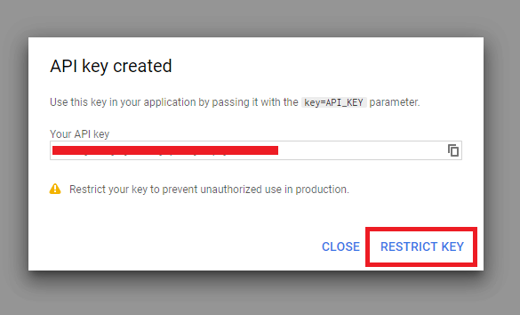

# Google's Geocoding API

> 📝 A sample of the `.env` file in our server project, after this lesson is complete, can be found - [here](https://gist.github.com/djirdehh/83c5fdf7f2837a84d8c4bd81224877a5).

We have a collection of listings stored persistently in our database. We've created the `/listing/:id` route in our client to allow users to view information about one certain listing at a time. We've also managed to create the capability for users to query for a list of listings that can be sorted based on listing price.

In this module, we'll focus on the functionality that will allow our users to search for listings **based on location**.

There are probably many ways to accomplish this. A very simple approach could be that we allow users to fill out a form and let our users provide values for a city, state, and country. In our database, we can try and have our listing documents contain some of this data and we can filter and find the correct listings based on user searches. This is a more a self-developed approach and there's a lot of questions to think about here - how do we handle spelling mistakes from users providing location information? How do we handle accepting information for many different regions in the world where certain regions may not have the concept of a state, province, etc?

We personally would want something a little more robust, like how [Airbnb](http://airbnb.com/) handles things. In the Airbnb website, there often exists an input field where the user can type a city, a state, a country or a combination of those, and the server will find listings _that best matches the user's input_.


> **Note:** Airbnb does provide searching capabilities in many different ways. We've just highlighted the more straightforward approach where a user can search for any location and results are shown based on that location.

Lucky for us, there is a perfect API that can help us achieve something like this. This where we'll use [**Google's Geocoding API**](https://developers.google.com/maps/documentation/geocoding/start).

### Google Geocoding API

[Google's Geocoding API](https://developers.google.com/maps/documentation/geocoding/start) is a service that provides **geocoding** and **reverse geocoding** of addresses. From the Google Geocoding API documentation:

- **Geocoding** is the process of converting addresses (like a street address) into geographic coordinates (like latitude and longitude), which you can use to place markers on a map or position the map.
- **Reverse geocoding** is the process of converting geographic coordinates into a human-readable address.

We're going to spend more time in the next lesson talking about how we'll want to use the API and what our proposed solution will be but we'll be attempting to _geocode_ location information. A user is to provide an address and Google's servers will respond with more information about the address including its latitude and longitude.

Here's an example geocoding response, for the address input of `"1600 Amphitheatre Parkway, Mountain View, CA",` that Google shows us in their [documentation](https://developers.google.com/maps/documentation/geocoding/start).

```json
// Sample response for address input of "1600 Amphitheatre Parkway, Mountain View, CA"
{
  "results": [
    {
      "address_components": [
        {
          "long_name": "1600",
          "short_name": "1600",
          "types": ["street_number"]
        },
        {
          "long_name": "Amphitheatre Parkway",
          "short_name": "Amphitheatre Pkwy",
          "types": ["route"]
        },
        {
          "long_name": "Mountain View",
          "short_name": "Mountain View",
          "types": ["locality", "political"]
        },
        {
          "long_name": "Santa Clara County",
          "short_name": "Santa Clara County",
          "types": ["administrative_area_level_2", "political"]
        },
        {
          "long_name": "California",
          "short_name": "CA",
          "types": ["administrative_area_level_1", "political"]
        },
        {
          "long_name": "United States",
          "short_name": "US",
          "types": ["country", "political"]
        },
        {
          "long_name": "94043",
          "short_name": "94043",
          "types": ["postal_code"]
        }
      ],
      "formatted_address": "1600 Amphitheatre Pkwy, Mountain View, CA 94043, USA",
      "geometry": {
        "location": {
          "lat": 37.4267861,
          "lng": -122.0806032
        },
        "location_type": "ROOFTOP",
        "viewport": {
          "northeast": {
            "lat": 37.4281350802915,
            "lng": -122.0792542197085
          },
          "southwest": {
            "lat": 37.4254371197085,
            "lng": -122.0819521802915
          }
        }
      },
      "place_id": "ChIJtYuu0V25j4ARwu5e4wwRYgE",
      "plus_code": {
        "compound_code": "CWC8+R3 Mountain View, California, United States",
        "global_code": "849VCWC8+R3"
      },
      "types": ["street_address"]
    }
  ],
  "status": "OK"
}
```

In the geocoding response, there's an `address_components` array within the `result` that contains specific information about the location's `street_number`, `route` (Amphitheatre Parkway), locality (which refers to the city or political entity) among other information that can't be derived from reading the original address input such as `administrative_area_level_2`, `postal_code`, etc.).

> Administrative area is the term used to convey the entities below the country level. Within the context of a country like the United States, `administrative_area_level_1` often refers to the state and `administrative_area_level_2` often refers to the county. The [Address Types and Address Component Types](https://developers.google.com/maps/documentation/geocoding/intro#Types) section of the Google Geocoding API documentation explains this some more.

We can also see more information being returned from the sample geocoding response above such as a `formatted_address` field, `latitude` and `longitude` of the location, etc. For our use case and how we intend on geocoding locations for our app, we'll primarily focus on the `address_components` section of the Geocoding API response. When a user searches for a location, we'll be interested in three things in particular:

- The `city` (which for the _most part_ comes from the `locality` field of `addressComponents`).
- The `admin` (i.e. `administrative_area_level_1`).
- The `country`.

Our `listing` documents in the `"listings"` collection of our database are to have the three fields - `city`, `admin`, and `country`. When a query is made for listings in a certain location, we'll look to find the `listing` documents with which these three fields match that of what we've found from the API.

We're going to spend more time talking about this in the next lesson. For now, let's look to enable Google's Geocoding API for us to use it in our application.

### Enable Google Geocoding API

To use Google's Geocoding API we'll have to activate it from our project's [Google Developer Console](https://console.developers.google.com). The APIs section of the console can be accessed at [console.developers.google.com/apis](https://console.developers.google.com).

When logged in, click the "**ENABLE APIS AND SERVICES**" link to head over to the API Library section (or visit <https://console.developers.google.com/apis/library> directly in the browser).


Next, search for "**Geocoding API**" and when found, click **ENABLE** to enable the API.


When the API is enabled, within the "**Geocoding API**" section, click on **CREDENTIALS** and then **Credentials in APIs & Services** to create a new credential for this API.


This will take us to the credentials section of the APIs in our console where we can create a new API Key.


When the new API Key is created, we'll restrict it so that it can only be used for the "**Geocoding API**".



When we look to restrict the API Key, we can rename our API key to something more meaningful and we'll name it "**Geocoding API**" so we know what it's going to being used for. We can keep the application restriction as none. If in the future we wanted to expand our app to the iOS or Google Play store, the API key will still work. We do, however, want to restrict the key to be for the Geocoding API only.


Perfect, we'll now have our Geocoding API key available to us.


Since we'll need this API Key in our application when we are to have requests be made in our app, we'll save the newly generated Geocoding API Key as an environment variable in our server application. In the `.env` file of our server project, we'll add a new environment variable we'll label `G_GEOCODE_KEY` and we'll provide the value we've obtained from our Google developer console.

```shell
G_GEOCODE_KEY=*****************************
```

#### Google Developer Console - Billing Information

As a quick note and before we close - we believe before you can start using the Google Maps Platform APIs and SDKs, you might have to create a billing account with your payment information in the Google Developer Console. This is documented and mentioned in the [Get Started with Google Maps Platform](https://developers.google.com/maps/gmp-get-started) documentation.

To add billing information, you'll need to head over to the [`/billing/`](https://console.developers.google.com/billing/) route of your project in the developer console with which you can provide your billing information.

We encourage you to provide your billing information if possible. If you're building the app locally and for development purposes, **it's highly unlikely your API keys are going to go to be used by a lot of people unless you share it with them**. The Geocoding API uses a [pay-as-you-go pricing model](https://developers.google.com/maps/documentation/geocoding/usage-and-billing) where it's summarized that it costs around `5$` _per_ 1000 requests (which is unlikely to be hit when experimenting and using the API Key locally).


With a Google Geocoding API Key now created and saved in our server environment configuration, in the next coming lessons, we'll begin updating our GraphQL fields such that we can return listings to a user based on the location address they search for.
