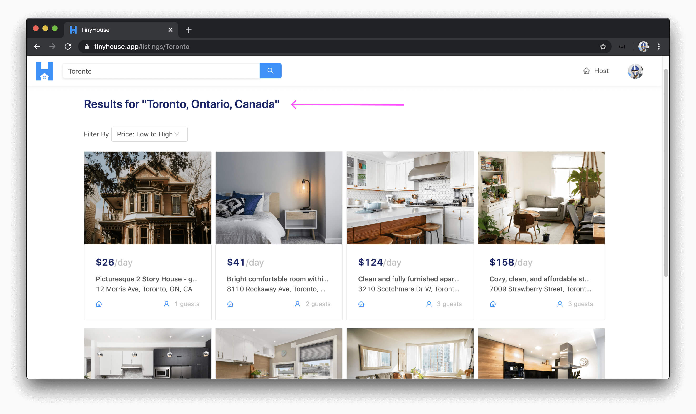

# Location-based searching for listings

> 📖 This lesson's lecture slides can be found - [here](./protected/lecture-slides.pdf).

In this lesson, we'll address the gameplan we have in mind in how we want to conduct location-based searching in our app. If a user was to search for a country (like Canada), all the listings in our application that are in Canada should be surfaced and shown in the listings page we'll create under the `/listings/:location?` route.


If a user was to search for a city like Toronto, all the listings in the city of Toronto should be surfaced and shown in the `/listings/:location?` route.


If a user was to search for a specific address, we _won't_ show listings only for that certain address but instead show listings for the _city_ in which the address pertains to. For example, if a user was to search for `"33 University Avenue"`, which is an address located in downtown Toronto, the listings for the city of Toronto will surface. The city is the smallest searchable unit for where we surface listings information.


With that said, how do we facilitate this location-based searching?

### `find()`

The listing documents in the `"listings"` collection of our database have three fields that will be used to help with our searching - `country`, `admin`, and `city`.

```typescript
// A document in the listings collection
{
  _id: ObjectId("5d378db94e84753160e08b30"),
  // ...
  country: "Canada",
  admin: "Ontario",
  city: "Toronto"
  // ...
}
```

The `listings()` resolver function uses the Node Mongo driver's [`find()`](https://docs.mongodb.com/manual/reference/method/db.collection.find/) method to get the collection of listings information that is to be returned. Since no filters or properties are defined within the query of this `find()`, MongoDB simply returns _everything_ from the `"listings"` collection.

```ts
let cursor = await db.listings.find({});
```

If we were to specify certain selection filters within the `find()` query, perhaps something like `country: "Canada"`, MongoDB will find all the documents where the document `country` field is equal to `"Canada"`.

```typescript
// Finding listings in a certain country
let cursor = await db.listings.find({
  country: "Canada"
});
```

If we were to add a filter for the `admin` field (e.g. `admin: "Ontario"`), we'll get all the listing documents where the `admin` is `"Ontario"`.

```typescript
// Finding listings in a certain administration
let cursor = await db.listings.find({
  admin: "Ontario"
});
```

If we specified a filter for the `city` (e.g. `city: "Toronto"`), we'll get all the documents where the `city` is `"Toronto"`.

```typescript
// Finding listings in a certain city
let cursor = await db.listings.find({
  city: "Toronto"
});
```

Lastly, if we wanted to filter documents in a more controlled manner, we can say we want to find listings where the listing `country` is equal to `"Canada"`, `admin` is `"Ontario"`, and `city` is `"Toronto"`. This will filter away any listing documents that are in Canada but don't have an `admin` of Ontario. It will further filter away listings that are in Canada and Ontario but aren't in the `city` of Toronto. In other words, MongoDB will return documents for where the `country`, `admin`, and `city` fields are `"Canada"`, `"Ontario"`, and `"Toronto"` respectively.

```typescript
// Finding listings in a specific country, admin, and city
let cursor = await db.listings.find({
  country: "Canada",
  admin: "Ontario",
  city: "Toronto"
});
```

We now have the first half of our gameplan in mind. When it comes to finding the correct listings in our database, we can apply the appropriate filters in our MongoDB `find()` query.

### Geocoding location input

When a user is to provide an input, whether it's an address, city, or just an administration area - how can we get more focused geographic information for this particular search? This is where we're going to use [Google's Geocoding API](https://developers.google.com/maps/documentation/geocoding/start) to help **geocode the search input** (i.e. convert the input provided to valid geographic information).

Let's take a look at the example response we saw in the last lesson from the [Google API Geocoding documentation](https://developers.google.com/maps/documentation/geocoding/start) for an address input of `"1600 Amphitheatre Parkway, Mountain View, CA"`.

```json
// Sample response for address input of "1600 Amphitheatre Parkway, Mountain View, CA"
{
  "results": [
    {
      "address_components": [
        {
          "long_name": "1600",
          "short_name": "1600",
          "types": ["street_number"]
        },
        {
          "long_name": "Amphitheatre Parkway",
          "short_name": "Amphitheatre Pkwy",
          "types": ["route"]
        },
        {
          "long_name": "Mountain View",
          "short_name": "Mountain View",
          "types": ["locality", "political"]
        },
        {
          "long_name": "Santa Clara County",
          "short_name": "Santa Clara County",
          "types": ["administrative_area_level_2", "political"]
        },
        {
          "long_name": "California",
          "short_name": "CA",
          "types": ["administrative_area_level_1", "political"]
        },
        {
          "long_name": "United States",
          "short_name": "US",
          "types": ["country", "political"]
        },
        {
          "long_name": "94043",
          "short_name": "94043",
          "types": ["postal_code"]
        }
      ],
      "formatted_address": "1600 Amphitheatre Pkwy, Mountain View, CA 94043, USA",
      "geometry": {
        "location": {
          "lat": 37.4267861,
          "lng": -122.0806032
        },
        "location_type": "ROOFTOP",
        "viewport": {
          "northeast": {
            "lat": 37.4281350802915,
            "lng": -122.0792542197085
          },
          "southwest": {
            "lat": 37.4254371197085,
            "lng": -122.0819521802915
          }
        }
      },
      "place_id": "ChIJtYuu0V25j4ARwu5e4wwRYgE",
      "plus_code": {
        "compound_code": "CWC8+R3 Mountain View, California, United States",
        "global_code": "849VCWC8+R3"
      },
      "types": ["street_address"]
    }
  ],
  "status": "OK"
}
```

From the results returned, we get `address_components` which summarize the components of the address in question. The `types` field within each address component is the _type_ of the returned geographic result. So here we see:

- `street_number` is `"1600"`.
- `route` is `"Amphitheatre Parkway"`.
- `locality` and `political` information refers to `"Mountain View"` (in this example, this can be recognized as the city).
- `administrative_area _1` tells us the state is in `"California"` and `administrative_area_2` tells us the county is `"Santa Clara"`.
- We get the `country` as `"United States"` and the `postal_code` of the address as `"94043"`.
- We also get other information such as the geometry (i.e. `latitude`/`longitude`) and a `formatted address` but our solution is mostly concerned with the `address_components` results.

With this information available to us, how would we map the appropriate address component type to the fields we have in our listing document? The geocoder often returns a large list of address components and we'll only need to access or use a few.

#### `country`

The `country` address component is the most straightforward one and is the highest location order returned from the geocoder. The `address_component` `type` label is `country` and everything we search for **has to have a country**.

To get the `country` of a location input, we'll simply map the `country` address component value from the result to the `country` field in our query.

#### `admin`

`administrative_area_level_1` from the geocoder indicates the first level entity _below_ country. In the US and Canada, this maps to the states and provinces of these countries respectively.

To get the `admin` of a location input, we'll simply map the `administrative_area_level_1` type value from the geocoder result to the `admin` field in our query.

#### `city`

To get the `city` of a location input is a little more tricky since the geocoder doesn't return an address component for a type labeled city. What it returns is often `locality` which indicates an incorporated city or town political entity. However, we've found the `locality` address component isn't provided for results for a few certain inputs but we've recognized in these cases, a `postal_town` field (which refers to a grouping of geographic areas such as locality) is often provided.

To get the `city` of a location input, we'll check if the `locality` address component exists from the API and if so we'll use that value for the city. If `locality` doesn't exist, we'll check for the `postal_town` value.

> For more information on each of the different types within the `address_components` array of the geocoder result, be sure to check the [Address Types and Address Component Types](https://developers.google.com/maps/documentation/geocoding/intro#Types) section of the Google Geocoding API documentation.

#### Conclusion

One important note to mention is that our query will depend on the fact that a country can be found from a location input. When a user searches for a certain location, we'll have to add a filter for at least the country field. If a country can't be found from the geocoder, it probably means the search was invalid and we'll throw an error.

However, if for some reason or another, we're unable to find the `admin` (i.e. `administrative_area_level_1`) or unable to find the `city` BUT the `country` value from the geocoder was returned → we'll only add the filter for the country and make the query.

Lastly, it will be important for the user to know what was recognized from their search. As an example, if the user searches for Toronto, we'll be explicit and tell the user the city, the admin, and the country that their search falls into. We'll have this information sent from the server to the client.



In the next lesson, we'll implement the solution we've talked about here in our server application!
