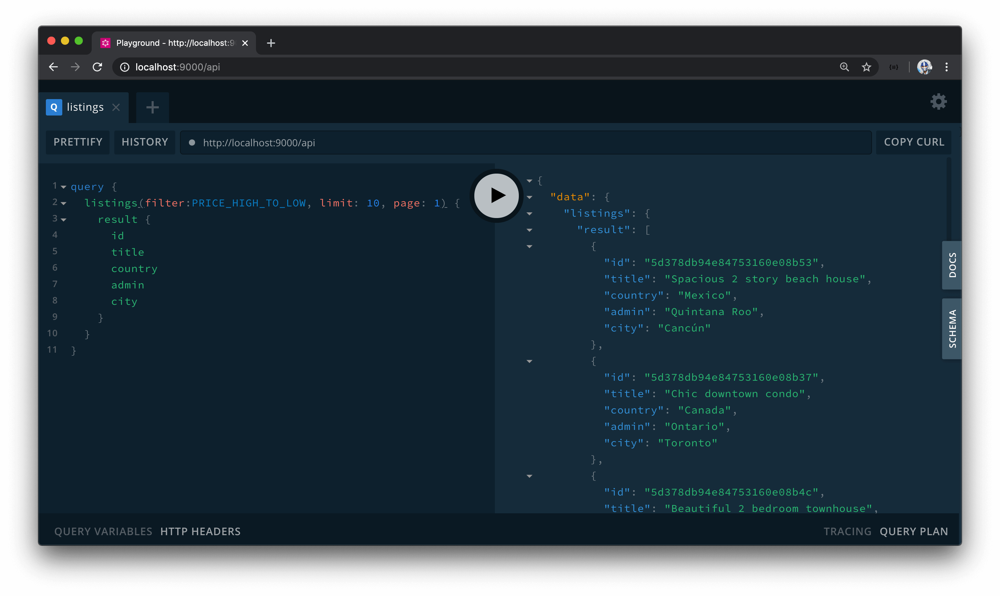
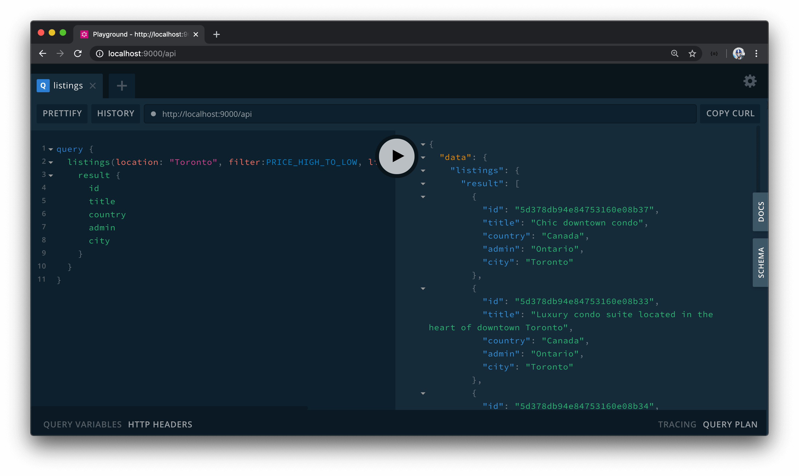
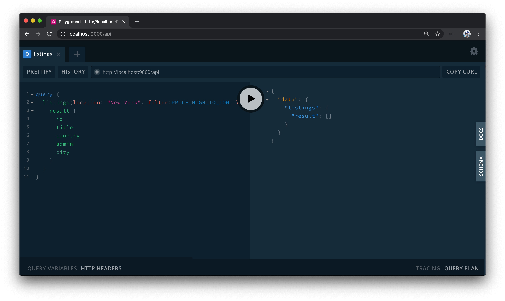
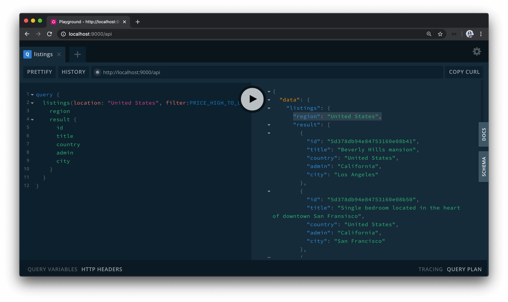
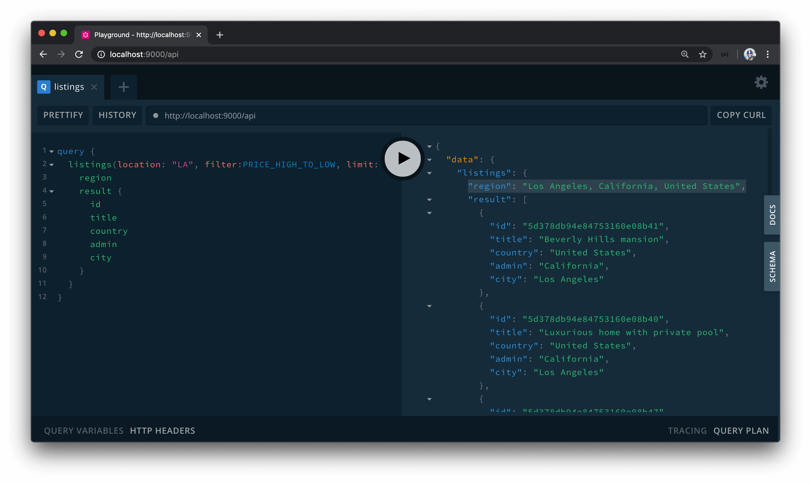

# Updating the listings resolver

In this lesson, we'll begin to write the code in our server project to help allow a user to search for listings in a certain **location**. We're going to modify the existing `listings` GraphQL query field to accept an optional `location` argument that when provided will return the listings that pertain only to that location.

To access Google's Geocoding API, we're going to use the [Node.js client for Google Maps Services](https://github.com/googlemaps/google-maps-services-js) which provides access to a list of different Maps APIs such as the [Directions API](https://developers.google.com/maps/documentation/directions/), [Elevation API](https://developers.google.com/maps/documentation/elevation/), and the one we're interested in - the [Geocoding API](https://developers.google.com/maps/documentation/geocoding/).

In our Node server project, we'll first install the Google Maps client.

    npm i @google/maps

Once installed, we'll install the community prepared typings at `@types/google__maps`.

    npm i -D @types/google__maps

With the Google Maps Node client available, we can begin to add geocoding functionality in our server project. We already have a `src/lib/api/Google.ts` file where we've instantiated our OAuth2 client and created the function necessary to log a user in and obtain the necessary OAuth token for a logged-in user. We'll use this same file to construct a new Maps client constructor as well and a function labeled `geocode()` where our `listings()` resolver function will call to obtain geographic information of that location.

First, we'll create our maps client under a constant we'll call `maps`. To do so, we'll need to run the `createClient()` function available to us from the `@google/maps` package. The argument we'll provide to the `createClient()` function is an options object where at the minimum we'll need to supply the API Key for our Geocoding API. We've already created the `G_GEOCODE_KEY` environment variable in our server project that references the Geocoding API Key we've created, so in our `createClient()` constructor options - we'll specify a `key` with the value of the `G_GEOCODE_KEY` environment variable with which we'll access with `process.env`.

```ts
// ...
import { createClient } from "@google/maps";

// ...

const maps = createClient({ key: `${process.env.G_GEOCODE_KEY}` });
```

The documentation tells us that to make this a `Promise` based solution, we can provide another key value in the options object denoted with `Promise`. In the `Promise` key option, we'll provide the actual [`Promise`](https://developer.mozilla.org/en-US/docs/Web/JavaScript/Reference/Global_Objects/Promise) object constructor as the value.

```ts
// ...
import { createClient } from "@google/maps";

// ...

const maps = createClient({ key: `${process.env.G_GEOCODE_KEY}`, Promise });
```

With our `maps` client constructed, we'll create the `geocode()` function property of the `Google` object in this file.

```ts
// ...

export const Google = {
  // ...
  geocode: async () => {}
};
```

For us to run the geocoding functionality and provide additional geographic information, we'll need access to the location provided from the client. With that said, we'll assume that location is to be passed into this function as a string and we'll call this location parameter `address`.

```ts
// ...

export const Google = {
  // ...
  geocode: async (address: string) => {}
};
```

With the `address` to be passed in and the constructed `maps` client available, we can run the `geocode` function available as part of the `maps` client constructor which accepts an options object that contains an address. To maintain a promise-based solution, the documentation tells us to chain a `asPromise()` function the `.geocode()` function as well.

```ts
// ...

export const Google = {
  // ...
  geocode: async (address: string) => {
    const res = await maps.geocode({ address }).asPromise();
  }
};
```

The response from the `geocode().asPromise()` function is the geocoding response from the API and it's the response that is to have the `address_components` array that we'll be interested in accessing. If this response was to ever fail, it could have a status code of either less than `200` or greater than `299`, so we can check for this and throw an error if ever to occur.

```ts
// ...

export const Google = {
  // ...
  geocode: async (address: string) => {
    const res = await maps.geocode({ address }).asPromise();

    if (res.status < 200 || res.status > 299) {
      throw new Error("failed to geocode address");
    }
  }
};
```

If the response is successful, we'll look to parse the `address_components` of the response to obtain information on the `country`, `admin`, and `city` of the address input. In the `geocode()` function within the `Google` object, we'll call another function we'll create shortly called `parseAddress()`, that will help parse the response from the Geocoding API, and we'll pass the `address_components` array from the response result.

```ts
export const Google = {
  // ...
  geocode: async (address: string) => {
    const res = await maps.geocode({ address }).asPromise();

    if (res.status < 200 || res.status > 299) {
      throw new Error("failed to geocode address");
    }

    return parseAddress(res.json.results[0].address_components);
  }
};
```

### `parseAddress()`

We'll now need to create the `parseAddress()` function and we'll create it above our `Google` object. We'll state that the `parseAddress()` function is to accept a parameter called `addressComponents`. We can define the shape of this parameter with an interface we can import from the typings of the `@google/maps` library called `AddressComponent`. The `AddressComponent` interface represents the shape of a single address component with which we'll say the `addressComponents` parameter of the function is to be an array of these components.

```ts
// ...
import { createClient, AddressComponent } from "@google/maps";

const parseAddress = (addressComponents: AddressComponent[]) => {};

export const Google = {
  // ...
};
```

In the `parseAddress()` function, we'll initialize three variables - `country`, `admin`, and `city` with `null` values. By the end of the function, we'll return an object that contains these three properties.

```ts
// ...

const parseAddress = (addressComponents: AddressComponent[]) => {
  let country = null;
  let admin = null;
  let city = null;

  return { country, admin, city };
};

export const Google = {
  // ...
};
```

Before the return statement of the `parseAddress()` function, we'll look through the `addressComponents` array and try and find values of the types that we can map to one of the properties we return. To loop through every item in the `addressComponents` array, we can use a [`for`](https://developer.mozilla.org/en-US/docs/Web/JavaScript/Guide/Loops_and_iteration#for_statement) loop for every component in `addressComponents`.

```ts
// ...

const parseAddress = (addressComponents: AddressComponent[]) => {
  let country = null;
  let admin = null;
  let city = null;

  for (const component of addressComponents) {
  }

  return { country, admin, city };
};

export const Google = {
  // ...
};
```

In the `for` loop, we'll check for `country` as a type in the `addressComponents` array. Since the `types` field of an iterated component from `addressComponents` is an array, we can check and see if the component `types` [includes](https://developer.mozilla.org/en-US/docs/Web/JavaScript/Reference/Global_Objects/Array/includes) `country`. If it does, we'll make the value of the `country` local variable to the value of the `long_name` property of the component.

```ts
// ...

const parseAddress = (addressComponents: AddressComponent[]) => {
  let country = null;
  let admin = null;
  let city = null;

  for (const component of addressComponents) {
    if (component.types.includes("country")) {
      country = component.long_name;
    }
  }

  return { country, admin, city };
};

export const Google = {
  // ...
};
```

> **Note:** Each address component has a `long_name` and `short_name` property. We'll be using the value of the `long_name` property for the fields we want to access.

We'll then try and map the component where the `types` includes `administration_area_level_1` to the value of the `admin` field in our function.

```ts
// ...

const parseAddress = (addressComponents: AddressComponent[]) => {
  let country = null;
  let admin = null;
  let city = null;

  for (const component of addressComponents) {
    if (component.types.includes("country")) {
      country = component.long_name;
    }

    if (component.types.includes("administrative_area_level_1")) {
      admin = component.long_name;
    }
  }

  return { country, admin, city };
};

export const Google = {
  // ...
};
```

For the `city`, we'll look for a component where the `types` includes the `locality` type OR the `postal_town` type.

```ts
const parseAddress = (addressComponents: AddressComponent[]) => {
  let country = null;
  let admin = null;
  let city = null;

  for (const component of addressComponents) {
    if (component.types.includes("country")) {
      country = component.long_name;
    }

    if (component.types.includes("administrative_area_level_1")) {
      admin = component.long_name;
    }

    if (component.types.includes("locality") || component.types.includes("postal_town")) {
      city = component.long_name;
    }
  }

  return { country, admin, city };
};
```

When our `listings()` resolver function now calls the `geocode()` function in our `Google` API object and passes a location parameter - it can expect `country`, `admin`, and `city` information for that location address to be returned.

### `listings()`

Let's now modify the GraphQL type definitions for the `listings` field to note that it can accept a `location` argument that is optional and is of the string type. We'll state the `location` field as optional since this `listings` field is to be used elsewhere in our app like the homepage where a location value isn't provided to get the highest-priced listings.

```ts
  type Query {
    authUrl: String!
    user(id: ID!): User!
    listing(id: ID!): Listing!
    listings(
      location: String
      filter: ListingsFilter!
      limit: Int!
      page: Int!
    ): Listings!
  }
```

We'll now modify the resolver function for the `listings` field in our `listingsResolver` map. First, we'll update the `ListingArgs` TypeScript interface in the `types.ts` file in our `src/resolvers/Listing/` folder to state that a location argument may exist which can be of type string or `null`.

```ts
export interface ListingsArgs {
  location: string | null;
  filter: ListingsFilter;
  limit: number;
  page: number;
}
```

In the `listings()` resolver function, we'll say `location` is now one of the arguments that can be passed in.

```ts
export const listingResolvers: IResolvers = {
  Query: {
    // ...,
    listings: async (
      _root: undefined,
      { location, filter, limit, page }: ListingsArgs,
      { db }: { db: Database }
    ): Promise<ListingsData> => {
      // ...
    }
  },
  Listing: {
    // ...
  }
};
```

In our `listings()` resolver, we'll construct an empty query object and pass that along to the MongoDB `find()` method we've established before to create the cursor.

```ts
export const listingResolvers: IResolvers = {
  Query: {
    // ...,
    listings: async (
      _root: undefined,
      { location, filter, limit, page }: ListingsArgs,
      { db }: { db: Database }
    ): Promise<ListingsData> => {
      const query = {};

      // ...

      let cursor = await db.listings.find(query);

      // ...
    }
  },
  Listing: {
    // ...
  }
};
```

In the function, we'll to check to see if the `location` parameter has a value. If it does, we'll run the `geocode()` function from our `Google` API object to get the city, admin, or country information for this location which we'll then populate our `query` object with.

First, let's use TypeScript to help define the shape of what this query constant can be. In the adjacent `types.ts` file, we'll create and export a `ListingsQuery` interface that can potentially have `country` , `admin`, and `city` fields all of type `string`.

```ts
export interface ListingsQuery {
  country?: string;
  admin?: string;
  city?: string;
}
```

In the `listingResolvers` map file, we'll import the `ListingsQuery` interface and define the shape of the query constant we've set up with it.

```ts
// ...
import {
  // ...,
  ListingsQuery
} from "./types";

export const listingResolvers: IResolvers = {
  Query: {
    // ...,
    listings: async (
      _root: undefined,
      { location, filter, limit, page }: ListingsArgs,
      { db }: { db: Database }
    ): Promise<ListingsData> => {
      const query: ListingsQuery = {};

      // ...

      let cursor = await db.listings.find(query);

      // ...
    }
  },
  Listing: {
    // ...
  }
};
```

In addition, we'll import the `Google` object in our `src/lib/api/` since we'll need it to run the `geocode()` function we've prepared.

```ts
import { Google } from "../../../lib/api";
```

In our `listings()` resolver, we'll check if the `location` argument exists and if it does we'll run the `Google` `geocode()` method and pass in the `location` value. From the returned result of the `geocode()` function, we'll look to destruct the `country`, `admin`, and `city` properties.

```ts
// ...

export const listingResolvers: IResolvers = {
  Query: {
    // ...,
    listings: async (
      _root: undefined,
      { location, filter, limit, page }: ListingsArgs,
      { db }: { db: Database }
    ): Promise<ListingsData> => {
      const query: ListingsQuery = {};

      // ...

      if (location) {
        const { country, admin, city } = await Google.geocode(location);
      }

      let cursor = await db.listings.find(query);

      // ...
    }
  },
  Listing: {
    // ...
  }
};
```

Here's where we'll check the values of what our `geocode()` function was able to return. If `city` exists, we'll set it as the `city` property of our query. If `admin` exists, we'll set it as the `admin` property of the query. If `country` exists, we'll set it as the `country` property of our query.

However, if `country` doesn't exist, it probably means the search didn't go well since everything we search for should have a country associated with it so we'll throw an error that says something like `"no country found"`.

```ts
// ...

export const listingResolvers: IResolvers = {
  Query: {
    // ...,
    listings: async (
      _root: undefined,
      { location, filter, limit, page }: ListingsArgs,
      { db }: { db: Database }
    ): Promise<ListingsData> => {
      const query: ListingsQuery = {};

      // ...

      if (location) {
        const { country, admin, city } = await Google.geocode(location);

        if (city) query.city = city;
        if (admin) query.admin = admin;
        if (country) {
          query.country = country;
        } else {
          throw new Error("no country found");
        }
      }

      let cursor = await db.listings.find(query);

      // ...
    }
  },
  Listing: {
    // ...
  }
};
```

Let's now give what we've done a try. We'll head over to GraphQL Playground and attempt to query the `listings` field. We'll say we want our `listings` ordered from `PRICE_HIGH_TO_LOW`, be limited to 10 items, and be on the first page of results. In our returned `result` output, we'll try and get `id`, `title`, `city`, `admin`, and `country` of each listing.

```gql
query {
  listings(filter: PRICE_HIGH_TO_LOW, limit: 10, page: 1) {
    result {
      id
      title
      country
      admin
      city
    }
  }
}
```


We'll see an error in GraphQL Playground that tells us the `country` field isn't part of the `Listing` GraphQL object. `country`, `admin`, `city` are part of our TypeScript definitions and mock data for listings in our `"listings"` collection. We'll need to update the definition of our GraphQL `Listing` object to contain the `country`, `admin`, and `city` fields to all be of type string.

```ts
  type Listing {
    id: ID!
    title: String!
    description: String!
    image: String!
    host: User!
    type: ListingType!
    address: String!
    country: String!
    admin: String!
    city: String!
    bookings(limit: Int!, page: Int!): Bookings
    bookingsIndex: String!
    price: Int!
    numOfGuests: Int!
  }
```

If we head back to GraphQL Playground and make our query now - we'll get a bunch of different listings from different locations in the world.



Let's add a `location` argument to our query with a string value of `"Toronto"`.

    query {
      listings(location: "Toronto", filter:PRICE_HIGH_TO_LOW, limit: 10, page: 1) {
        result {
          id
          title
          country
          admin
          city
        }
      }
    }

When we now run our query, all listings data returned to us is in Toronto, Canada!



If we were to provide a location of `"Los Angeles"`, we'll get listings from the region of Los Angeles.


If we provide a location argument value of a country, like `"United States"`, we'll get listings for Los Angeles and San Fransisco!


If we provide a location to our query where we don't have any listings for in our database, like `"New York"`, we'll get an empty result array.



### Geocoder result

So far so good! At this moment, however, when the client is to make the request to the server for listings in a certain location, it won't know what the geocoder was able to note as the location. If a user searches for `"United States"`, we'll want to convey that we're looking for listings all over the United States. If a user searches for `"Los Angeles"`, we'll want to convey we're looking for listings in Los Angeles, California, United States.

To help us here, we can return an interpolated string message from the server that simply contains the city, admin, and country that was recognized from our geocoder. In our GraphQL type definitions, we'll say the `Listings` GraphQL object is to contain a `region` field of type string and is to be optional. We'll mark the `region` field as optional since we expect a value of `region` to exist only if a `location` argument value is provided.

```ts
  type Listings {
    region: String
    total: Int!
    result: [Listing!]!
  }
```

In the TypeScript `types.ts` file for our `listingResolvers` map (in the `src/graphql/resolvers/Listing/types.ts` file), we'll update the `ListingsData` interface to have a `region` property of type `string` or `null`.

```ts
export interface ListingsData {
  region: string | null;
  total: number;
  result: Listing[];
}
```

In the `listings()` resolver function, we'll update the initial value of the `data` object with a region of `null`.

```ts
        const data: ListingsData = {
          region: null,
          total: 0,
          result: []
        };
```

If the `location` argument value exists in the `listings()` resolver, we'll try and create an interpolated string that contains the `city`, `admin`, and `country` values from the geocoder. Since the `city` and `admin` fields from the geocoder may not always be found, we'll construct text constants for city and admin and state that if they're found they'll be string values of what they are, followed by a `", "` string. We'll then state the `region` property of the `data` object that is to be returned is an interpolation of the found `city`, `admin`, and `country`. With this implemented, the `listings()` resolver function in its entirety will look as follows:

```ts
    listings: async (
      _root: undefined,
      { location, filter, limit, page }: ListingsArgs,
      { db }: { db: Database }
    ): Promise<ListingsData> => {
      try {
        const query: ListingsQuery = {};
        const data: ListingsData = {
          region: null,
          total: 0,
          result: []
        };

        if (location) {
          const { country, admin, city } = await Google.geocode(location);

          if (city) query.city = city;
          if (admin) query.admin = admin;
          if (country) {
            query.country = country;
          } else {
            throw new Error("no country found");
          }

          const cityText = city ? `${city}, ` : "";
          const adminText = admin ? `${admin}, ` : "";
          data.region = `${cityText}${adminText}${country}`;
        }

        let cursor = await db.listings.find(query);

        if (filter && filter === ListingsFilter.PRICE_LOW_TO_HIGH) {
          cursor = cursor.sort({ price: 1 });
        }

        if (filter && filter === ListingsFilter.PRICE_HIGH_TO_LOW) {
          cursor = cursor.sort({ price: -1 });
        }

        cursor = cursor.skip(page > 0 ? (page - 1) * limit : 0);
        cursor = cursor.limit(limit);

        data.total = await cursor.count();
        data.result = await cursor.toArray();

        return data;
      } catch (error) {
        throw new Error(`Failed to query listings: ${error}`);
      }
    }
```

If we now make our queries again in the GraphQL Playground, we'll see if the `region` of the returned `data` is returned as expected. We'll specify `region` is another field we expect to be queried and we'll first query for listings in `"United States"`.



If we searched for listings for the location of `"LA"` (shorthand for Los Angeles), the `region` returned from our API will have a value of `"Los Angeles, California, United States"`!



That's it! In the next coming lesson, we'll have our client now make the query and show the results for certain locations within the page shown in the `/listings/:location?` route.
