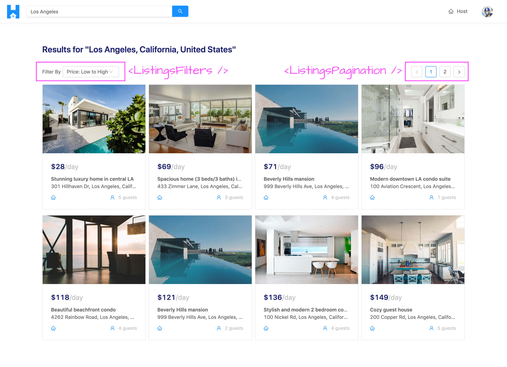
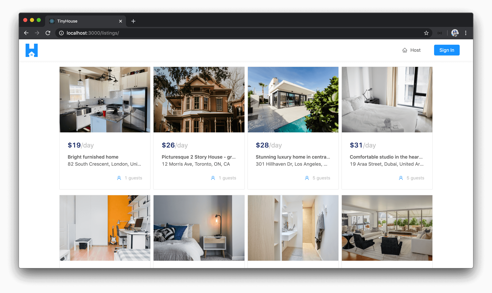
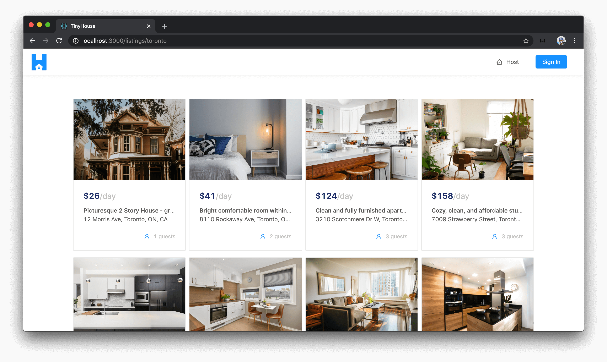
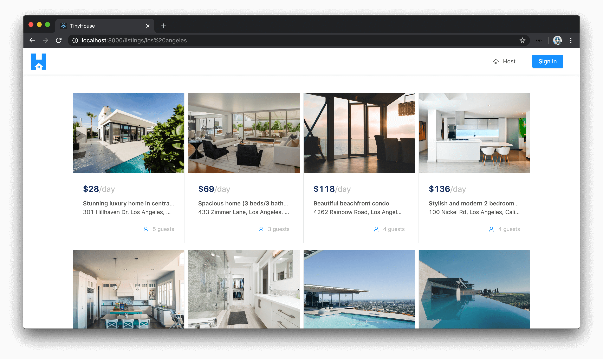
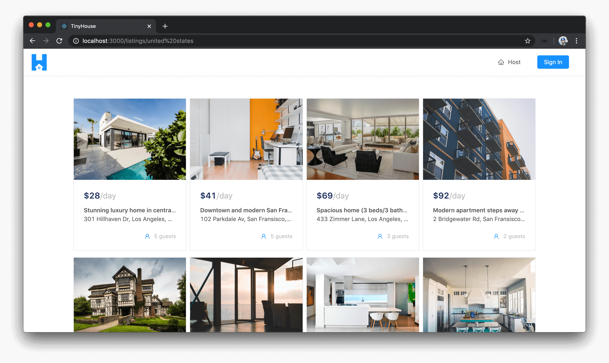
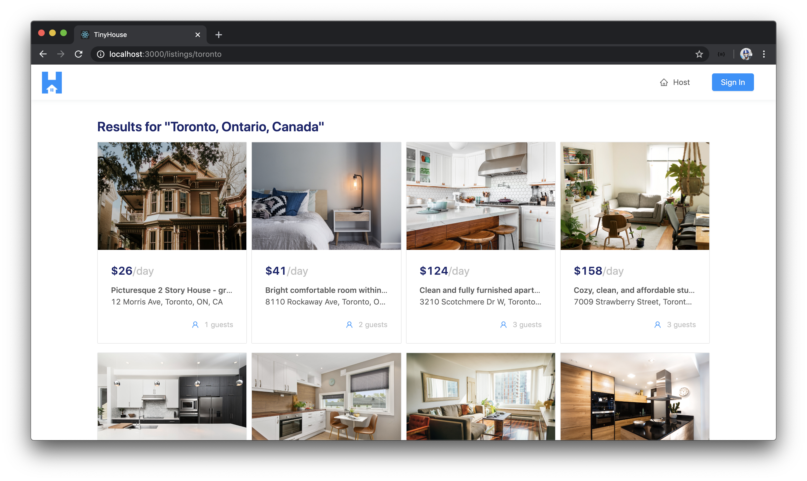
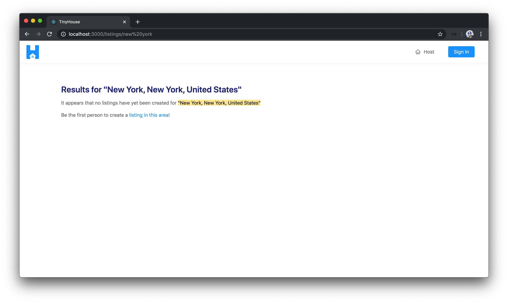

# Building the Listings page

With our `listings` field in our GraphQL API prepared to accept a `location` argument, we'll begin to work on the client app to build the `/listings/:location?` page for where certain listings can be shown for specific locations.

The `/listings/:location?` page isn't going to be very difficult to build but there will be a few things we'll need to think about and handle. When data is available, we'll look to show up to eight listing cards at a time for the listings that have been queried. We already have a component created labeled `<ListingsCard/>` that will be used to show the card previews for each listing.

The two children components we'll create when data is available are the `<ListingsFilters />` and `<ListingsPagination />` components. Both of these child components will have very little markup but will contain functionality that affects the information that is to be shown on the parent listings page. When we pick a certain filter, we'll be able to have our listings be sorted either from a high to low price or a low to high price. The pagination element will allow us to move from page to page where every page is to have at most eight listings.



We'll build all of this step by step. The first thing we'll attempt to do is make the `listings` query from the `/listings/:location?` page in our app and show the first page of listings with the `<ListingCard />` components. Once we make the query and everything is shown, we'll then see how the query can return different results when we provide a different location.

### Listings query

In the `<Listings />` section component in our `src/sections/Listings/index.tsx` file, we'll import a few things we'll need to get started with.

- We'll import the `useQuery` Hook from React Apollo.
- We'll import the `<Layout />` and `<List />` components from Ant Design.
- We'll import the `<ListingCard />` component from the `src/lib/components/` folder that we'll use to show each listing card.
- We'll import the `LISTINGS` GraphQL query document and the autogenerated TypeScript definitions for the data and variables for the `LISTINGS` query.
- And we'll import the autogenerated `ListingsFilter` Enum from the globalTypes file kept in the `src/lib/graphql/` folder.

```tsx
import React from "react";
import { useQuery } from "@apollo/react-hooks";
import { Layout, List } from "antd";
import { ListingCard } from "../../lib/components";
import { LISTINGS } from "../../lib/graphql/queries";
import {
  Listings as ListingsData,
  ListingsVariables
} from "../../lib/graphql/queries/Listings/generated/Listings";
import { ListingsFilter } from "../../lib/graphql/globalTypes";
```

We'll destruct Ant Designs `<Content />` component from `<Layout />` and we'll create a constant to reference the limit of the number of listings we want to show in a page. We'll call this constant `PAGE_LIMIT` and provide a value of `8`.

```tsx
import React from "react";
import { useQuery } from "@apollo/react-hooks";
import { Layout, List } from "antd";
import { ListingCard } from "../../lib/components";
import { LISTINGS } from "../../lib/graphql/queries";
import {
  Listings as ListingsData,
  ListingsVariables
} from "../../lib/graphql/queries/Listings/generated/Listings";
import { ListingsFilter } from "../../lib/graphql/globalTypes";

const { Content } = Layout;
const PAGE_LIMIT = 8;

export const Listings = () => {
  // ...
};
```

In our `<Listings/>` component function, we'll use the `useQuery` Hook to query for the `listings` field. In our `useQuery` Hook declaration, we'll pass the appropriate TypeScript interfaces for data and variables. For the values of the variables the query expects, we'll specify the `filter` to have the `"PRICE_LOW_TO_HIGH"` value from the `ListingsFilter` Enum, we'll use the `PAGE_LIMIT` constant for the `limit` variable, and for page number we'll provide a value of `1` for now.

At this moment, we'll only destruct the `data` object from the query result.

```tsx
// ...

export const Listings = () => {
  const { data } = useQuery<ListingsData, ListingsVariables>(LISTINGS, {
    variables: {
      filter: ListingsFilter.PRICE_LOW_TO_HIGH,
      limit: PAGE_LIMIT,
      page: 1
    }
  });

  // ...
};
```

> **Note:** We're initializing the `filter` variable with the `"PRICE_LOW_TO_HIGH"` value and the `page` variable with a value of `1` since that is the default setting we'll want the user to see when they first land on the page. When we build the filter and pagination capability, we'll have values for the `filter` and `page` variables as part of component state that changes based on user action.

When data is available from our query, we'll look to obtain the `listings` field from `data` and assign it to a `listings` constant.

```tsx
// ...

export const Listings = () => {
  const { data } = useQuery<ListingsData, ListingsVariables>(LISTINGS, {
    variables: {
      filter: ListingsFilter.PRICE_LOW_TO_HIGH,
      limit: PAGE_LIMIT,
      page: 1
    }
  });

  const listings = data ? data.listings : null;

  // ...
};
```

We'll then look to construct a React element in a constant labeled `listingsSectionElement` that will be the list of listings we'll build with the help of Ant Design's `<List />` component. This list will be very similar to the lists we've created in the Home and User pages. We'll specify a gutter of around `8` units and we'll want `4` cards to be shown for the entire width in large viewports, `2` in small viewports and `1` in extra-small viewports. The source of data for the list will be the result array within the `listings` field and in the `renderItem()` function of the `<List />` component, we'll render the `<ListingCard />` component for each list item and pass the iterated `listing` object down.

```tsx
// ...

export const Listings = () => {
  const { data } = useQuery<ListingsData, ListingsVariables>(LISTINGS, {
    variables: {
      filter: ListingsFilter.PRICE_LOW_TO_HIGH,
      limit: PAGE_LIMIT,
      page: 1
    }
  });

  const listings = data ? data.listings : null;

  const listingsSectionElement = listings ? (
    <List
      grid={{
        gutter: 8,
        xs: 1,
        sm: 2,
        lg: 4
      }}
      dataSource={listings.result}
      renderItem={listing => (
        <List.Item>
          <ListingCard listing={listing} />
        </List.Item>
      )}
    />
  ) : null;

  // ...
};
```

In our component return statement, we'll return the `<Content />` component and within we'll place the `listingsSectionElement`.

```tsx
// ...

export const Listings = () => {
  const { data } = useQuery<ListingsData, ListingsVariables>(LISTINGS, {
    variables: {
      filter: ListingsFilter.PRICE_LOW_TO_HIGH,
      limit: PAGE_LIMIT,
      page: 1
    }
  });

  const listings = data ? data.listings : null;

  const listingsSectionElement = listings ? (
    <List
      grid={{
        gutter: 8,
        xs: 1,
        sm: 2,
        lg: 4
      }}
      dataSource={listings.result}
      renderItem={listing => (
        <List.Item>
          <ListingCard listing={listing} />
        </List.Item>
      )}
    />
  ) : null;

  return <Content className="listings">{listingsSectionElement}</Content>;
};
```

When we take a look at the listings page in the `/listings` route of our application, we'll see eight different listing cards be shown to us!



### Listings query with location

Though this works great, our intention for the listings page in our client is to help **show listings for a certain location**. To tackle this, the first thing we'll do is specify that the `listings` query in the GraphQL document within `src/lib/graphql/queries/Listings/index.ts` can take an optional `location` argument of type `String`.

```ts
import { gql } from "apollo-boost";

export const LISTINGS = gql`
  query Listings($location: String, $filter: ListingsFilter!, $limit: Int!, $page: Int!) {
    listings(location: $location, filter: $filter, limit: $limit, page: $page) {
      result {
        id
        title
        image
        address
        price
        numOfGuests
      }
    }
  }
`;
```

We'll want to autogenerate the TypeScript definitions regarding this query since we're now saying a new argument can be passed in. Since we've also made some small changes to the GraphQL API schema in the last lesson we'll first run the `codegen:schema` command, in our client project, to generate the schema json available in our client.

```shell
npm run codegen:schema
```

When that's complete, we'll run the `codegen:generate` command to regenerate our GraphQL related typings.

```shell
npm run codegen:generate
```

With our `listings` GraphQL query ready to accept a `location` argument when provided, we'll need to pass it from our `<Listings />` component. The location the user is interested in searching for will be derived from the URL parameter in the route. When a user enters a location in the search bar on the home page or in the search bar in the app header, we're simply just going to take them straight to the `/listings/:location?` page. In the `<Listings />` component where we make our query, we'll simply need to derive the value of the `location` URL parameter.

We'll first import `RouteComponentProps` from `react-router-dom` which we'll use to describe the shape of the `match` props in our component.

```tsx
// ...
import { RouteComponentProps } from "react-router-dom";
// ...
```

We'll declare an interface called `MatchParams` to dictate the `location` param in our route which is of type `string`.

```tsx
interface MatchParams {
  location: string;
}
```

We'll declare the `match` object as a prop of our component and we'll use `RouteComponentProps` to describe the shape of our component. `RouteComponentProps` is a generic so we'll pass the `MatchParams` interface within which helps tell our component that the `match.params` field will have a `location` of type string.

```tsx
export const Listings = ({ match }: RouteComponentProps<MatchParams>) => {
  // ...
};
```

With the `match` object available in our component, let's now provide a `location` variable to our query and say the value is `match.params.location`.

```tsx
const { data } = useQuery<ListingsData, ListingsVariables>(LISTINGS, {
  variables: {
    location: match.params.location,
    filter: ListingsFilter.PRICE_LOW_TO_HIGH,
    limit: PAGE_LIMIT,
    page: 1
  }
});
```

> React Router has now introduced Hooks! Be sure to check out the **React Router Hooks** video in **Module 15** of the course to highlight how the above can be done with Hooks.

Let's see how our `/listings/:location?` page now behaves. When we don't provide a URL parameter, we'll be presented with listings for a variety of different locations. However, if we now try to go to the `/listings/toronto` route, the listings returned to us will only be located in Toronto!



If we instead visit the `/listings/los%20angeles` route in our browser, we'll only get listings in Los Angeles.



If we visit the `/listings/united%20states` route, we'll get listings from both Los Angeles and San Fransisco!



There are a few more things we'll take care of before we close this lesson.

### Listings query and region

The first small thing we'll tackle is conveying to the user what location they're searching for. We've added a `region` field in our `Listings` GraphQL Object that is populated with the `region` the geocoder determines based on the location/address input. With that said, in our Listings GraphQL document, we'll add a `region` field in our query.

```tsx
export const LISTINGS = gql`
  query Listings($location: String, $filter: ListingsFilter!, $limit: Int!, $page: Int!) {
    listings(location: $location, filter: $filter, limit: $limit, page: $page) {
      region
      result {
        id
        title
        image
        address
        price
        numOfGuests
      }
    }
  }
`;
```

Since we've added a new field to query, we'll regenerate our GraphQL related TypeScript definitions in our client project.

```shell
npm run codegen:generate
```

In our `<Listings />` component, when data is available, we'll try and grab the `region` from the `listings` field and have it as the value of a `listingsRegion` constant. When `data` isn't there, `listingsRegion` will be `null`.

```tsx
// ...

export const Listings = () => {
  const { data } = useQuery<ListingsData, ListingsVariables>(LISTINGS, {
    variables: {
      filter: ListingsFilter.PRICE_LOW_TO_HIGH,
      limit: PAGE_LIMIT,
      page: 1
    }
  });

  const listings = data ? data.listings : null;
  const listingsRegion = listings ? listings.region : null;

  // ...
};
```

We'll then create a constant element called `listingsRegionElement` that when the `listingsRegion` constant exists will be a `<Title />` component from Ant Design that simply says `"Results for "{listingRegion}"`. We'll have to import the `<Typography />` component from Ant Design as well and destruct the `<Title />` sub component from `<Typography />`. Finally, we'll place the `listingsRegionElement` right before the `listingsSectionElement` in our `<Listings />` component return statement.

```tsx
import { Layout, List, Typography } from "antd";

// ...

const { Title } = Typography;

// ...

export const Listings = () => {
  const { data } = useQuery<ListingsData, ListingsVariables>(LISTINGS, {
    variables: {
      filter: ListingsFilter.PRICE_LOW_TO_HIGH,
      limit: PAGE_LIMIT,
      page: 1
    }
  });

  const listings = data ? data.listings : null;
  const listingsRegion = listings ? listings.region : null;

  // ...

  const listingsRegionElement = listingsRegion ? (
    <Title level={3} className="listings__title">
      Results for "{listingsRegion}"
    </Title>
  ) : null;

  return (
    <Content className="listings">
      {listingsRegionElement}
      {listingsSectionElement}
    </Content>
  );
};
```

When we visit a valid `/listings/location?` route in our app, we'll now see the region that was returned from our geocoder be presented to us!



### Listings query with no data

The last thing we'll look to tackle is to provide some text information to the user when no data exists from a query made for listings. In the information we tell the user, we can convey to the user that they can go to the `/host` route of our app to create a new listing.

In the `listingsSectionElement` constant within the `<Listings />` component, we won't only check if `listings` data is available but we'll also check for the length of the `results` array from our listings object. If the `results` array is empty, it means there are no listings so we won't show the entire `<List />` component. Instead, we'll show a `<div />` element that has a paragraph that says `"It appears that no listings have yet been created for this region"`. We'll have another paragraph and say something along the lines of `"Be the first person to create a listing in this area"` where we'll make a portion of that a link that will take the user to the `/host` route when clicked.

With the above change implemented and all the changes we've made, the `src/sections/Listings/index.tsx` file will look like the following:

```tsx
import React from "react";
import { Link, RouteComponentProps } from "react-router-dom";
import { useQuery } from "@apollo/react-hooks";
import { Layout, List, Typography } from "antd";
import { ListingCard } from "../../lib/components";
import { LISTINGS } from "../../lib/graphql/queries";
import {
  Listings as ListingsData,
  ListingsVariables
} from "../../lib/graphql/queries/Listings/__generated__/Listings";
import { ListingsFilter } from "../../lib/graphql/globalTypes";

interface MatchParams {
  location: string;
}

const { Content } = Layout;
const { Paragraph, Text, Title } = Typography;

const PAGE_LIMIT = 8;

export const Listings = ({ match }: RouteComponentProps<MatchParams>) => {
  const { data } = useQuery<ListingsData, ListingsVariables>(LISTINGS, {
    variables: {
      location: match.params.location,
      filter: ListingsFilter.PRICE_LOW_TO_HIGH,
      limit: PAGE_LIMIT,
      page: 1
    }
  });

  const listings = data ? data.listings : null;
  const listingsRegion = listings ? listings.region : null;

  const listingsSectionElement =
    listings && listings.result.length ? (
      <List
        grid={{
          gutter: 8,
          xs: 1,
          sm: 2,
          lg: 4
        }}
        dataSource={listings.result}
        renderItem={listing => (
          <List.Item>
            <ListingCard listing={listing} />
          </List.Item>
        )}
      />
    ) : (
      <div>
        <Paragraph>
          It appears that no listings have yet been created for{" "}
          <Text mark>"{listingsRegion}"</Text>
        </Paragraph>
        <Paragraph>
          Be the first person to create a <Link to="/host">listing in this area</Link>!
        </Paragraph>
      </div>
    );

  const listingsRegionElement = listingsRegion ? (
    <Title level={3} className="listings__title">
      Results for "{listingsRegion}"
    </Title>
  ) : null;

  return (
    <Content className="listings">
      {listingsRegionElement}
      {listingsSectionElement}
    </Content>
  );
};
```

If we were to now attempt to query for listings where listing data doesn't exist in our database, we'll see a message being shown to us that says `"It appears no listings have yet been created..."`.



Awesome! We don't currently handle for when the `listings` query is loading or has errored. We'll look to handle this and the capability to change filters and paginate within the `/listings/:location?` page in the next coming lessons.
