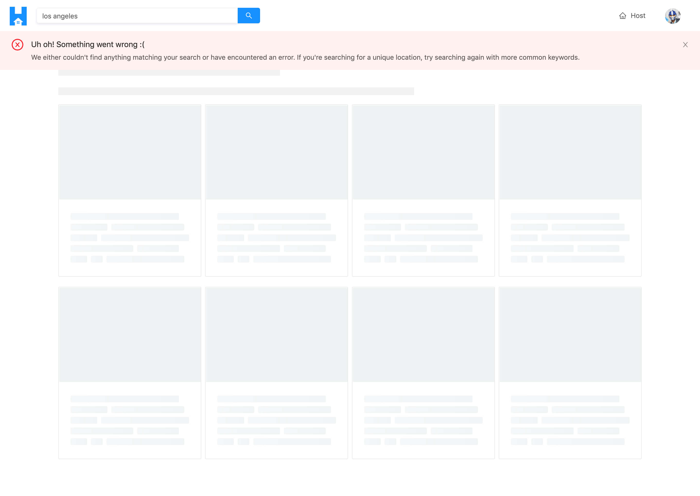

# Pagination & Filtering in the Listings page

> 📝 The `listing-loading-card-cover.jpg` image asset used in this lesson can be found - [here](./public/assets/listing-loading-card-cover.jpg).

In the last lesson, we were able to build the page displayed in the `/listings/location?` route and show up to eight different listing cards for listings that exist in certain locations.

There are still a few things left for us to do on this page. We mentioned earlier that we're interested in allowing a user to filter listings from one of two ways - whether it's to see listings sorted from the lowest price to the highest price OR to see listings sorted from the highest price to the lowest price.

We also want to give the user the capability to move from page to page. We only show a maximum of eight listings per page and if more is to exist for a certain location, we'll like the user to be able to move to the next page. If there is to be only a single page of listings, we'll avoid showing the pagination section.

Both the filter section and the pagination section within the `/listing/:location?` page are to be components of their own. The markup for these components will be small but depending on the user action conducted on these components, a re-query for new data will be made to show a new set of listings.


Some other things we'll want to take care of is appropriate UI for when the query is loading or when the query might have completely errored. When the query is loading, we could use the shared `<PageSkeleton />` component we've built for some of the other pages in our app. However, for this particular page, we'll go the extra step and look to create a custom loading page that tells the user what the perceived UI would be. The loading state will essentially be a grid of eight cards that resemble that they're all in the "loading" state. Very similar to how we've done it on the homepage except we'll be showing eight cards. instead of four. This will be a `<ListingsSkeleton />` component that we'll create.


Lastly, if an error was to ever occur when the query in the `/listings/:location?` page is made, we'll show the `<ListingsSkeleton />` component and we'll display an `<ErrorBanner/ >` at the top to say `"We either couldn't find anything matching your search or have encountered an error. If you're searching for a unique location, try searching again with more common keywords"`. In this case, we tell the user to conduct the action of trying to search for a more unique location just in case they've tried to search for a location and the geocoder isn't able to derive location information when it should have been found.



We'll take this step by step. The first few things we'll tackle are the filtering and pagination capabilities.

### `<ListingsFilter />`

The `listings` query in our GraphQL API accepts a `filter` variable that dictates how the listings are going to be sorted. At this moment in time, we've simply provided a value of `"PRICE_LOW_TO_HIGH"` from the `ListingsFilter` Enum when we make the query in the `<Listings />` component. If we want to give the user the option to control how the listings are going to be shown and sorted, we'll need to have them be able to control the value we pass in this `filter` variable in our query. Because of this, we'll keep the value as part of component state.

In the `src/sections/Listings/index.tsx` file, we'll import the `useState` Hook from React.

```tsx
import React, { useState } from "react";
```

In the `<Listings />` component, we'll use the `useState` Hook to initialize a state variable we'll call `filter`. We'll also destruct a function that can be used to update the filter state variable which we'll call `setFilter()`. We'll state that the initial value of the `filter` state variable will be the `"PRICE_LOW_TO_HIGH"` value in our `ListingsFilter` Enum. We'll then update the `filter` variable in our query to take the `filter` state variable as its value.

```tsx
// ...

export const Listings = ({ match }: RouteComponentProps<MatchParams>) => {
  const [filter, setFilter] = useState(ListingsFilter.PRICE_LOW_TO_HIGH);
  const { data } = useQuery<ListingsData, ListingsVariables>(LISTINGS, {
    variables: {
      location: match.params.location,
      filter,
      limit: PAGE_LIMIT,
      page: 1
    }
  });

  // ...
};
```

We'll now look to create a component called `<ListingsFilters />` that will accept the `filter` state variable and the `setFilter()` function and will have the markup for the select dropdown that the user can use to change how the listings in the `/listings/:location?` page is sorted. We'll create this `<ListingsFilter />` component before we import it and use it in the `<Listings />` component. We'll create a `ListingsFilters/` folder in the `components/` folder within the `src/sections/Listings/` directory that is to have an `index.tsx` file. We'll also create an `index.ts` file in the `src/sections/Listings/components/` folder.

```shell
client/
  // ...
  src/
    // ...
    sections/
      // ...
      Listings/
        components/
          ListingsFilters/
            index.tsx
        index.ts
      // ...
  // ...
```

In the `src/sections/Listings/components/index.ts` file, we'll re-export the soon to be created `<ListingsFilters />` component.

```ts
export * from "./ListingsFilters";
```

The markup for the `<ListingsFilters />` component will be very small and will mostly consist of the [`<Select />`](https://ant.design/components/select/) dropdown that we'll use from Ant Design. With Ant Design's [`<Select />`](https://ant.design/components/select/) component, we'll be able to show a select dropdown which accepts a `value` prop that determines what the selected value is. Within the select dropdown, we can declare the `<Select.Option />` sub-components that convey each potential option and will have a value attached to them. Finally, there'll be an `onChange()` prop function in the select dropdown that will trigger a callback function that we'll use to update the state value.

In the `<ListingsFilter />` component file, we'll import the React library and the `<Select />` dropdown from Ant Design. We'll also import the `ListingsFilter` Enum from the `src/lib/graphql/globalTypes.ts` file with which we'll use to dictate the value of each option in the select dropdown.

```tsx
import React from "react";
import { Select } from "antd";
import { ListingsFilter } from "../../../../lib/graphql/globalTypes";
```

We'll declare the shape of `Props` that this component can expect. We'll want this component to accept the actual `filter` state variable from the parent which is of type `ListingsFilter` and a `setFilter()` function which can be used to update the filter variable and will take a new `filter` value argument of type `ListingsFilter` and will return void.

We'll also destruct the `<Option />` sub-component from `<Select />`.

```tsx
import React from "react";
import { Select } from "antd";
import { ListingsFilter } from "../../../../lib/graphql/globalTypes";

interface Props {
  filter: ListingsFilter;
  setFilter: (filter: ListingsFilter) => void;
}

const { Option } = Select;
```

We'll then create the `<ListingsFilters />` component function, specify the props it is to accept and for its markup, we'll return a `<div />` element that has some text that says "Filter By" which will convey to the user that they can filter the listings by whatever the options are in the select dropdown. We'll then render the `<Select />` dropdown with which the value will be what the `filter` state value is in the parent. When a change is made, it'll trigger the `setFilter()` function and pass along the new value. We'll have two options in the dropdown - one to say "Price: Low to High" and the other to say "Price: High to Low". We'll provide the appropriate Enum values for each select option.

```tsx
import React from "react";
import { Select } from "antd";
import { ListingsFilter } from "../../../../lib/graphql/globalTypes";

interface Props {
  filter: ListingsFilter;
  setFilter: (filter: ListingsFilter) => void;
}

const { Option } = Select;

export const ListingsFilters = ({ filter, setFilter }: Props) => {
  return (
    <div className="listings-filters">
      <span>Filter By</span>
      <Select value={filter} onChange={(filter: ListingsFilter) => setFilter(filter)}>
        <Option value={ListingsFilter.PRICE_LOW_TO_HIGH}>Price: Low to High</Option>
        <Option value={ListingsFilter.PRICE_HIGH_TO_LOW}>Price: High to Low</Option>
      </Select>
    </div>
  );
};
```

In the `<Listings />` page component file, we'll import the `<ListingsFilters />` component from the adjacent `components/` folder.

```tsx
// ...
import { ListingsFilters } from "./components";
```

We'll now look to render the `<ListingsFilters />` component in the `<Listings />` component. We'll render the child filter component only when listings data is available and listings are present. There's no point in rendering the filter options when there's no listing data at all. With that said, in the `listingsSectionElement` within the `<Listings />` component, instead of rendering just a list, we'll render a `<div />` element that is to contain the list of listings and the `<ListingsFilters />` component. We'll be sure to pass along the values for the `filter` and `setFilter()` props that it accepts.

```tsx
// ...

export const Listings = ({ match }: RouteComponentProps<MatchParams>) => {
  const [filter, setFilter] = useState(ListingsFilter.PRICE_LOW_TO_HIGH);
  const { data } = useQuery<ListingsData, ListingsVariables>(LISTINGS, {
    variables: {
      location: match.params.location,
      filter,
      limit: PAGE_LIMIT,
      page: 1
    }
  });

  // ...

  const listingsSectionElement =
    listings && listings.result.length ? (
      <div>
        <ListingsFilters filter={filter} setFilter={setFilter} />
        <List
          grid={{
            gutter: 8,
            xs: 1,
            sm: 2,
            lg: 4
          }}
          dataSource={listings.result}
          renderItem={listing => (
            <List.Item>
              <ListingCard listing={listing} />
            </List.Item>
          )}
        />
      </div>
    ) : (
      <div>
        <Paragraph>
          It appears that no listings have yet been created for{" "}
          <Text mark>"{listingsRegion}"</Text>
        </Paragraph>
        <Paragraph>
          Be the first person to create a <Link to="/host">listing in this area</Link>!
        </Paragraph>
      </div>
    );
  // ...
};
```

Let's now see how our `/listings/:location?` page behaves. If we look at our listings page, we'll see a select dropdown be shown to us with two options, one that says "Price Low To High" and the other that says "Price High To Low". By default, we can see the filter value is "Price Low To High" with the presented listings being sorted from the lowest to highest price.


When we pick the other option in our dropdown of "Price High To Low" and wait a brief second, a new set of listings will be shown to us which are now sorted from the highest price to the lowest!


What's happening here? We've seen this behavior when building some paginated sections in the `/user/:id` page of our app. Understanding what's happened here is pretty important so let's break it down step by step.

1.  When we first load the page, the `filter` value in our query is set from `"Price Low To High"` which is why we see listings sorted from price low to high. This is what the server returns from the query we've made.
2.  When the page is first rendered, a select dropdown is shown to the user and the initial state value of `filter` dictates the dropdown is to have a value of `"Price Low To High"`.
3.  When a user selects the other option in the dropdown, the `setFilter()` function in the `<Listings />` component is run and the new `filter` state value is passed.
4.  The `setFilter()` function changes the value of the `filter` state variable. **In React, when state changes, components re-render to show the change**.
5.  We understand that the `useQuery` Hook makes a query when a component first mounts/renders. However, when the values of the variables in the `useQuery` Hook changes, it recognizes that it should make **another query to get fresh new data from the server**.
6.  Lastly, if we were to toggle back and forth between the two filter options, we'll notice the query won't be made again despite our UI showing the new changes. This is because of **React Apollo's state management solution**. When a query is first made, it caches the data from that query. By default, if we attempt to re-query what we've already done queried before - Apollo will check to see if we already have this data in the cache. If this data already exists in the cache, Apollo won't need to hit the network again and will provide the data from the cache directly.

This behavior of querying data, keeping it in component state, updating state from user action, and if needed re-querying information is, in our opinion, a large part of the work one does when building React applications. We'll see another very similar example of this pattern when we build the pagination capability in the `/listings/:location?` page.

### `<ListingsPagination />`

To show the pagination section in our `/listings/:location?` page, we could use the `pagination` prop object that the Ant Design `<List />` component expects. Though very similar, what we'll do in this case is construct our own component called `<ListingsPagination />` that uses the Ant Design [`<Pagination />`](https://ant.design/components/pagination/) component. The pagination we've seen before within the `<List />` component essentially renders this same pagination section.

We'll be interested in telling the `<Pagination />` component what the total amount of results from the query is. This is because Ant Design's `<Pagination />` component uses that data to determine the number of page elements to show. Our API allows us to retrieve this information, so we'll head to the `listings` GraphQL document we've set up and specify a `total` field is to be returned alongside the `region` and `result`.

```ts
import { gql } from "apollo-boost";

export const LISTINGS = gql`
  query Listings($location: String, $filter: ListingsFilter!, $limit: Int!, $page: Int!) {
    listings(location: $location, filter: $filter, limit: $limit, page: $page) {
      region
      total
      result {
        id
        title
        image
        address
        price
        numOfGuests
      }
    }
  }
`;
```

To have our generated TypeScript definitions recognize that the data returned from the `listings` query is to have a `total` number field, we'll head to the terminal and run the `npm run codegen:generate` command to regenerate our GraphQL typings.

```shell
npm run codegen:generate
```

In the `<Listings />` component, we'll now create a state property that's responsible for tracking the page the user is viewing. We'll call this state property `page` and the function responsible for updating the state property as `setPage()`. Initially, we'll always want the user to see the first page of results so we'll provide an initial value of `1`. We'll also have the `page` variable in our query now accept the value of the `page` state value.

```tsx
// ...

export const Listings = ({ match }: RouteComponentProps<MatchParams>) => {
  const [filter, setFilter] = useState(ListingsFilter.PRICE_LOW_TO_HIGH);
  const [page, setPage] = useState(1);

  const { data } = useQuery<ListingsData, ListingsVariables>(LISTINGS, {
    variables: {
      location: match.params.location,
      filter,
      limit: PAGE_LIMIT,
      page
    }
  });

  // ...
};
```

We'll create the `<ListingsPagination />` component that will have the markup for the pagination section. We'll create the appropriate folder and index file in the adjacent `components/` folder of the `<Listings />` component file.

```shell
client/
  // ...
  src/
    // ...
    sections/
      // ...
      Listings/
        components/
          // ...
          ListingsPagination/
            index.tsx
        index.ts
      // ...
  // ...
```

In the `src/sections/Listings/components/index.ts` file, we'll re-export the soon to be created `<ListingsPagination />` component.

```ts
export * from "./ListingsPagination";
```

In the `<ListingsPagination />` component file, we'll only need to import two things - the `React` library and the `<Pagination />` component from Ant Design.

```tsx
import React from "react";
import { Pagination } from "antd";
```

The `<ListingsPagination />` component is to accept a couple of props from the parent that will be used in the rendered pagination element. It will accept:

- The `total` number of listings that are retrieved from the query.
- The `page` currently being viewed.
- The `limit`, or in other words, the total amount of items that should be shown on a page.
- A function we'll label as `setPage()` that will essentially be used in the parent to update the `page` state variable. The `setPage()` function prop will accept a `page` argument of type `number` and will return void.

```tsx
import React from "react";
import { Pagination } from "antd";

interface Props {
  total: number;
  page: number;
  limit: number;
  setPage: (page: number) => void;
}
```

We'll export the `<ListingsPagination />` component function, declare the props it is to accept, and return the `<Pagination />` component from Ant Design. There are a few props we'll declare to have the `<Pagination />` component behave the way we'll want it to.

- The `current` prop conveys what the current page is with which we'll provide a value of the `page` prop we'll pass into the component.
- The `total` prop refers to the total amount of items and helps control the number of pages to be shown in the pagination element. We'll pass the `total` prop to be available in the component as a value for this.
- `defaultPageSize` refers to the number of items to be shown in the page which is used by the `<Pagination />` component to determine the number of pages to be shown in the list. We'll supply the `limit` prop, that we'll pass into this component, as the value for `defaultPageSize`.
- `hideOnSinglePage` is a useful prop that tells the component to be hidden when there is only one page which is what we'll want.
- `showLessItems` helps show fewer page numbers and compresses the pagination section to focus more on the initial page numbers and the last page numbers. This is mostly preference and we'll apply it as well.
- There's the `onChange()` callback prop that will trigger when a page number is selected. We'll take that page number and pass it along to the `setPage()` function prop that will be available and passed in.
- And lastly, we'll just add a class we've created to help with some minor styling.

```tsx
import React from "react";
import { Pagination } from "antd";

interface Props {
  total: number;
  page: number;
  limit: number;
  setPage: (page: number) => void;
}

export const ListingsPagination = ({ total, page, limit, setPage }: Props) => {
  return (
    <Pagination
      current={page}
      total={total}
      defaultPageSize={limit}
      hideOnSinglePage
      showLessItems
      onChange={(page: number) => setPage(page)}
      className="listings-pagination"
    />
  );
};
```

In the parent `<Listings />` component, we'll import the `<ListingsPagination/>` component from the `components/` folder.

```tsx
// ...
import { ListingsFilters, ListingsPagination } from "./components";
```

We'll now look to render the `<ListingsPagination />` component in the `<Listings />` component. Similar to the filter section shown on the page - we wouldn't want to show the pagination section only until listings data is available and listings are present. With that said, we'll look to place it among where the `<ListingsFilter />` component is and we'll pass the necessary props that it is to accept.

One other minor thing we'll do is use Ant Designs [`<Affix />`](https://ant.design/components/affix/) component to affix the filter and pagination section to close to the top of the screen if the user was to scroll a little below past the entire section. We'll import the `<Affix />` component from Ant Design and wrap the `<ListingsFilters />` and `<ListingsPagination />` components that will be part of the `listingsSectionElement`. We'll specify an `offsetTop` prop to the `<Affix />` component which helps offset the section from the top of the page if the user was to scroll below it. We'll apply a value of `64` to help position the filters and pagination below the app header by around 64px.

```tsx
// ...
import { Affix, Layout, List, Typography } from "antd";
// ...

export const Listings = ({ match }: RouteComponentProps<MatchParams>) => {
  // ...

  // ...

  const listingsSectionElement =
    listings && listings.result.length ? (
      <div>
        <Affix offsetTop={64}>
          <ListingsPagination
            total={listings.total}
            page={page}
            limit={PAGE_LIMIT}
            setPage={setPage}
          />
          <ListingsFilters filter={filter} setFilter={setFilter} />
        </Affix>
        <List
          grid={{
            gutter: 8,
            xs: 1,
            sm: 2,
            lg: 4
          }}
          dataSource={listings.result}
          renderItem={listing => (
            <List.Item>
              <ListingCard listing={listing} />
            </List.Item>
          )}
        />
      </div>
    ) : (
      <div>
        <Paragraph>
          It appears that no listings have yet been created for{" "}
          <Text mark>"{listingsRegion}"</Text>
        </Paragraph>
        <Paragraph>
          Be the first person to create a <Link to="/host">listing in this area</Link>!
        </Paragraph>
      </div>
    );
  // ...
};
```

If we take a look at our `/listings/:location?` page now for a location that has more than eight listings, we should see a pagination section shown to us with the first page being selected by default. Keep in mind, we've stated the pagination component is to only be shown if there is _more_ than one page of results. If we're unable to see the pagination section since none of our current locations have more than eight listings, we can test out the pagination section by simply changing the `PAGE_LIMIT` value, we have in the `src/sections/Listings/index.tsx` and is being used in the query and is being passed to the `<ListingsPagination />` component, to a smaller value (e.g. `4`).

```tsx
const PAGE_LIMIT = 4; // set page limit to a smaller value temporarily
```

We'll now see a smaller list of listings be presented to us and the pagination section be displayed with the first page being selected by default.


If we were to click the second page in the pagination section, we'll get a new result of listings shown to us after a brief period!


The behavior that occurs when a different page is selected is very similar to the behaviour made in the filters dropdown. We have a state value for the `page` variable being used in the query. When a user changes a page in the pagination section, the `page` state value is updated. When a change in state happens, the `<Listing />` component re-renders. Since the value of the state variable is being used in the `useQuery` Hook - when it changes, it makes the query happen again. Lastly, once the data is available in Apollo's cache - the next time we try to visit a page we've already visited, Apollo gets the data from the cache as opposed to making the network request.

Before we continue, we'll go back and make sure our `PAGE_LIMIT` is set back to 8.

### Listings query - loading & error handling

The last couple of things we'll tackle in the `/listings/:location?` page involve the UI we'll want to show when the `listings` query is in the loading state or has errored out completely. We'll first attempt to handle the UI for when the query is `loading`, with which we'll create a component called `<ListingsSkeleton />` that is to be shown in this case.

We'll create the `ListingsSkeleton/` component folder and the associated `index.ts` file in the `src/sections/Listings/components/` directory.

```shell
client/
  // ...
  src/
    // ...
    sections/
      // ...
      Listings/
        components/
          // ...
          ListingsSkeleton/
            index.tsx
        index.ts
      // ...
  // ...
```

We'll then have the `<ListingsSkeleton />` component we'll create shorly be re-exported from the `src/sections/Listings/components/` file.

```ts
export * from "./ListingsSkeleton";
```

We mentioned we want the loading state of the `/listings/:location?` page to show eight "loading" cards. The `<ListingsSkeleton />` component is to be very similar to the skeleton component we show when the highest priced listings are being queried for in the homepage - so we'll copy the skeleton UI we've prepared in the `src/sections/Home/HomeListingsSkeleton/index.tsx` component over to `src/sections/Listings/ListingsSkeleton/index.tsx` and make some necessary changes.

> **Note:** We use an image asset labeled `listing-loading-card-cover.jpg` in the `src/sections/Listings/assets/` folder for help displaying the loading cards in the `<ListingsSkeleton />` component. Find a source for this image asset - [here](./public/assets/listing-loading-card-cover.jpg).

Mostly everything will remain the same except we'll rename the component function accordingly, make a few changes to the `classNames` applied, and in the upper skeleton paragraph - we'll say we'll only want a single row. We'll also look to specify that we expect to have eight cards be shown. The way we can achieve this is to update the `emptyData` array we have in the component to contain eight objects so it'll render the list items eight times.

```tsx
import React from "react";
import { Card, List, Skeleton } from "antd";

import listingLoadingCardCover from "../../assets/listing-loading-card-cover.jpg";

export const ListingsSkeleton = () => {
  const emptyData = [{}, {}, {}, {}, {}, {}, {}, {}];

  return (
    <div>
      <Skeleton paragraph={{ rows: 1 }} />
      <List
        grid={{
          gutter: 8,
          xs: 1,
          sm: 2,
          lg: 4
        }}
        dataSource={emptyData}
        renderItem={() => (
          <List.Item>
            <Card
              cover={
                <div
                  style={{ backgroundImage: `url(${listingLoadingCardCover})` }}
                  className="listings-skeleton__card-cover-img"
                ></div>
              }
              loading
              className="listings-skeleton__card"
            />
          </List.Item>
        )}
      />
    </div>
  );
};
```

In the `<Listings />` component file, we'll import the `<ListingsSkeleton />` component from the adjacent `components/` folder.

```tsx
import { ListingsFilters, ListingsPagination, ListingsSkeleton } from "./components";
```

In the `<Listings />` component, we'll destruct the `loading` state from the query and when it's ever true, we'll render the `<ListingsSkeleton />` component and have it within Ant Design's `<Content />` component.

```tsx
export const Listings = ({ match }: RouteComponentProps<MatchParams>) => {
  const [filter, setFilter] = useState(ListingsFilter.PRICE_LOW_TO_HIGH);
  const { loading, data } = useQuery<ListingsData, ListingsVariables>(LISTINGS, {
    variables: {
      location: match.params.location,
      filter,
      limit: PAGE_LIMIT,
      page: 1
    }
  });

  // ...

  if (loading) {
    return (
      <Content className="listings">
        <ListingsSkeleton />
      </Content>
    );
  }
};
```

Now, when our query is in flight (i.e. loading), we'll see the loading state be presented to us that mimics the perceived outcome of the page we intend to show!


The last thing we'll look to handle is if our `listings` query was to ever fail. If it was, we'll show the `<ListingsSkeleton />` component with an error banner as well.

First, we'll import the shared `<ErrorBanner />` component we've created in the `lib/components` folder.

```tsx
import { ListingsFilters, ListingsPagination, ListingsSkeleton } from "./components";
```

We'll destruct the `error` property from our query result and when `true`, we'll look render the `<ListingsSkeleton />` component with an `<ErrorBanner />` that has an appropriate description. With this change and all the changes we've made for the `<Listings />` component, the `src/sections/Listings/index.tsx` file will look like the following:

```tsx
import React, { useState } from "react";
import { Link, RouteComponentProps } from "react-router-dom";
import { useQuery } from "@apollo/react-hooks";
import { Affix, Layout, List, Typography } from "antd";
import { ErrorBanner, ListingCard } from "../../lib/components";
import { LISTINGS } from "../../lib/graphql/queries";
import {
  Listings as ListingsData,
  ListingsVariables
} from "../../lib/graphql/queries/Listings/__generated__/Listings";
import { ListingsFilter } from "../../lib/graphql/globalTypes";
import { ListingsFilters, ListingsPagination, ListingsSkeleton } from "./components";

interface MatchParams {
  location: string;
}

const { Content } = Layout;
const { Paragraph, Text, Title } = Typography;

const PAGE_LIMIT = 8;

export const Listings = ({ match }: RouteComponentProps<MatchParams>) => {
  const [filter, setFilter] = useState(ListingsFilter.PRICE_LOW_TO_HIGH);
  const [page, setPage] = useState(1);

  const { loading, data, error } = useQuery<ListingsData, ListingsVariables>(LISTINGS, {
    variables: {
      location: match.params.location,
      filter,
      limit: PAGE_LIMIT,
      page
    }
  });

  if (loading) {
    return (
      <Content className="listings">
        <ListingsSkeleton />
      </Content>
    );
  }

  if (error) {
    return (
      <Content className="listings">
        <ErrorBanner description="We either couldn't find anything matching your search or have encountered an error. If you're searching for a unique location, try searching again with more common keywords." />
        <ListingsSkeleton />
      </Content>
    );
  }

  const listings = data ? data.listings : null;
  const listingsRegion = listings ? listings.region : null;

  const listingsSectionElement =
    listings && listings.result.length ? (
      <div>
        <Affix offsetTop={64}>
          <ListingsPagination
            total={listings.total}
            page={page}
            limit={PAGE_LIMIT}
            setPage={setPage}
          />
          <ListingsFilters filter={filter} setFilter={setFilter} />
        </Affix>
        <List
          grid={{
            gutter: 8,
            xs: 1,
            sm: 2,
            lg: 4
          }}
          dataSource={listings.result}
          renderItem={listing => (
            <List.Item>
              <ListingCard listing={listing} />
            </List.Item>
          )}
        />
      </div>
    ) : (
      <div>
        <Paragraph>
          It appears that no listings have yet been created for{" "}
          <Text mark>"{listingsRegion}"</Text>
        </Paragraph>
        <Paragraph>
          Be the first person to create a <Link to="/host">listing in this area</Link>!
        </Paragraph>
      </div>
    );

  const listingsRegionElement = listingsRegion ? (
    <Title level={3} className="listings__title">
      Results for "{listingsRegion}"
    </Title>
  ) : null;

  return (
    <Content className="listings">
      {listingsRegionElement}
      {listingsSectionElement}
    </Content>
  );
};
```

An error could occur if the server was to error out unexpectedly. However, an error could also arise if a user was to search for a location where the geocoder would not be able to find geographic information. To see this, we can try and navigate to the `/listings/:location?` route where the `location` URL parameter is just a random set of characters.

When the `listings` query now errors, we'll be presented with the `<ListingsSkeleton />` component and an error banner that tells the user that something might have gone wrong.


Our `/listings/:location?` page is now complete! We can query listings for certain locations and when a query is made and successful, we're able to filter the listings shown to us from a low price to a high price or vice versa. If there are a large number of listings that exist within a certain location, the user can use the pagination elements available to them to navigate from page to page.

Great!
