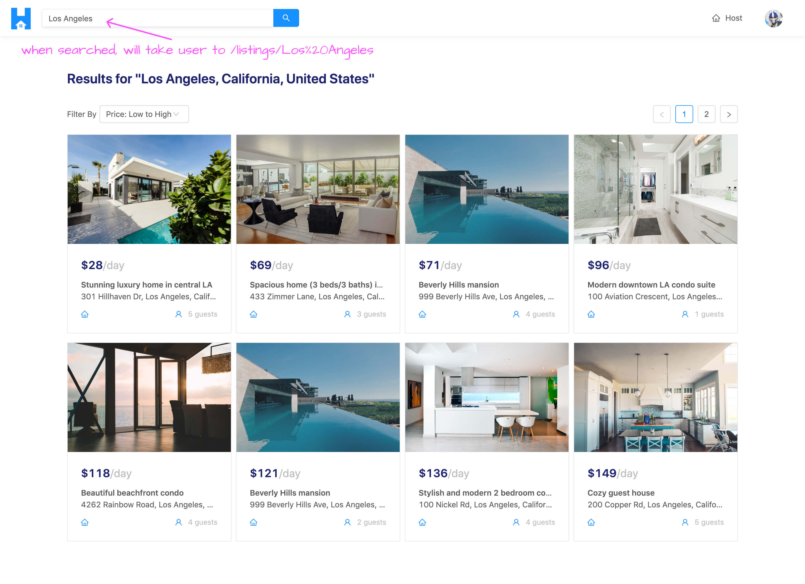
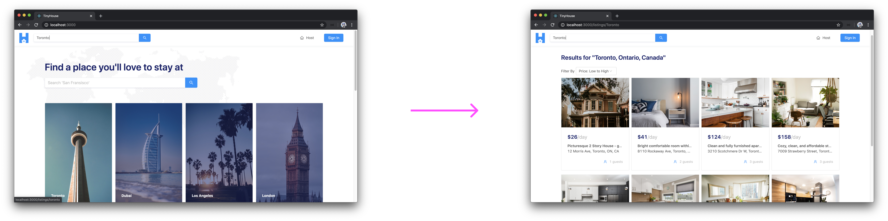
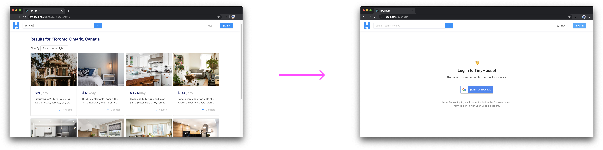
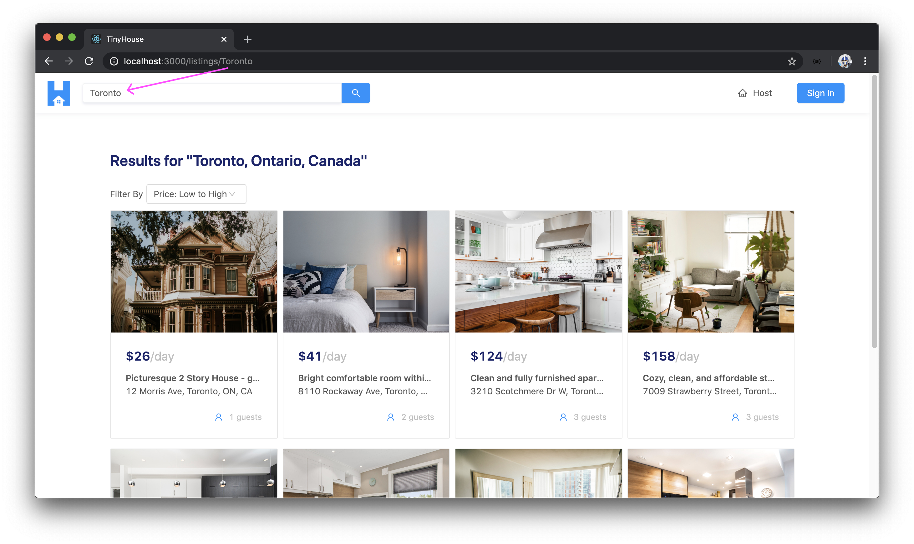
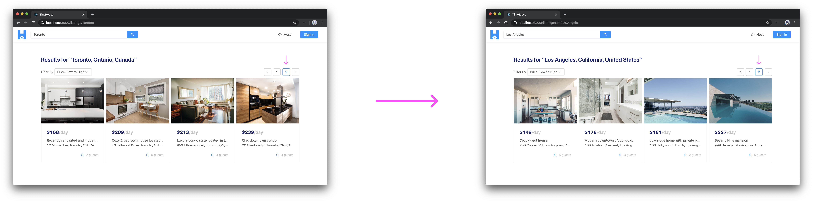
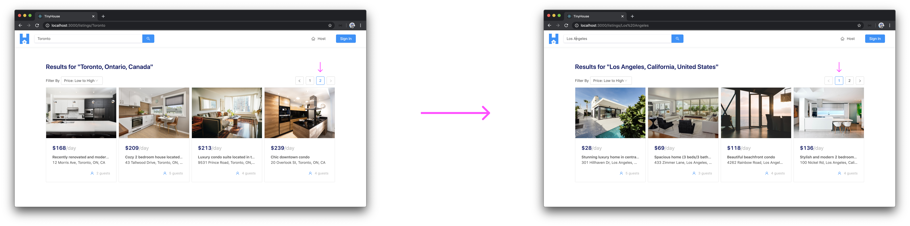
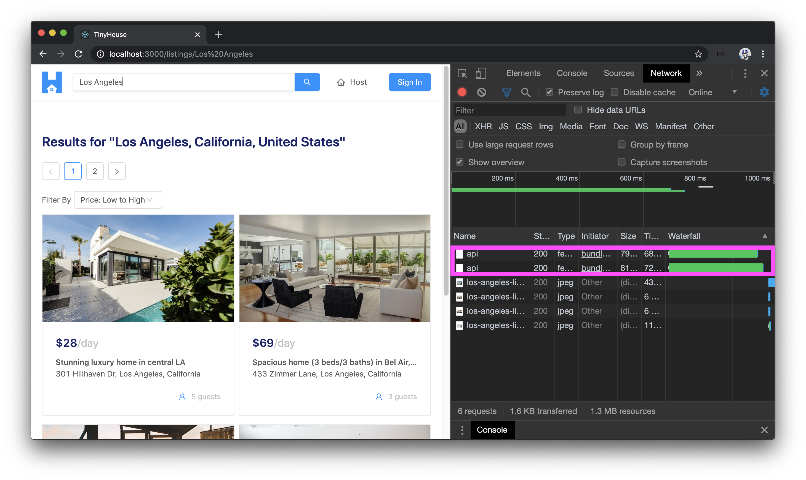
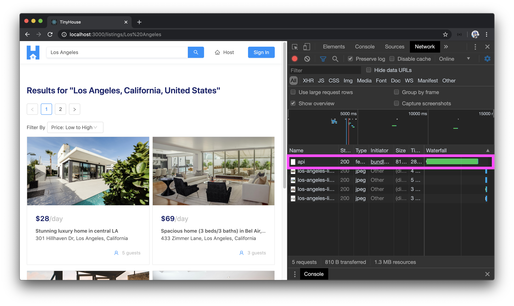

# Searching for listings from the App Header

At this moment in time, our `/listings/:location?` page behaves the way we want it to. In this lesson, we'll work on something slightly related to the `/listings/:location?` page and is a big factor of our app. We'll be working on the search input we're going to place in the app header. Having the search input in the app header itself is useful since it will allow users to search for listings in a location while within any part of our app.



The search input in the app header is going to behave similarly to the search input we have on the homepage. It'll simply be the [`<Input />`](https://ant.design/components/input/) component from Ant Design where when a user searches for something, it'll take the user directly to the `/listings/:location?` page and append whatever's been searched in the `location` URL parameter. The `/listings/:location?` page will retrieve the value for the `location` parameter and make the appropriate query.

Let's look to provide the search input functionality that's very similar to what we have on the homepage. First, we'll head over to the `<AppHeader />` component we created before in the `src/sections/AppHeader/index.tsx` file. In this file, we'll import the `<Input />` component from Ant Design.

```tsx
import { Input, Layout } from "antd";
```

We'll also destruct the `<Search />` sub-component from the `<Input />` component.

```tsx
const { Search } = Input;
```

Let's prepare the `<Search />` input we want in the app header. We'll place the `<Search />` input right after the `<div />` element that encompasses the logo section of our app header. We'll apply a placeholder value of the `<Search />` input of `"Search San Fransisco"` and we'll provide the `enterButton` prop that helps display the call to action search button. For the `onSearch()` callback prop that gets called when a search is inputted - we'll call a function in the component called `onSearch()`.

```tsx
// ...

export const AppHeader = ({ viewer, setViewer, history }: Props) => {
  const onSearch = (value: string) => {};

  return (
    <Header className="app-header">
      <div className="app-header__logo-search-section">
        <div className="app-header__logo">
          <Link to="/">
            
          </Link>
        </div>
        <div className="app-header__search-input">
          <Search placeholder="Search 'San Fransisco'" enterButton onSearch={onSearch} />
        </div>
      </div>
      <div className="app-header__menu-section">
        <MenuItems viewer={viewer} setViewer={setViewer} />
      </div>
    </Header>
  );
};
```

When a search is to be made, we'll do as we've done before and [`trim()`](https://developer.mozilla.org/en-US/docs/Web/JavaScript/Reference/Global_Objects/String/trim) the value that's been searched to remove any whitespace in the beginning or end of the submitted string. If the user simply tries to search for empty whitespaces, the trimmed value will be an empty string with which we'll use the `displayErrorMessage` utility function we have in the `src/lib/utils/` folder to display an error message.

```tsx
// ...
import { displayErrorMessage } from "../../lib/utils";
// ...

export const AppHeader = ({ viewer, setViewer, history }: Props) => {
  const onSearch = (value: string) => {
    const trimmedValue = value.trim();

    if (trimmedValue) {
    } else {
      displayErrorMessage("Please enter a valid search!");
    }
  };

  return (
    <Header className="app-header">
      <div className="app-header__logo-search-section">
        <div className="app-header__logo">
          <Link to="/">
            
          </Link>
        </div>
        <div className="app-header__search-input">
          <Search placeholder="Search 'San Fransisco'" enterButton onSearch={onSearch} />
        </div>
      </div>
      <div className="app-header__menu-section">
        <MenuItems viewer={viewer} setViewer={setViewer} />
      </div>
    </Header>
  );
};
```

If we were to take a look at our app now, we'll see the search input in our header! If we tried to simply search for a value of just empty whitespace characters, we'll get the error message shown to us prompting us to search for a location.


We'll now look to take the user to the `/listings/:location?` route when a search is successfully made in the app header. In the `<Home />` component, we used the [`history`](https://github.com/ReactTraining/react-router/blob/master/packages/react-router/docs/api/history.md) object available in the component to help add a new entry to the browser session stack (i.e. help direct the user to the appropriate route). This `history` object is available as a prop to components rendered as part of the `<Route />` component from React Router.

The `<AppHeader />` component isn't rendered as part of a `<Route />` component and we're interested in using this `history` object. To have `history` available in the `<AppHeader />` component, we'll use a Higher Order Component function that React Router provides called `withRouter()` that provides additional props related to the route for components that aren't rendered as part of the main routes.

In the `<AppHeader />` component file, we'll import the `withRouter()` function and the `RouteComponentProps` interface from React Router.

```tsx
import { Link, withRouter, RouteComponentProps } from "react-router-dom";
```

We'll then wrap our `<AppHeader />` component with the `withRouter` function to then be able to access the `history` object as a prop. We'll be able to specify the shape of the `history` prop object by using the `RouteComponentProps` interface.

```tsx
// ...

export const AppHeader = withRouter(
  ({ viewer, setViewer, history }: Props & RouteComponentProps) => {
    // ...
  }
);
```

In our component `onSearch()` function, we'll use the `push()` method from the `history` object to direct the user to the new location of `/listings/` and append whatever the trimmed search value is as the `location` parameter of the route.

```tsx
// ...

export const AppHeader = withRouter(
  ({ viewer, setViewer, history }: Props & RouteComponentProps) => {
    const onSearch = (value: string) => {
      const trimmedValue = value.trim();

      if (trimmedValue) {
        history.push(`/listings/${trimmedValue}`);
      } else {
        displayErrorMessage("Please enter a valid search!");
      }
    };

    return (
      <Header className="app-header">
        <div className="app-header__logo-search-section">
          <div className="app-header__logo">
            <Link to="/">
              
            </Link>
          </div>
          <div className="app-header__search-input">
            <Search
              placeholder="Search 'San Fransisco'"
              enterButton
              onSearch={onSearch}
            />
          </div>
        </div>
        <div className="app-header__menu-section">
          <MenuItems viewer={viewer} setViewer={setViewer} />
        </div>
      </Header>
    );
  }
);
```

If we were to use the search input in the app header, we'll find ourselves being navigated to the `/listings/:location?` page with the appropriate URL parameter!



### `<AppHeader />` - `useEffect()`

We're in a good spot now, however, there are a few improvements we can make with regards to this search input. When we search for something in the app header, we're taken to the new `/listings/:location?` route and the search input is populated with the recently searched location which helps tell the user what they've recently searched for.

However, as a preference, we'll also want the search input to be two-way bound to the URL parameter in our route. As an example, if we were to simply visit the `/listings/:location?` page with a certain parameter, we want to be taken to the appropriate listings page but we'll also want the search input to be populated with the `location` parameter.

What we want to do is check for when the `<AppHeader />` component first renders and see if the `/listings/:location?` route has an appropriate URL parameter. If the `location` URL parameter exists, it'll be used to update the value in the search input of the app header.

We'll need to keep track of the value in the search input so we'll import and use the `useState` Hook.

```tsx
import React, { useState } from "react";
// ...
```

At the beginning of our `<AppHeader />` component function, we'll declare a new state property called `search` and a function called `setSearch()` which will be used to update the `search` state property. We'll initialize the value of this `search` state property with a blank string and we'll place the `search` state property as the value of the `value` prop in our `<Search />` component.

```tsx
// ...

export const AppHeader = withRouter(
  ({ viewer, setViewer, history }: Props & RouteComponentProps) => {
    const [search, setSearch] = useState("");

    // ...

    return (
      <Header className="app-header">
        <div className="app-header__logo-search-section">
          {/* ... */}
          <div className="app-header__search-input">
            <Search
              placeholder="Search 'San Fransisco'"
              enterButton
              value={search}
              onSearch={onSearch}
            />
          </div>
        </div>
        {/* ... */}
      </Header>
    );
  }
);
```

If we checked the search input at this time, we'll see it's initialized with a blank string. However, we'll be unable to type anything in the input. This is because by providing a state property as the value of the input, we haven't provided the means to _update_ the state value. We'll use another prop labeled `onChange()` in the `<Search />` input that receives an `evt` object. From this `evt` object, we can access the `value` property from `evt.target.value` with which we can then use to update the `search` state property with the `setState()` function.

```tsx
// ...

export const AppHeader = withRouter(
  ({ viewer, setViewer, history }: Props & RouteComponentProps) => {
    const [search, setSearch] = useState("");

    // ...

    return (
      <Header className="app-header">
        <div className="app-header__logo-search-section">
          {/* ... */}
          <div className="app-header__search-input">
            <Search
              placeholder="Search 'San Fransisco'"
              enterButton
              value={search}
              onChange={evt => setSearch(evt.target.value)}
              onSearch={onSearch}
            />
          </div>
        </div>
        {/* ... */}
      </Header>
    );
  }
);
```

At this moment, we have a state property that populates the value of the search input. We can now check for when the component _first_ renders and see if the user is in the `/listings/:location?` route. If so, we'll take the URL pathname of the route and look to update the state property with its value. Since we want to do something when the component first renders, we'll import and use the `useEffect` Hook from React.

```tsx
import React, { useState, useEffect } from "react";
```

We'll construct an effect callback with the `useEffect` Hook. We'll want the effect run only on first render so we'll provide an empty dependencies array.

```tsx
// ...

export const AppHeader = withRouter(
  ({ viewer, setViewer, history }: Props & RouteComponentProps) => {
    const [search, setSearch] = useState("");

    useEffect(() => {}, []);

    // ...

    return (
      // ...
    );
  }
);
```

Our approach in the effect callback would be to check what URL route the user is in. If the user is in the `listings/:location?` route, we'll want to update the state value with the URL parameter in the route. React Router provides access to another object called [`location`](https://github.com/ReactTraining/react-router/blob/master/packages/react-router/docs/api/location.md) which is useful if we need to know what the current URL is at any time.

Since we've used the `withRouter` higher-order function for our `<AppHeader />` component, we'll able to destruct a `location` object from the props available in the component. In our effect callback, we'll attempt to access the `pathname` of the URL with the help of the `location` object.

```tsx
// ...

export const AppHeader = withRouter(
  ({ viewer, setViewer, history, location }: Props & RouteComponentProps) => {
    const [search, setSearch] = useState("");

    useEffect(() => {
      const { pathname } = location;
    }, [location]);

    // ...

    return (
      // ...
    );
  }
);
```

> React Router has now introduced Hooks! Be sure to check out the **React Router Hooks** video in **Module 15** of the course to highlight how retrieving the `history` and `location` objects can be done with Hooks.

The first thing we'll do in the effect callback will be the opposite of what we just talked about. If a user while, in the `/listings/:location?` page, navigates _away_ from the page to another location in our app, we'll want the search input to be cleared out. If the user visits another page in our app after viewing listings for a location, there's no reason to have the search input still contain the most recent search.

To achieve this, we can check if the URL pathname does not contain the string `/listings` . If it doesn't, it probably means the user _isn't_ visiting the listings page and is trying to visit some other page in our app. If that's the case, we'll use the `setSearch()` state function we have to set the state property to an empty string.

```tsx
// ...

export const AppHeader = withRouter(
  ({ viewer, setViewer, history, location }: Props & RouteComponentProps) => {
    const [search, setSearch] = useState("");

    useEffect(() => {
      const { pathname } = location;

      if (!pathname.includes("/listings")) {
        setSearch("");
        return;
      }
    }, [location]);

    // ...

    return (
      // ...
    );
  }
);
```

While in the `/listings/:location?` page, if we were to navigate elsewhere in our app - the search input will be cleared out!



If the user is visits the `/listings/:location?` route directly in the URL bar, we'll want to update the search input in the app header with the `location` parameter value. We can do this by checking if the `pathname` of the `location` includes `/listings`. If so, we'll try and retrieve the portion of the URL at the end of the pathname. The first thing we'll do is get all the sub-strings in our URL by separating every portion with `"/"`, and we'll keep this within a constant labeled `pathnameSubStrings`.

```tsx
// ...

export const AppHeader = withRouter(
  ({ viewer, setViewer, history, location }: Props & RouteComponentProps) => {
    const [search, setSearch] = useState("");

    useEffect(() => {
      const { pathname } = location;
      const pathnameSubStrings = pathname.split("/");

      if (!pathname.includes("/listings")) {
        setSearch("");
        return;
      }
    }, [location]);

    // ...

    return (
      // ...
    );
  }
);
```

The `pathnameSubStrings` constant will be an array of three strings - the domain name, `listings`, and the `location` pathname. In another `if` statement in the effect callback, we can add a further check to make sure the user is attempting to visit a certain location in the `/listings/:location?` page by seeing if `pathnameSubStrings` has a length of `3`. If it has a length of `2`, it would mean perhaps the user is attempting to only visit the `/listings` route without a `location` URL pathname.

If `pathnameSubStrings` is to have a length of `3`, we can take the last item in the array and use it to update the `search` state property with it. With this change and all the changes we've made to the `<AppHeader />` component, the `src/sections/AppHeader/index.tsx` file will look like the following:

```tsx
import React, { useState, useEffect } from "react";
import { Link, withRouter, RouteComponentProps } from "react-router-dom";
import { Input, Layout } from "antd";
import { displayErrorMessage } from "../../lib/utils";
import { Viewer } from "../../lib/types";
import { MenuItems } from "./components";

import logo from "./assets/tinyhouse-logo.png";

interface Props {
  viewer: Viewer;
  setViewer: (viewer: Viewer) => void;
}

const { Header } = Layout;
const { Search } = Input;

export const AppHeader = withRouter(
  ({ viewer, setViewer, location, history }: Props & RouteComponentProps) => {
    const [search, setSearch] = useState("");

    useEffect(() => {
      const { pathname } = location;
      const pathnameSubStrings = pathname.split("/");

      if (!pathname.includes("/listings")) {
        setSearch("");
        return;
      }

      if (pathname.includes("/listings") && pathnameSubStrings.length === 3) {
        setSearch(pathnameSubStrings[2]);
        return;
      }
    }, [location]);

    const onSearch = (value: string) => {
      const trimmedValue = value.trim();

      if (trimmedValue) {
        history.push(`/listings/${trimmedValue}`);
      } else {
        displayErrorMessage("Please enter a valid search!");
      }
    };

    return (
      <Header className="app-header">
        <div className="app-header__logo-search-section">
          <div className="app-header__logo">
            <Link to="/">
              
            </Link>
          </div>
          <div className="app-header__search-input">
            <Search
              placeholder="Search 'San Fransisco'"
              enterButton
              value={search}
              onChange={evt => setSearch(evt.target.value)}
              onSearch={onSearch}
            />
          </div>
        </div>
        <div className="app-header__menu-section">
          <MenuItems viewer={viewer} setViewer={setViewer} />
        </div>
      </Header>
    );
  }
);
```

> **Note** We aren't using the `match` object React Router provides like we've done elsewhere since the `match` param is route relative and is **only inherited from the nearest route**. If we attempted to use the `match` param object in `<AppHeader />`, it'll have no context as to what URL parameter exists and just be an empty object. As a result, we've resorted to retrieving the `location` parameter manually from the URL.

If we attempted to access the `/listings/:location?` path in the URL bar of our browser, with something like `/listings/Toronto`, we'll see the \`"Toronto" pathname populating our search input!



### `<Listings />` - Pagination

We've covered most of what we wanted to with having the search input be available in the app header. There's one other small quirk we'll look to handle and this can be observed when attempting to navigate between pages in the `/listings/:location?` route.

> **Note:** To see the pagination element in our `/listings/:location?` page, we can change the `PAGE_LIMIT` constant used in the `<Listings />` component temporarily to a smaller value (e.g. `4`).

If we were to navigate to another page in the `/listings/:location?` route (e.g. go to page `2`) and then search for another location in the search bar in the app header, we'll notice that the new search is made but we'll still be in the second page.



As a preference, we wouldn't want this. We'll prefer whenever a search is made for a certain location, we bring the page level back to `1`. This will be more important if we had dozens of pages for a location and if we were on the 30th page and searched for a different location, we wouldn't want to stay on the 30th page of that new location.

When our `<Listings />` component is first rendered, the page is initialized with `1`. When we change the page state value then attempt to search for a different location, we're still in the same `<Listings />` component so the **`page` state value remains the same** but the `location` value in our query changes. This is why we get a new set of listings but stay on the same page.

To resolve this, in the `<Listings />` component, we can check if the value of the URL `location` ever changes while still in the `listings/:location?` page (i.e. still in the `<Listings />` component). If this is to happen, we'll set the `page` state value back to `1`. This is a perfect use case for the `useEffect` Hook so we'll import it and attempt to use it in our `<Listings/>` component file.

```tsx
import React, { useState, useEffect } from "react";
// ...

// ...

export const Listings = ({ match }: RouteComponentProps<MatchParams>) => {
  // ...

  useEffect(() => {}, []);

  // ...
};
```

We want to have an effect that brings our `page` state value back to `1` with which we can achieve by using the `setPage()` function available in our `<Listings />` component and providing a value of `1`.

```tsx
import React, { useState, useEffect } from "react";
// ...

// ...

export const Listings = ({ match }: RouteComponentProps<MatchParams>) => {
  // ...

  useEffect(() => {
    setPage(1);
  }, []);

  // ...
};
```

When would we want the above effect to run? We'll want it to run at any moment the URL `location` parameter ever changes while still in this `/listings/:location?` route. If the `location` URL parameter changes and the `<Listings/>` component is still rendered, this probably means that the user has used the search bar to find listings for another location. With that said, we can add the `location` URL parameter available in our `match.params` object as the dependency of our effect.

```tsx
import React, { useState, useEffect } from "react";
// ...

// ...

export const Listings = ({ match }: RouteComponentProps<MatchParams>) => {
  // ...

  useEffect(() => {
    setPage(1);
  }, [match.params.location]);

  // ...
};
```

When we're now in the `/listings/:location?` route, visit another page, and attempt to search for listings in a different location with the app header - we'll be brought back to page 1!



### `<Listings />` - Skip Query

Great! Things are working the way we expect to. However, if we were to repeat the above process and took a look at our network logs, we'll notice something peculiar happening. When we go to a new page and then search for a different location, we'll see two network requests being made to query for new set of listings.



Why is this happening? This is because the variables in the query are changing _twice._ First, the value of the `location` variable in the query changes and a query is made. An effect is _then_ being run to set the value of the `page` state variable back to `1` and a second query is made. Since this happens instantly from a UI perspective, we just see the final outcome. However, it's unnecessary to make that first request.

What we can do here is try and **skip** that first request if under the condition we know the page is going to be updated back to `1`. We can achieve this by using the `skip` property React Apollo provides to help skip making the query under a certain condition. We can say that if the value of the `location` URL parameter is being updated _and_ the `page` isn't equal to `1`, this means that when the location is updated; the page will be set back to `1` so let's skip making that first query.

How do we keep context of when the location is being changed? We can use the `useRef` Hook. The `useRef` Hook in React helps return a mutable ref object that persists for the lifetime of the component. We'll import the `useRef` Hook in the `<Listings />` component file.

```tsx
import React, { useState, useRef, useEffect } from "react";
```

At the beginning of our `<Listings />` component function, we'll create a new `ref` object that we'll call `locationRef` and we'll pass in the location parameter from the `match.params` object.

```tsx
// ...

export const Listings = ({ match }: RouteComponentProps<MatchParams>) => {
  const locationRef = useRef(match.params.location);
  // ...

  // ...
};
```

We'll apply a `skip` property in the options of our `useQuery` Hook, and for `skip` clause we can check to see if the `locationRef.current` value (which is the referenced value we passed in) isn't equal to the new `match.params.location` value and the `page` state value is not equal to `1`.

In our effect callback within the `useEffect` Hook, we'll be sure to update the `locationRef.current` value with the new `location` after the `page` has already been set back to `1`.

```tsx
// ...

export const Listings = ({ match }: RouteComponentProps<MatchParams>) => {
  const locationRef = useRef(match.params.location);
  // ...

  const { loading, data, error } = useQuery<ListingsData, ListingsVariables>(LISTINGS, {
    skip: locationRef.current !== match.params.location && page !== 1,
    variables: {
      location: match.params.location,
      filter,
      limit: PAGE_LIMIT,
      page
    }
  });

  useEffect(() => {
    setPage(1);
    locationRef.current = match.params.location;
  }, [match.params.location]);

  // ...
};
```

How would this work?

Let's assume we first visit the `/listings/toronto` route. The `locationRef` value will be `toronto` in this instance. Let's then say we switched to page `2` and made a search for a different location (e.g. `los angeles`) in the search bar of our app header. The reference value at this point (`locationRef` which will be `toronto`) _won't_ be equal to the new location value (`match.params.location` which will be `los angeles`) and since we're not in page `1` - we'll **skip** making the query for the fact that the `match.params.location` value has changed.

Our effect callback will pick up the fact that our location has changed and will attempt to set our page state value back to `1`. Since the value of the `page` variable in the query is being updated, the query will now be made with the new `page` and `match.params.location` values.

If we take a look at our UI and attempt to replicate the situation to have two queries be made (i.e. change page + search for a new location in the app header), we'll only be able to make a single query request with the latest values of the `page` and `location` variables!



That is pretty much it! We have our app header search functionality now working the way we want it to.
