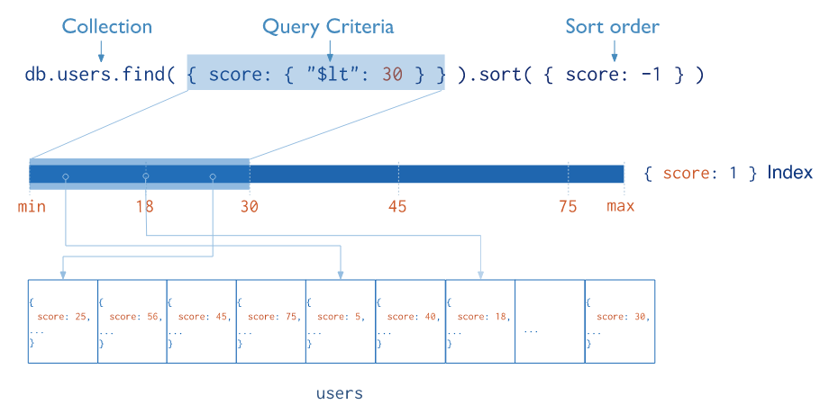
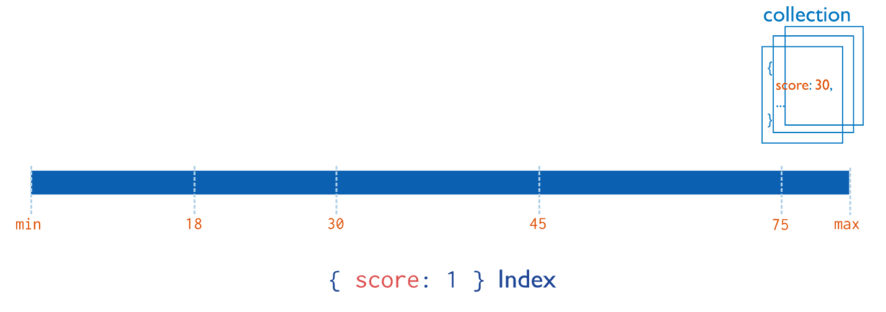
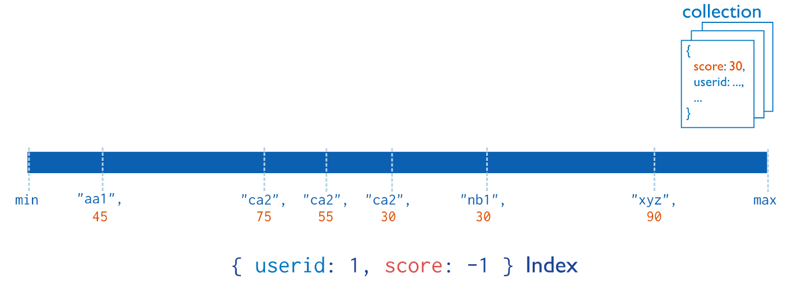
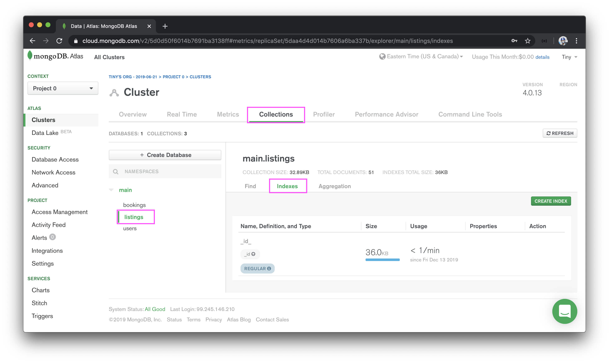
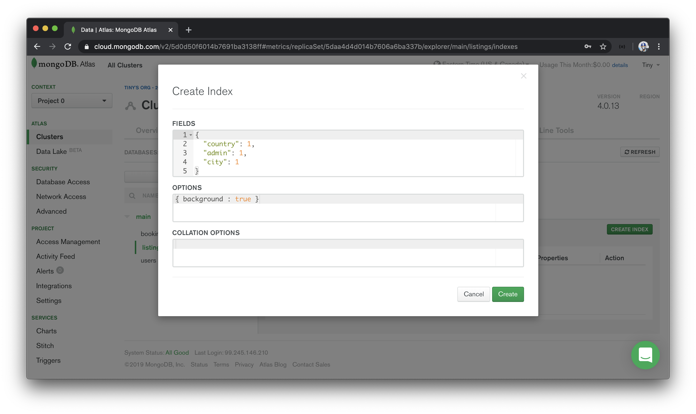
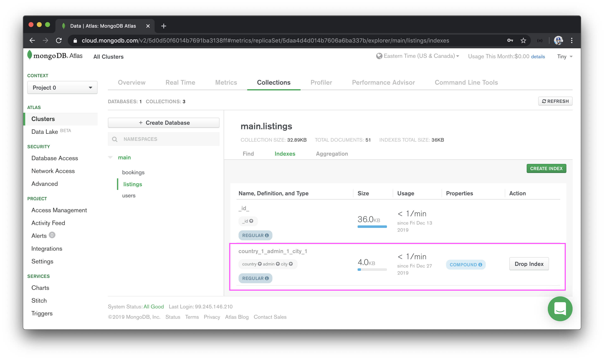

# Index location-based data

> 📝 MongoDB documentation on indexes can be found - [here](https://docs.mongodb.com/manual/indexes/).<br />
> 📖 This lesson's lecture slides can be found - [here](./protected/lecture-slides.pdf).

At this moment in time, we've introduced the capability to have our client application query for listing documents for different locations. Our database, at this moment in time, only contains a handful of listings that we've prepared as mock data. As a result, when we query our database based on location data, it returns results fairly quickly. However, imagine if we had _tens of millions of listings_ in our database. If we tried to search all the listings in New York (for example) our server will take several minutes to scan through our entire collection and pick out the correct data.

Here is a suitable analogy, imagine you had a book with one million random pictures in it and someone told you to find all the pictures with a cat in it. It would take you a long time to check _each and every picture_. However, if there was an index at the beginning of the book that categorized all the pictures based on the object in them along with their page number, you will have a much easier time.

What we need is an index for our `"listings"` collection in the database!

### MongoDB Indexes

[MongoDB Indexes](https://docs.mongodb.com/manual/indexes/) support the efficient execution of queries in a collection. Without indexes, MongoDB must perform a **collection scan** (i.e. scan for every document in a collection) to select the documents that match the query statement. If an appropriate index exists for a query, **MongoDB can use the index to limit the number of documents it must inspect**.

Indexes are important when it comes to databases and are data structures that essentially allow for faster access of data. Without an index, MongoDB will perform a scan for every document in a collection to satisfy a query. If there are millions of documents - so be it, it will go through every document.

When we define an index for a certain field, we tell the database (in this case MongoDB) to create a different data structure for the values of that field for every document in the collection. When we provide a query to find the documents based on certain values of the field, MongoDB doesn't do a collection scan and go through every document but instead gets the documents we're looking for in a more time-effective manner. How? This is because the data structure MongoDB prepares for the values of the field in the index is now **easier to traverse**.

What is the algorithm or data structure that's made with the help of an index? The documentation in MongoDB doesn't spend much time talking about this but it does note that [B-tree data structures](https://docs.mongodb.com/manual/indexes/#b-tree) are used for indexes. [B-trees](https://www.cpp.edu/~ftang/courses/CS241/notes/b-tree.htm) are self-balancing data structures that maintain sorted data and allow for fairly quick searches, removals, and insertions of data.

> Traversing through a B-Tree data structure is often recognized to be done in logarithmic time, O(log N), which is more time-effective as the data set grows when compared with linear time, O(N), which is what a collection scan would do.

The key takeaway here is that specifying indexes helps speed up the amount of time needed to query for documents in large collections. Here's a diagram from the [MongoDB documentation](https://docs.mongodb.com/manual/indexes) that illustrates a query that selects and orders the matching documents using an index.



The diagram above conveys that an attempt is being made to find all the documents in a `"users"` collection where the `score` of the user is less than `30` and the results are to be sorted in ascending order of `score`. In this case, an index has been specified for the `score` field and by doing so, MongoDB creates a data structure for all the values of the `score` field for all the documents in the collection. It then performs a search faster than linear time to get all the documents that match the query.

Fundamentally, indexes in MongoDB are similar to indexes in other database systems. **MongoDB defines indexes at the collection level and supports indexes on any field or sub-field of the documents in a MongoDB collection**.

### Default `_id` Index

MongoDB automatically creates a unique index on the `_id` field during the creation of a collection. Since the `_id` field index is given a unique property, MongoDB rejects duplicate values for the indexed field which prevents clients from inserting two documents with the same value for the `_id` field.

MongoDB also offers many other different index types such as [Geospatial](https://docs.mongodb.com/manual/indexes/#geospatial-index), [Text](https://docs.mongodb.com/manual/indexes/#text-indexes), etc. For more information on this topic, we strongly encourage you to check out the MongoDB documentation on [indexes and index types](https://docs.mongodb.com/manual/indexes/#index-types).

### Compound Indexes

We've now come to understand that MongoDB supports the creation of indexes on a single field of a document. Here's a diagram from [MongoDB documentation](https://docs.mongodb.com/manual/indexes/#single-field) that conveys an index is created for a single `score` field in a document.



MongoDB also supports the creation of indexes on multiple fields otherwise known as [**compound indexes**](https://docs.mongodb.com/manual/core/index-compound/). The order of fields listed in a compound index has significance. For instance, if a compound index consists of `{userid: 1, score: -1 }`, the index sorts first by `userid` and within each `userid` value _then_ sorts by `score`. Here's a diagram from [MongoDB documentation](https://docs.mongodb.com/manual/indexes) that conveys a compound index being created for a `userId` and `score` fields.



With that all said, let's now go back to our use case. We've mentioned that if a certain location is searched in our app, at this moment in time, MongoDB will conduct a collection scan and go through all the documents in the `listings` collection that satisfy the query. This isn't a huge issue now since we don't have a lot of listings but it can be an issue if we start to have thousands or even millions of listings in our app.

When it comes to searching for listings in a location, what are the fields we're querying for? If we recall, we make a query for listings that matches at most three fields - `country`, `admin`, and `city`.

```ts
let cursor = await db.listings.find({
  country: "Canada",
  admin: "Ontario",
  city: "Toronto"
});
```

At the minimum, we provide a query that contains the `country` when a location is specified. If our geocoder picks up the administrative area and city, we include those fields in our query as well. When all three fields exist and when MongoDB makes a search, it isn't looking for documents that satisfy a single field - but three!

With that said, let's visit the Atlas dashboard of our MongoDB cluster and prepare indexes for the three fields we query for when it comes to retrieving listings information. We'll visit the `listings` collection and click on the `indexes` tab to provide a new index.



We'll already see the default `_id` unique index automatically created by MongoDB. We will now create our own index by clicking on the **CREATE INDEX** button.

Since we're going to create an index for multiple fields, we'll create a **compound index**. `country` holds the most importance in our location searches followed by the `admin` and followed by the `city`. With that said, we'll define a compound index that sorts our `listings` documents by `country` first, then `admin`, and lastly by `city`. We'll provide all of them with a value of `1` which helps prepare the sorted indexes in ascending alphabetical order.

```ts
{
  country: 1,
  admin: 1,
  city: 1
}
```



We'll finally click **Create** to create our new index.



A compound index has now been created for the `country`, `admin`, and `city` fields for the documents in our `"listings"` collection. If we had millions of listings in our database, a query that utilizes our new index for location-based searching could potentially take seconds as opposed to minutes to complete.
