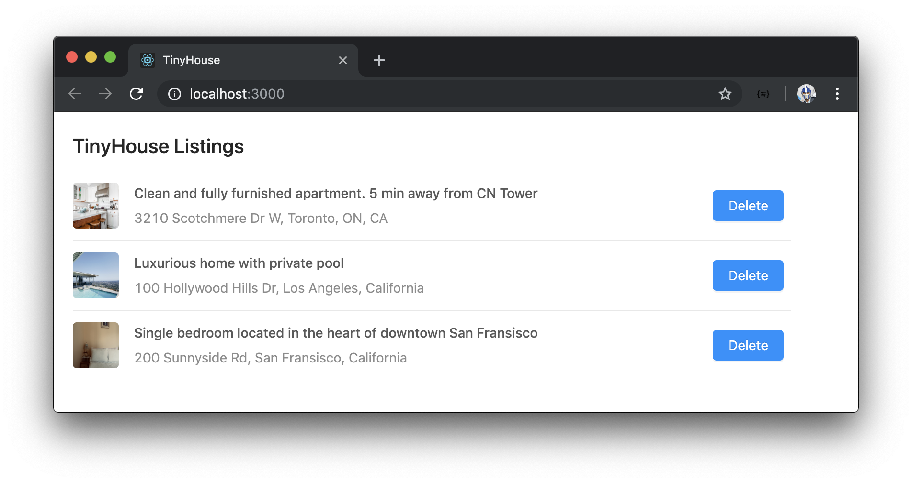
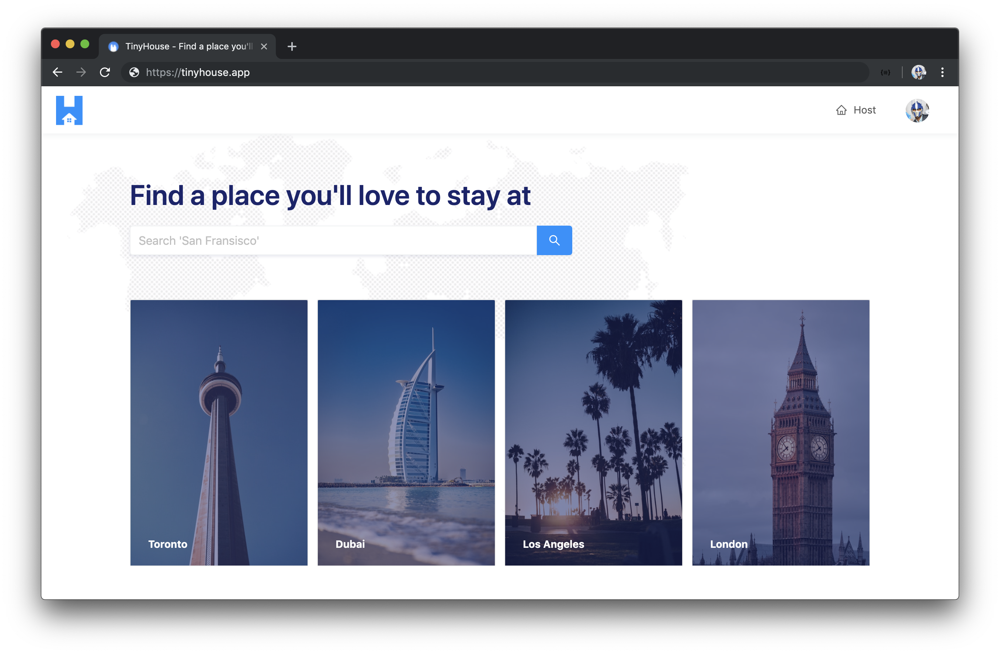

# Syllabus

Welcome to Newline's first Masterclass - **TinyHouse**.

TinyHouse is a structured, self-paced, online learning course designed to help you build a Universal JavaScript application. We'll be working with a variety of different technologies such as **React**, **GraphQL**, and **TypeScript** to learn how we can build a real home-sharing app including authentication, data persistence, payments, and deployment.

## Technologies

In this course, we learn how to build a full-stack JavaScript application with some of the most popular technologies being used today.

### React

We use [**React**](http://reactjs.org) extensively to build dynamic client UI and take a deep dive and use [**React Hooks**](https://reactjs.org/docs/hooks-intro.html) to manage _all_ component logic.

### Node

We create a web server with [**Node**](https://nodejs.org) and [**Express**](http://expressjs.com) to serve our GraphQL API and handle API requests by querying and manipulating data from the MongoDB database.

### GraphQL

We build a robust [**GraphQL**](https://graphql.org/) API within the Node environment. We first highlight the benefits of GraphQL over traditional REST APIs before using and implementing the GraphQL JavaScript library, the GraphQL Schema Language, GraphQL Scalar Types, Resolvers, etc.

### Apollo

With the help of the [**Apollo**](https://www.apollographql.com/) platform, we build a well documented, production-ready GraphQL API with the [**Apollo Server**](https://www.apollographql.com/docs/apollo-server/) package. We utilize [**React Apollo**](https://www.apollographql.com/docs/react/) (i.e. the Apollo Client utility) to have our React client request and cache data from the API and update the UI.

### MongoDB

We construct a [**MongoDB**](https://www.mongodb.com/) cluster and database with the database as a service, [**MongoDB Atlas**](https://www.mongodb.com/cloud/atlas). Querying and manipulation of data is done with the help of the official [**Node Mongo Driver**](https://mongodb.github.io/node-mongodb-native/).

### TypeScript

[**TypeScript**](http://www.typescriptlang.org/) is used extensively both on the client and the server to build a robust and type-safe application. We learn how to configure a project's TypeScript compiler, use basic types and advanced types, use the DefinitelyTyped repository, and see how TypeScript can be used within a JSX environment.

### Ant Design

We leverage and use the [**Ant Design**](https://ant.design/) React UI framework to help build presentable and beautiful React components.

## Part I

The TinyHouse course is broken down into **two parts**.

In **Part I**, we take an introductory approach to introduce all the different tools we'll need to build the TinyHouse application. We'll:

- Build our server with [Node](https://nodejs.org) & [Express](http://expressjs.com).
- Introduce and use [TypeScript](http://www.typescriptlang.org/).
- Set up a [GraphQL](https://graphql.org/) API with [Apollo Server](https://www.apollographql.com/docs/apollo-server/).
- Persist data with [MongoDB](https://www.mongodb.com/).
- Create a [React](http://reactjs.org) project with [`create-react-app`](https://github.com/facebook/create-react-app).
- Introduce and use [React Hooks](https://reactjs.org/docs/hooks-intro.html).
- Use [Apollo Client](https://apollographql.com/docs/react/) to make our GraphQL requests.
- Finally, use the [Ant Design UI](https://ant.design/) framework to help style our client application.

By the end of Part I, we'll have our React client application present a list of listings where the data is to live in a MongoDB collection. Our Node server will set up a GraphQL API where our client application will be able to query for listings or trigger a mutation to delete a certain listing.

Part I of the course contains:

- **65+ screencast videos** (over **7hrs of recorded material**).
- Detailed manuscript (and code) for **every single screencast** video.
- **110+** multiple choice quiz questions.
- In-depth challenge projects.
- **8+** PDF cheat sheets

## Part II

In **Part II**, we take everything we've learned from Part I of the course and focus our efforts on building the TinyHouse home sharing application. We'll:

- Establish client-side routing with [React Router](https://reacttraining.com/react-router/web/guides/quick-start).
- Handle authentication with [Google Sign In (and OAuth 2.0)](https://developers.google.com/identity/sign-in/web/sign-in).
- Permit persistent login sessions with cookies and session storage.
- Handle payments with [Stripe](http://stripe.com/).
- Enable location searching with [Google's Geocode API](https://developers.google.com/maps/documentation/geocoding/start).
- Handle image uploads with [Cloudinary](https://cloudinary.com/).
- Deploy with [Heroku](https://www.heroku.com/).

By the end of Part II, we'll have a fully functioning home-sharing application where users will be able to sign in, create a listing, and book other listings.

> **Markup (i.e. HTML) and CSS/styling is not a primary lesson of this course**. In Part II, we'll provide all the custom CSS we'll need from the beginning and move a little quicker in areas where we spend our time creating the HTML (i.e JSX) markup.

## Prerequisites

Students should have an understanding of HTML, CSS, and JavaScript. Prior development experience working with a newer front-end technology (e.g. React) and Git/NPM is preferable.

Students are assumed to understand spoken and written English.

## Course Material

Each part of the TinyHouse Masterclass is broken down into modules that each govern a section of the course that is to be addressed and learned. Course material contains the following:

- Screencast videos
- Manuscript
- Code samples
- Quiz questions
- Project challenges
- Cheatsheets
- Lecture slides

For every lesson, students are expected to proceed through the screencast video, survey the lesson manuscript, run code samples, and answer the lesson quiz questions to reinforce specific lesson topics.

## How we help

We've structured this course to be more than just screencast videos by providing a detailed manuscript, live code samples, and more.

- **Proceed at your own time**: We understand everyone has their own schedule which is why we've provided all the material for the course the moment you've enrolled. Feel free to venture through the material as fast as possible or to take your time.

- **Live online community**: Feel stuck somewhere or need guidance on a certain topic? Hop on to the **#tinyhouse** channel in our Discord organization where you'll be able to find help (and help others!). We (the instructors) will be on the channel as well.

While we've made every effort to be clear, precise, and accurate; you may find that when you're writing your code, you may find an inaccuracy in how we describe something or feel a concept can be made more clear. If so, email us at [us@fullstack.io](us@fullstack.io)! Similarly, if you've found a bug in our code we want to hear about it.

## Part I Structure

In Part I, we introduce and learn all the patterns and concepts we’ll need to know to build the TinyHouse application. We'll focus our efforts to build a simple page that surfaces a list of rental listings kept in a MongoDB database and available through a GraphQL API.

### Module 1: Getting Started With Our Server

Node is a JavaScript runtime environment that was first introduced in 2009 by Ryan Dahl as a response to how slow web servers were at the time. We'll learn how to set up a Node web server with the help of the Express framework.

- Learn what Node is.
- Run JavaScript with Node.
- Create a minimal Node/Express server.
- Enable automatic reloading with Nodemon.
- Introduce TypeScript.
- Add TypeScript to our server.
- Compile our TypeScript project.
- Lint our code with ESLint.
- Introduce mock listings.
- Create GET and POST Express routes.

### Module 2: Comparing GraphQL/REST APIs

GraphQL is a powerful query language for APIs that allow client applications to request the specific data they need. In this module, we explain and introduce GraphQL and some of its core concepts.

- Learn what GraphQL is.
- Compare Github's REST & GraphQL APIs.
- Learn some of the core concepts of GraphQL.

### Module 3: Using Apollo Server

GraphQL, as a specification, can be implemented in many different programming languages. We'll create a GraphQL API with the Apollo Server package to interact with the mock data in our app.

- Install Apollo Server and GraphQL JS library.
- Create a GraphQL Schema with the GraphQL JS library.
- Query and mutate listings data with GraphQL.
- Recreate the Schema with the GraphQL Schema Language.

### Module 4: Storing Data with MongoDB

We move away from handling mock data and use a database to contain any data we want to be persisted in our application. We establish this database with MongoDB and use a database as a service known as MongoDB Atlas.

- Learn what MongoDB is and how non-relational databases work.
- Set up a new MongoDB Cluster with MongoDB Atlas.
- Connect the Node server with MongoDB with the official Node Mongo driver.
- Learn how TypeScript Generics can help add types to our database collections.
- Set up environment variables.
- Seed mock data to the database.
- Modularize our GraphQL Resolvers.

### Module 5: Getting Started with React

React is a JavaScript library for building interactive user interfaces. React changes the way we do front-end development by allowing us to build UI in a declarative manner, with reusable components, and the JSX syntax.

- Learn important React concepts.
- Use the `create-react-app` command line to scaffold a new Webpack bundled React application.
- Walkthrough the files and folder structure of a `create-react-app` scaffolded project.

### Module 6: Building out Listings

With our new React project created, we'll work towards having our React client app make API requests to our server through GraphQL.

- Create a functional `<Listings>` component.
- Investigate how we can type check for `props` in a component.
- Investigate how we can define the type of a functional component.
- Create a POST request to query listings information from the API.
- Abstract the type of data being requested with the help of Generics.
- Have the client be able to trigger the mutation to delete a listing.

### Module 7: GraphQL and React Hooks

React Hooks have been one of the biggest paradigm changes to the React ecosystem and are essentially functions that allow components to hook into specific features.

- Introduce and understand how React Hooks work.
- Use the `useState` Hook to track state in our component.
- Use the `useEffect` Hook to have our GraphQL query be made when our component first renders.
- Create and use a custom `useQuery` Hook to consolidate how components can execute GraphQL queries.
- Extrapolate the capability to refetch a query from the `useQuery` Hook.
- Have loading and error information be returned from the `useQuery` Hook.
- Create and use a custom `useMutation` Hook to consolidate how components can execute GraphQL mutations.
- Investigate and use React's `useReducer` Hook to handle state and state changes in a more controlled manner.

### Module 8: Introducing React Apollo

Though our custom Hooks implementation for interacting with the GraphQL API works, there are limitations for performing more complicated functionality which is why we'll switch over to using Apollo. Apollo Client from the Apollo ecosystem provides a declarative API and intelligent caching to help client applications query GraphQL fields in a predictable and declarative manner.

- Create our Apollo Client.
- Utilize and use React Apollo's Hooks to conduct GraphQL requests.
- Autogenerate TypeScript definitions with the Apollo CLI.

### Module 9: Styling with Ant Design

UI/CSS frameworks are packages containing pre-written, standardized, and often well-tested template and CSS code to help speed up development in providing a consistent UI experience. We introduce and use the Ant Design React UI framework to make our client look a lot more presentable.

- Discuss how certain UI/CSS frameworks work and introduce Ant Design.
- Utilize components from the Ant Design framework to style our client application.

## Part II Structure

In **Part II**, we take everything we’ve learned from Part I and focus our efforts on building the TinyHouse home sharing application.

### Module 1: Set-up for Part 2

We begin working on building the TinyHouse application by first modifying the code from the end of Part I of the course to prepare us as we move forward.

- Set-up For Part II.

### Module 2: Routing in TinyHouse

We'll begin establishing the main page-level components of our application as well as the different URL routes for where these components should show.

- We'll address what routing is within the context of a web application.
- Spend a little time addressing the difference between server-side and client-side routing.
- Install and introduce React Router in our client application.
- Finally, set-up some of the main routes and corresponding components we'll have in TinyHouse.

### Module 3: Setting up our Database

We'll spend some time constructing the shape of documents we intend to store for the different collections we'll establish in Part II of the course. In Part II, we'll work with three collections - `"users"`, `"listings"`, and `"bookings"`.

- Declare the three collections we intend to create.
- With TypeScript, describe the shape of documents we intend to store for each collection.
- Seed the collections in our database with mock data that we've prepared and will provide to you.

### Module 4: User Authentication with Google Sign-In & OAuth 2.0

**OAuth** is an industry-standard protocol that enables applications to gain limited access to user accounts that have been created on different platforms. If you've ever signed in to an application with your Google account, Facebook account, Twitter account, etc. - that sign-in process was most likely made capable with OAuth!

- Explain what OAuth 2.0 is.
- Create OAuth Credentials for [Google Sign-In](https://developers.google.com/identity/sign-in/web/sign-in).
- Update our GraphQL API to allow a user to sign-in with a Google account.
- Construct the UI of the Login page of our client project.
- Execute the `login` and `logout` mutations we'll create from the client.
- Build the app header to convey to our user when in the logged-in state.

### Module 5: Persist Login Sessions with Cookies

From the end of the last module, if we were to ever refresh a page in the app when logged-in, our login state was effectively removed. Though a user will just be able to log-in again by going to the Login page and clicking beginning the sign-in process with Google, this will be repetitive. In this module, we'll investigate how we can persist the log-in session of a user with [**cookies**](https://developer.mozilla.org/en-US/docs/Web/HTTP/Cookies).

- Talk about persistent login sessions and cookies.
- Compare [localStorage](https://developer.mozilla.org/en-US/docs/Web/API/Window/localStorage), [sessionStorage](https://developer.mozilla.org/en-US/docs/Web/API/Window/sessionStorage), and [cookies](https://developer.mozilla.org/en-US/docs/Web/HTTP/Cookies).
- Utilize a cookie on our client to persist login state.
- Discuss and see how we can help avoid [cross-site request forgery attacks](https://developer.mozilla.org/en-US/docs/Glossary/CSRF).

### Module 6: Building the User Page

In the User page of TinyHouse, we'll display information of a certain user as well as the show the listings the user hosts. In addition, when a user views their own User page, they'll be able to see the sensitive booking information only available to them.

- Create the GraphQL fields in our API to query information for a certain user from the `"users"` collection.
- Build the GraphQL resolver functions to resolve the data for the certain fields we want to be returned for a single user.
- Discuss the difference between offset and cursor-based pagination, and implement offset-based pagination for a few fields in our `User` GraphQL object.
- Finally, build the UI of the User page in our client.

### Module 7: Building the Listing Page

The Listing page of TinyHouse is where a user can see details about a certain listing and where the user will eventually be able to book that listing for a period of time.

- Update our GraphQL API to query information for a specific listing from our database.
- Build the UI of the Listing page in our client project.

### Module 8: Building the Home Page

We'll continue from what we've done in the previous module but now allow our client project to query for a _list_ of listing objects from the server. For this module, we'll do this to show the four highest priced listings (i.e. the premium listings) in the Home page of our app.

- Update our API to allow the request of data for multiple listings at the same time.
- Build the UI for our Home page.
- Finally, see how we can apply a filter to our API request to fetch only the highest-priced listings.

### Module 9: Searching for listings with Google's Geocoding API

**Geocoding** is the process of converting address information, in the form of text, into specific geographic coordinates. We're going to leverage the capability to geocode address information to help allow users to search for listings in certain locations. We'll do this with the help of [Google's Geocoding API](https://developers.google.com/maps/documentation/geocoding/start).

- Discuss how Google's Geocoding API works as well as retrieve the necessary API keys for application.
- Interact with the Geocoding API in our server to resolve the address/location inputs provided by a user.
- In the client, navigate a user to the Listings page when a location search is made.
- In the Listings page, query for listings in a specific location with the help of the Geocoding API.
- Finally, create an index for our `"listings"` collection to support efficient location-based queries.

### Module 10: Connecting with Stripe

[**Stripe**](https://stripe.com/) is a third-party payment processor that helps applications and businesses accept payments online in a safe/secure manner. In TinyHouse, we're going to use Stripe to help handle payments between tenants and hosts.

- Discuss [Stripe](https://stripe.com/) and the [Stripe Connect](https://stripe.com/connect) product for marketplaces
- Discuss how we'll facilitate Sign-in with Stripe, with OAuth 2.0, so users that are to receive payments can sign-in with their Stripe accounts.
- Establish the GraphQL Fields for Stripe authentication.
- Interact with the Stripe API and build the accompanying resolver functions.
- Update the user profile section of a logged-in user in the User page, to allow a user to connect and disconnect with Stripe from our application.

### Module 11: Hosting new listings

In this module, we'll focus on allowing users to host their own listings on the TinyHouse platform.

- Introduce the `hostListing` GraphQL mutation.
- Build the `hostListing()` resolver function that is to receive the appropriate input and subsequently update certain collections in our database.
- On the client, build the form in the `/host` page and trigger the `hostListing` mutation when the host form is completed and submitted.

### Module 12: Cloudinary & Image Storage

In the module prior to this, we build the functionality to allow a user to host a new listing of their choice by providing the necessary information for a listing. When it comes to having an image be provided for a new listing, the server receives the image and stores it in the database as a base64 encoded string. Storing images this way takes a lot of space in our database.

- Discuss our existing approach to storing images of new listings.
- See how we can leverage [**Cloudinary**](http://cloudinary.com/), a cloud-based image (and video) management service, to store images for new listings _on the cloud_.

### Module 13: Booking listings

In this module, we'll focus on the last big feature of our application and that is allowing users to book listings from other users.

- Create and build the `createBooking` GraphQL mutation.
- Address that when a booking is created, how the `bookingsIndex` of a listing is to be updated.
- See how we can disable dates that have already been booked in the date picker elements of the Listing page.
- Show how we can surface a confirmation modal that summarizes the amount to be paid when a user is ready to book a listing.
- See how we can use components from the [React Stripe Elements](https://github.com/stripe/react-stripe-elements) library to capture debit or credit card information.
- Finally, when the `createBooking` mutation is triggered - verify the payment is made and all the expected updates in our application are made accordingly.

### Module 14: Deploying with Heroku

For the last core module of Part II of the course, we'll investigate how we can deploy our application!

- Briefly talk about cloud computing and the difference between **Platform as a service**, **Infrastructure as a service**, and **Software as a service**.
- Leverage [**Heroku**](https://www.heroku.com/) to have our application deployed!

### Module 15: Bonus Module

At this point, we would have finished everything we set out to do to build and deploy the TinyHouse application. In this module, we've prepared a few separate lessons on topics we consider good to know and/or important that don't really fall into the grand scheme of the actual TinyHouse application. We'll be updating this module as time goes by but at this moment we discuss:

- Building the UI of the NotFound page of our client.
- ApolloClient & FetchPolicy.
- The useLayoutEffect Hook & Window Scroll.
- React Router Hooks.
- Stripe Disconnect & Revoking Access.
- Additional Listing DatePicker Changes.
